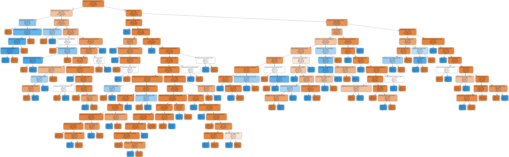

```python
import pandas as pd
import numpy as np

import matplotlib.pyplot as plt
import seaborn as sns

from sklearn import metrics
from sklearn.model_selection import train_test_split
from sklearn.preprocessing import StandardScaler, LabelEncoder
from sklearn.metrics import accuracy_score
from sklearn.metrics import precision_score
from sklearn.metrics import recall_score

from sklearn.linear_model import LogisticRegression
from sklearn.discriminant_analysis import LinearDiscriminantAnalysis
from sklearn.discriminant_analysis import QuadraticDiscriminantAnalysis
from sklearn.linear_model import SGDClassifier
from sklearn.svm import LinearSVC
from sklearn.neighbors import RadiusNeighborsClassifier
from sklearn.naive_bayes import GaussianNB
from sklearn.tree import DecisionTreeClassifier
from sklearn.ensemble import RandomForestClassifier
from sklearn.neighbors import KNeighborsClassifier
```

The case chosen is about predicting the bankruptcy of companies based on their financial data. The data was collected from the Taiwan Economic Journal for the years 1999 to 2009. Company bankruptcy was defined based on the business regulations of the Taiwan Stock Exchange. The dataset provided has already been standardized and all missing values were previously replaced with 0


```python
#Overview of Data
# Load data from CSV file
bankruptcy_df = pd.read_csv(r'C:\Users\azizm\Documents\BDA-398B-Final-Project\bankruptcy.csv', sep=',', header=0, encoding='utf-8', engine='python', on_bad_lines='warn')


bankruptcy_df.head(20)
```


<div>
<style scoped>
    .dataframe tbody tr th:only-of-type {
        vertical-align: middle;
    }

    .dataframe tbody tr th {
        vertical-align: top;
    }

    .dataframe thead th {
        text-align: right;
    }
</style>
<table border="1" class="dataframe">
  <thead>
    <tr style="text-align: right;">
      <th></th>
      <th>Bankrupt?</th>
      <th>ROA(C) before interest and depreciation before interest</th>
      <th>ROA(A) before interest and % after tax</th>
      <th>ROA(B) before interest and depreciation after tax</th>
      <th>Operating Gross Margin</th>
      <th>Realized Sales Gross Margin</th>
      <th>Operating Profit Rate</th>
      <th>Pre-tax net Interest Rate</th>
      <th>After-tax net Interest Rate</th>
      <th>Non-industry income and expenditure/revenue</th>
      <th>...</th>
      <th>Net Income to Total Assets</th>
      <th>Total assets to GNP price</th>
      <th>No-credit Interval</th>
      <th>Gross Profit to Sales</th>
      <th>Net Income to Stockholder's Equity</th>
      <th>Liability to Equity</th>
      <th>Degree of Financial Leverage (DFL)</th>
      <th>Interest Coverage Ratio (Interest expense to EBIT)</th>
      <th>Net Income Flag</th>
      <th>Equity to Liability</th>
    </tr>
  </thead>
  <tbody>
    <tr>
      <th>0</th>
      <td>1</td>
      <td>0.370594</td>
      <td>0.424389</td>
      <td>0.405750</td>
      <td>0.601457</td>
      <td>0.601457</td>
      <td>0.998969</td>
      <td>0.796887</td>
      <td>0.808809</td>
      <td>0.302646</td>
      <td>...</td>
      <td>0.716845</td>
      <td>0.009219</td>
      <td>0.622879</td>
      <td>0.601453</td>
      <td>0.827890</td>
      <td>0.290202</td>
      <td>0.026601</td>
      <td>0.564050</td>
      <td>1</td>
      <td>0.016469</td>
    </tr>
    <tr>
      <th>1</th>
      <td>1</td>
      <td>0.464291</td>
      <td>0.538214</td>
      <td>0.516730</td>
      <td>0.610235</td>
      <td>0.610235</td>
      <td>0.998946</td>
      <td>0.797380</td>
      <td>0.809301</td>
      <td>0.303556</td>
      <td>...</td>
      <td>0.795297</td>
      <td>0.008323</td>
      <td>0.623652</td>
      <td>0.610237</td>
      <td>0.839969</td>
      <td>0.283846</td>
      <td>0.264577</td>
      <td>0.570175</td>
      <td>1</td>
      <td>0.020794</td>
    </tr>
    <tr>
      <th>2</th>
      <td>1</td>
      <td>0.426071</td>
      <td>0.499019</td>
      <td>0.472295</td>
      <td>0.601450</td>
      <td>0.601364</td>
      <td>0.998857</td>
      <td>0.796403</td>
      <td>0.808388</td>
      <td>0.302035</td>
      <td>...</td>
      <td>0.774670</td>
      <td>0.040003</td>
      <td>0.623841</td>
      <td>0.601449</td>
      <td>0.836774</td>
      <td>0.290189</td>
      <td>0.026555</td>
      <td>0.563706</td>
      <td>1</td>
      <td>0.016474</td>
    </tr>
    <tr>
      <th>3</th>
      <td>1</td>
      <td>0.399844</td>
      <td>0.451265</td>
      <td>0.457733</td>
      <td>0.583541</td>
      <td>0.583541</td>
      <td>0.998700</td>
      <td>0.796967</td>
      <td>0.808966</td>
      <td>0.303350</td>
      <td>...</td>
      <td>0.739555</td>
      <td>0.003252</td>
      <td>0.622929</td>
      <td>0.583538</td>
      <td>0.834697</td>
      <td>0.281721</td>
      <td>0.026697</td>
      <td>0.564663</td>
      <td>1</td>
      <td>0.023982</td>
    </tr>
    <tr>
      <th>4</th>
      <td>1</td>
      <td>0.465022</td>
      <td>0.538432</td>
      <td>0.522298</td>
      <td>0.598783</td>
      <td>0.598783</td>
      <td>0.998973</td>
      <td>0.797366</td>
      <td>0.809304</td>
      <td>0.303475</td>
      <td>...</td>
      <td>0.795016</td>
      <td>0.003878</td>
      <td>0.623521</td>
      <td>0.598782</td>
      <td>0.839973</td>
      <td>0.278514</td>
      <td>0.024752</td>
      <td>0.575617</td>
      <td>1</td>
      <td>0.035490</td>
    </tr>
    <tr>
      <th>5</th>
      <td>1</td>
      <td>0.388680</td>
      <td>0.415177</td>
      <td>0.419134</td>
      <td>0.590171</td>
      <td>0.590251</td>
      <td>0.998758</td>
      <td>0.796903</td>
      <td>0.808771</td>
      <td>0.303116</td>
      <td>...</td>
      <td>0.710420</td>
      <td>0.005278</td>
      <td>0.622605</td>
      <td>0.590172</td>
      <td>0.829939</td>
      <td>0.285087</td>
      <td>0.026675</td>
      <td>0.564538</td>
      <td>1</td>
      <td>0.019534</td>
    </tr>
    <tr>
      <th>6</th>
      <td>0</td>
      <td>0.390923</td>
      <td>0.445704</td>
      <td>0.436158</td>
      <td>0.619950</td>
      <td>0.619950</td>
      <td>0.998993</td>
      <td>0.797012</td>
      <td>0.808960</td>
      <td>0.302814</td>
      <td>...</td>
      <td>0.736619</td>
      <td>0.018372</td>
      <td>0.623655</td>
      <td>0.619949</td>
      <td>0.829980</td>
      <td>0.292504</td>
      <td>0.026622</td>
      <td>0.564200</td>
      <td>1</td>
      <td>0.015663</td>
    </tr>
    <tr>
      <th>7</th>
      <td>0</td>
      <td>0.508361</td>
      <td>0.570922</td>
      <td>0.559077</td>
      <td>0.601738</td>
      <td>0.601717</td>
      <td>0.999009</td>
      <td>0.797449</td>
      <td>0.809362</td>
      <td>0.303545</td>
      <td>...</td>
      <td>0.815350</td>
      <td>0.010005</td>
      <td>0.623843</td>
      <td>0.601739</td>
      <td>0.841459</td>
      <td>0.278607</td>
      <td>0.027031</td>
      <td>0.566089</td>
      <td>1</td>
      <td>0.034889</td>
    </tr>
    <tr>
      <th>8</th>
      <td>0</td>
      <td>0.488519</td>
      <td>0.545137</td>
      <td>0.543284</td>
      <td>0.603612</td>
      <td>0.603612</td>
      <td>0.998961</td>
      <td>0.797414</td>
      <td>0.809338</td>
      <td>0.303584</td>
      <td>...</td>
      <td>0.803647</td>
      <td>0.000824</td>
      <td>0.623977</td>
      <td>0.603613</td>
      <td>0.840487</td>
      <td>0.276423</td>
      <td>0.026891</td>
      <td>0.565592</td>
      <td>1</td>
      <td>0.065826</td>
    </tr>
    <tr>
      <th>9</th>
      <td>0</td>
      <td>0.495686</td>
      <td>0.550916</td>
      <td>0.542963</td>
      <td>0.599209</td>
      <td>0.599209</td>
      <td>0.999001</td>
      <td>0.797404</td>
      <td>0.809320</td>
      <td>0.303483</td>
      <td>...</td>
      <td>0.804195</td>
      <td>0.005798</td>
      <td>0.623865</td>
      <td>0.599205</td>
      <td>0.840688</td>
      <td>0.279388</td>
      <td>0.027243</td>
      <td>0.566668</td>
      <td>1</td>
      <td>0.030801</td>
    </tr>
    <tr>
      <th>10</th>
      <td>0</td>
      <td>0.482475</td>
      <td>0.567543</td>
      <td>0.538198</td>
      <td>0.614026</td>
      <td>0.614026</td>
      <td>0.998978</td>
      <td>0.797535</td>
      <td>0.809460</td>
      <td>0.303759</td>
      <td>...</td>
      <td>0.814111</td>
      <td>0.076972</td>
      <td>0.623687</td>
      <td>0.614021</td>
      <td>0.841337</td>
      <td>0.278356</td>
      <td>0.026971</td>
      <td>0.565892</td>
      <td>1</td>
      <td>0.036572</td>
    </tr>
    <tr>
      <th>11</th>
      <td>0</td>
      <td>0.444401</td>
      <td>0.549717</td>
      <td>0.498956</td>
      <td>0.623712</td>
      <td>0.623712</td>
      <td>0.998975</td>
      <td>0.797443</td>
      <td>0.809389</td>
      <td>0.303605</td>
      <td>...</td>
      <td>0.804887</td>
      <td>0.007318</td>
      <td>0.623724</td>
      <td>0.623709</td>
      <td>0.840650</td>
      <td>0.277892</td>
      <td>0.027391</td>
      <td>0.566983</td>
      <td>1</td>
      <td>0.040381</td>
    </tr>
    <tr>
      <th>12</th>
      <td>0</td>
      <td>0.491152</td>
      <td>0.551570</td>
      <td>0.543391</td>
      <td>0.608131</td>
      <td>0.608138</td>
      <td>0.999045</td>
      <td>0.797429</td>
      <td>0.809344</td>
      <td>0.303435</td>
      <td>...</td>
      <td>0.803260</td>
      <td>0.008232</td>
      <td>0.623578</td>
      <td>0.608125</td>
      <td>0.840702</td>
      <td>0.281113</td>
      <td>0.027480</td>
      <td>0.567146</td>
      <td>1</td>
      <td>0.025282</td>
    </tr>
    <tr>
      <th>13</th>
      <td>0</td>
      <td>0.474041</td>
      <td>0.533308</td>
      <td>0.523690</td>
      <td>0.600578</td>
      <td>0.600578</td>
      <td>0.998967</td>
      <td>0.797368</td>
      <td>0.809299</td>
      <td>0.303492</td>
      <td>...</td>
      <td>0.794158</td>
      <td>0.005262</td>
      <td>0.623777</td>
      <td>0.600578</td>
      <td>0.839910</td>
      <td>0.278518</td>
      <td>0.025000</td>
      <td>0.577445</td>
      <td>1</td>
      <td>0.035464</td>
    </tr>
    <tr>
      <th>14</th>
      <td>0</td>
      <td>0.506703</td>
      <td>0.575829</td>
      <td>0.569838</td>
      <td>0.604686</td>
      <td>0.604686</td>
      <td>0.999053</td>
      <td>0.797514</td>
      <td>0.809456</td>
      <td>0.303566</td>
      <td>...</td>
      <td>0.819715</td>
      <td>0.003954</td>
      <td>0.624946</td>
      <td>0.604683</td>
      <td>0.841624</td>
      <td>0.277668</td>
      <td>0.026896</td>
      <td>0.565614</td>
      <td>1</td>
      <td>0.042646</td>
    </tr>
    <tr>
      <th>15</th>
      <td>0</td>
      <td>0.513821</td>
      <td>0.571086</td>
      <td>0.558756</td>
      <td>0.621773</td>
      <td>0.621773</td>
      <td>0.999097</td>
      <td>0.797507</td>
      <td>0.809396</td>
      <td>0.303462</td>
      <td>...</td>
      <td>0.815419</td>
      <td>0.006590</td>
      <td>0.623764</td>
      <td>0.621769</td>
      <td>0.841399</td>
      <td>0.278124</td>
      <td>0.026897</td>
      <td>0.565618</td>
      <td>1</td>
      <td>0.038354</td>
    </tr>
    <tr>
      <th>16</th>
      <td>0</td>
      <td>0.488909</td>
      <td>0.560238</td>
      <td>0.540286</td>
      <td>0.606524</td>
      <td>0.606524</td>
      <td>0.998996</td>
      <td>0.797877</td>
      <td>0.809761</td>
      <td>0.304319</td>
      <td>...</td>
      <td>0.810421</td>
      <td>0.013611</td>
      <td>0.623325</td>
      <td>0.606524</td>
      <td>0.840889</td>
      <td>0.276518</td>
      <td>0.027003</td>
      <td>0.565999</td>
      <td>1</td>
      <td>0.062940</td>
    </tr>
    <tr>
      <th>17</th>
      <td>0</td>
      <td>0.535953</td>
      <td>0.590438</td>
      <td>0.580920</td>
      <td>0.618451</td>
      <td>0.618451</td>
      <td>0.999119</td>
      <td>0.797588</td>
      <td>0.809461</td>
      <td>0.303559</td>
      <td>...</td>
      <td>0.826642</td>
      <td>0.002746</td>
      <td>0.623825</td>
      <td>0.618452</td>
      <td>0.841983</td>
      <td>0.277190</td>
      <td>0.026908</td>
      <td>0.565659</td>
      <td>1</td>
      <td>0.048822</td>
    </tr>
    <tr>
      <th>18</th>
      <td>0</td>
      <td>0.504071</td>
      <td>0.559802</td>
      <td>0.558649</td>
      <td>0.598344</td>
      <td>0.598344</td>
      <td>0.998989</td>
      <td>0.797412</td>
      <td>0.809334</td>
      <td>0.303523</td>
      <td>...</td>
      <td>0.806264</td>
      <td>0.004238</td>
      <td>0.623339</td>
      <td>0.598345</td>
      <td>0.840955</td>
      <td>0.280839</td>
      <td>0.027637</td>
      <td>0.567399</td>
      <td>1</td>
      <td>0.025953</td>
    </tr>
    <tr>
      <th>19</th>
      <td>0</td>
      <td>0.487398</td>
      <td>0.543720</td>
      <td>0.533647</td>
      <td>0.636259</td>
      <td>0.636252</td>
      <td>0.999042</td>
      <td>0.797444</td>
      <td>0.809340</td>
      <td>0.303467</td>
      <td>...</td>
      <td>0.802552</td>
      <td>0.001521</td>
      <td>0.623763</td>
      <td>0.636256</td>
      <td>0.840456</td>
      <td>0.277139</td>
      <td>0.026924</td>
      <td>0.565722</td>
      <td>1</td>
      <td>0.049622</td>
    </tr>
  </tbody>
</table>
<p>20 rows × 96 columns</p>
</div>


```python
# Display the number of rows in the DataFrame
print(f"Number of rows: {len(bankruptcy_df)}")
```

    Number of rows: 6819
    


```python
FEATURES = bankruptcy_df.columns.tolist()
FEATURES.remove('Bankrupt?')
XFeatures = FEATURES

# Print the list of features
print("List of features:")
for feature in XFeatures:
    print(feature)
```

    List of features:
     ROA(C) before interest and depreciation before interest
     ROA(A) before interest and % after tax
     ROA(B) before interest and depreciation after tax
     Operating Gross Margin
     Realized Sales Gross Margin
     Operating Profit Rate
     Pre-tax net Interest Rate
     After-tax net Interest Rate
     Non-industry income and expenditure/revenue
     Continuous interest rate (after tax)
     Operating Expense Rate
     Research and development expense rate
     Cash flow rate
     Interest-bearing debt interest rate
     Tax rate (A)
     Net Value Per Share (B)
     Net Value Per Share (A)
     Net Value Per Share (C)
     Persistent EPS in the Last Four Seasons
     Cash Flow Per Share
     Revenue Per Share (Yuan ¥)
     Operating Profit Per Share (Yuan ¥)
     Per Share Net profit before tax (Yuan ¥)
     Realized Sales Gross Profit Growth Rate
     Operating Profit Growth Rate
     After-tax Net Profit Growth Rate
     Regular Net Profit Growth Rate
     Continuous Net Profit Growth Rate
     Total Asset Growth Rate
     Net Value Growth Rate
     Total Asset Return Growth Rate Ratio
     Cash Reinvestment %
     Current Ratio
     Quick Ratio
     Interest Expense Ratio
     Total debt/Total net worth
     Debt ratio %
     Net worth/Assets
     Long-term fund suitability ratio (A)
     Borrowing dependency
     Contingent liabilities/Net worth
     Operating profit/Paid-in capital
     Net profit before tax/Paid-in capital
     Inventory and accounts receivable/Net value
     Total Asset Turnover
     Accounts Receivable Turnover
     Average Collection Days
     Inventory Turnover Rate (times)
     Fixed Assets Turnover Frequency
     Net Worth Turnover Rate (times)
     Revenue per person
     Operating profit per person
     Allocation rate per person
     Working Capital to Total Assets
     Quick Assets/Total Assets
     Current Assets/Total Assets
     Cash/Total Assets
     Quick Assets/Current Liability
     Cash/Current Liability
     Current Liability to Assets
     Operating Funds to Liability
     Inventory/Working Capital
     Inventory/Current Liability
     Current Liabilities/Liability
     Working Capital/Equity
     Current Liabilities/Equity
     Long-term Liability to Current Assets
     Retained Earnings to Total Assets
     Total income/Total expense
     Total expense/Assets
     Current Asset Turnover Rate
     Quick Asset Turnover Rate
     Working capitcal Turnover Rate
     Cash Turnover Rate
     Cash Flow to Sales
     Fixed Assets to Assets
     Current Liability to Liability
     Current Liability to Equity
     Equity to Long-term Liability
     Cash Flow to Total Assets
     Cash Flow to Liability
     CFO to Assets
     Cash Flow to Equity
     Current Liability to Current Assets
     Liability-Assets Flag
     Net Income to Total Assets
     Total assets to GNP price
     No-credit Interval
     Gross Profit to Sales
     Net Income to Stockholder's Equity
     Liability to Equity
     Degree of Financial Leverage (DFL)
     Interest Coverage Ratio (Interest expense to EBIT)
     Net Income Flag
     Equity to Liability
    


```python
bankruptcy_df.shape
```


    (6819, 96)


```python
# Get an overview of the dataset
print(bankruptcy_df.head())

# Get summary statistics
print(bankruptcy_df.describe())

# Get data types and missing values
print(bankruptcy_df.info())
```

       Bankrupt?   ROA(C) before interest and depreciation before interest  \
    0          1                                           0.370594          
    1          1                                           0.464291          
    2          1                                           0.426071          
    3          1                                           0.399844          
    4          1                                           0.465022          
    
        ROA(A) before interest and % after tax  \
    0                                 0.424389   
    1                                 0.538214   
    2                                 0.499019   
    3                                 0.451265   
    4                                 0.538432   
    
        ROA(B) before interest and depreciation after tax  \
    0                                           0.405750    
    1                                           0.516730    
    2                                           0.472295    
    3                                           0.457733    
    4                                           0.522298    
    
        Operating Gross Margin   Realized Sales Gross Margin  \
    0                 0.601457                      0.601457   
    1                 0.610235                      0.610235   
    2                 0.601450                      0.601364   
    3                 0.583541                      0.583541   
    4                 0.598783                      0.598783   
    
        Operating Profit Rate   Pre-tax net Interest Rate  \
    0                0.998969                    0.796887   
    1                0.998946                    0.797380   
    2                0.998857                    0.796403   
    3                0.998700                    0.796967   
    4                0.998973                    0.797366   
    
        After-tax net Interest Rate   Non-industry income and expenditure/revenue  \
    0                      0.808809                                      0.302646   
    1                      0.809301                                      0.303556   
    2                      0.808388                                      0.302035   
    3                      0.808966                                      0.303350   
    4                      0.809304                                      0.303475   
    
       ...   Net Income to Total Assets   Total assets to GNP price  \
    0  ...                     0.716845                    0.009219   
    1  ...                     0.795297                    0.008323   
    2  ...                     0.774670                    0.040003   
    3  ...                     0.739555                    0.003252   
    4  ...                     0.795016                    0.003878   
    
        No-credit Interval   Gross Profit to Sales  \
    0             0.622879                0.601453   
    1             0.623652                0.610237   
    2             0.623841                0.601449   
    3             0.622929                0.583538   
    4             0.623521                0.598782   
    
        Net Income to Stockholder's Equity   Liability to Equity  \
    0                             0.827890              0.290202   
    1                             0.839969              0.283846   
    2                             0.836774              0.290189   
    3                             0.834697              0.281721   
    4                             0.839973              0.278514   
    
        Degree of Financial Leverage (DFL)  \
    0                             0.026601   
    1                             0.264577   
    2                             0.026555   
    3                             0.026697   
    4                             0.024752   
    
        Interest Coverage Ratio (Interest expense to EBIT)   Net Income Flag  \
    0                                           0.564050                   1   
    1                                           0.570175                   1   
    2                                           0.563706                   1   
    3                                           0.564663                   1   
    4                                           0.575617                   1   
    
        Equity to Liability  
    0              0.016469  
    1              0.020794  
    2              0.016474  
    3              0.023982  
    4              0.035490  
    
    [5 rows x 96 columns]
             Bankrupt?   ROA(C) before interest and depreciation before interest  \
    count  6819.000000                                        6819.000000          
    mean      0.032263                                           0.505180          
    std       0.176710                                           0.060686          
    min       0.000000                                           0.000000          
    25%       0.000000                                           0.476527          
    50%       0.000000                                           0.502706          
    75%       0.000000                                           0.535563          
    max       1.000000                                           1.000000          
    
            ROA(A) before interest and % after tax  \
    count                              6819.000000   
    mean                                  0.558625   
    std                                   0.065620   
    min                                   0.000000   
    25%                                   0.535543   
    50%                                   0.559802   
    75%                                   0.589157   
    max                                   1.000000   
    
            ROA(B) before interest and depreciation after tax  \
    count                                        6819.000000    
    mean                                            0.553589    
    std                                             0.061595    
    min                                             0.000000    
    25%                                             0.527277    
    50%                                             0.552278    
    75%                                             0.584105    
    max                                             1.000000    
    
            Operating Gross Margin   Realized Sales Gross Margin  \
    count              6819.000000                   6819.000000   
    mean                  0.607948                      0.607929   
    std                   0.016934                      0.016916   
    min                   0.000000                      0.000000   
    25%                   0.600445                      0.600434   
    50%                   0.605997                      0.605976   
    75%                   0.613914                      0.613842   
    max                   1.000000                      1.000000   
    
            Operating Profit Rate   Pre-tax net Interest Rate  \
    count             6819.000000                 6819.000000   
    mean                 0.998755                    0.797190   
    std                  0.013010                    0.012869   
    min                  0.000000                    0.000000   
    25%                  0.998969                    0.797386   
    50%                  0.999022                    0.797464   
    75%                  0.999095                    0.797579   
    max                  1.000000                    1.000000   
    
            After-tax net Interest Rate  \
    count                   6819.000000   
    mean                       0.809084   
    std                        0.013601   
    min                        0.000000   
    25%                        0.809312   
    50%                        0.809375   
    75%                        0.809469   
    max                        1.000000   
    
            Non-industry income and expenditure/revenue  ...  \
    count                                   6819.000000  ...   
    mean                                       0.303623  ...   
    std                                        0.011163  ...   
    min                                        0.000000  ...   
    25%                                        0.303466  ...   
    50%                                        0.303525  ...   
    75%                                        0.303585  ...   
    max                                        1.000000  ...   
    
            Net Income to Total Assets   Total assets to GNP price  \
    count                  6819.000000                6.819000e+03   
    mean                      0.807760                1.862942e+07   
    std                       0.040332                3.764501e+08   
    min                       0.000000                0.000000e+00   
    25%                       0.796750                9.036205e-04   
    50%                       0.810619                2.085213e-03   
    75%                       0.826455                5.269777e-03   
    max                       1.000000                9.820000e+09   
    
            No-credit Interval   Gross Profit to Sales  \
    count          6819.000000             6819.000000   
    mean              0.623915                0.607946   
    std               0.012290                0.016934   
    min               0.000000                0.000000   
    25%               0.623636                0.600443   
    50%               0.623879                0.605998   
    75%               0.624168                0.613913   
    max               1.000000                1.000000   
    
            Net Income to Stockholder's Equity   Liability to Equity  \
    count                          6819.000000           6819.000000   
    mean                              0.840402              0.280365   
    std                               0.014523              0.014463   
    min                               0.000000              0.000000   
    25%                               0.840115              0.276944   
    50%                               0.841179              0.278778   
    75%                               0.842357              0.281449   
    max                               1.000000              1.000000   
    
            Degree of Financial Leverage (DFL)  \
    count                          6819.000000   
    mean                              0.027541   
    std                               0.015668   
    min                               0.000000   
    25%                               0.026791   
    50%                               0.026808   
    75%                               0.026913   
    max                               1.000000   
    
            Interest Coverage Ratio (Interest expense to EBIT)   Net Income Flag  \
    count                                        6819.000000              6819.0   
    mean                                            0.565358                 1.0   
    std                                             0.013214                 0.0   
    min                                             0.000000                 1.0   
    25%                                             0.565158                 1.0   
    50%                                             0.565252                 1.0   
    75%                                             0.565725                 1.0   
    max                                             1.000000                 1.0   
    
            Equity to Liability  
    count           6819.000000  
    mean               0.047578  
    std                0.050014  
    min                0.000000  
    25%                0.024477  
    50%                0.033798  
    75%                0.052838  
    max                1.000000  
    
    [8 rows x 96 columns]
    <class 'pandas.core.frame.DataFrame'>
    RangeIndex: 6819 entries, 0 to 6818
    Data columns (total 96 columns):
     #   Column                                                    Non-Null Count  Dtype  
    ---  ------                                                    --------------  -----  
     0   Bankrupt?                                                 6819 non-null   int64  
     1    ROA(C) before interest and depreciation before interest  6819 non-null   float64
     2    ROA(A) before interest and % after tax                   6819 non-null   float64
     3    ROA(B) before interest and depreciation after tax        6819 non-null   float64
     4    Operating Gross Margin                                   6819 non-null   float64
     5    Realized Sales Gross Margin                              6819 non-null   float64
     6    Operating Profit Rate                                    6819 non-null   float64
     7    Pre-tax net Interest Rate                                6819 non-null   float64
     8    After-tax net Interest Rate                              6819 non-null   float64
     9    Non-industry income and expenditure/revenue              6819 non-null   float64
     10   Continuous interest rate (after tax)                     6819 non-null   float64
     11   Operating Expense Rate                                   6819 non-null   float64
     12   Research and development expense rate                    6819 non-null   float64
     13   Cash flow rate                                           6819 non-null   float64
     14   Interest-bearing debt interest rate                      6819 non-null   float64
     15   Tax rate (A)                                             6819 non-null   float64
     16   Net Value Per Share (B)                                  6819 non-null   float64
     17   Net Value Per Share (A)                                  6819 non-null   float64
     18   Net Value Per Share (C)                                  6819 non-null   float64
     19   Persistent EPS in the Last Four Seasons                  6819 non-null   float64
     20   Cash Flow Per Share                                      6819 non-null   float64
     21   Revenue Per Share (Yuan ¥)                               6819 non-null   float64
     22   Operating Profit Per Share (Yuan ¥)                      6819 non-null   float64
     23   Per Share Net profit before tax (Yuan ¥)                 6819 non-null   float64
     24   Realized Sales Gross Profit Growth Rate                  6819 non-null   float64
     25   Operating Profit Growth Rate                             6819 non-null   float64
     26   After-tax Net Profit Growth Rate                         6819 non-null   float64
     27   Regular Net Profit Growth Rate                           6819 non-null   float64
     28   Continuous Net Profit Growth Rate                        6819 non-null   float64
     29   Total Asset Growth Rate                                  6819 non-null   float64
     30   Net Value Growth Rate                                    6819 non-null   float64
     31   Total Asset Return Growth Rate Ratio                     6819 non-null   float64
     32   Cash Reinvestment %                                      6819 non-null   float64
     33   Current Ratio                                            6819 non-null   float64
     34   Quick Ratio                                              6819 non-null   float64
     35   Interest Expense Ratio                                   6819 non-null   float64
     36   Total debt/Total net worth                               6819 non-null   float64
     37   Debt ratio %                                             6819 non-null   float64
     38   Net worth/Assets                                         6819 non-null   float64
     39   Long-term fund suitability ratio (A)                     6819 non-null   float64
     40   Borrowing dependency                                     6819 non-null   float64
     41   Contingent liabilities/Net worth                         6819 non-null   float64
     42   Operating profit/Paid-in capital                         6819 non-null   float64
     43   Net profit before tax/Paid-in capital                    6819 non-null   float64
     44   Inventory and accounts receivable/Net value              6819 non-null   float64
     45   Total Asset Turnover                                     6819 non-null   float64
     46   Accounts Receivable Turnover                             6819 non-null   float64
     47   Average Collection Days                                  6819 non-null   float64
     48   Inventory Turnover Rate (times)                          6819 non-null   float64
     49   Fixed Assets Turnover Frequency                          6819 non-null   float64
     50   Net Worth Turnover Rate (times)                          6819 non-null   float64
     51   Revenue per person                                       6819 non-null   float64
     52   Operating profit per person                              6819 non-null   float64
     53   Allocation rate per person                               6819 non-null   float64
     54   Working Capital to Total Assets                          6819 non-null   float64
     55   Quick Assets/Total Assets                                6819 non-null   float64
     56   Current Assets/Total Assets                              6819 non-null   float64
     57   Cash/Total Assets                                        6819 non-null   float64
     58   Quick Assets/Current Liability                           6819 non-null   float64
     59   Cash/Current Liability                                   6819 non-null   float64
     60   Current Liability to Assets                              6819 non-null   float64
     61   Operating Funds to Liability                             6819 non-null   float64
     62   Inventory/Working Capital                                6819 non-null   float64
     63   Inventory/Current Liability                              6819 non-null   float64
     64   Current Liabilities/Liability                            6819 non-null   float64
     65   Working Capital/Equity                                   6819 non-null   float64
     66   Current Liabilities/Equity                               6819 non-null   float64
     67   Long-term Liability to Current Assets                    6819 non-null   float64
     68   Retained Earnings to Total Assets                        6819 non-null   float64
     69   Total income/Total expense                               6819 non-null   float64
     70   Total expense/Assets                                     6819 non-null   float64
     71   Current Asset Turnover Rate                              6819 non-null   float64
     72   Quick Asset Turnover Rate                                6819 non-null   float64
     73   Working capitcal Turnover Rate                           6819 non-null   float64
     74   Cash Turnover Rate                                       6819 non-null   float64
     75   Cash Flow to Sales                                       6819 non-null   float64
     76   Fixed Assets to Assets                                   6819 non-null   float64
     77   Current Liability to Liability                           6819 non-null   float64
     78   Current Liability to Equity                              6819 non-null   float64
     79   Equity to Long-term Liability                            6819 non-null   float64
     80   Cash Flow to Total Assets                                6819 non-null   float64
     81   Cash Flow to Liability                                   6819 non-null   float64
     82   CFO to Assets                                            6819 non-null   float64
     83   Cash Flow to Equity                                      6819 non-null   float64
     84   Current Liability to Current Assets                      6819 non-null   float64
     85   Liability-Assets Flag                                    6819 non-null   int64  
     86   Net Income to Total Assets                               6819 non-null   float64
     87   Total assets to GNP price                                6819 non-null   float64
     88   No-credit Interval                                       6819 non-null   float64
     89   Gross Profit to Sales                                    6819 non-null   float64
     90   Net Income to Stockholder's Equity                       6819 non-null   float64
     91   Liability to Equity                                      6819 non-null   float64
     92   Degree of Financial Leverage (DFL)                       6819 non-null   float64
     93   Interest Coverage Ratio (Interest expense to EBIT)       6819 non-null   float64
     94   Net Income Flag                                          6819 non-null   int64  
     95   Equity to Liability                                      6819 non-null   float64
    dtypes: float64(93), int64(3)
    memory usage: 5.0 MB
    None
    


```python
bankruptcy_df[bankruptcy_df.isnull().any(axis=1)].count()
```


    Bankrupt?                                                   0
     ROA(C) before interest and depreciation before interest    0
     ROA(A) before interest and % after tax                     0
     ROA(B) before interest and depreciation after tax          0
     Operating Gross Margin                                     0
                                                               ..
     Liability to Equity                                        0
     Degree of Financial Leverage (DFL)                         0
     Interest Coverage Ratio (Interest expense to EBIT)         0
     Net Income Flag                                            0
     Equity to Liability                                        0
    Length: 96, dtype: int64


```python
bankruptcy_df.shape
```


    (6819, 96)


```python
names_of_x_cols = bankruptcy_df.columns.drop(['Bankrupt?', ' Net Income Flag'])
```


```python
bankruptcy_df.describe()
```


<div>
<style scoped>
    .dataframe tbody tr th:only-of-type {
        vertical-align: middle;
    }

    .dataframe tbody tr th {
        vertical-align: top;
    }

    .dataframe thead th {
        text-align: right;
    }
</style>
<table border="1" class="dataframe">
  <thead>
    <tr style="text-align: right;">
      <th></th>
      <th>Bankrupt?</th>
      <th>ROA(C) before interest and depreciation before interest</th>
      <th>ROA(A) before interest and % after tax</th>
      <th>ROA(B) before interest and depreciation after tax</th>
      <th>Operating Gross Margin</th>
      <th>Realized Sales Gross Margin</th>
      <th>Operating Profit Rate</th>
      <th>Pre-tax net Interest Rate</th>
      <th>After-tax net Interest Rate</th>
      <th>Non-industry income and expenditure/revenue</th>
      <th>...</th>
      <th>Net Income to Total Assets</th>
      <th>Total assets to GNP price</th>
      <th>No-credit Interval</th>
      <th>Gross Profit to Sales</th>
      <th>Net Income to Stockholder's Equity</th>
      <th>Liability to Equity</th>
      <th>Degree of Financial Leverage (DFL)</th>
      <th>Interest Coverage Ratio (Interest expense to EBIT)</th>
      <th>Net Income Flag</th>
      <th>Equity to Liability</th>
    </tr>
  </thead>
  <tbody>
    <tr>
      <th>count</th>
      <td>6819.000000</td>
      <td>6819.000000</td>
      <td>6819.000000</td>
      <td>6819.000000</td>
      <td>6819.000000</td>
      <td>6819.000000</td>
      <td>6819.000000</td>
      <td>6819.000000</td>
      <td>6819.000000</td>
      <td>6819.000000</td>
      <td>...</td>
      <td>6819.000000</td>
      <td>6.819000e+03</td>
      <td>6819.000000</td>
      <td>6819.000000</td>
      <td>6819.000000</td>
      <td>6819.000000</td>
      <td>6819.000000</td>
      <td>6819.000000</td>
      <td>6819.0</td>
      <td>6819.000000</td>
    </tr>
    <tr>
      <th>mean</th>
      <td>0.032263</td>
      <td>0.505180</td>
      <td>0.558625</td>
      <td>0.553589</td>
      <td>0.607948</td>
      <td>0.607929</td>
      <td>0.998755</td>
      <td>0.797190</td>
      <td>0.809084</td>
      <td>0.303623</td>
      <td>...</td>
      <td>0.807760</td>
      <td>1.862942e+07</td>
      <td>0.623915</td>
      <td>0.607946</td>
      <td>0.840402</td>
      <td>0.280365</td>
      <td>0.027541</td>
      <td>0.565358</td>
      <td>1.0</td>
      <td>0.047578</td>
    </tr>
    <tr>
      <th>std</th>
      <td>0.176710</td>
      <td>0.060686</td>
      <td>0.065620</td>
      <td>0.061595</td>
      <td>0.016934</td>
      <td>0.016916</td>
      <td>0.013010</td>
      <td>0.012869</td>
      <td>0.013601</td>
      <td>0.011163</td>
      <td>...</td>
      <td>0.040332</td>
      <td>3.764501e+08</td>
      <td>0.012290</td>
      <td>0.016934</td>
      <td>0.014523</td>
      <td>0.014463</td>
      <td>0.015668</td>
      <td>0.013214</td>
      <td>0.0</td>
      <td>0.050014</td>
    </tr>
    <tr>
      <th>min</th>
      <td>0.000000</td>
      <td>0.000000</td>
      <td>0.000000</td>
      <td>0.000000</td>
      <td>0.000000</td>
      <td>0.000000</td>
      <td>0.000000</td>
      <td>0.000000</td>
      <td>0.000000</td>
      <td>0.000000</td>
      <td>...</td>
      <td>0.000000</td>
      <td>0.000000e+00</td>
      <td>0.000000</td>
      <td>0.000000</td>
      <td>0.000000</td>
      <td>0.000000</td>
      <td>0.000000</td>
      <td>0.000000</td>
      <td>1.0</td>
      <td>0.000000</td>
    </tr>
    <tr>
      <th>25%</th>
      <td>0.000000</td>
      <td>0.476527</td>
      <td>0.535543</td>
      <td>0.527277</td>
      <td>0.600445</td>
      <td>0.600434</td>
      <td>0.998969</td>
      <td>0.797386</td>
      <td>0.809312</td>
      <td>0.303466</td>
      <td>...</td>
      <td>0.796750</td>
      <td>9.036205e-04</td>
      <td>0.623636</td>
      <td>0.600443</td>
      <td>0.840115</td>
      <td>0.276944</td>
      <td>0.026791</td>
      <td>0.565158</td>
      <td>1.0</td>
      <td>0.024477</td>
    </tr>
    <tr>
      <th>50%</th>
      <td>0.000000</td>
      <td>0.502706</td>
      <td>0.559802</td>
      <td>0.552278</td>
      <td>0.605997</td>
      <td>0.605976</td>
      <td>0.999022</td>
      <td>0.797464</td>
      <td>0.809375</td>
      <td>0.303525</td>
      <td>...</td>
      <td>0.810619</td>
      <td>2.085213e-03</td>
      <td>0.623879</td>
      <td>0.605998</td>
      <td>0.841179</td>
      <td>0.278778</td>
      <td>0.026808</td>
      <td>0.565252</td>
      <td>1.0</td>
      <td>0.033798</td>
    </tr>
    <tr>
      <th>75%</th>
      <td>0.000000</td>
      <td>0.535563</td>
      <td>0.589157</td>
      <td>0.584105</td>
      <td>0.613914</td>
      <td>0.613842</td>
      <td>0.999095</td>
      <td>0.797579</td>
      <td>0.809469</td>
      <td>0.303585</td>
      <td>...</td>
      <td>0.826455</td>
      <td>5.269777e-03</td>
      <td>0.624168</td>
      <td>0.613913</td>
      <td>0.842357</td>
      <td>0.281449</td>
      <td>0.026913</td>
      <td>0.565725</td>
      <td>1.0</td>
      <td>0.052838</td>
    </tr>
    <tr>
      <th>max</th>
      <td>1.000000</td>
      <td>1.000000</td>
      <td>1.000000</td>
      <td>1.000000</td>
      <td>1.000000</td>
      <td>1.000000</td>
      <td>1.000000</td>
      <td>1.000000</td>
      <td>1.000000</td>
      <td>1.000000</td>
      <td>...</td>
      <td>1.000000</td>
      <td>9.820000e+09</td>
      <td>1.000000</td>
      <td>1.000000</td>
      <td>1.000000</td>
      <td>1.000000</td>
      <td>1.000000</td>
      <td>1.000000</td>
      <td>1.0</td>
      <td>1.000000</td>
    </tr>
  </tbody>
</table>
<p>8 rows × 96 columns</p>
</div>


```python
import seaborn as sns

X_features_df = bankruptcy_df[XFeatures]
X_features_corr = X_features_df.corr()
plt.figure(figsize=(12, 12))
sns.heatmap(X_features_corr, annot=True)
plt.show()
```


    

    

hints at multicolinearity


```python
result_dict = {}
```


# V1 Testing of Model without any modifications to the data


```python
def summarize_classification(y_test, y_pred):
    
    acc = accuracy_score(y_test, y_pred, normalize=True)
    num_acc = accuracy_score(y_test, y_pred, normalize=False)
    
    return {'accuracy': acc}
```


```python
def random_forest_fn(x_train, y_train, max_depth=None, max_features=None): 
    
    model = RandomForestClassifier(n_estimators = 100) 
    model.fit(x_train, y_train)
    
    return model
```


```python
def build_model(classifier_fn,                
                name_of_y_col, 
                names_of_x_cols, 
                dataset, 
                test_frac=0.2):
    
    X = dataset[names_of_x_cols]
    Y = dataset[name_of_y_col]

    x_train, x_test, y_train, y_test = train_test_split(X, Y, test_size=test_frac)
       
    model = classifier_fn(x_train, y_train)
    
    y_pred = model.predict(x_test)

    test_summary = summarize_classification(y_test, y_pred)
    
    pred_results = pd.DataFrame({'y_test': y_test,
                                 'y_pred': y_pred})
    
    model_crosstab = pd.crosstab(pred_results.y_pred, pred_results.y_test)
    
    return {'test': test_summary,
            'confusion_matrix': model_crosstab}
```


```python
def compare_results():
    for key in result_dict:
        print('Classification: ', key)

        print()
        print('Test data')
        for score in result_dict[key]['test']:
            print(score, result_dict[key]['test'][score])
       
        print()
```


```python
result_dict['Bankrupt? ~ random_forest'] = build_model(random_forest_fn,
                                                 'Bankrupt?',
                                                  XFeatures,
                                                  bankruptcy_df)

compare_results()
```

    Classification:  Bankrupt? ~ random_forest
    
    Test data
    accuracy 0.9655425219941349
    
    

V1 High accuracy shows that data has most likely been preprocessed and features carefully selected before the dataset  wasprovided


# V2P1 Using Select K best to use less features for model and hypothesis testing


```python
X = bankruptcy_df.drop('Bankrupt?', axis=1) # Features
y = bankruptcy_df['Bankrupt?'] # Target variable
```


```python
from sklearn.feature_selection import VarianceThreshold

# Create the VarianceThreshold object with a threshold of 0 to remove constant features
selector = VarianceThreshold(threshold=0)

# Fit the selector on your feature matrix X
selector.fit(X)

# Transform the feature matrix by keeping only the non-constant features
X_filtered = selector.transform(X)
```


```python
from sklearn.feature_selection import f_classif, SelectKBest
from sklearn.linear_model import LogisticRegression
from sklearn.model_selection import GridSearchCV
from sklearn.pipeline import Pipeline

# Prepare the data
X = bankruptcy_df.drop('Bankrupt?', axis=1)  # Features
y = bankruptcy_df['Bankrupt?']  # Target variable

# Create a pipeline for the feature selection and logistic regression model
pipe = Pipeline([
    ('select_features', SelectKBest(f_classif)),
    ('logistic', LogisticRegression(solver='liblinear'))
])

# Set up the grid search with a range of 'k' values up to 10
param_grid = {
    'select_features__k': range(1, 11)
}

# Perform the grid search with cross-validation
grid_search = GridSearchCV(pipe, param_grid, cv=5, scoring='accuracy')
grid_search.fit(X, y)

# Print the best 'k' and its corresponding score
print("Best k for feature selection:", grid_search.best_params_['select_features__k'])
print("Best score:", grid_search.best_score_)

# Print the results for all 'k' values
print("\nResults for all 'k' values:")
for k, mean_test_score in zip(param_grid['select_features__k'], grid_search.cv_results_['mean_test_score']):
    print(f"k = {k}: {mean_test_score:.4f}")
```

    C:\Users\azizm\AppData\Local\Programs\Python\Python313\Lib\site-packages\sklearn\feature_selection\_univariate_selection.py:111: UserWarning: Features [93] are constant.
      warnings.warn("Features %s are constant." % constant_features_idx, UserWarning)
    C:\Users\azizm\AppData\Local\Programs\Python\Python313\Lib\site-packages\sklearn\feature_selection\_univariate_selection.py:112: RuntimeWarning: invalid value encountered in divide
      f = msb / msw
    C:\Users\azizm\AppData\Local\Programs\Python\Python313\Lib\site-packages\sklearn\feature_selection\_univariate_selection.py:111: UserWarning: Features [93] are constant.
      warnings.warn("Features %s are constant." % constant_features_idx, UserWarning)
    C:\Users\azizm\AppData\Local\Programs\Python\Python313\Lib\site-packages\sklearn\feature_selection\_univariate_selection.py:112: RuntimeWarning: invalid value encountered in divide
      f = msb / msw
    C:\Users\azizm\AppData\Local\Programs\Python\Python313\Lib\site-packages\sklearn\feature_selection\_univariate_selection.py:111: UserWarning: Features [93] are constant.
      warnings.warn("Features %s are constant." % constant_features_idx, UserWarning)
    C:\Users\azizm\AppData\Local\Programs\Python\Python313\Lib\site-packages\sklearn\feature_selection\_univariate_selection.py:112: RuntimeWarning: invalid value encountered in divide
      f = msb / msw
    C:\Users\azizm\AppData\Local\Programs\Python\Python313\Lib\site-packages\sklearn\feature_selection\_univariate_selection.py:111: UserWarning: Features [93] are constant.
      warnings.warn("Features %s are constant." % constant_features_idx, UserWarning)
    C:\Users\azizm\AppData\Local\Programs\Python\Python313\Lib\site-packages\sklearn\feature_selection\_univariate_selection.py:112: RuntimeWarning: invalid value encountered in divide
      f = msb / msw
    C:\Users\azizm\AppData\Local\Programs\Python\Python313\Lib\site-packages\sklearn\feature_selection\_univariate_selection.py:111: UserWarning: Features [93] are constant.
      warnings.warn("Features %s are constant." % constant_features_idx, UserWarning)
    C:\Users\azizm\AppData\Local\Programs\Python\Python313\Lib\site-packages\sklearn\feature_selection\_univariate_selection.py:112: RuntimeWarning: invalid value encountered in divide
      f = msb / msw
    C:\Users\azizm\AppData\Local\Programs\Python\Python313\Lib\site-packages\sklearn\feature_selection\_univariate_selection.py:111: UserWarning: Features [93] are constant.
      warnings.warn("Features %s are constant." % constant_features_idx, UserWarning)
    C:\Users\azizm\AppData\Local\Programs\Python\Python313\Lib\site-packages\sklearn\feature_selection\_univariate_selection.py:112: RuntimeWarning: invalid value encountered in divide
      f = msb / msw
    C:\Users\azizm\AppData\Local\Programs\Python\Python313\Lib\site-packages\sklearn\feature_selection\_univariate_selection.py:111: UserWarning: Features [93] are constant.
      warnings.warn("Features %s are constant." % constant_features_idx, UserWarning)
    C:\Users\azizm\AppData\Local\Programs\Python\Python313\Lib\site-packages\sklearn\feature_selection\_univariate_selection.py:112: RuntimeWarning: invalid value encountered in divide
      f = msb / msw
    C:\Users\azizm\AppData\Local\Programs\Python\Python313\Lib\site-packages\sklearn\feature_selection\_univariate_selection.py:111: UserWarning: Features [93] are constant.
      warnings.warn("Features %s are constant." % constant_features_idx, UserWarning)
    C:\Users\azizm\AppData\Local\Programs\Python\Python313\Lib\site-packages\sklearn\feature_selection\_univariate_selection.py:112: RuntimeWarning: invalid value encountered in divide
      f = msb / msw
    C:\Users\azizm\AppData\Local\Programs\Python\Python313\Lib\site-packages\sklearn\feature_selection\_univariate_selection.py:111: UserWarning: Features [93] are constant.
      warnings.warn("Features %s are constant." % constant_features_idx, UserWarning)
    C:\Users\azizm\AppData\Local\Programs\Python\Python313\Lib\site-packages\sklearn\feature_selection\_univariate_selection.py:112: RuntimeWarning: invalid value encountered in divide
      f = msb / msw
    C:\Users\azizm\AppData\Local\Programs\Python\Python313\Lib\site-packages\sklearn\feature_selection\_univariate_selection.py:111: UserWarning: Features [93] are constant.
      warnings.warn("Features %s are constant." % constant_features_idx, UserWarning)
    C:\Users\azizm\AppData\Local\Programs\Python\Python313\Lib\site-packages\sklearn\feature_selection\_univariate_selection.py:112: RuntimeWarning: invalid value encountered in divide
      f = msb / msw
    C:\Users\azizm\AppData\Local\Programs\Python\Python313\Lib\site-packages\sklearn\feature_selection\_univariate_selection.py:111: UserWarning: Features [93] are constant.
      warnings.warn("Features %s are constant." % constant_features_idx, UserWarning)
    C:\Users\azizm\AppData\Local\Programs\Python\Python313\Lib\site-packages\sklearn\feature_selection\_univariate_selection.py:112: RuntimeWarning: invalid value encountered in divide
      f = msb / msw
    

    C:\Users\azizm\AppData\Local\Programs\Python\Python313\Lib\site-packages\sklearn\feature_selection\_univariate_selection.py:111: UserWarning: Features [93] are constant.
      warnings.warn("Features %s are constant." % constant_features_idx, UserWarning)
    C:\Users\azizm\AppData\Local\Programs\Python\Python313\Lib\site-packages\sklearn\feature_selection\_univariate_selection.py:112: RuntimeWarning: invalid value encountered in divide
      f = msb / msw
    C:\Users\azizm\AppData\Local\Programs\Python\Python313\Lib\site-packages\sklearn\feature_selection\_univariate_selection.py:111: UserWarning: Features [93] are constant.
      warnings.warn("Features %s are constant." % constant_features_idx, UserWarning)
    C:\Users\azizm\AppData\Local\Programs\Python\Python313\Lib\site-packages\sklearn\feature_selection\_univariate_selection.py:112: RuntimeWarning: invalid value encountered in divide
      f = msb / msw
    C:\Users\azizm\AppData\Local\Programs\Python\Python313\Lib\site-packages\sklearn\feature_selection\_univariate_selection.py:111: UserWarning: Features [93] are constant.
      warnings.warn("Features %s are constant." % constant_features_idx, UserWarning)
    C:\Users\azizm\AppData\Local\Programs\Python\Python313\Lib\site-packages\sklearn\feature_selection\_univariate_selection.py:112: RuntimeWarning: invalid value encountered in divide
      f = msb / msw
    C:\Users\azizm\AppData\Local\Programs\Python\Python313\Lib\site-packages\sklearn\feature_selection\_univariate_selection.py:111: UserWarning: Features [93] are constant.
      warnings.warn("Features %s are constant." % constant_features_idx, UserWarning)
    C:\Users\azizm\AppData\Local\Programs\Python\Python313\Lib\site-packages\sklearn\feature_selection\_univariate_selection.py:112: RuntimeWarning: invalid value encountered in divide
      f = msb / msw
    C:\Users\azizm\AppData\Local\Programs\Python\Python313\Lib\site-packages\sklearn\feature_selection\_univariate_selection.py:111: UserWarning: Features [93] are constant.
      warnings.warn("Features %s are constant." % constant_features_idx, UserWarning)
    C:\Users\azizm\AppData\Local\Programs\Python\Python313\Lib\site-packages\sklearn\feature_selection\_univariate_selection.py:112: RuntimeWarning: invalid value encountered in divide
      f = msb / msw
    C:\Users\azizm\AppData\Local\Programs\Python\Python313\Lib\site-packages\sklearn\feature_selection\_univariate_selection.py:111: UserWarning: Features [93] are constant.
      warnings.warn("Features %s are constant." % constant_features_idx, UserWarning)
    C:\Users\azizm\AppData\Local\Programs\Python\Python313\Lib\site-packages\sklearn\feature_selection\_univariate_selection.py:112: RuntimeWarning: invalid value encountered in divide
      f = msb / msw
    C:\Users\azizm\AppData\Local\Programs\Python\Python313\Lib\site-packages\sklearn\feature_selection\_univariate_selection.py:111: UserWarning: Features [93] are constant.
      warnings.warn("Features %s are constant." % constant_features_idx, UserWarning)
    C:\Users\azizm\AppData\Local\Programs\Python\Python313\Lib\site-packages\sklearn\feature_selection\_univariate_selection.py:112: RuntimeWarning: invalid value encountered in divide
      f = msb / msw
    C:\Users\azizm\AppData\Local\Programs\Python\Python313\Lib\site-packages\sklearn\feature_selection\_univariate_selection.py:111: UserWarning: Features [93] are constant.
      warnings.warn("Features %s are constant." % constant_features_idx, UserWarning)
    C:\Users\azizm\AppData\Local\Programs\Python\Python313\Lib\site-packages\sklearn\feature_selection\_univariate_selection.py:112: RuntimeWarning: invalid value encountered in divide
      f = msb / msw
    C:\Users\azizm\AppData\Local\Programs\Python\Python313\Lib\site-packages\sklearn\feature_selection\_univariate_selection.py:111: UserWarning: Features [93] are constant.
      warnings.warn("Features %s are constant." % constant_features_idx, UserWarning)
    C:\Users\azizm\AppData\Local\Programs\Python\Python313\Lib\site-packages\sklearn\feature_selection\_univariate_selection.py:112: RuntimeWarning: invalid value encountered in divide
      f = msb / msw
    

    C:\Users\azizm\AppData\Local\Programs\Python\Python313\Lib\site-packages\sklearn\feature_selection\_univariate_selection.py:111: UserWarning: Features [93] are constant.
      warnings.warn("Features %s are constant." % constant_features_idx, UserWarning)
    C:\Users\azizm\AppData\Local\Programs\Python\Python313\Lib\site-packages\sklearn\feature_selection\_univariate_selection.py:112: RuntimeWarning: invalid value encountered in divide
      f = msb / msw
    C:\Users\azizm\AppData\Local\Programs\Python\Python313\Lib\site-packages\sklearn\feature_selection\_univariate_selection.py:111: UserWarning: Features [93] are constant.
      warnings.warn("Features %s are constant." % constant_features_idx, UserWarning)
    C:\Users\azizm\AppData\Local\Programs\Python\Python313\Lib\site-packages\sklearn\feature_selection\_univariate_selection.py:112: RuntimeWarning: invalid value encountered in divide
      f = msb / msw
    C:\Users\azizm\AppData\Local\Programs\Python\Python313\Lib\site-packages\sklearn\feature_selection\_univariate_selection.py:111: UserWarning: Features [93] are constant.
      warnings.warn("Features %s are constant." % constant_features_idx, UserWarning)
    C:\Users\azizm\AppData\Local\Programs\Python\Python313\Lib\site-packages\sklearn\feature_selection\_univariate_selection.py:112: RuntimeWarning: invalid value encountered in divide
      f = msb / msw
    C:\Users\azizm\AppData\Local\Programs\Python\Python313\Lib\site-packages\sklearn\feature_selection\_univariate_selection.py:111: UserWarning: Features [93] are constant.
      warnings.warn("Features %s are constant." % constant_features_idx, UserWarning)
    C:\Users\azizm\AppData\Local\Programs\Python\Python313\Lib\site-packages\sklearn\feature_selection\_univariate_selection.py:112: RuntimeWarning: invalid value encountered in divide
      f = msb / msw
    C:\Users\azizm\AppData\Local\Programs\Python\Python313\Lib\site-packages\sklearn\feature_selection\_univariate_selection.py:111: UserWarning: Features [93] are constant.
      warnings.warn("Features %s are constant." % constant_features_idx, UserWarning)
    C:\Users\azizm\AppData\Local\Programs\Python\Python313\Lib\site-packages\sklearn\feature_selection\_univariate_selection.py:112: RuntimeWarning: invalid value encountered in divide
      f = msb / msw
    C:\Users\azizm\AppData\Local\Programs\Python\Python313\Lib\site-packages\sklearn\feature_selection\_univariate_selection.py:111: UserWarning: Features [93] are constant.
      warnings.warn("Features %s are constant." % constant_features_idx, UserWarning)
    C:\Users\azizm\AppData\Local\Programs\Python\Python313\Lib\site-packages\sklearn\feature_selection\_univariate_selection.py:112: RuntimeWarning: invalid value encountered in divide
      f = msb / msw
    C:\Users\azizm\AppData\Local\Programs\Python\Python313\Lib\site-packages\sklearn\feature_selection\_univariate_selection.py:111: UserWarning: Features [93] are constant.
      warnings.warn("Features %s are constant." % constant_features_idx, UserWarning)
    C:\Users\azizm\AppData\Local\Programs\Python\Python313\Lib\site-packages\sklearn\feature_selection\_univariate_selection.py:112: RuntimeWarning: invalid value encountered in divide
      f = msb / msw
    C:\Users\azizm\AppData\Local\Programs\Python\Python313\Lib\site-packages\sklearn\feature_selection\_univariate_selection.py:111: UserWarning: Features [93] are constant.
      warnings.warn("Features %s are constant." % constant_features_idx, UserWarning)
    C:\Users\azizm\AppData\Local\Programs\Python\Python313\Lib\site-packages\sklearn\feature_selection\_univariate_selection.py:112: RuntimeWarning: invalid value encountered in divide
      f = msb / msw
    

    C:\Users\azizm\AppData\Local\Programs\Python\Python313\Lib\site-packages\sklearn\feature_selection\_univariate_selection.py:111: UserWarning: Features [93] are constant.
      warnings.warn("Features %s are constant." % constant_features_idx, UserWarning)
    C:\Users\azizm\AppData\Local\Programs\Python\Python313\Lib\site-packages\sklearn\feature_selection\_univariate_selection.py:112: RuntimeWarning: invalid value encountered in divide
      f = msb / msw
    C:\Users\azizm\AppData\Local\Programs\Python\Python313\Lib\site-packages\sklearn\feature_selection\_univariate_selection.py:111: UserWarning: Features [93] are constant.
      warnings.warn("Features %s are constant." % constant_features_idx, UserWarning)
    C:\Users\azizm\AppData\Local\Programs\Python\Python313\Lib\site-packages\sklearn\feature_selection\_univariate_selection.py:112: RuntimeWarning: invalid value encountered in divide
      f = msb / msw
    C:\Users\azizm\AppData\Local\Programs\Python\Python313\Lib\site-packages\sklearn\feature_selection\_univariate_selection.py:111: UserWarning: Features [93] are constant.
      warnings.warn("Features %s are constant." % constant_features_idx, UserWarning)
    C:\Users\azizm\AppData\Local\Programs\Python\Python313\Lib\site-packages\sklearn\feature_selection\_univariate_selection.py:112: RuntimeWarning: invalid value encountered in divide
      f = msb / msw
    C:\Users\azizm\AppData\Local\Programs\Python\Python313\Lib\site-packages\sklearn\feature_selection\_univariate_selection.py:111: UserWarning: Features [93] are constant.
      warnings.warn("Features %s are constant." % constant_features_idx, UserWarning)
    C:\Users\azizm\AppData\Local\Programs\Python\Python313\Lib\site-packages\sklearn\feature_selection\_univariate_selection.py:112: RuntimeWarning: invalid value encountered in divide
      f = msb / msw
    C:\Users\azizm\AppData\Local\Programs\Python\Python313\Lib\site-packages\sklearn\feature_selection\_univariate_selection.py:111: UserWarning: Features [93] are constant.
      warnings.warn("Features %s are constant." % constant_features_idx, UserWarning)
    C:\Users\azizm\AppData\Local\Programs\Python\Python313\Lib\site-packages\sklearn\feature_selection\_univariate_selection.py:112: RuntimeWarning: invalid value encountered in divide
      f = msb / msw
    C:\Users\azizm\AppData\Local\Programs\Python\Python313\Lib\site-packages\sklearn\feature_selection\_univariate_selection.py:111: UserWarning: Features [93] are constant.
      warnings.warn("Features %s are constant." % constant_features_idx, UserWarning)
    C:\Users\azizm\AppData\Local\Programs\Python\Python313\Lib\site-packages\sklearn\feature_selection\_univariate_selection.py:112: RuntimeWarning: invalid value encountered in divide
      f = msb / msw
    C:\Users\azizm\AppData\Local\Programs\Python\Python313\Lib\site-packages\sklearn\feature_selection\_univariate_selection.py:111: UserWarning: Features [93] are constant.
      warnings.warn("Features %s are constant." % constant_features_idx, UserWarning)
    C:\Users\azizm\AppData\Local\Programs\Python\Python313\Lib\site-packages\sklearn\feature_selection\_univariate_selection.py:112: RuntimeWarning: invalid value encountered in divide
      f = msb / msw
    

    C:\Users\azizm\AppData\Local\Programs\Python\Python313\Lib\site-packages\sklearn\feature_selection\_univariate_selection.py:111: UserWarning: Features [93] are constant.
      warnings.warn("Features %s are constant." % constant_features_idx, UserWarning)
    C:\Users\azizm\AppData\Local\Programs\Python\Python313\Lib\site-packages\sklearn\feature_selection\_univariate_selection.py:112: RuntimeWarning: invalid value encountered in divide
      f = msb / msw
    C:\Users\azizm\AppData\Local\Programs\Python\Python313\Lib\site-packages\sklearn\feature_selection\_univariate_selection.py:111: UserWarning: Features [93] are constant.
      warnings.warn("Features %s are constant." % constant_features_idx, UserWarning)
    C:\Users\azizm\AppData\Local\Programs\Python\Python313\Lib\site-packages\sklearn\feature_selection\_univariate_selection.py:112: RuntimeWarning: invalid value encountered in divide
      f = msb / msw
    C:\Users\azizm\AppData\Local\Programs\Python\Python313\Lib\site-packages\sklearn\feature_selection\_univariate_selection.py:111: UserWarning: Features [93] are constant.
      warnings.warn("Features %s are constant." % constant_features_idx, UserWarning)
    C:\Users\azizm\AppData\Local\Programs\Python\Python313\Lib\site-packages\sklearn\feature_selection\_univariate_selection.py:112: RuntimeWarning: invalid value encountered in divide
      f = msb / msw
    C:\Users\azizm\AppData\Local\Programs\Python\Python313\Lib\site-packages\sklearn\feature_selection\_univariate_selection.py:111: UserWarning: Features [93] are constant.
      warnings.warn("Features %s are constant." % constant_features_idx, UserWarning)
    C:\Users\azizm\AppData\Local\Programs\Python\Python313\Lib\site-packages\sklearn\feature_selection\_univariate_selection.py:112: RuntimeWarning: invalid value encountered in divide
      f = msb / msw
    C:\Users\azizm\AppData\Local\Programs\Python\Python313\Lib\site-packages\sklearn\feature_selection\_univariate_selection.py:111: UserWarning: Features [93] are constant.
      warnings.warn("Features %s are constant." % constant_features_idx, UserWarning)
    C:\Users\azizm\AppData\Local\Programs\Python\Python313\Lib\site-packages\sklearn\feature_selection\_univariate_selection.py:112: RuntimeWarning: invalid value encountered in divide
      f = msb / msw
    C:\Users\azizm\AppData\Local\Programs\Python\Python313\Lib\site-packages\sklearn\feature_selection\_univariate_selection.py:111: UserWarning: Features [93] are constant.
      warnings.warn("Features %s are constant." % constant_features_idx, UserWarning)
    C:\Users\azizm\AppData\Local\Programs\Python\Python313\Lib\site-packages\sklearn\feature_selection\_univariate_selection.py:112: RuntimeWarning: invalid value encountered in divide
      f = msb / msw
    C:\Users\azizm\AppData\Local\Programs\Python\Python313\Lib\site-packages\sklearn\feature_selection\_univariate_selection.py:111: UserWarning: Features [93] are constant.
      warnings.warn("Features %s are constant." % constant_features_idx, UserWarning)
    C:\Users\azizm\AppData\Local\Programs\Python\Python313\Lib\site-packages\sklearn\feature_selection\_univariate_selection.py:112: RuntimeWarning: invalid value encountered in divide
      f = msb / msw
    C:\Users\azizm\AppData\Local\Programs\Python\Python313\Lib\site-packages\sklearn\feature_selection\_univariate_selection.py:111: UserWarning: Features [93] are constant.
      warnings.warn("Features %s are constant." % constant_features_idx, UserWarning)
    C:\Users\azizm\AppData\Local\Programs\Python\Python313\Lib\site-packages\sklearn\feature_selection\_univariate_selection.py:112: RuntimeWarning: invalid value encountered in divide
      f = msb / msw
    

    Best k for feature selection: 7
    Best score: 0.9684704474991556
    
    Results for all 'k' values:
    k = 1: 0.9674
    k = 2: 0.9680
    k = 3: 0.9680
    k = 4: 0.9676
    k = 5: 0.9679
    k = 6: 0.9682
    k = 7: 0.9685
    k = 8: 0.9682
    k = 9: 0.9682
    k = 10: 0.9682
    

    C:\Users\azizm\AppData\Local\Programs\Python\Python313\Lib\site-packages\sklearn\feature_selection\_univariate_selection.py:111: UserWarning: Features [93] are constant.
      warnings.warn("Features %s are constant." % constant_features_idx, UserWarning)
    C:\Users\azizm\AppData\Local\Programs\Python\Python313\Lib\site-packages\sklearn\feature_selection\_univariate_selection.py:112: RuntimeWarning: invalid value encountered in divide
      f = msb / msw
    C:\Users\azizm\AppData\Local\Programs\Python\Python313\Lib\site-packages\sklearn\feature_selection\_univariate_selection.py:111: UserWarning: Features [93] are constant.
      warnings.warn("Features %s are constant." % constant_features_idx, UserWarning)
    C:\Users\azizm\AppData\Local\Programs\Python\Python313\Lib\site-packages\sklearn\feature_selection\_univariate_selection.py:112: RuntimeWarning: invalid value encountered in divide
      f = msb / msw
    C:\Users\azizm\AppData\Local\Programs\Python\Python313\Lib\site-packages\sklearn\feature_selection\_univariate_selection.py:111: UserWarning: Features [93] are constant.
      warnings.warn("Features %s are constant." % constant_features_idx, UserWarning)
    C:\Users\azizm\AppData\Local\Programs\Python\Python313\Lib\site-packages\sklearn\feature_selection\_univariate_selection.py:112: RuntimeWarning: invalid value encountered in divide
      f = msb / msw
    C:\Users\azizm\AppData\Local\Programs\Python\Python313\Lib\site-packages\sklearn\feature_selection\_univariate_selection.py:111: UserWarning: Features [93] are constant.
      warnings.warn("Features %s are constant." % constant_features_idx, UserWarning)
    C:\Users\azizm\AppData\Local\Programs\Python\Python313\Lib\site-packages\sklearn\feature_selection\_univariate_selection.py:112: RuntimeWarning: invalid value encountered in divide
      f = msb / msw
    C:\Users\azizm\AppData\Local\Programs\Python\Python313\Lib\site-packages\sklearn\feature_selection\_univariate_selection.py:111: UserWarning: Features [93] are constant.
      warnings.warn("Features %s are constant." % constant_features_idx, UserWarning)
    C:\Users\azizm\AppData\Local\Programs\Python\Python313\Lib\site-packages\sklearn\feature_selection\_univariate_selection.py:112: RuntimeWarning: invalid value encountered in divide
      f = msb / msw
    C:\Users\azizm\AppData\Local\Programs\Python\Python313\Lib\site-packages\sklearn\feature_selection\_univariate_selection.py:111: UserWarning: Features [93] are constant.
      warnings.warn("Features %s are constant." % constant_features_idx, UserWarning)
    C:\Users\azizm\AppData\Local\Programs\Python\Python313\Lib\site-packages\sklearn\feature_selection\_univariate_selection.py:112: RuntimeWarning: invalid value encountered in divide
      f = msb / msw
    C:\Users\azizm\AppData\Local\Programs\Python\Python313\Lib\site-packages\sklearn\feature_selection\_univariate_selection.py:111: UserWarning: Features [93] are constant.
      warnings.warn("Features %s are constant." % constant_features_idx, UserWarning)
    C:\Users\azizm\AppData\Local\Programs\Python\Python313\Lib\site-packages\sklearn\feature_selection\_univariate_selection.py:112: RuntimeWarning: invalid value encountered in divide
      f = msb / msw
    C:\Users\azizm\AppData\Local\Programs\Python\Python313\Lib\site-packages\sklearn\feature_selection\_univariate_selection.py:111: UserWarning: Features [93] are constant.
      warnings.warn("Features %s are constant." % constant_features_idx, UserWarning)
    C:\Users\azizm\AppData\Local\Programs\Python\Python313\Lib\site-packages\sklearn\feature_selection\_univariate_selection.py:112: RuntimeWarning: invalid value encountered in divide
      f = msb / msw
    


```python
from sklearn.feature_selection import f_classif, SelectKBest
from numpy import array 

select_features = SelectKBest(f_classif, k=7)

X = bankruptcy_df.drop('Bankrupt?', axis=1)  # Features
y = bankruptcy_df['Bankrupt?']  # Target variable

X_filtered = select_features.fit_transform(X, y)
filter_mask = select_features.get_support()
selected_features = array(list(X.columns))

# Create a DataFrame with only the selected features
X_filtered = pd.DataFrame(X_filtered, columns=selected_features[filter_mask])

print("All features:")
print(selected_features)

print("\nSelected best 7:")
print(selected_features[filter_mask])

print("\nX_filtered:")
print(X_filtered.head())
```

    All features:
    [' ROA(C) before interest and depreciation before interest'
     ' ROA(A) before interest and % after tax'
     ' ROA(B) before interest and depreciation after tax'
     ' Operating Gross Margin' ' Realized Sales Gross Margin'
     ' Operating Profit Rate' ' Pre-tax net Interest Rate'
     ' After-tax net Interest Rate'
     ' Non-industry income and expenditure/revenue'
     ' Continuous interest rate (after tax)' ' Operating Expense Rate'
     ' Research and development expense rate' ' Cash flow rate'
     ' Interest-bearing debt interest rate' ' Tax rate (A)'
     ' Net Value Per Share (B)' ' Net Value Per Share (A)'
     ' Net Value Per Share (C)' ' Persistent EPS in the Last Four Seasons'
     ' Cash Flow Per Share' ' Revenue Per Share (Yuan ¥)'
     ' Operating Profit Per Share (Yuan ¥)'
     ' Per Share Net profit before tax (Yuan ¥)'
     ' Realized Sales Gross Profit Growth Rate'
     ' Operating Profit Growth Rate' ' After-tax Net Profit Growth Rate'
     ' Regular Net Profit Growth Rate' ' Continuous Net Profit Growth Rate'
     ' Total Asset Growth Rate' ' Net Value Growth Rate'
     ' Total Asset Return Growth Rate Ratio' ' Cash Reinvestment %'
     ' Current Ratio' ' Quick Ratio' ' Interest Expense Ratio'
     ' Total debt/Total net worth' ' Debt ratio %' ' Net worth/Assets'
     ' Long-term fund suitability ratio (A)' ' Borrowing dependency'
     ' Contingent liabilities/Net worth' ' Operating profit/Paid-in capital'
     ' Net profit before tax/Paid-in capital'
     ' Inventory and accounts receivable/Net value' ' Total Asset Turnover'
     ' Accounts Receivable Turnover' ' Average Collection Days'
     ' Inventory Turnover Rate (times)' ' Fixed Assets Turnover Frequency'
     ' Net Worth Turnover Rate (times)' ' Revenue per person'
     ' Operating profit per person' ' Allocation rate per person'
     ' Working Capital to Total Assets' ' Quick Assets/Total Assets'
     ' Current Assets/Total Assets' ' Cash/Total Assets'
     ' Quick Assets/Current Liability' ' Cash/Current Liability'
     ' Current Liability to Assets' ' Operating Funds to Liability'
     ' Inventory/Working Capital' ' Inventory/Current Liability'
     ' Current Liabilities/Liability' ' Working Capital/Equity'
     ' Current Liabilities/Equity' ' Long-term Liability to Current Assets'
     ' Retained Earnings to Total Assets' ' Total income/Total expense'
     ' Total expense/Assets' ' Current Asset Turnover Rate'
     ' Quick Asset Turnover Rate' ' Working capitcal Turnover Rate'
     ' Cash Turnover Rate' ' Cash Flow to Sales' ' Fixed Assets to Assets'
     ' Current Liability to Liability' ' Current Liability to Equity'
     ' Equity to Long-term Liability' ' Cash Flow to Total Assets'
     ' Cash Flow to Liability' ' CFO to Assets' ' Cash Flow to Equity'
     ' Current Liability to Current Assets' ' Liability-Assets Flag'
     ' Net Income to Total Assets' ' Total assets to GNP price'
     ' No-credit Interval' ' Gross Profit to Sales'
     " Net Income to Stockholder's Equity" ' Liability to Equity'
     ' Degree of Financial Leverage (DFL)'
     ' Interest Coverage Ratio (Interest expense to EBIT)' ' Net Income Flag'
     ' Equity to Liability']
    
    Selected best 7:
    [' ROA(C) before interest and depreciation before interest'
     ' ROA(A) before interest and % after tax'
     ' ROA(B) before interest and depreciation after tax'
     ' Persistent EPS in the Last Four Seasons' ' Debt ratio %'
     ' Net worth/Assets' ' Net Income to Total Assets']
    
    X_filtered:
       ROA(C) before interest and depreciation before interest  \
    0                                           0.370594         
    1                                           0.464291         
    2                                           0.426071         
    3                                           0.399844         
    4                                           0.465022         
    
       ROA(A) before interest and % after tax  \
    0                                0.424389   
    1                                0.538214   
    2                                0.499019   
    3                                0.451265   
    4                                0.538432   
    
       ROA(B) before interest and depreciation after tax  \
    0                                           0.405750   
    1                                           0.516730   
    2                                           0.472295   
    3                                           0.457733   
    4                                           0.522298   
    
       Persistent EPS in the Last Four Seasons  Debt ratio %  Net worth/Assets  \
    0                                 0.169141      0.207576          0.792424   
    1                                 0.208944      0.171176          0.828824   
    2                                 0.180581      0.207516          0.792484   
    3                                 0.193722      0.151465          0.848535   
    4                                 0.212537      0.106509          0.893491   
    
       Net Income to Total Assets  
    0                    0.716845  
    1                    0.795297  
    2                    0.774670  
    3                    0.739555  
    4                    0.795016  
    

    C:\Users\azizm\AppData\Local\Programs\Python\Python313\Lib\site-packages\sklearn\feature_selection\_univariate_selection.py:111: UserWarning: Features [93] are constant.
      warnings.warn("Features %s are constant." % constant_features_idx, UserWarning)
    C:\Users\azizm\AppData\Local\Programs\Python\Python313\Lib\site-packages\sklearn\feature_selection\_univariate_selection.py:112: RuntimeWarning: invalid value encountered in divide
      f = msb / msw
    


```python
from scipy.stats import f_oneway

# Get the selected features
selected_features_filter = grid_search.best_estimator_.named_steps['select_features'].get_support()
selected_features = X.columns[selected_features_filter]

# Perform hypothesis testing for each selected feature
results = []

for feature in selected_features:
    group1 = bankruptcy_df[bankruptcy_df['Bankrupt?'] == 0][feature]
    group2 = bankruptcy_df[bankruptcy_df['Bankrupt?'] == 1][feature]
    
    f_stat, p_value = f_oneway(group1, group2)
    results.append((feature, f_stat, p_value))

# Sort the results by p-value
results.sort(key=lambda x: x[2])

# Print the results
print("Feature\tF-statistic\tp-value")
for result in results:
    print(f"{result[0]}\t{result[1]:.4f}\t{result[2]:.4e}")
```

    Feature	F-statistic	p-value
     Net Income to Total Assets	753.3489	2.0981e-157
     ROA(A) before interest and % after tax	593.2286	1.0337e-125
     ROA(B) before interest and depreciation after tax	549.2021	7.0946e-117
     ROA(C) before interest and depreciation before interest	497.5351	1.9508e-106
     Debt ratio %	455.0912	8.3740e-98
     Net worth/Assets	455.0912	8.3740e-98
     Persistent EPS in the Last Four Seasons	345.2675	3.2012e-75
    

Hypothesis testing on the best features selected, all features are significant with net income to assets being the most


```python
from sklearn.linear_model import LogisticRegression

def logistic_fn(x_train, y_train):
    model = LogisticRegression(solver='liblinear')
    model.fit(x_train, y_train)
    return model

# Use the filtered features for training the logistic regression model
X_filtered_train = X_filtered 
model = logistic_fn(X_filtered_train, y)

```


```python
X_filtered_df = bankruptcy_df[selected_features]
```


```python
result_dict['bankruptcy ~ logistic_filtered'] = build_model(logistic_fn,
                                                            'Bankrupt?',
                                                            X_filtered_df.columns,
                                                            bankruptcy_df)
compare_results()
```

    Classification:  Bankrupt? ~ random_forest
    
    Test data
    accuracy 0.9655425219941349
    
    Classification:  bankruptcy ~ logistic_filtered
    
    Test data
    accuracy 0.967008797653959
    
    


```python
# Train the random forest model using the column names of the filtered X data
result_dict['Bankrupt? ~ random_forest_filtered'] = build_model(random_forest_fn,
                                                                'Bankrupt?',
                                                                X_filtered.columns,
                                                                bankruptcy_df)

compare_results()
```

    Classification:  Bankrupt? ~ random_forest
    
    Test data
    accuracy 0.9655425219941349
    
    Classification:  bankruptcy ~ logistic_filtered
    
    Test data
    accuracy 0.967008797653959
    
    Classification:  Bankrupt? ~ random_forest_filtered
    
    Test data
    accuracy 0.9721407624633431
    
    


```python
def decision_tree_fn(x_train, y_train, max_depth=None, max_features=None): 
    
    model = DecisionTreeClassifier(max_depth=max_depth, max_features=max_features)
    model.fit(x_train, y_train)
    
    return model
```


```python
result_dict['bankruptcy ~ decision_tree_filtered'] = build_model(decision_tree_fn,
                                                 'Bankrupt?',
                                                  X_filtered.columns,
                                                  bankruptcy_df)

compare_results()
```

    Classification:  Bankrupt? ~ random_forest
    
    Test data
    accuracy 0.9655425219941349
    
    Classification:  bankruptcy ~ logistic_filtered
    
    Test data
    accuracy 0.967008797653959
    
    Classification:  Bankrupt? ~ random_forest_filtered
    
    Test data
    accuracy 0.9721407624633431
    
    Classification:  bankruptcy ~ decision_tree_filtered
    
    Test data
    accuracy 0.9420821114369502
    
    


```python
def knn_fn(x_train, y_train, max_depth=None, max_features=None): 
    
    model = KNeighborsClassifier(n_neighbors = 5)
    model.fit(x_train, y_train)
    
    return model
```


```python
import pandas as pd

# Convert the NumPy array to a pandas DataFrame using the selected features
X_filtered_df = pd.DataFrame(X_filtered, columns=selected_features)

# Build the KNN model using X_filtered_df
result_dict['bankruptcy ~ knn_filtered'] = build_model(knn_fn, 'Bankrupt?', X_filtered_df.columns, bankruptcy_df)

# Compare the results
compare_results()
```

    Classification:  Bankrupt? ~ random_forest
    
    Test data
    accuracy 0.9655425219941349
    
    Classification:  bankruptcy ~ logistic_filtered
    
    Test data
    accuracy 0.967008797653959
    
    Classification:  Bankrupt? ~ random_forest_filtered
    
    Test data
    accuracy 0.9721407624633431
    
    Classification:  bankruptcy ~ decision_tree_filtered
    
    Test data
    accuracy 0.9420821114369502
    
    Classification:  bankruptcy ~ knn_filtered
    
    Test data
    accuracy 0.966275659824047
    
    
for V2P1 no matter what model we used the accuracy of the model based on all the original data is better this may hint at a loss of information however the accuracy is still very high so the information removed is not a main determinant


# V2P2 Using Variance threshoild to select best features

```python
import numpy as np
import pandas as pd

# Extract the features and target variable into separate variables
features = bankruptcy_df.drop("Bankrupt?", axis=1)

# Calculate the variance of each feature using numpy.var
variances = np.var(features, axis=0)

# Print the variances for each feature
for i, var in enumerate(variances):
    print(f"Variance of feature {i}: {var:.4f}")
```

    Variance of feature 0: 0.0037
    Variance of feature 1: 0.0043
    Variance of feature 2: 0.0038
    Variance of feature 3: 0.0003
    Variance of feature 4: 0.0003
    Variance of feature 5: 0.0002
    Variance of feature 6: 0.0002
    Variance of feature 7: 0.0002
    Variance of feature 8: 0.0001
    Variance of feature 9: 0.0002
    Variance of feature 10: 10481059711863402496.0000
    Variance of feature 11: 6750128954264507392.0000
    Variance of feature 12: 0.0003
    Variance of feature 13: 11721763648686012.0000
    Variance of feature 14: 0.0192
    Variance of feature 15: 0.0011
    Variance of feature 16: 0.0011
    Variance of feature 17: 0.0011
    Variance of feature 18: 0.0011
    Variance of feature 19: 0.0003
    Variance of feature 20: 2673231047923742.5000
    Variance of feature 21: 0.0008
    Variance of feature 22: 0.0011
    Variance of feature 23: 0.0001
    Variance of feature 24: 0.0001
    Variance of feature 25: 0.0002
    Variance of feature 26: 0.0002
    Variance of feature 27: 0.0001
    Variance of feature 28: 8395536903103504384.0000
    Variance of feature 29: 13030455030831886.0000
    Variance of feature 30: 0.0001
    Variance of feature 31: 0.0004
    Variance of feature 32: 1108870943882430.0000
    Variance of feature 33: 59861846150941160.0000
    Variance of feature 34: 0.0001
    Variance of feature 35: 28356726649011472.0000
    Variance of feature 36: 0.0029
    Variance of feature 37: 0.0029
    Variance of feature 38: 0.0008
    Variance of feature 39: 0.0003
    Variance of feature 40: 0.0001
    Variance of feature 41: 0.0008
    Variance of feature 42: 0.0009
    Variance of feature 43: 0.0002
    Variance of feature 44: 0.0102
    Variance of feature 45: 77417182055569280.0000
    Variance of feature 46: 65710245647555416.0000
    Variance of feature 47: 10547742680828313600.0000
    Variance of feature 48: 6137390084074262528.0000
    Variance of feature 49: 0.0013
    Variance of feature 50: 18665744530102952.0000
    Variance of feature 51: 0.0011
    Variance of feature 52: 86721237820328016.0000
    Variance of feature 53: 0.0035
    Variance of feature 54: 0.0408
    Variance of feature 55: 0.0476
    Variance of feature 56: 0.0194
    Variance of feature 57: 29449416908034832.0000
    Variance of feature 58: 260419848429353760.0000
    Variance of feature 59: 0.0025
    Variance of feature 60: 0.0012
    Variance of feature 61: 0.0001
    Variance of feature 62: 338734329874971392.0000
    Variance of feature 63: 0.0427
    Variance of feature 64: 0.0001
    Variance of feature 65: 0.0002
    Variance of feature 66: 325160890733996032.0000
    Variance of feature 67: 0.0007
    Variance of feature 68: 0.0001
    Variance of feature 69: 0.0007
    Variance of feature 70: 7957783559560378368.0000
    Variance of feature 71: 11388579348197517312.0000
    Variance of feature 72: 0.0001
    Variance of feature 73: 8634240079394366464.0000
    Variance of feature 74: 0.0001
    Variance of feature 75: 10149911804568434.0000
    Variance of feature 76: 0.0427
    Variance of feature 77: 0.0002
    Variance of feature 78: 0.0004
    Variance of feature 79: 0.0022
    Variance of feature 80: 0.0009
    Variance of feature 81: 0.0034
    Variance of feature 82: 0.0002
    Variance of feature 83: 0.0010
    Variance of feature 84: 0.0012
    Variance of feature 85: 0.0016
    Variance of feature 86: 141693865161547696.0000
    Variance of feature 87: 0.0002
    Variance of feature 88: 0.0003
    Variance of feature 89: 0.0002
    Variance of feature 90: 0.0002
    Variance of feature 91: 0.0002
    Variance of feature 92: 0.0002
    Variance of feature 93: 0.0000
    Variance of feature 94: 0.0025
    


We can see a big split in variance so I decided to put the threshold at 1000 so we are left with the data with the highest variance


```python
from sklearn.feature_selection import VarianceThreshold
from scipy.stats import f_oneway
import pandas as pd

# Drop the target variable 'Bankrupt?' before applying the feature selection method
X = bankruptcy_df.drop(columns=['Bankrupt?'])

# Create the VarianceThreshold object with a threshold of 0 to remove constant features
selector = VarianceThreshold(threshold=1000)

# Fit the selector on your feature matrix X
selector.fit(X)

# Transform the feature matrix by keeping only the non-constant features
X_filtered1 = selector.transform(X)

# Get the selected features
selected_features_filter1 = selector.get_support()
selected_features1 = X.columns[selected_features_filter1]

# Create a new DataFrame with only the selected features and the target variable
selected_df1 = bankruptcy_df[selected_features1]
selected_df1['Bankrupt?'] = bankruptcy_df['Bankrupt?']

# Perform hypothesis testing for each selected feature
results = []

for feature in selected_features1:
    group1 = selected_df1[selected_df1['Bankrupt?'] == 0][feature]
    group2 = selected_df1[selected_df1['Bankrupt?'] == 1][feature]
    
    f_stat, p_value = f_oneway(group1, group2)
    results.append((feature, f_stat, p_value))

# Sort the results by p-value
results.sort(key=lambda x: x[2])

# Print the results
print("Feature\tF-statistic\tp-value")
for result in results:
    print(f"{result[0]}\t{result[1]:.4f}\t{result[2]:.4e}")
```

    Feature	F-statistic	p-value
     Cash/Current Liability	41.6436	1.1704e-10
     Fixed Assets Turnover Frequency	36.3398	1.7439e-09
     Fixed Assets to Assets	30.1236	4.1996e-08
     Net Value Growth Rate	29.2192	6.6826e-08
     Total Asset Growth Rate	13.4842	2.4243e-04
     Revenue per person	10.7712	1.0361e-03
     Total assets to GNP price	8.4110	3.7415e-03
     Quick Asset Turnover Rate	4.5455	3.3042e-02
     Quick Ratio	4.2832	3.8528e-02
     Research and development expense rate	4.0052	4.5399e-02
     Interest-bearing debt interest rate	3.6278	5.6862e-02
     Cash Turnover Rate	2.2181	1.3645e-01
     Total debt/Total net worth	1.0338	3.0931e-01
     Current Asset Turnover Rate	0.9702	3.2467e-01
     Average Collection Days	0.2930	5.8834e-01
     Operating Expense Rate	0.2523	6.1549e-01
     Accounts Receivable Turnover	0.1541	6.9470e-01
     Revenue Per Share (Yuan ¥)	0.1501	6.9847e-01
     Quick Assets/Current Liability	0.0996	7.5229e-01
     Allocation rate per person	0.0546	8.1533e-01
     Current Ratio	0.0333	8.5514e-01
     Inventory Turnover Rate (times)	0.0129	9.0956e-01
     Inventory/Current Liability	0.0046	9.4589e-01
     Long-term Liability to Current Assets	0.0041	9.4876e-01
    

    C:\Users\azizm\AppData\Local\Temp\ipykernel_42124\2302123713.py:23: SettingWithCopyWarning: 
    A value is trying to be set on a copy of a slice from a DataFrame.
    Try using .loc[row_indexer,col_indexer] = value instead
    
    See the caveats in the documentation: https://pandas.pydata.org/pandas-docs/stable/user_guide/indexing.html#returning-a-view-versus-a-copy
      selected_df1['Bankrupt?'] = bankruptcy_df['Bankrupt?']
    


This dropped the low variance data for this section and did hypothesis tsting on the rest

Hypothesis testing on the best selected variables but removed, not  all were significant ( Interest-bearing debt interest rate and after are non significant,  here the highest significance was Cash/Current Liability). Firstly, this hints that this selection method is not the best as it left us with unsignificant features, secondly the fact the the highest is not the same as the previous may shows that there is no one main determinant in the data


```python
# Convert the NumPy array to a pandas DataFrame
X_filtered1_df = pd.DataFrame(X_filtered1, columns=selected_features1)

```


```python
from sklearn.linear_model import LogisticRegression

def logistic_fn(x_train, y_train):
    model = LogisticRegression(solver='liblinear')
    model.fit(x_train, y_train)
    return model

# Use the filtered features for training the logistic regression model
model = logistic_fn(X_filtered1, y)

```


```python
result_dict['bankruptcy ~ logistic_filtered1'] = build_model(logistic_fn,
                                                            'Bankrupt?',
                                                            X_filtered1_df.columns,
                                                            bankruptcy_df)
compare_results()
```

    Classification:  Bankrupt? ~ random_forest
    
    Test data
    accuracy 0.9655425219941349
    
    Classification:  bankruptcy ~ logistic_filtered
    
    Test data
    accuracy 0.967008797653959
    
    Classification:  Bankrupt? ~ random_forest_filtered
    
    Test data
    accuracy 0.9721407624633431
    
    Classification:  bankruptcy ~ decision_tree_filtered
    
    Test data
    accuracy 0.9420821114369502
    
    Classification:  bankruptcy ~ knn_filtered
    
    Test data
    accuracy 0.966275659824047
    
    Classification:  bankruptcy ~ logistic_filtered1
    
    Test data
    accuracy 0.968475073313783
    
    


```python
# Train the random forest model using the column names of the filtered X data
result_dict['Bankrupt? ~ random_forest_filtered1'] = build_model(random_forest_fn,
                                                                'Bankrupt?',
                                                                selected_features1,
                                                                bankruptcy_df)

compare_results()
```

    Classification:  Bankrupt? ~ random_forest
    
    Test data
    accuracy 0.9655425219941349
    
    Classification:  bankruptcy ~ logistic_filtered
    
    Test data
    accuracy 0.967008797653959
    
    Classification:  Bankrupt? ~ random_forest_filtered
    
    Test data
    accuracy 0.9721407624633431
    
    Classification:  bankruptcy ~ decision_tree_filtered
    
    Test data
    accuracy 0.9420821114369502
    
    Classification:  bankruptcy ~ knn_filtered
    
    Test data
    accuracy 0.966275659824047
    
    Classification:  bankruptcy ~ logistic_filtered1
    
    Test data
    accuracy 0.968475073313783
    
    Classification:  Bankrupt? ~ random_forest_filtered1
    
    Test data
    accuracy 0.9655425219941349
    
    


```python
result_dict['bankruptcy ~ decision_tree_filtered1'] = build_model(decision_tree_fn,
                                                                   'Bankrupt?',
                                                                   selected_features1,
                                                                   bankruptcy_df)

compare_results()
```

    Classification:  Bankrupt? ~ random_forest
    
    Test data
    accuracy 0.9655425219941349
    
    Classification:  bankruptcy ~ logistic_filtered
    
    Test data
    accuracy 0.967008797653959
    
    Classification:  Bankrupt? ~ random_forest_filtered
    
    Test data
    accuracy 0.9721407624633431
    
    Classification:  bankruptcy ~ decision_tree_filtered
    
    Test data
    accuracy 0.9420821114369502
    
    Classification:  bankruptcy ~ knn_filtered
    
    Test data
    accuracy 0.966275659824047
    
    Classification:  bankruptcy ~ logistic_filtered1
    
    Test data
    accuracy 0.968475073313783
    
    Classification:  Bankrupt? ~ random_forest_filtered1
    
    Test data
    accuracy 0.9655425219941349
    
    Classification:  bankruptcy ~ decision_tree_filtered1
    
    Test data
    accuracy 0.9472140762463344
    
    


```python

import pandas as pd

# Convert the NumPy array to a pandas DataFrame using the selected features
X_filtered1_df = pd.DataFrame(X_filtered1, columns=selected_features1)

# Build the KNN model using X_filtered_df
result_dict['bankruptcy ~ knn_filtered1'] = build_model(knn_fn, 'Bankrupt?', X_filtered1_df.columns, bankruptcy_df)

# Compare the results
compare_results()
```

    Classification:  Bankrupt? ~ random_forest
    
    Test data
    accuracy 0.9655425219941349
    
    Classification:  bankruptcy ~ logistic_filtered
    
    Test data
    accuracy 0.967008797653959
    
    Classification:  Bankrupt? ~ random_forest_filtered
    
    Test data
    accuracy 0.9721407624633431
    
    Classification:  bankruptcy ~ decision_tree_filtered
    
    Test data
    accuracy 0.9420821114369502
    
    Classification:  bankruptcy ~ knn_filtered
    
    Test data
    accuracy 0.966275659824047
    
    Classification:  bankruptcy ~ logistic_filtered1
    
    Test data
    accuracy 0.968475073313783
    
    Classification:  Bankrupt? ~ random_forest_filtered1
    
    Test data
    accuracy 0.9655425219941349
    
    Classification:  bankruptcy ~ decision_tree_filtered1
    
    Test data
    accuracy 0.9472140762463344
    
    Classification:  bankruptcy ~ knn_filtered1
    
    Test data
    accuracy 0.967008797653959
    

V2P2 returned unsignificant variables so not the most trusted method anyways, the best remains the unmodified data in terms of accuracy

# V3: Outlier Detection and Multicolinesrity

```python
import numpy as np
from scipy.spatial import distance

# Assuming 'bankruptcy_df' is your DataFrame containing 96 features
mean = np.mean(bankruptcy_df, axis=0)
cov = np.cov(bankruptcy_df.T)
cov_pinv = np.linalg.pinv(cov)

def mahalanobis_distance(x, mean, cov_pinv):
    diff = x - mean
    dist = np.sqrt(diff.T @ cov_pinv @ diff)
    return dist

distances = [mahalanobis_distance(x, mean, cov_pinv) for x in bankruptcy_df.values]

print("Mahalanobis distances:", distances)

```

    Mahalanobis distances: [np.float64(2.289077871646741), np.float64(3.0658811048155132), np.float64(10.657197066013845), np.float64(4.745733572006822), np.float64(2.6600661260094145), np.float64(4.781367514526784), np.float64(3.046692134272054), np.float64(3.0392434590453865), np.float64(3.406776142580765), np.float64(2.065839531808766), np.float64(2.44648799125464), np.float64(2.7633900178299977), np.float64(2.5569815347770053), np.float64(3.246912330811531), np.float64(5.156556542345789), np.float64(4.327921512838029), np.float64(2.5602271255923434), np.float64(2.7349751239543503), np.float64(1.7917679208448216), np.float64(3.261223103137359), np.float64(3.814459804754937), np.float64(2.689091190053659), np.float64(2.859283088009501), np.float64(1.7592783367417433), np.float64(3.1488968334685348), np.float64(3.626313184620695), np.float64(2.281122161815027), np.float64(2.774466478026748), np.float64(2.701282058301268), np.float64(3.086555074510337), np.float64(2.7285177113345944), np.float64(3.630819086527128), np.float64(2.969827567443496), np.float64(3.755730583561263), np.float64(2.1340028994198175), np.float64(2.434167378339839), np.float64(2.745054058951191), np.float64(2.6014547221967463), np.float64(3.0853565044140527), np.float64(4.006903583273842), np.float64(2.7626561960165885), np.float64(2.877784633101917), np.float64(3.0264466549090603), np.float64(1.9200542155756217), np.float64(3.0895149610431765), np.float64(4.483316228090669), np.float64(2.492221165345236), np.float64(3.1062606323674493), np.float64(3.4814763858874116), np.float64(2.7725279570835952), np.float64(3.7128672965563463), np.float64(4.037552689510212), np.float64(4.123855886630303), np.float64(3.1664248656412926), np.float64(3.4261700103882795), np.float64(2.783360821176443), np.float64(3.3350857390167383), np.float64(2.744695790474125), np.float64(2.7580093305854008), np.float64(2.7899464603942574), np.float64(3.5047055442030173), np.float64(1.9813367351162616), np.float64(1.8129042801711788), np.float64(3.736149677835806), np.float64(3.72319288239987), np.float64(2.975722269758803), np.float64(4.668399319851817), np.float64(4.13577711536229), np.float64(3.3439079143461345), np.float64(2.584668165312461), np.float64(1.8011488319151594), np.float64(3.7261352172861786), np.float64(3.3555314072120805), np.float64(1.623039570468951), np.float64(3.502659833543276), np.float64(2.545384138774229), np.float64(3.7111100171670985), np.float64(3.5409223838082964), np.float64(1.6449318555845285), np.float64(2.5986868171884945), np.float64(3.0762234641012642), np.float64(1.720128954461247), np.float64(2.6046980522545606), np.float64(2.1267688635484188), np.float64(1.7266015515356636), np.float64(2.137912613657086), np.float64(1.8069429758844309), np.float64(3.1573744520797993), np.float64(3.382037050219223), np.float64(3.7581865087361486), np.float64(2.275254132120333), np.float64(3.9442715571506652), np.float64(1.6153889327191888), np.float64(4.532291163740847), np.float64(1.2831663186539868), np.float64(3.1754488317200846), np.float64(3.427626272033), np.float64(3.3863971559395187), np.float64(2.6954510344039644), np.float64(1.6695845523768003), np.float64(3.6542574476995315), np.float64(3.5623435606159357), np.float64(3.367517597071263), np.float64(2.3199920531695155), np.float64(2.294476921730722), np.float64(3.3829760082143743), np.float64(3.13989366141721), np.float64(3.5930319866701854), np.float64(2.9038157026857387), np.float64(3.804279981635217), np.float64(3.419013220284304), np.float64(3.377114514652701), np.float64(2.2964568796099676), np.float64(3.261032856463461), np.float64(1.9493452113485505), np.float64(1.9924670775371625), np.float64(3.897123714808139), np.float64(1.7374968522176975), np.float64(3.1845448622558945), np.float64(2.622594406428886), np.float64(1.704605092129968), np.float64(2.7771834725685216), np.float64(1.6574312781990448), np.float64(14.116590483974127), np.float64(2.908904371658582), np.float64(3.201947669996924), np.float64(2.358088346199126), np.float64(3.728749665909818), np.float64(3.3411150668627663), np.float64(1.2535541188265684), np.float64(2.662230906301634), np.float64(2.3003894939488223), np.float64(4.441700891835316), np.float64(1.387069487744516), np.float64(3.2929826453404516), np.float64(2.3179036429634854), np.float64(2.8766418614544733), np.float64(2.1953664400518833), np.float64(9.040414279925338), np.float64(3.3121821547764574), np.float64(2.8007454829400102), np.float64(2.8205192008725417), np.float64(2.3383629489589515), np.float64(3.5921560581700955), np.float64(2.236734325784992), np.float64(4.9275646384326945), np.float64(2.942022442217124), np.float64(3.389482748094148), np.float64(2.6084107046589837), np.float64(6.620665915966869), np.float64(1.8586694344665102), np.float64(4.892181887670087), np.float64(1.3044675814258675), np.float64(4.101504978264515), np.float64(3.414272256337333), np.float64(2.3363070138723536), np.float64(3.71588604324211), np.float64(2.3228336280714688), np.float64(4.364280774964807), np.float64(3.306168155466754), np.float64(3.3954904913928106), np.float64(1.8787271196725883), np.float64(2.7581289831568423), np.float64(2.6903167641014702), np.float64(1.7780020137274781), np.float64(3.215845881136218), np.float64(1.9440395861857682), np.float64(2.5746048781189916), np.float64(19.165891071169504), np.float64(2.9588963686153917), np.float64(2.9474168939948435), np.float64(3.872479951202616), np.float64(3.1784942525587567), np.float64(2.398648987880303), np.float64(3.841380293375637), np.float64(4.687634506969422), np.float64(4.5066867289411485), np.float64(3.16075508330003), np.float64(3.515819342322874), np.float64(2.847166631262818), np.float64(2.8745249158253405), np.float64(1.5548747355109298), np.float64(2.503105949993715), np.float64(2.4267571228951326), np.float64(1.3881527034757977), np.float64(2.966964376197818), np.float64(2.539988281706712), np.float64(4.530901914819222), np.float64(4.499274753857299), np.float64(3.380562070105778), np.float64(2.0047023221738804), np.float64(3.4133723272322216), np.float64(1.6780206752406657), np.float64(1.7821638991585924), np.float64(2.0720959366287612), np.float64(1.804520925281075), np.float64(2.580914470244191), np.float64(4.331049120871224), np.float64(3.059905484571725), np.float64(4.219485798048675), np.float64(4.197947471219162), np.float64(3.485166424615782), np.float64(4.4192499615253915), np.float64(3.8391524899398206), np.float64(2.70074724030497), np.float64(2.286729008396769), np.float64(3.960337173422315), np.float64(3.4989736014165356), np.float64(2.2244220367030088), np.float64(2.277315844464859), np.float64(3.364258373983182), np.float64(3.144544214125132), np.float64(1.9871609269342962), np.float64(2.6904975926044603), np.float64(2.7554769262815064), np.float64(3.6757248864561243), np.float64(3.571241210369454), np.float64(3.3757411685748746), np.float64(3.464397067055192), np.float64(1.8992664128479435), np.float64(2.486973749631681), np.float64(3.1083039393484198), np.float64(2.788337584838055), np.float64(2.522210167281946), np.float64(3.8662673828257423), np.float64(3.255559196416329), np.float64(3.169842144494346), np.float64(4.572519516264214), np.float64(3.3496048590292826), np.float64(1.7186819010272538), np.float64(5.17622325046326), np.float64(3.5901369262787926), np.float64(2.1126445976510237), np.float64(3.047469549120317), np.float64(3.6910766768325307), np.float64(4.134326788122424), np.float64(12.457579698788614), np.float64(3.7035904852614454), np.float64(4.824613890599273), np.float64(2.914004582838585), np.float64(2.861193719734039), np.float64(2.822053682193292), np.float64(2.9444308724351878), np.float64(2.3212880888101695), np.float64(2.9119471722905943), np.float64(2.0043475154720785), np.float64(2.4837860150537594), np.float64(2.770252431329483), np.float64(3.0946179093950237), np.float64(3.453369893903982), np.float64(2.228517553609478), np.float64(4.111553519073277), np.float64(4.148232434518093), np.float64(3.184389506354738), np.float64(4.646352176813511), np.float64(3.0941444297713314), np.float64(3.7881411883873826), np.float64(4.381059061838179), np.float64(1.849262801079842), np.float64(3.441843930204275), np.float64(4.813211948201839), np.float64(2.6390612957474833), np.float64(1.3004250389034693), np.float64(2.6502568598472185), np.float64(3.7275565658791905), np.float64(2.727710952125616), np.float64(3.014026331867751), np.float64(4.79658192986342), np.float64(2.687966850092121), np.float64(1.651705045679265), np.float64(2.4379360323942936), np.float64(3.489716938151277), np.float64(3.155798409135678), np.float64(1.6955046017204871), np.float64(2.524721110899251), np.float64(3.653289098247987), np.float64(2.4005293057714097), np.float64(2.943935694496137), np.float64(5.081851890189506), np.float64(2.5969557333322006), np.float64(2.3146254815023135), np.float64(1.9963530513852612), np.float64(4.158637512177334), np.float64(2.042829321892678), np.float64(2.3015539385205566), np.float64(4.630366540114515), np.float64(2.947683367707824), np.float64(3.4950921504921055), np.float64(4.033611488026039), np.float64(3.186365856276379), np.float64(2.14439412038377), np.float64(2.234032377393301), np.float64(3.542461622103663), np.float64(2.341402816065856), np.float64(1.8109079445299476), np.float64(3.499468755399385), np.float64(2.889262936998455), np.float64(4.082650543552984), np.float64(2.008383468552775), np.float64(4.188813555866708), np.float64(2.887178939908836), np.float64(2.039549009636696), np.float64(4.598040655343747), np.float64(3.6569563805956413), np.float64(2.981556128883779), np.float64(3.608409437638345), np.float64(3.37443122087004), np.float64(2.470469821599325), np.float64(2.523146712915521), np.float64(2.505161629603702), np.float64(1.343061831775782), np.float64(3.82118637112632), np.float64(2.549687580330001), np.float64(2.3766112395874393), np.float64(3.549896200246867), np.float64(3.6971259768537004), np.float64(2.1969457335456757), np.float64(3.0882065463193413), np.float64(2.8886931035918297), np.float64(2.686790875973422), np.float64(2.6220818853002132), np.float64(2.7962704251649884), np.float64(2.679761503733203), np.float64(3.6192597566341123), np.float64(3.2802558983531727), np.float64(3.1195809223007394), np.float64(1.9989645330337635), np.float64(2.7947202340399513), np.float64(1.7887194024805462), np.float64(3.4296992027460456), np.float64(2.6917927832842676), np.float64(1.3886916590275675), np.float64(1.5273309784763756), np.float64(1.7450133383146234), np.float64(3.055944203888832), np.float64(2.695953284572559), np.float64(3.4991565314962845), np.float64(3.2387190742897314), np.float64(1.6461977018688212), np.float64(3.703866328036753), np.float64(1.8879621816281986), np.float64(1.4723454453429465), np.float64(3.195816359032317), np.float64(3.0456775493830475), np.float64(3.971179260071553), np.float64(2.5081011758939384), np.float64(4.203782084824339), np.float64(3.195756877623545), np.float64(2.056027060883484), np.float64(2.963367241427181), np.float64(3.8556555142850177), np.float64(3.0312447509033205), np.float64(2.8832597987385027), np.float64(3.287992988692299), np.float64(2.4237374312345636), np.float64(2.9101890845457037), np.float64(4.147664216267019), np.float64(1.5395767608849193), np.float64(3.94813294436784), np.float64(2.257261701146053), np.float64(2.1874983965235755), np.float64(2.4036504467795234), np.float64(3.7503625510092053), np.float64(2.7779758591069244), np.float64(3.41577091715339), np.float64(3.3928930631617926), np.float64(2.6612979287618077), np.float64(3.3915121449796954), np.float64(1.1233767580646676), np.float64(1.5874667006399137), np.float64(3.2250826133235897), np.float64(3.2494105668638102), np.float64(3.367651450606261), np.float64(3.9989932921428095), np.float64(3.0224773333380233), np.float64(2.925985032319983), np.float64(3.0699840716915623), np.float64(3.9062558242276344), np.float64(1.910669350606579), np.float64(54.33936398493653), np.float64(2.6267565983698478), np.float64(2.786810442166759), np.float64(2.6030618493929927), np.float64(4.204024847941516), np.float64(3.3559995859766674), np.float64(2.1307136891950256), np.float64(1.3637321450860462), np.float64(4.7418370044450695), np.float64(2.0413670073034385), np.float64(1.4840362693713154), np.float64(4.038002460770093), np.float64(2.0025342048127883), np.float64(4.210995719821616), np.float64(2.3483522512784596), np.float64(2.2093481790576512), np.float64(4.060568209312558), np.float64(2.2319843014176795), np.float64(2.782338426553978), np.float64(4.660483689409144), np.float64(3.274149686040158), np.float64(2.4757814898930235), np.float64(3.4728463298607277), np.float64(12.192656812529723), np.float64(3.1900757474036934), np.float64(5.017175277101074), np.float64(1.4254874384240568), np.float64(2.573005386095093), np.float64(2.339979697112256), np.float64(3.3956341286153506), np.float64(2.805701154828264), np.float64(3.8605949727242574), np.float64(1.7693920871754918), np.float64(2.6025413358688105), np.float64(4.632933849150441), np.float64(2.7274116173376415), np.float64(3.0782364280344248), np.float64(3.2881896512279343), np.float64(2.870018336884734), np.float64(3.1864241315970068), np.float64(2.8302597980964888), np.float64(2.3462353670582976), np.float64(2.3549677673386316), np.float64(3.237788529148252), np.float64(2.355089047622759), np.float64(3.785461183863098), np.float64(2.8710620134919793), np.float64(1.9693415275633885), np.float64(3.134797028510723), np.float64(3.753041734078482), np.float64(3.5063677102642594), np.float64(2.297356295672618), np.float64(4.0358990325074755), np.float64(3.4277700305743295), np.float64(1.8500358440634042), np.float64(1.8318269962259726), np.float64(3.9662945017932905), np.float64(2.8287403068131853), np.float64(1.6919867653479381), np.float64(2.759310528101742), np.float64(1.770389937629354), np.float64(3.394196025802259), np.float64(13.719220833339888), np.float64(2.285881868773274), np.float64(3.744025818963299), np.float64(5.322314291353274), np.float64(2.763503587919877), np.float64(2.096802821366185), np.float64(2.60617844552954), np.float64(2.766001383627657), np.float64(4.589512930893786), np.float64(2.8528725557139176), np.float64(3.3011450602253913), np.float64(3.5886474631832823), np.float64(2.023951315825229), np.float64(2.5290838146985077), np.float64(3.654411203047722), np.float64(3.563955825798763), np.float64(3.1872237307333466), np.float64(2.3102195549328766), np.float64(1.7021468039120289), np.float64(3.694498584555741), np.float64(3.959933724092487), np.float64(9.663543018987287), np.float64(3.6813210727380974), np.float64(3.5036809327903344), np.float64(1.425463882405097), np.float64(3.471065825363723), np.float64(2.674574762004457), np.float64(3.5099029449947263), np.float64(1.9026859345567015), np.float64(3.210258550698624), np.float64(2.857049887731825), np.float64(3.1496026094932623), np.float64(4.830316316777568), np.float64(1.3794261703061659), np.float64(1.941987206580194), np.float64(2.3203104237296786), np.float64(3.032570820136308), np.float64(2.3736387565660566), np.float64(1.631065618435436), np.float64(2.141862013828977), np.float64(3.7185552961270862), np.float64(2.4336374703508477), np.float64(4.189195671680386), np.float64(3.5199169955345324), np.float64(2.5175047619731084), np.float64(2.647464891569904), np.float64(3.424561399594112), np.float64(1.7553302198721175), np.float64(4.4324885346235225), np.float64(2.5376953217172487), np.float64(1.370909151779934), np.float64(4.256390509076583), np.float64(2.6392626053225405), np.float64(1.4971545247297824), np.float64(2.8248312933265947), np.float64(3.006968254747446), np.float64(2.5192889950106383), np.float64(3.2335800050734362), np.float64(2.71783783074457), np.float64(1.7707357827501917), np.float64(4.278024934352457), np.float64(2.37488808826766), np.float64(2.139809230722057), np.float64(2.4837591307774756), np.float64(2.9443009334371286), np.float64(3.36997867705608), np.float64(4.153333000094273), np.float64(3.0040158539226316), np.float64(3.796174862705571), np.float64(3.719540682774787), np.float64(2.40764187225086), np.float64(3.1602886139369244), np.float64(2.2601285723167566), np.float64(2.815428959158905), np.float64(3.127052304502923), np.float64(4.289851338449709), np.float64(3.0546271681459256), np.float64(2.7140694814197674), np.float64(3.4669692675352004), np.float64(3.2882802764918093), np.float64(4.189701110359518), np.float64(2.3741615779488296), np.float64(2.1599856746582207), np.float64(4.136425243259926), np.float64(9.629640443902694), np.float64(3.480018156166387), np.float64(13.616443978950901), np.float64(3.5997869993544107), np.float64(2.518822580705362), np.float64(1.4776221233853515), np.float64(3.528464791830314), np.float64(3.750463238102323), np.float64(1.6285904130763242), np.float64(3.678581692634242), np.float64(2.501526039043431), np.float64(2.8879351084786498), np.float64(2.431402619383717), np.float64(4.512129518209399), np.float64(2.190921146700285), np.float64(2.050481138120458), np.float64(2.545015748652492), np.float64(2.5905093867439315), np.float64(4.0173590903497285), np.float64(4.283504896236478), np.float64(1.3061026357689707), np.float64(4.374189102738994), np.float64(2.8916287708300445), np.float64(2.7235039104517975), np.float64(3.12445878551271), np.float64(1.6657461631615547), np.float64(2.5481251312843907), np.float64(3.3360881708830727), np.float64(2.160001755897633), np.float64(3.814181515699766), np.float64(4.7884269584049965), np.float64(3.218915101056659), np.float64(3.454555708828423), np.float64(4.171585077572603), np.float64(2.3267936848909274), np.float64(5.086720065007486), np.float64(3.5799939616734333), np.float64(2.958257351791683), np.float64(3.2171177399084776), np.float64(3.930936571061732), np.float64(2.4524557815356998), np.float64(2.1718702471285454), np.float64(4.19591033670582), np.float64(3.383864166021627), np.float64(1.68006045357945), np.float64(2.8411819958467914), np.float64(3.5540860617484284), np.float64(1.6523205465971087), np.float64(3.0243360751767097), np.float64(1.9184019521820783), np.float64(2.9268356133136506), np.float64(1.2523356142314337), np.float64(2.29531026452235), np.float64(2.482343685552454), np.float64(3.4603789428280916), np.float64(2.6019737203289313), np.float64(2.8157500444711103), np.float64(3.8761604122061804), np.float64(3.079071440355488), np.float64(3.111934300046974), np.float64(3.2568010125423568), np.float64(2.539273346310927), np.float64(2.864259025676486), np.float64(2.665817913190335), np.float64(2.7522532416930154), np.float64(3.6103799834966734), np.float64(3.521913685983641), np.float64(3.6787292906190046), np.float64(2.906583759509202), np.float64(2.1452995304792832), np.float64(2.223116222458709), np.float64(2.846260223464857), np.float64(3.1610606646837627), np.float64(2.080159965617522), np.float64(7.7638877699678295), np.float64(2.5613199845289847), np.float64(3.2137453600292263), np.float64(2.6265248049717758), np.float64(4.321629369154903), np.float64(11.158714418464696), np.float64(15.89251545226761), np.float64(9.06351117231347), np.float64(1.6134478937037304), np.float64(3.06474942065135), np.float64(3.332512275826759), np.float64(2.5798823105245887), np.float64(3.0313662965839216), np.float64(2.0668634252148848), np.float64(1.5362039451147291), np.float64(3.398359868809116), np.float64(1.92852537762906), np.float64(2.3250687780352077), np.float64(3.122677407284582), np.float64(3.58212253842489), np.float64(3.1838265115604196), np.float64(2.3549375648642066), np.float64(3.8634414547283553), np.float64(2.9294210520538377), np.float64(1.8534274548474625), np.float64(3.8349381839567296), np.float64(3.441489843681638), np.float64(3.5467110060698595), np.float64(4.2534339026969175), np.float64(2.2461866894544853), np.float64(2.4568216437264154), np.float64(5.599885182943508), np.float64(1.5222755108790365), np.float64(3.097864457978895), np.float64(3.4991387409865826), np.float64(1.6939191160616447), np.float64(3.4167036477944546), np.float64(5.361853965236836), np.float64(1.7803904196342435), np.float64(2.384474623848752), np.float64(1.7421272435293373), np.float64(3.069676494523677), np.float64(2.7696457636300296), np.float64(2.8312567537119255), np.float64(2.436343265971466), np.float64(4.482969234965029), np.float64(3.3203625654665267), np.float64(3.5146507680113706), np.float64(2.5334221363859153), np.float64(3.4514180547971587), np.float64(3.615867159770631), np.float64(1.5697125624041142), np.float64(5.247587824328708), np.float64(2.7833962381483612), np.float64(1.747807135215298), np.float64(1.9685580464994148), np.float64(1.8591774478411938), np.float64(1.9119573150222646), np.float64(3.283024925274425), np.float64(3.794912107854636), np.float64(3.8273965381808006), np.float64(4.649821588964699), np.float64(2.713740367151685), np.float64(3.485319868851797), np.float64(4.992339038975328), np.float64(2.429531889718381), np.float64(1.9866211870075452), np.float64(2.2467708151934196), np.float64(3.21587716771703), np.float64(2.9326262349732746), np.float64(2.8326268113786606), np.float64(3.337953131297601), np.float64(2.5183112755446477), np.float64(2.924710770510131), np.float64(3.2986605939467095), np.float64(2.400162927778705), np.float64(4.665570857453211), np.float64(2.7601308543353307), np.float64(3.020424746184579), np.float64(3.6593418139270564), np.float64(2.2762475834455347), np.float64(3.000630702545729), np.float64(4.392192414866259), np.float64(2.225728385505288), np.float64(2.8728928809233643), np.float64(3.3657652830576925), np.float64(1.865266900465484), np.float64(2.615229025563032), np.float64(3.100802332468483), np.float64(1.516230440345232), np.float64(3.8333300363353913), np.float64(3.800286602990458), np.float64(3.246886301223539), np.float64(2.448710631420626), np.float64(2.216475461383756), np.float64(2.495155969337978), np.float64(3.7070095867627617), np.float64(2.22275578337596), np.float64(3.3165579732122588), np.float64(3.021471404066966), np.float64(2.028546439965264), np.float64(2.8304221479510345), np.float64(3.211030253824723), np.float64(3.105607854361335), np.float64(1.3980153797769168), np.float64(3.429838414058292), np.float64(4.338568807868773), np.float64(2.0678461994325303), np.float64(2.152315865298206), np.float64(1.6796642092715173), np.float64(2.0641756550797723), np.float64(3.112681804338649), np.float64(3.512330097599083), np.float64(2.0840154778295856), np.float64(2.7962537257860536), np.float64(2.644319839243483), np.float64(1.8045401279433766), np.float64(2.661822286424816), np.float64(2.512450807492401), np.float64(3.808800086018685), np.float64(4.15794375416242), np.float64(1.5224101552886335), np.float64(3.3191751363937643), np.float64(2.3347400164299867), np.float64(1.5661173281553977), np.float64(3.288698709640654), np.float64(9.075319497662331), np.float64(1.3578556670664528), np.float64(3.7545311998541857), np.float64(2.336486742359897), np.float64(2.762431761642996), np.float64(4.164812562573866), np.float64(2.3182754170616517), np.float64(3.4692380350392513), np.float64(3.1749183360128694), np.float64(2.3429224309832892), np.float64(2.2078389311450444), np.float64(1.574279616902638), np.float64(2.567308413735704), np.float64(3.079936650950884), np.float64(2.7852432689117923), np.float64(2.41112257781496), np.float64(3.290669980542478), np.float64(2.2034509273273093), np.float64(2.8759206763931275), np.float64(2.9770560730563504), np.float64(1.912130880374185), np.float64(4.530030076708635), np.float64(3.750426171556158), np.float64(3.169984906647272), np.float64(4.329060700246007), np.float64(3.302186216778159), np.float64(3.170783589376811), np.float64(1.7833424767433976), np.float64(3.597205349492883), np.float64(3.183497253153372), np.float64(3.100615810491541), np.float64(2.4507185692257782), np.float64(3.7445430239906012), np.float64(4.2312135347213395), np.float64(2.223172654243384), np.float64(2.6776516299430675), np.float64(2.9199850154723803), np.float64(2.2807648318412057), np.float64(1.5221107626618922), np.float64(2.8504875231860423), np.float64(1.637790684503704), np.float64(2.967065387722311), np.float64(2.6361162408228953), np.float64(1.908363396235842), np.float64(2.2713072769941025), np.float64(2.6395479515045173), np.float64(1.5427290232228155), np.float64(1.9242739125172743), np.float64(1.7600103692703049), np.float64(2.9186486827630977), np.float64(2.31392698436257), np.float64(3.9042021606484383), np.float64(6.871051649510839), np.float64(3.16206712926052), np.float64(2.384356378413139), np.float64(3.820686649042739), np.float64(4.875334477376988), np.float64(3.056687265855587), np.float64(2.6609505889383542), np.float64(2.6709810822386575), np.float64(1.5133452644965515), np.float64(3.3224762917699704), np.float64(5.221253653075831), np.float64(3.1402111680422755), np.float64(3.3282376071575004), np.float64(2.206078558932988), np.float64(5.543006324989478), np.float64(2.0727586997839245), np.float64(1.583991751759199), np.float64(3.2376251208229703), np.float64(1.4165316223039526), np.float64(2.2990190362433385), np.float64(3.651315171735418), np.float64(2.0104964025297805), np.float64(3.0310330227625855), np.float64(2.3614064502710597), np.float64(1.370767117010216), np.float64(2.1440737634535223), np.float64(3.60820383279136), np.float64(4.053048942161894), np.float64(4.107144408152336), np.float64(2.6030259552565), np.float64(4.015622132978396), np.float64(2.3774319580789247), np.float64(3.022998581077087), np.float64(2.7280659269860883), np.float64(3.351283478802896), np.float64(1.5696834559958612), np.float64(2.0613089465723213), np.float64(2.865483130682705), np.float64(1.692942254731446), np.float64(2.5452928283904868), np.float64(3.015743839316204), np.float64(3.2234732461091444), np.float64(3.308760239854888), np.float64(2.26712126980523), np.float64(2.4934491996882397), np.float64(2.737229807597034), np.float64(3.154413442367309), np.float64(2.966106942756482), np.float64(3.0469844637457704), np.float64(1.8875844832472815), np.float64(16.728711984869776), np.float64(3.8221890126099693), np.float64(2.114008222546869), np.float64(4.001625215463844), np.float64(2.3609114128065842), np.float64(2.5863338744486986), np.float64(3.897335442071236), np.float64(4.892804999814295), np.float64(5.369550132448757), np.float64(3.1931312852240525), np.float64(3.874092427270153), np.float64(3.9399739812589694), np.float64(3.1864284644943237), np.float64(2.24795471211026), np.float64(1.6840992918778752), np.float64(3.3995562943492628), np.float64(2.937828672031466), np.float64(3.428437803911362), np.float64(1.5766993157363074), np.float64(2.2475039492683235), np.float64(3.786396868344534), np.float64(2.716783237036825), np.float64(1.5508835291091763), np.float64(2.684072386326332), np.float64(1.727674042261533), np.float64(3.734574693192736), np.float64(3.8631296781201114), np.float64(2.5914192688053697), np.float64(3.1400044095801602), np.float64(1.8742965795655742), np.float64(2.743001259480618), np.float64(2.739646343306714), np.float64(1.4024772533772853), np.float64(2.7035108857126775), np.float64(2.9306884489478957), np.float64(6.633950843664298), np.float64(2.7258260193096677), np.float64(3.6347157786918065), np.float64(3.5621634114571257), np.float64(2.5686579694347587), np.float64(2.3549648853759573), np.float64(3.2324973262510674), np.float64(4.166451713763821), np.float64(1.1082181395264825), np.float64(2.8737891854262436), np.float64(3.3489399388024608), np.float64(1.3472938949483335), np.float64(2.3397481970965517), np.float64(2.327986386635614), np.float64(2.463669181986304), np.float64(1.7211864603914517), np.float64(1.8650922040541578), np.float64(1.681331967463877), np.float64(2.210020330790845), np.float64(3.5842173436431546), np.float64(4.386108859750358), np.float64(1.9473841177186524), np.float64(2.991958281855818), np.float64(3.7172096670494144), np.float64(4.147060042989417), np.float64(4.254054256728456), np.float64(4.578606925082715), np.float64(2.380991908479631), np.float64(2.590114635741654), np.float64(1.6568929403911947), np.float64(2.829958857155973), np.float64(2.0809179231270827), np.float64(3.635442975361331), np.float64(1.452836552844306), np.float64(2.504626446216073), np.float64(2.4588419374420036), np.float64(2.6107141483796017), np.float64(3.0494154176389463), np.float64(2.1610374002854273), np.float64(3.5867046097722763), np.float64(3.260672890000907), np.float64(4.465151674934795), np.float64(3.921305925747583), np.float64(2.1169330140458436), np.float64(1.9605194623329882), np.float64(2.2823564776669274), np.float64(2.897262694806259), np.float64(2.539252353714556), np.float64(2.8122122300514354), np.float64(2.5392952749891666), np.float64(3.5989566370458688), np.float64(3.4886777573820695), np.float64(2.7818864328051465), np.float64(2.9002235295624623), np.float64(3.8315064119123625), np.float64(2.8030505675601205), np.float64(32.88982896792613), np.float64(1.72643702628717), np.float64(2.5848071494689955), np.float64(3.389024766832359), np.float64(2.443252975658206), np.float64(2.284541295221321), np.float64(1.9766074763876589), np.float64(2.2768920225733393), np.float64(2.419677112330722), np.float64(1.9488534908530797), np.float64(2.4915299070585397), np.float64(1.4514420134468873), np.float64(3.3670450465619868), np.float64(3.1466770560536044), np.float64(3.2590621422996575), np.float64(4.245434649324748), np.float64(2.1509723585549265), np.float64(3.719014460354905), np.float64(3.5544051790558386), np.float64(2.4323086597514356), np.float64(3.1107518977429773), np.float64(2.419698186925229), np.float64(1.415931841908006), np.float64(2.686493920125744), np.float64(4.086699988049316), np.float64(3.084902555252839), np.float64(3.421939715137247), np.float64(3.1652586555700726), np.float64(3.8916895403275205), np.float64(4.5198716320139365), np.float64(1.8416891824909083), np.float64(3.2200214436270747), np.float64(3.464891617773291), np.float64(1.3446119636661586), np.float64(2.538731067001556), np.float64(2.1516611317725673), np.float64(2.582097081460614), np.float64(2.226096608501995), np.float64(2.018691387169984), np.float64(1.62422234252633), np.float64(3.271329409191029), np.float64(2.727691120091678), np.float64(3.8293260684300523), np.float64(2.122260267881751), np.float64(2.4762274033334424), np.float64(2.340429403119689), np.float64(2.842624247442254), np.float64(2.9173915863036544), np.float64(2.878391084087841), np.float64(2.123058293171202), np.float64(2.0771239181177603), np.float64(3.078764746626187), np.float64(2.6302782568385923), np.float64(2.0275171119223647), np.float64(3.7856203180584185), np.float64(2.353245388206891), np.float64(3.2626630796957494), np.float64(2.1735688604154504), np.float64(3.4825702231619617), np.float64(3.339434509039569), np.float64(3.656059377607273), np.float64(4.028023087734777), np.float64(2.7502368797426024), np.float64(3.5142878622501206), np.float64(2.5080431119467455), np.float64(3.199820823671641), np.float64(3.8085700607797675), np.float64(2.0407880217866645), np.float64(2.048997287872838), np.float64(2.731358191792555), np.float64(1.407684919531041), np.float64(3.65817657264785), np.float64(3.5240137237279887), np.float64(4.597152796969654), np.float64(2.2456155424840283), np.float64(3.5838467349944745), np.float64(4.175713308674923), np.float64(2.7756154049963233), np.float64(29.063766930497444), np.float64(1.6684701505420396), np.float64(1.5379751356911047), np.float64(3.5292813980173574), np.float64(1.6321589341689795), np.float64(3.161169833933104), np.float64(1.862774599682726), np.float64(4.464106700707303), np.float64(2.8091269981193494), np.float64(3.066206136455005), np.float64(3.2579857684071736), np.float64(1.642825747209781), np.float64(2.680991824008089), np.float64(3.8581369984041176), np.float64(2.330759595169488), np.float64(3.4629213983652702), np.float64(2.5468178019759207), np.float64(3.3969342621546486), np.float64(3.648786207358645), np.float64(1.9049788432038024), np.float64(2.3970293780851115), np.float64(3.647688449853582), np.float64(1.340835313330028), np.float64(2.4424245750517684), np.float64(3.8867827987100396), np.float64(5.0199688863330625), np.float64(2.82275343203655), np.float64(2.6293147357326414), np.float64(3.9207600125336), np.float64(3.9906395725693886), np.float64(2.18855638637131), np.float64(2.7299690533386447), np.float64(3.1396466484555696), np.float64(1.32417439324631), np.float64(1.8790971036710786), np.float64(5.101114547508526), np.float64(3.018285956516023), np.float64(2.6108588635506216), np.float64(2.155477201103626), np.float64(2.0168876309406), np.float64(2.865545373317495), np.float64(2.6390128955421117), np.float64(3.688005490278624), np.float64(1.9829522851035015), np.float64(2.025829749196163), np.float64(4.720967256725592), np.float64(2.550358316567352), np.float64(4.455072929382685), np.float64(3.2494994856766155), np.float64(2.474818458573522), np.float64(2.031349104747863), np.float64(2.792570402177796), np.float64(2.8813306049715712), np.float64(3.4036750492479593), np.float64(3.657641557279279), np.float64(2.508530322733717), np.float64(2.043122168894162), np.float64(3.2465376360716625), np.float64(3.805883078463155), np.float64(2.5466938123476917), np.float64(2.8445464053251803), np.float64(3.987788217052998), np.float64(3.5119507603950337), np.float64(2.6900469715090765), np.float64(2.684096949503547), np.float64(3.050027669490616), np.float64(3.979454840737445), np.float64(1.69300738721227), np.float64(2.6629259826871783), np.float64(1.7533881786567462), np.float64(2.9100253729104053), np.float64(2.9118833166645213), np.float64(3.7598012509877416), np.float64(4.252283370779276), np.float64(3.2172611709347754), np.float64(1.5997113844245423), np.float64(2.2920046561717373), np.float64(2.7841818165625187), np.float64(2.808040038345202), np.float64(2.8922364509335154), np.float64(28.50708034603549), np.float64(2.526247194394851), np.float64(1.797747338669911), np.float64(2.2468758104610917), np.float64(3.3038806717717915), np.float64(1.687915395344063), np.float64(2.1556505075390953), np.float64(4.144699262260551), np.float64(3.93385235511531), np.float64(1.6482974555674186), np.float64(2.107063319583665), np.float64(2.4920532172622263), np.float64(3.402647136724705), np.float64(2.9206104304405835), np.float64(1.832459155566242), np.float64(3.2699218005283504), np.float64(2.910985272896316), np.float64(4.095086842361809), np.float64(4.806160461700649), np.float64(2.3094855915087473), np.float64(2.1900200082038213), np.float64(3.3032853993924114), np.float64(3.546450785315549), np.float64(1.7014419114197061), np.float64(5.508477396731528), np.float64(3.3440329012179655), np.float64(3.380008586123987), np.float64(1.6921146393478923), np.float64(3.6543891565968667), np.float64(2.707280624118485), np.float64(2.95649574118971), np.float64(4.211689595283214), np.float64(2.1471229007922634), np.float64(2.6286371709266496), np.float64(4.286770117656461), np.float64(3.4190307922140835), np.float64(2.3261522158305), np.float64(3.1673617108239838), np.float64(3.03845780476386), np.float64(3.279864086742535), np.float64(3.183501694259545), np.float64(3.7777596965216484), np.float64(2.6061700604103675), np.float64(1.6911563813746004), np.float64(1.5099959766077746), np.float64(3.5567237274233205), np.float64(3.0581661481874725), np.float64(2.556644130726807), np.float64(3.6204377079477283), np.float64(4.846348497675138), np.float64(1.6025177383429041), np.float64(3.280821901583216), np.float64(4.633175721626094), np.float64(3.591679278579096), np.float64(3.728670638075911), np.float64(2.2509804787175254), np.float64(6.826997769292869), np.float64(2.0234572238112665), np.float64(2.9733075208536226), np.float64(2.5358275523633074), np.float64(3.3304827563114943), np.float64(3.179424198251182), np.float64(2.3939384866320417), np.float64(3.4320892745567892), np.float64(3.185429582112753), np.float64(4.517376585313441), np.float64(1.463796754951688), np.float64(3.404317516669368), np.float64(2.0119452668446716), np.float64(1.9925170115879087), np.float64(3.374640706383932), np.float64(2.163195878113841), np.float64(3.184495042127619), np.float64(3.198934339974559), np.float64(3.183747156136404), np.float64(2.794997298460625), np.float64(3.5909454159585565), np.float64(2.434985782498145), np.float64(2.5775233872541463), np.float64(1.4037682055064375), np.float64(2.2939486485975453), np.float64(2.1813164468145434), np.float64(2.368386652331688), np.float64(2.6025959800155865), np.float64(2.2676078145278487), np.float64(2.050718865252453), np.float64(2.652971130542059), np.float64(1.060798453346172), np.float64(4.379881500507661), np.float64(3.044432744181988), np.float64(1.2223158930341207), np.float64(2.8377650079679366), np.float64(2.29948658872608), np.float64(3.491521727801407), np.float64(2.7413535319088678), np.float64(20.749797082892915), np.float64(4.288862154516298), np.float64(2.4452004601913186), np.float64(3.591926787279431), np.float64(1.6924945603047001), np.float64(3.762381533789291), np.float64(3.144381672608273), np.float64(2.960401519558425), np.float64(3.462103896186665), np.float64(2.602145188628385), np.float64(3.7983488724006), np.float64(3.8331197250261666), np.float64(9.258305792552557), np.float64(10.877843084164418), np.float64(2.68385950589706), np.float64(10.192780623069826), np.float64(4.951113282735684), np.float64(3.819054957053216), np.float64(3.070979940751832), np.float64(3.912936975151947), np.float64(2.9935423797727667), np.float64(1.6988147682720387), np.float64(1.8510978428586948), np.float64(4.039255133108428), np.float64(2.3442324565449093), np.float64(2.954840410930842), np.float64(5.08412520707071), np.float64(3.113838360526097), np.float64(4.420974658098952), np.float64(3.2145181465940516), np.float64(2.667733490963133), np.float64(3.2349031955696277), np.float64(2.9705086985670546), np.float64(3.1566801326558984), np.float64(3.906974781762303), np.float64(3.1148521276158605), np.float64(2.8795842005876535), np.float64(1.7438737532846735), np.float64(2.1732304729440446), np.float64(4.246539485387905), np.float64(1.646685642606405), np.float64(3.5746789014718185), np.float64(3.442540268562008), np.float64(2.744323883240165), np.float64(4.055722999478712), np.float64(3.2263478581033938), np.float64(3.973946822940181), np.float64(5.368712363583775), np.float64(2.270654457330755), np.float64(3.6045908910623976), np.float64(1.6732158281932021), np.float64(2.498462857558968), np.float64(4.482187077833232), np.float64(3.8647600565205673), np.float64(1.6495369529129718), np.float64(2.550147934158981), np.float64(2.3556155669746732), np.float64(2.972974103380141), np.float64(2.972540118963986), np.float64(3.084638238223623), np.float64(2.2886297610825777), np.float64(2.3912069150608857), np.float64(2.936314252187296), np.float64(2.6196460394898353), np.float64(3.1957450298775916), np.float64(2.434028342854965), np.float64(3.013769911216523), np.float64(3.043873583826405), np.float64(2.72017941384486), np.float64(3.4370981268473235), np.float64(3.449408894297159), np.float64(2.6856363913440044), np.float64(3.0980030081584085), np.float64(3.168700824254812), np.float64(1.4730246641117226), np.float64(3.939436528715339), np.float64(1.6553387924477316), np.float64(3.0021307774526123), np.float64(3.641306049123826), np.float64(5.350046077681397), np.float64(3.172123757844396), np.float64(3.1874314835192674), np.float64(1.5559006930853023), np.float64(2.5736000889657173), np.float64(2.9656617692986327), np.float64(4.674593042018522), np.float64(1.7201677119191034), np.float64(2.397742023464084), np.float64(2.376087914500102), np.float64(2.4211894923336272), np.float64(2.3880422972289583), np.float64(1.823051224955916), np.float64(2.4130319454328713), np.float64(3.366141560150233), np.float64(2.852670021211897), np.float64(2.5514110718769167), np.float64(3.8709985173384505), np.float64(6.47728934005028), np.float64(2.6026551062700687), np.float64(3.6312383896727716), np.float64(2.5801455353180516), np.float64(2.7765815128379563), np.float64(2.7396209881922196), np.float64(3.891458849857975), np.float64(3.1563424782264864), np.float64(3.616466198533202), np.float64(2.8401095785923918), np.float64(3.755380460091868), np.float64(3.67560703261227), np.float64(3.267745252592302), np.float64(4.268515808110936), np.float64(2.504665586950303), np.float64(9.191966490061159), np.float64(3.5494685211588615), np.float64(1.4306323646588655), np.float64(2.5660499135413097), np.float64(6.889092903861122), np.float64(4.534259738314724), np.float64(2.5858831486864506), np.float64(1.7130861318601085), np.float64(2.7286163971614985), np.float64(1.9947991101600335), np.float64(2.776333320381027), np.float64(1.7392067441001537), np.float64(1.9540706578494347), np.float64(1.6578449739793808), np.float64(2.7536740102324897), np.float64(3.0502257337357883), np.float64(2.707809640369075), np.float64(2.657428601151982), np.float64(2.883252541872761), np.float64(3.4618867046426613), np.float64(2.956963202994344), np.float64(1.624349715704365), np.float64(2.550344473034847), np.float64(2.5085252679087593), np.float64(3.1292578990070226), np.float64(1.4453325502579208), np.float64(2.198433499164169), np.float64(2.170540360619456), np.float64(15.22540668045463), np.float64(3.7186734954565903), np.float64(2.858180406614833), np.float64(1.727915413999406), np.float64(2.218319445880238), np.float64(2.2374147684009795), np.float64(2.1532818765347086), np.float64(2.2266627255822633), np.float64(2.8142017907780135), np.float64(1.6997774401412604), np.float64(2.526700222907251), np.float64(2.1017378948065617), np.float64(2.3864226113073563), np.float64(2.5596181200192363), np.float64(3.140463656942692), np.float64(3.039380456030645), np.float64(1.9084648377750228), np.float64(2.4539908278133904), np.float64(3.2284753964326396), np.float64(2.3591476573878594), np.float64(2.9651482474482993), np.float64(3.395960440374413), np.float64(3.8370588420356038), np.float64(4.376945481296212), np.float64(2.6561563013919565), np.float64(3.0886773771719946), np.float64(3.0707176016465367), np.float64(2.7149275246429974), np.float64(2.827887763316655), np.float64(3.5165801728849946), np.float64(2.4236853473050406), np.float64(1.8983952587418966), np.float64(2.723446977875292), np.float64(2.016741301334537), np.float64(3.6940075740035097), np.float64(5.017888895273763), np.float64(4.007952333737708), np.float64(2.822112629109866), np.float64(3.7188226576883365), np.float64(2.96128552656617), np.float64(4.294341729692527), np.float64(1.8041133238048912), np.float64(4.280662516952782), np.float64(6.643523214249926), np.float64(4.162163537563295), np.float64(2.4593928885028835), np.float64(1.8050584158259892), np.float64(1.54130821893826), np.float64(3.164228121094345), np.float64(11.238603248072492), np.float64(3.5669910236060445), np.float64(3.3010858918667765), np.float64(2.1211193267058106), np.float64(2.271319519106684), np.float64(4.123762066360025), np.float64(3.559092124165232), np.float64(3.4190240391994564), np.float64(3.158499387228451), np.float64(3.6187241457011083), np.float64(2.765121997583333), np.float64(3.91088599283661), np.float64(3.7708213058442475), np.float64(2.456821643696241), np.float64(2.7181261279711504), np.float64(1.8484085340824363), np.float64(3.6553102493505447), np.float64(3.4958104671432233), np.float64(2.1903948746496997), np.float64(2.6514193302736713), np.float64(3.5492710912433756), np.float64(2.4568216437130914), np.float64(3.5001286048034164), np.float64(2.95384874084218), np.float64(2.2445346482484054), np.float64(2.3060168908753296), np.float64(2.9889391105826935), np.float64(2.458009879993126), np.float64(2.649446601644642), np.float64(2.4195216153395553), np.float64(2.8454604002056945), np.float64(2.630732542708621), np.float64(2.672080278429107), np.float64(13.905553512160804), np.float64(3.1727541116137807), np.float64(2.673168228301274), np.float64(2.08964404544766), np.float64(3.4472968968777415), np.float64(2.3932593926757266), np.float64(2.41066883721774), np.float64(2.456821643735649), np.float64(2.308916896043332), np.float64(2.4568216437107133), np.float64(2.4568216437185075), np.float64(3.0999045571157597), np.float64(3.1983007881774195), np.float64(3.122156009685971), np.float64(2.878491806604373), np.float64(2.4234429700081086), np.float64(3.529679793589788), np.float64(2.207110255151784), np.float64(3.5487659808674534), np.float64(2.4434441936551905), np.float64(3.7217287965804373), np.float64(2.45682164374891), np.float64(2.87359404218172), np.float64(3.7488140875188782), np.float64(2.2743445167929184), np.float64(3.6433465515894827), np.float64(2.0432258746627996), np.float64(3.542108543486501), np.float64(2.3254247722998573), np.float64(1.7591089816207655), np.float64(3.0379866749189324), np.float64(3.0835969042716984), np.float64(2.5843705926010045), np.float64(2.4229173870940826), np.float64(2.397820919589569), np.float64(5.429384355144269), np.float64(2.669068463413438), np.float64(3.5740587779319877), np.float64(3.192734650447675), np.float64(3.630463355585196), np.float64(3.8283527377963558), np.float64(2.7573044602774717), np.float64(3.926865915225254), np.float64(2.1877160374741567), np.float64(2.352577523029606), np.float64(2.9357574476949817), np.float64(1.6869731380340982), np.float64(1.8763697649324713), np.float64(2.108009611738953), np.float64(4.792860386144784), np.float64(7.725365847505926), np.float64(1.7848206327217708), np.float64(3.2532391286693954), np.float64(3.696037721231327), np.float64(2.883749619036038), np.float64(3.831525943535105), np.float64(3.5317556972448023), np.float64(3.190397817211836), np.float64(2.3578279216596165), np.float64(5.099710567462171), np.float64(3.661662037491387), np.float64(2.813499024954932), np.float64(1.7812505359532231), np.float64(3.9158150487317833), np.float64(2.7098245100066074), np.float64(2.7977499218453743), np.float64(2.8655105222353168), np.float64(3.367334271745489), np.float64(3.3047502785528144), np.float64(2.3438628937110053), np.float64(2.402406654864113), np.float64(2.8714698164515684), np.float64(2.363717771732467), np.float64(2.8118599702712297), np.float64(4.1420922638967035), np.float64(2.4568216437445227), np.float64(3.4904035993699125), np.float64(3.015167815864145), np.float64(3.5491482802865613), np.float64(3.237784261819424), np.float64(2.324750772268882), np.float64(3.7964692393826183), np.float64(2.912189994266039), np.float64(1.4940983329249646), np.float64(2.8122809626507643), np.float64(2.860006134111542), np.float64(2.9464879487273494), np.float64(2.8527514455145724), np.float64(3.179874609257072), np.float64(1.670761520816464), np.float64(3.807502474029453), np.float64(3.013494201173487), np.float64(2.326826550628161), np.float64(2.1224909109082213), np.float64(2.4405848559596457), np.float64(3.5908208605787877), np.float64(2.4568216437472787), np.float64(2.563823599471738), np.float64(3.31847154999179), np.float64(3.2464091005253417), np.float64(1.7607748099189058), np.float64(2.4602400376738993), np.float64(3.45999556481086), np.float64(3.0898720517822156), np.float64(2.0891741541899367), np.float64(2.4937706859643916), np.float64(1.7730693456015292), np.float64(2.6075848001522264), np.float64(2.8666116916296853), np.float64(2.3671118910965903), np.float64(3.2062959702490326), np.float64(2.408250313778082), np.float64(3.4865086231066043), np.float64(2.992942304659406), np.float64(2.456821643742516), np.float64(2.32464179478156), np.float64(2.9491101928024364), np.float64(3.6029321746501592), np.float64(2.164668678941211), np.float64(2.142348027579576), np.float64(2.8565978680995627), np.float64(3.6518558916079167), np.float64(2.1248570738774353), np.float64(1.9387483828799874), np.float64(2.589683748752706), np.float64(2.0275547681390664), np.float64(2.456821643728229), np.float64(2.512627615213544), np.float64(2.2317790224720775), np.float64(2.82048750959976), np.float64(3.425356956037831), np.float64(4.801343440384251), np.float64(2.5375613267364954), np.float64(3.2011070847393523), np.float64(2.734089306448893), np.float64(3.084340319363607), np.float64(2.5668661216501567), np.float64(2.482202194133723), np.float64(4.332681885550201), np.float64(3.9319304792477956), np.float64(3.4381400499638266), np.float64(3.242463685522477), np.float64(2.1281687266280835), np.float64(3.3013331223191282), np.float64(2.9926785858244234), np.float64(2.026792665289235), np.float64(4.664850833306033), np.float64(3.386663623159562), np.float64(4.200295312135904), np.float64(2.474721113755328), np.float64(2.949523137676437), np.float64(2.595424562047105), np.float64(1.996026159085248), np.float64(3.3082623459049856), np.float64(2.6144889284343984), np.float64(2.0406236523337644), np.float64(2.229383458754106), np.float64(18.180005577883335), np.float64(2.1902471247715067), np.float64(1.673227121640515), np.float64(2.900210834927225), np.float64(2.5453400715897443), np.float64(2.8851835262389804), np.float64(3.6493269324758293), np.float64(2.7003560900887313), np.float64(3.3565431529039853), np.float64(3.661695934641215), np.float64(2.6905030352882777), np.float64(2.430365919059086), np.float64(3.6010744683580174), np.float64(2.4550510726999617), np.float64(2.7607331685454386), np.float64(2.174892341018792), np.float64(2.265617266260809), np.float64(2.765522080770752), np.float64(2.0327723181650956), np.float64(2.8384310891194664), np.float64(2.657576158895626), np.float64(3.1350906445945395), np.float64(2.450455141038064), np.float64(3.2467713063862065), np.float64(39.9605992975631), np.float64(3.5762194731782304), np.float64(2.423540777079237), np.float64(1.6604118571858424), np.float64(1.658686211999981), np.float64(2.107704644879691), np.float64(2.492824647343923), np.float64(3.542502595870534), np.float64(2.357585205709502), np.float64(2.760566295370159), np.float64(1.572986861087379), np.float64(2.299414471349885), np.float64(2.3977637536923964), np.float64(2.1812333729224025), np.float64(1.4978708457672163), np.float64(3.7504313682027384), np.float64(2.85562369118989), np.float64(3.5185022269026427), np.float64(1.5103517506742592), np.float64(1.5024620516272755), np.float64(3.882716893275291), np.float64(2.456821643727472), np.float64(3.46074402436397), np.float64(3.0051200968220253), np.float64(3.426862402804398), np.float64(2.024222659790146), np.float64(1.8335583215513005), np.float64(7.411018491208537), np.float64(3.849751276642903), np.float64(3.1978252006359607), np.float64(2.526473945196895), np.float64(1.6737132119260882), np.float64(3.207372785723906), np.float64(2.485815053498443), np.float64(3.341185159245864), np.float64(3.2956331884243886), np.float64(1.6600385022265096), np.float64(2.5604482035340412), np.float64(4.974586792650204), np.float64(1.501456215452182), np.float64(2.2029501879611604), np.float64(2.035639275929036), np.float64(3.5260792063066986), np.float64(3.6999077408748624), np.float64(2.983758624246344), np.float64(1.825947904433965), np.float64(3.099203583983182), np.float64(1.7789120387801807), np.float64(1.6606142238745776), np.float64(6.793670417384939), np.float64(1.6028471528392558), np.float64(1.5589244494231862), np.float64(6.629420907578197), np.float64(3.3086299576441593), np.float64(2.6771876440803744), np.float64(3.1720214633707893), np.float64(1.8669341231450207), np.float64(3.723598639627977), np.float64(2.7689832549254025), np.float64(1.7532111183271253), np.float64(8.775360322044229), np.float64(3.1352889306696894), np.float64(2.780980821479299), np.float64(3.180330064159221), np.float64(1.975551164988114), np.float64(2.844879051649111), np.float64(3.349769284852873), np.float64(3.073520977180966), np.float64(1.6294885554201723), np.float64(4.801916647652926), np.float64(3.404783169756865), np.float64(2.819088271742711), np.float64(2.66124987100142), np.float64(3.806591586773671), np.float64(2.3131228381992623), np.float64(2.87258315269582), np.float64(3.3243078088484452), np.float64(3.4315268156998373), np.float64(2.910153642051723), np.float64(2.0157534011164517), np.float64(2.859565017392562), np.float64(2.236302521962116), np.float64(2.9270624421351172), np.float64(1.3911718523838843), np.float64(1.4646609407617412), np.float64(4.120417428158214), np.float64(2.1905404043682584), np.float64(2.477926242734538), np.float64(1.9864463902293328), np.float64(3.3665618334475007), np.float64(4.381115404459703), np.float64(1.6418269596112964), np.float64(1.6565538988612274), np.float64(2.3025606094206523), np.float64(2.227031514004914), np.float64(1.7301375350347639), np.float64(3.32649486744665), np.float64(3.2008951711366067), np.float64(1.857387855327507), np.float64(3.6145354230741336), np.float64(2.4305193283168185), np.float64(9.826447732772904), np.float64(3.1352618722357426), np.float64(1.775975691661397), np.float64(2.3539388648958797), np.float64(26.294964300778357), np.float64(2.2623681452806306), np.float64(2.7608631751873407), np.float64(5.842040336556926), np.float64(3.1321604766084485), np.float64(2.970709365878642), np.float64(2.405419746893687), np.float64(2.331578402280511), np.float64(2.273085715107821), np.float64(2.3483012706287014), np.float64(3.4938619388610537), np.float64(2.45505107269447), np.float64(8.795386444185006), np.float64(2.4054309956745987), np.float64(2.6140454267504882), np.float64(3.2977132942563925), np.float64(4.476041017491523), np.float64(6.754676550901557), np.float64(2.46317485153303), np.float64(3.305496812612117), np.float64(2.7763851047155645), np.float64(8.753219605837023), np.float64(1.7563597911554805), np.float64(3.6962257423928273), np.float64(3.2412526838503086), np.float64(2.4645203720803495), np.float64(3.7869654387391583), np.float64(3.360372262466039), np.float64(3.312935687864361), np.float64(3.4010370466913518), np.float64(2.893862103728066), np.float64(2.4568216437404207), np.float64(3.198145466242899), np.float64(1.9077584445858111), np.float64(1.9581012626807413), np.float64(3.933856845265532), np.float64(1.4872220460871244), np.float64(2.6845098915646988), np.float64(1.6675565151556004), np.float64(9.65795133377404), np.float64(1.7298035805930392), np.float64(1.682890440307588), np.float64(6.744940755785422), np.float64(1.5847345706315064), np.float64(3.4759747355056327), np.float64(2.255630035975208), np.float64(1.797808413883455), np.float64(2.405761656768849), np.float64(2.654365060558482), np.float64(4.810315082278259), np.float64(1.58155710228952), np.float64(3.284005865565948), np.float64(3.286177506779203), np.float64(2.847967263114179), np.float64(5.5890019171531415), np.float64(3.08227978315349), np.float64(3.5452710193196766), np.float64(2.8569438881086278), np.float64(3.4165131811074256), np.float64(1.7544345259097258), np.float64(1.6449650362273938), np.float64(2.340746857881331), np.float64(3.1048789256232983), np.float64(3.4618232101840123), np.float64(2.451934437068159), np.float64(2.7947598085315777), np.float64(2.456821643737355), np.float64(2.3111949651231045), np.float64(1.462349391743449), np.float64(2.073809790875578), np.float64(3.9814235065708297), np.float64(3.120200408920755), np.float64(1.4287302223010852), np.float64(4.105963244568495), np.float64(3.6390299834247144), np.float64(1.8862949906128321), np.float64(2.0278037056560354), np.float64(1.8110269858953238), np.float64(2.699009372735061), np.float64(3.5355642783452135), np.float64(3.7127813722440517), np.float64(2.901834482909937), np.float64(1.5480213268636576), np.float64(4.420337879722376), np.float64(3.3112212286900378), np.float64(1.478048431842439), np.float64(3.1609763951476144), np.float64(3.654096014208178), np.float64(2.190343349070449), np.float64(2.8110040422868905), np.float64(3.5558027934937035), np.float64(1.61578998637178), np.float64(8.151046907293455), np.float64(3.5934677492404115), np.float64(2.553643289531762), np.float64(3.429691786475139), np.float64(2.286045699946549), np.float64(2.2567454135915086), np.float64(3.5225258930040324), np.float64(2.725140984404596), np.float64(1.7170431552183565), np.float64(2.344391082053327), np.float64(2.9244954502159026), np.float64(2.6086786713251624), np.float64(2.3548697654391204), np.float64(2.229789794621097), np.float64(3.910786184218275), np.float64(3.093959130969528), np.float64(2.8735065608213786), np.float64(2.481371671270479), np.float64(16.817826970984765), np.float64(6.120767220149038), np.float64(3.8070420541860317), np.float64(2.9162799734274114), np.float64(2.902520531868854), np.float64(2.456821643740643), np.float64(3.438168272095282), np.float64(2.919867645322135), np.float64(3.5989076809185003), np.float64(3.1877023610397166), np.float64(2.3304003256577377), np.float64(2.766677579374998), np.float64(2.193096601514919), np.float64(4.073772695339753), np.float64(3.7917148791895072), np.float64(1.7653612417835456), np.float64(2.4363458363727677), np.float64(3.3058473298504905), np.float64(4.417691653306039), np.float64(3.911987121957507), np.float64(1.793566144205853), np.float64(3.467490583644581), np.float64(3.3922908916328782), np.float64(2.4048118759081447), np.float64(3.2133770109957585), np.float64(3.6510982615235), np.float64(1.4966264386542922), np.float64(3.2840118112657217), np.float64(1.7427143722947145), np.float64(2.415269902485358), np.float64(3.7463132052131676), np.float64(1.9570957226880095), np.float64(2.490106848788229), np.float64(2.5529376627709204), np.float64(4.0481756386998935), np.float64(3.3552947437959952), np.float64(4.135292480137659), np.float64(2.769754897607784), np.float64(1.660726275919511), np.float64(3.813296856589766), np.float64(3.308343493970229), np.float64(2.4925315115912725), np.float64(1.5466782467098072), np.float64(1.8102947929352018), np.float64(1.5345748320418897), np.float64(2.7459200573337377), np.float64(1.7627569282959135), np.float64(2.2262744626681465), np.float64(2.7940546793397556), np.float64(1.3227407625328522), np.float64(2.7639194858655007), np.float64(2.188311020160805), np.float64(1.5705669704526337), np.float64(1.6428255179342113), np.float64(1.9617026554647954), np.float64(1.5304875959149828), np.float64(3.178105398369081), np.float64(4.6646116902802595), np.float64(1.912967496821735), np.float64(2.677437313756125), np.float64(1.9234043038887394), np.float64(2.512580580233338), np.float64(3.805633343976693), np.float64(2.8938984614338437), np.float64(2.433792625912454), np.float64(3.607622390447056), np.float64(3.928826601731913), np.float64(4.147778886468232), np.float64(3.3190163565209607), np.float64(1.427099397139437), np.float64(2.8853669615237085), np.float64(1.5016421241333084), np.float64(21.866770597492714), np.float64(3.5097167835016116), np.float64(1.4449895590823065), np.float64(3.848471796882348), np.float64(3.0059567305946824), np.float64(1.9721694657716844), np.float64(1.9396826870729804), np.float64(2.0114447633350365), np.float64(3.8487305390516493), np.float64(2.3841688583997596), np.float64(3.2426452836090376), np.float64(2.9628281990915406), np.float64(3.1912642233465465), np.float64(1.6279834877318182), np.float64(2.7668267217264937), np.float64(2.4457506015181503), np.float64(1.9057087852468801), np.float64(3.8013486712048343), np.float64(1.9048101945646316), np.float64(3.402515026464776), np.float64(1.7434746045600298), np.float64(3.645983780484367), np.float64(3.258238098134682), np.float64(3.815446751570344), np.float64(3.472213041684303), np.float64(3.5021123898807405), np.float64(3.1312445318668836), np.float64(3.0263264147402635), np.float64(2.8638490571578084), np.float64(3.191327722500059), np.float64(1.4933014422869486), np.float64(1.8847912631944996), np.float64(2.5022509255749665), np.float64(3.8532491482143496), np.float64(1.7985651926876056), np.float64(5.056476202595882), np.float64(2.330482815747442), np.float64(3.8908831214106643), np.float64(3.490091149254875), np.float64(3.079437357218029), np.float64(3.017620400266802), np.float64(2.8895674855588616), np.float64(3.354504764147929), np.float64(2.7807594594658482), np.float64(1.8198653053994538), np.float64(3.9931525418373646), np.float64(3.070136392629948), np.float64(3.362886201595241), np.float64(4.166218290121642), np.float64(2.367414874972565), np.float64(2.456821643731007), np.float64(3.894096154775908), np.float64(2.6318971212754803), np.float64(1.6893870394385937), np.float64(4.237865563048406), np.float64(3.075526884919686), np.float64(2.61143807483561), np.float64(2.0790168406928036), np.float64(1.661410120593509), np.float64(3.506265389713707), np.float64(2.1326067256027734), np.float64(3.881588093596445), np.float64(4.001459415142164), np.float64(2.3993968720514895), np.float64(1.5435608600212605), np.float64(2.6098314555058315), np.float64(2.662887028977048), np.float64(1.8018343135812733), np.float64(3.167127089337378), np.float64(1.2728828855737213), np.float64(2.8634726343835086), np.float64(2.286592362740788), np.float64(1.4090135314034529), np.float64(2.708637149649663), np.float64(2.6894795896529553), np.float64(2.6420680699685533), np.float64(1.7657930124995664), np.float64(1.8377287695156446), np.float64(3.082956352239025), np.float64(2.600700887299189), np.float64(1.8679906308846692), np.float64(3.101675598838037), np.float64(4.665918958512811), np.float64(3.3287436460756457), np.float64(1.4466217466170754), np.float64(1.9837243346258493), np.float64(1.8333268428940603), np.float64(1.3829044527136332), np.float64(2.5100221065257), np.float64(6.602109854271908), np.float64(2.3276593643172854), np.float64(2.9146142386828116), np.float64(3.745890919387743), np.float64(4.042219856221764), np.float64(2.9392937269722528), np.float64(1.9309654299535475), np.float64(2.832240846499931), np.float64(2.7712684164095895), np.float64(3.151709247144701), np.float64(1.6864526658378949), np.float64(7.1769663993368775), np.float64(3.549497236111635), np.float64(2.4399665921099483), np.float64(2.713050012171679), np.float64(2.933487780189649), np.float64(2.7270857933601635), np.float64(1.5956595740028225), np.float64(6.009300852446558), np.float64(1.756877900485479), np.float64(3.4763486958919523), np.float64(2.340714944802654), np.float64(2.963502274676961), np.float64(2.801390890376237), np.float64(4.02515028372276), np.float64(7.969904654429934), np.float64(1.9459072602624385), np.float64(3.157896645530992), np.float64(2.2818025695506723), np.float64(2.326725991331181), np.float64(3.1774842473339295), np.float64(1.8981575420536725), np.float64(1.7416598268913799), np.float64(3.269244165751659), np.float64(3.5892719352486315), np.float64(1.6185436079593696), np.float64(4.321541760233968), np.float64(3.281161771355532), np.float64(3.1166933794404117), np.float64(1.3589522949539403), np.float64(4.340781224428024), np.float64(1.713222639386757), np.float64(1.6460043862352385), np.float64(3.098728910298532), np.float64(1.885770907032089), np.float64(4.14106627219639), np.float64(1.456055909166911), np.float64(4.040153408445991), np.float64(1.6560406494059), np.float64(3.7769002189048755), np.float64(3.981446449148339), np.float64(2.3758325600877415), np.float64(2.737043083518608), np.float64(2.5487038271961455), np.float64(2.565662262912323), np.float64(3.179729804425983), np.float64(1.5441935851098354), np.float64(2.780253319549387), np.float64(2.4030153716449423), np.float64(1.6681193015460862), np.float64(2.791124508231798), np.float64(12.927489553364333), np.float64(2.0082327883501554), np.float64(11.294979021890558), np.float64(1.6779908356058473), np.float64(1.400519637743125), np.float64(3.611040688399798), np.float64(2.408252194396363), np.float64(4.085763799831051), np.float64(2.6262306522671954), np.float64(2.0223514800810762), np.float64(1.4509265096850308), np.float64(3.7715166001326565), np.float64(4.548723439517274), np.float64(2.0598653222777155), np.float64(1.4908160792508725), np.float64(2.5394284053102023), np.float64(1.7002101350191583), np.float64(1.918162331332463), np.float64(3.9888482562464915), np.float64(1.6223028061416946), np.float64(3.247703985066616), np.float64(3.229171590303662), np.float64(2.8818056568327366), np.float64(8.335743085028264), np.float64(2.186669625812767), np.float64(2.332411223714792), np.float64(3.201366268485992), np.float64(7.469443017123162), np.float64(3.6008063848588003), np.float64(1.5239076260369868), np.float64(7.319437342063286), np.float64(1.531521636147139), np.float64(2.972897743489931), np.float64(2.512768509049868), np.float64(13.627253571704179), np.float64(1.9403372559543794), np.float64(3.129400176353619), np.float64(2.392554347254667), np.float64(1.4601666338344816), np.float64(2.210949017853963), np.float64(2.083918554070779), np.float64(1.5105485478447156), np.float64(1.4678355641399023), np.float64(1.7866002834244348), np.float64(15.088872228682362), np.float64(2.5250730638802037), np.float64(1.649560441150049), np.float64(2.918840834727034), np.float64(1.6710267734190993), np.float64(1.688935092845028), np.float64(2.2707621734340173), np.float64(3.7423492284809274), np.float64(47.63249174038853), np.float64(2.611526609086092), np.float64(2.945414437940144), np.float64(2.5842188565856206), np.float64(3.5605935205398898), np.float64(1.8150925547047998), np.float64(21.03753610753732), np.float64(3.5017293962116463), np.float64(2.6892176885155883), np.float64(2.7926606378304357), np.float64(3.1666118156071117), np.float64(2.6285045099425024), np.float64(2.919672801209715), np.float64(1.9451125666803304), np.float64(3.2941888724901687), np.float64(1.987415863676356), np.float64(3.7393263232521976), np.float64(1.5204370023647502), np.float64(1.937074556515686), np.float64(9.645559932585664), np.float64(3.887329775896751), np.float64(2.36413597394476), np.float64(3.419658489453727), np.float64(3.175861124062693), np.float64(3.0741078572039022), np.float64(2.6338638895254816), np.float64(2.822807785095577), np.float64(1.6808516738698756), np.float64(3.08997365042252), np.float64(2.600462486735256), np.float64(1.719227761853344), np.float64(1.5666173846971911), np.float64(3.1102903167409153), np.float64(4.3271153433284875), np.float64(3.5568885315261003), np.float64(2.594642942552018), np.float64(1.8289408894101835), np.float64(1.3798544633053638), np.float64(1.6335424735757054), np.float64(2.781456254769134), np.float64(2.402524667802916), np.float64(2.054666503149653), np.float64(1.9081587923519217), np.float64(1.4012824568098312), np.float64(1.8905134388810645), np.float64(3.0490863472337786), np.float64(3.175135368492966), np.float64(3.2602554560422776), np.float64(1.9050454931905745), np.float64(3.7008530584965325), np.float64(3.132386099183712), np.float64(3.1087059421556784), np.float64(1.9830824081921512), np.float64(1.6301558407066732), np.float64(1.6469325837578968), np.float64(2.227660710603025), np.float64(19.420561580305726), np.float64(2.741272821892497), np.float64(1.3691425958642562), np.float64(1.4582467803936838), np.float64(2.4568216437325625), np.float64(1.5658343893529405), np.float64(1.6642728444739046), np.float64(2.0940747436014684), np.float64(13.980247727167518), np.float64(3.520926942275066), np.float64(3.521684663854576), np.float64(2.2544577849709926), np.float64(2.3619445405344224), np.float64(2.1991101442095804), np.float64(3.2592429391075335), np.float64(1.6222855175462072), np.float64(2.6500865661546023), np.float64(3.097155596970464), np.float64(1.417200840664148), np.float64(2.5258629581851038), np.float64(1.8495774085091259), np.float64(4.060083835458858), np.float64(3.0263290961620783), np.float64(3.43054078722133), np.float64(2.524142917779123), np.float64(1.8177713469414316), np.float64(2.900518343753876), np.float64(2.15578078015777), np.float64(38.19348367989078), np.float64(6.797778934388543), np.float64(3.7425089996278937), np.float64(1.6395846861303056), np.float64(1.4917718187208302), np.float64(2.408115846911131), np.float64(1.913864670015597), np.float64(1.772358382966535), np.float64(1.4172594054141807), np.float64(1.6304704168680033), np.float64(2.5522051786763873), np.float64(1.3948338586501823), np.float64(1.7140102597064475), np.float64(1.5859968587400841), np.float64(1.6085514526004436), np.float64(3.054327614971215), np.float64(2.6285715832710994), np.float64(2.493018515832289), np.float64(2.2490412574819647), np.float64(2.9968245111202125), np.float64(2.64982421273773), np.float64(51.629979777806895), np.float64(2.0792779129957646), np.float64(2.642105580324085), np.float64(1.7297535462705032), np.float64(1.7651062962412432), np.float64(2.923967641751018), np.float64(3.0005256123851938), np.float64(2.4792192599011065), np.float64(1.8985668175740125), np.float64(1.6914368874819987), np.float64(1.5483791710804828), np.float64(2.892267007887548), np.float64(1.67200016165422), np.float64(2.0232333996865632), np.float64(1.9060614865400607), np.float64(2.879686247731566), np.float64(1.509774701478623), np.float64(1.903311015711688), np.float64(1.6072736046466722), np.float64(3.0221612466895813), np.float64(2.2912961306757644), np.float64(17.034087206806852), np.float64(3.066427141215092), np.float64(2.7832361641363437), np.float64(2.4105222531524158), np.float64(1.5859201189959349), np.float64(1.448238610706045), np.float64(1.8608885244382494), np.float64(1.7314616439314912), np.float64(2.389874824596629), np.float64(2.315267859174434), np.float64(1.7451781060413298), np.float64(59.05229236716035), np.float64(2.0653346468725147), np.float64(3.0329165275217074), np.float64(2.6998714967834156), np.float64(3.11291954836128), np.float64(1.7020004285554522), np.float64(1.5905218351917099), np.float64(3.830719087837207), np.float64(1.590620449762705), np.float64(1.6014910389737431), np.float64(2.599044009575424), np.float64(1.6488326676419038), np.float64(1.8652338292252102), np.float64(1.61966411259737), np.float64(2.328985723388284), np.float64(3.364065311973472), np.float64(2.106486886123557), np.float64(31.05986915614202), np.float64(3.518685003267334), np.float64(2.4499926686186493), np.float64(2.883481008805898), np.float64(2.2305806567385953), np.float64(1.9894548555441856), np.float64(3.8978386814220376), np.float64(2.413639298044925), np.float64(1.781833226338458), np.float64(35.17065343042598), np.float64(2.2144051648190963), np.float64(2.8944083826747047), np.float64(2.7810968938672236), np.float64(2.6893440542731315), np.float64(2.0398506107826186), np.float64(2.291696649420754), np.float64(3.441266437833306), np.float64(1.944264702129463), np.float64(2.2870103057136957), np.float64(2.359689948737212), np.float64(2.6727957380359944), np.float64(2.909271741119606), np.float64(3.499992299196511), np.float64(2.839496390931599), np.float64(3.41458284946671), np.float64(2.611713944193458), np.float64(1.6657663613676015), np.float64(3.331736146296388), np.float64(3.825195086895774), np.float64(1.742001754829957), np.float64(35.26965911382278), np.float64(3.1571217686553887), np.float64(1.7079094571832478), np.float64(3.313775939533713), np.float64(1.56526353092463), np.float64(2.1249809640513235), np.float64(1.7410682783555895), np.float64(1.5887452976117948), np.float64(2.146155317637344), np.float64(2.590159336571173), np.float64(33.40107500035055), np.float64(2.2098053939200253), np.float64(1.7703095185022801), np.float64(3.189976424336185), np.float64(2.1766002948293037), np.float64(3.279003771126516), np.float64(17.155603267009223), np.float64(1.5709836430778155), np.float64(2.3108172411974786), np.float64(2.6525131681230825), np.float64(3.4801466440985243), np.float64(2.2956470763017385), np.float64(2.0097493606528416), np.float64(1.5398671055350026), np.float64(2.1135550292077263), np.float64(4.385320214724415), np.float64(2.4589535114638976), np.float64(1.5401226457847668), np.float64(2.8584333899355316), np.float64(1.5883594853985736), np.float64(2.6736720878788423), np.float64(2.7523136889995863), np.float64(3.3507837308951323), np.float64(2.217720731468008), np.float64(2.098331056172612), np.float64(3.040449062791634), np.float64(2.253735363751988), np.float64(2.349524841658288), np.float64(2.547247470524135), np.float64(2.6245688770908564), np.float64(2.3527629229661677), np.float64(2.5525118031791076), np.float64(2.5422746410590977), np.float64(3.32471781568845), np.float64(1.934199629195323), np.float64(2.9760691207222507), np.float64(3.4343597795667966), np.float64(2.389659801135001), np.float64(1.8459757621142852), np.float64(5.090456695491427), np.float64(1.9239978269256135), np.float64(1.5838888138497302), np.float64(3.1138278316837806), np.float64(1.4658694327867992), np.float64(2.1914904619116755), np.float64(15.235439450269244), np.float64(1.7400150894128878), np.float64(2.8140118586064267), np.float64(2.3400659840101454), np.float64(24.885047275288716), np.float64(1.7251504117033911), np.float64(1.7280436154202488), np.float64(3.0979456746746457), np.float64(2.405692110679454), np.float64(2.4838425389075685), np.float64(2.237158068867046), np.float64(2.542944858840937), np.float64(1.7747593167034277), np.float64(2.275774035288903), np.float64(2.4805715953823833), np.float64(1.6556607472502003), np.float64(1.9454197759186413), np.float64(3.0426768450524038), np.float64(1.6691950727067277), np.float64(7.983486598435679), np.float64(3.0296666815756486), np.float64(1.8267140673323312), np.float64(1.4704316936282604), np.float64(3.012707536825608), np.float64(3.1209588342121943), np.float64(3.498022779149323), np.float64(3.1913794094736976), np.float64(1.8688965006508311), np.float64(2.4495481102146472), np.float64(2.3807184110356996), np.float64(1.8980033873806121), np.float64(1.5108330390788278), np.float64(2.3695777833171574), np.float64(2.3294635038531797), np.float64(36.95065294981199), np.float64(3.9236858616246266), np.float64(3.1528274954531885), np.float64(2.2893474128919435), np.float64(2.7019014384753004), np.float64(2.301733847654704), np.float64(3.3770229542965287), np.float64(1.862124505306193), np.float64(82.56512669795323), np.float64(31.01218784729717), np.float64(2.1727010860972062), np.float64(2.1855501338824186), np.float64(2.981719786712413), np.float64(3.1485118367308735), np.float64(8.032900537821007), np.float64(1.5449861351162542), np.float64(3.0871162450967247), np.float64(2.796076604866982), np.float64(2.5135627330166797), np.float64(19.921664914707264), np.float64(1.3873444167528475), np.float64(2.860363018123836), np.float64(2.4703312211963677), np.float64(4.124045597038624), np.float64(17.680487742398427), np.float64(4.152830961153843), np.float64(2.007995355165931), np.float64(41.460824814735595), np.float64(2.7029339571741864), np.float64(4.346275784389912), np.float64(2.1438664982206244), np.float64(2.2236688332853314), np.float64(2.6123023550945756), np.float64(2.2263419760216174), np.float64(2.3988223525330956), np.float64(3.213422292505235), np.float64(2.0329874454154284), np.float64(2.1448000793003836), np.float64(3.6578200219422135), np.float64(1.773441742042279), np.float64(3.16424269076766), np.float64(1.8617689325103792), np.float64(2.4603618647963534), np.float64(2.780538647787713), np.float64(3.0691993129494777), np.float64(2.240957288769862), np.float64(2.207375502669427), np.float64(3.178482947035014), np.float64(12.8572711034081), np.float64(11.517721955400887), np.float64(3.159392818969623), np.float64(2.365171545894442), np.float64(3.9378886264358535), np.float64(2.6044059221828744), np.float64(1.7361473028959549), np.float64(2.41169455658172), np.float64(1.9169941460803646), np.float64(63.0868959921182), np.float64(1.7061252165949108), np.float64(3.0905719612196627), np.float64(1.6831751695194188), np.float64(3.4699185719572325), np.float64(8.388728127599673), np.float64(1.5771777858422331), np.float64(1.723020049978426), np.float64(1.5506406519532763), np.float64(2.974185596982218), np.float64(2.789992088046543), np.float64(1.7236054063895856), np.float64(1.4783226750883494), np.float64(22.630610452405072), np.float64(2.826210695374919), np.float64(12.625218414846605), np.float64(20.167631481707147), np.float64(1.6261299136733018), np.float64(31.961709901784335), np.float64(2.6312860597925405), np.float64(3.078635183919892), np.float64(3.02744866372772), np.float64(2.8548929971740034), np.float64(2.9011835247334385), np.float64(2.394457635916905), np.float64(1.7533878868006647), np.float64(2.704591962944755), np.float64(2.8774414188553967), np.float64(2.043237354427315), np.float64(4.261021742357604), np.float64(3.6707766997401663), np.float64(3.092412860701665), np.float64(2.8771946730979385), np.float64(2.9842409252181525), np.float64(2.6031477307091206), np.float64(3.2002485183006546), np.float64(2.19498439072136), np.float64(4.0081676096787495), np.float64(2.1042503237250876), np.float64(8.027504995337548), np.float64(3.214169677059815), np.float64(3.1590916038384234), np.float64(3.11376694945012), np.float64(1.7255787981098403), np.float64(1.7726093475885547), np.float64(6.479373844538601), np.float64(2.381456121321321), np.float64(1.2620623922897645), np.float64(2.6017745132374412), np.float64(1.5939892735101464), np.float64(3.8928838242802866), np.float64(2.718510566799332), np.float64(2.938886594352846), np.float64(2.41337131857812), np.float64(2.6201058992252446), np.float64(3.4856801285128123), np.float64(2.302065654631921), np.float64(3.5957004373209642), np.float64(3.225240384267079), np.float64(2.799299938492096), np.float64(3.9798481943112045), np.float64(1.8394966207364976), np.float64(1.8088444516932278), np.float64(2.9456035866489656), np.float64(4.03590650445937), np.float64(1.6980928135255855), np.float64(4.414524985947711), np.float64(4.033497280453516), np.float64(1.643155758843511), np.float64(4.224578218409346), np.float64(1.9690716619780435), np.float64(2.082213690145207), np.float64(2.578175714914386), np.float64(2.787425699581974), np.float64(3.600093763649362), np.float64(6.981830642001201), np.float64(1.5004521305707026), np.float64(81.95798420081795), np.float64(1.8981347659035774), np.float64(2.409911874286579), np.float64(4.342920523687772), np.float64(2.0137385323332637), np.float64(2.599206678244977), np.float64(3.163827519365668), np.float64(1.5733968883804994), np.float64(2.587296082547462), np.float64(1.4448757116511644), np.float64(3.644377007472535), np.float64(1.6077082474207636), np.float64(1.8127016113419079), np.float64(2.9296489730207695), np.float64(4.0007414242055015), np.float64(2.750416183042773), np.float64(2.6080583564103326), np.float64(2.2793459835150243), np.float64(3.2543788415529855), np.float64(2.0581177922151834), np.float64(3.731728941008794), np.float64(7.21875230914296), np.float64(2.584623574303875), np.float64(3.0850460366101884), np.float64(4.02645085259361), np.float64(2.1851779549062167), np.float64(1.8335667073159216), np.float64(2.596935519657673), np.float64(2.9683089147345822), np.float64(82.56512669795318), np.float64(2.08991681485419), np.float64(3.1594384608778907), np.float64(3.270273038681599), np.float64(1.2283763627319428), np.float64(1.7461432561911825), np.float64(1.4144851718118059), np.float64(2.132924587060804), np.float64(3.686614248264027), np.float64(2.78448814888781), np.float64(2.0162154775563104), np.float64(3.5517186579765587), np.float64(2.0645876431028527), np.float64(1.5391918421626172), np.float64(3.771133346707691), np.float64(1.6809346405748717), np.float64(2.8521337945478873), np.float64(2.6168117195065737), np.float64(2.3961177845265826), np.float64(3.582871352451329), np.float64(1.7133235631090793), np.float64(1.9810983097586863), np.float64(2.1338456866549738), np.float64(2.558009521693549), np.float64(15.34237591256338), np.float64(1.7295918022258179), np.float64(2.2138513180355686), np.float64(8.750459106250528), np.float64(2.136636247568961), np.float64(4.187468187100287), np.float64(1.7759057117590697), np.float64(1.8179750809391584), np.float64(1.7308753779787223), np.float64(3.1728314554242196), np.float64(1.622058057871623), np.float64(1.7085255029177897), np.float64(3.357304231181967), np.float64(4.310554421143913), np.float64(3.042198701497018), np.float64(3.8574663405428833), np.float64(2.287060671420618), np.float64(4.076649101369351), np.float64(2.2600584222375364), np.float64(2.215600289789386), np.float64(30.69210018912145), np.float64(2.746567878457408), np.float64(2.0919652521686833), np.float64(3.6235937922227985), np.float64(2.370191305862405), np.float64(2.7273252285377656), np.float64(3.3347528265499973), np.float64(2.2494860595653847), np.float64(3.4236860612046134), np.float64(13.245460799304336), np.float64(2.4568216437199997), np.float64(9.959796996990859), np.float64(2.0140811880851373), np.float64(1.5520208272414586), np.float64(3.267447690275121), np.float64(3.4363313753863314), np.float64(2.953200520996592), np.float64(1.5333022179343594), np.float64(2.1047652929499603), np.float64(1.5789689870410195), np.float64(1.6883260106646458), np.float64(1.7644799556650173), np.float64(16.531835812493927), np.float64(2.0990903516999158), np.float64(2.471075889855813), np.float64(3.3067570677528817), np.float64(2.2498151290961785), np.float64(34.595162023177906), np.float64(1.8943440265067233), np.float64(4.331840720725912), np.float64(3.0038225859221854), np.float64(19.92178985690852), np.float64(1.8657154191670062), np.float64(2.737077939434562), np.float64(1.8043079078209996), np.float64(2.2918587820815715), np.float64(3.520418362697492), np.float64(3.4791254636527587), np.float64(2.3996672243550203), np.float64(3.1971848373874425), np.float64(2.9393885232265315), np.float64(18.234575833289934), np.float64(1.72308688730896), np.float64(2.4090376276904983), np.float64(2.7403455792845026), np.float64(3.227304868250877), np.float64(1.420426514653515), np.float64(2.958922730864895), np.float64(2.5421938593076576), np.float64(2.7444669010782596), np.float64(27.451178005179937), np.float64(2.764491587010175), np.float64(1.5462864842276272), np.float64(2.5030807073728725), np.float64(3.9354541098667943), np.float64(3.39979063904648), np.float64(3.6447168095683087), np.float64(4.021657619003144), np.float64(3.6271827983674103), np.float64(1.590154412646208), np.float64(3.788975467170845), np.float64(2.3914590927260004), np.float64(2.3885302371146806), np.float64(3.135350292811584), np.float64(2.6156451781021506), np.float64(3.194606732447999), np.float64(2.1396520721784777), np.float64(4.088046808860704), np.float64(2.5673180530252235), np.float64(2.4496688176947123), np.float64(2.200479179778587), np.float64(5.041008774298711), np.float64(1.6426996940073146), np.float64(1.6064412484447492), np.float64(3.379099461434297), np.float64(4.308266274432719), np.float64(2.869772926846615), np.float64(3.410029275900936), np.float64(2.9255171715849406), np.float64(7.48878622941326), np.float64(2.143163841070024), np.float64(3.022127442672705), np.float64(3.466148908041702), np.float64(4.167281479035103), np.float64(5.923226801188471), np.float64(10.941491187089708), np.float64(1.6725200126588744), np.float64(2.304463612237905), np.float64(4.26444438545375), np.float64(1.5779222481362714), np.float64(2.1835677444785526), np.float64(1.444702013460578), np.float64(3.2373567307086057), np.float64(4.500090397738224), np.float64(2.0054498822157107), np.float64(2.4860915529104792), np.float64(3.5255925614467296), np.float64(2.9929253731433554), np.float64(1.6447142151291347), np.float64(1.7610407481262784), np.float64(2.892117663624835), np.float64(1.5070603322203877), np.float64(1.6920177858160044), np.float64(3.5015508708594854), np.float64(1.5989588622334114), np.float64(3.5545278712169726), np.float64(2.4568216437273986), np.float64(3.4147865227510317), np.float64(2.9407178576940076), np.float64(2.4320420134838203), np.float64(3.5968827537432486), np.float64(2.507200671524909), np.float64(1.4991860619971744), np.float64(4.684224192204648), np.float64(18.322928825331104), np.float64(3.026073760968847), np.float64(4.566782339835418), np.float64(1.6583673325783626), np.float64(2.843929342473016), np.float64(3.330074124555034), np.float64(2.713846270196848), np.float64(2.4569469614119157), np.float64(2.0060850608940357), np.float64(1.9602690846478694), np.float64(4.151935429457377), np.float64(3.0217334816737043), np.float64(9.036563719526955), np.float64(2.3049852916765414), np.float64(3.0674422512126815), np.float64(4.675681842140609), np.float64(2.4767597427705033), np.float64(3.2248965045147124), np.float64(3.254215881691818), np.float64(2.3082374223376187), np.float64(4.5065803224717405), np.float64(3.5181461557323095), np.float64(2.8618064294027814), np.float64(14.478333030650457), np.float64(3.6005180776766306), np.float64(3.8373928259146366), np.float64(3.030724891207375), np.float64(3.0966438188071175), np.float64(1.6020218038527698), np.float64(2.797838248070411), np.float64(3.222794526404619), np.float64(3.792265322034491), np.float64(4.234915291489252), np.float64(4.231483357674439), np.float64(1.6853911372222827), np.float64(15.666054448404948), np.float64(1.635675462808198), np.float64(1.4998802374500528), np.float64(3.820478961739431), np.float64(3.5960342194112647), np.float64(1.51353794378998), np.float64(1.3123441518734504), np.float64(2.9312733630406207), np.float64(3.5817855228816033), np.float64(2.383920467256835), np.float64(3.9591206248357778), np.float64(2.09823678256683), np.float64(1.7941130139001538), np.float64(3.440104004517607), np.float64(3.1822188341402207), np.float64(1.879871599048365), np.float64(1.450882072779518), np.float64(3.6615385652156713), np.float64(1.7267551914215165), np.float64(2.609559459651418), np.float64(2.0238662025279197), np.float64(2.234553218842169), np.float64(2.3288655593510725), np.float64(3.283104212332798), np.float64(3.6206168693393486), np.float64(2.0508583144718306), np.float64(3.1500534227072357), np.float64(2.833454565300398), np.float64(5.035504069869135), np.float64(2.284126248313969), np.float64(23.677131089142197), np.float64(3.153111999551839), np.float64(2.5215308528018943), np.float64(1.4886425241748846), np.float64(4.596509622748768), np.float64(2.972580757258772), np.float64(2.2269802196638504), np.float64(2.4442997070634247), np.float64(2.5627054759272117), np.float64(2.1502469550971446), np.float64(2.6163024459233664), np.float64(2.393679865647923), np.float64(2.1202131820674777), np.float64(45.23226205043624), np.float64(2.654737504024578), np.float64(5.773148234742778), np.float64(17.523380807587195), np.float64(2.437513324184909), np.float64(3.0483975826550895), np.float64(16.578938413407126), np.float64(2.838764964265926), np.float64(2.21855920642818), np.float64(2.0805455646714717), np.float64(1.8471413089869093), np.float64(2.8854260759182524), np.float64(3.610067410649219), np.float64(3.8713244756709577), np.float64(3.233852709939056), np.float64(3.592113270720132), np.float64(8.5734817124178), np.float64(2.4561681813679725), np.float64(2.2330000807530426), np.float64(4.918099685303518), np.float64(3.232039616094432), np.float64(3.0524263476354876), np.float64(2.240059840174253), np.float64(12.457446928208102), np.float64(2.2589551129529464), np.float64(1.7050880272609077), np.float64(3.146139460006792), np.float64(1.3712114005834335), np.float64(1.6735065412756152), np.float64(1.475988551703864), np.float64(2.638259933700637), np.float64(3.4504259116080123), np.float64(1.4899460977857908), np.float64(2.1279205667691325), np.float64(4.224178914549776), np.float64(14.486299511913547), np.float64(18.058804338531033), np.float64(4.312741663825688), np.float64(1.9197578523973629), np.float64(2.1415690420455604), np.float64(2.3906481580367287), np.float64(2.88620791535928), np.float64(2.0187499602362995), np.float64(22.736258179633257), np.float64(1.7580186071375297), np.float64(1.814395936894687), np.float64(3.4745055662973736), np.float64(3.061778657362403), np.float64(3.0905790293720914), np.float64(2.386497593580571), np.float64(2.1736072087624128), np.float64(3.9700227253797338), np.float64(3.0141329044652427), np.float64(2.3920381498190464), np.float64(1.9514156062244257), np.float64(3.0709255202189563), np.float64(2.8440633120989047), np.float64(1.594997695830243), np.float64(4.075028623415642), np.float64(3.3560268631320307), np.float64(4.0148933841675065), np.float64(4.087985991000713), np.float64(8.771829564426687), np.float64(2.9850306880400352), np.float64(3.0244858440422764), np.float64(3.201806809110997), np.float64(3.1763098401198584), np.float64(2.1985490065116884), np.float64(2.6817291602889046), np.float64(2.883272689799255), np.float64(10.277348041465176), np.float64(3.201366601358578), np.float64(3.73288439532664), np.float64(2.7122365708160157), np.float64(3.077371243413249), np.float64(2.1555765097729824), np.float64(4.483935038053459), np.float64(1.8961486691157932), np.float64(3.181095304462422), np.float64(4.723825776454042), np.float64(3.2104652332692876), np.float64(3.6905814675515143), np.float64(2.4309272601988368), np.float64(1.7100194712417125), np.float64(3.0673690082501133), np.float64(2.3859511772961106), np.float64(2.6589755626063063), np.float64(3.398017955930019), np.float64(4.3147041429639055), np.float64(4.227409634885577), np.float64(19.18885250049927), np.float64(3.2636991401340523), np.float64(1.5777683640023075), np.float64(3.2818010954327237), np.float64(1.321923117687522), np.float64(1.77470863892655), np.float64(1.3677267804947997), np.float64(2.046305956356521), np.float64(2.114772736928804), np.float64(1.833712232274671), np.float64(3.7066302095828383), np.float64(4.595207818293597), np.float64(3.398926730710916), np.float64(1.821691730948911), np.float64(2.8346174122464887), np.float64(3.7653041169050376), np.float64(2.8627743159542396), np.float64(2.336666724647108), np.float64(24.42165374244867), np.float64(1.41240289549448), np.float64(3.1243570512943193), np.float64(3.48847942397032), np.float64(2.403108418783588), np.float64(2.09491459448905), np.float64(2.1645525002494597), np.float64(2.894533915308056), np.float64(2.647765903945015), np.float64(3.8330005928386917), np.float64(4.028777719561594), np.float64(4.364041250429977), np.float64(4.2510385055783), np.float64(3.554250254925155), np.float64(3.4819323538770033), np.float64(5.515081196898557), np.float64(2.02000122955664), np.float64(2.3951014414778), np.float64(1.425173098272828), np.float64(4.148177385928571), np.float64(3.852506409691287), np.float64(3.527388127911279), np.float64(4.056656269291089), np.float64(4.277570375690343), np.float64(1.9908124381689185), np.float64(2.3875015270632205), np.float64(3.754491931550875), np.float64(15.534173983744006), np.float64(3.7369286016028593), np.float64(2.4568216437399855), np.float64(5.662526076434281), np.float64(2.8952547755381444), np.float64(1.9404412221049745), np.float64(1.613198129225777), np.float64(3.306484164218853), np.float64(3.6377112932964226), np.float64(2.0493600222931736), np.float64(3.150674271114041), np.float64(9.310950347035448), np.float64(1.6546980939920868), np.float64(3.9865238577098436), np.float64(2.7920272461629527), np.float64(4.10494881030021), np.float64(3.0079070072351413), np.float64(1.5559595419869676), np.float64(3.264583018084755), np.float64(3.0283599396448495), np.float64(3.0381022629930166), np.float64(2.4147417021739996), np.float64(2.6235595367723255), np.float64(1.8544042673583785), np.float64(13.870674008900549), np.float64(3.2156552925369524), np.float64(2.9496740484091544), np.float64(3.950107100068801), np.float64(3.881712946162771), np.float64(1.7499645875025778), np.float64(1.6183498934758498), np.float64(1.5213928657396059), np.float64(3.9097771282514704), np.float64(2.2869910073605446), np.float64(3.0657453375757933), np.float64(3.852119378357689), np.float64(2.7220920920527827), np.float64(3.9079850041897544), np.float64(3.127506593666662), np.float64(2.7103566654106297), np.float64(29.761086695522692), np.float64(2.876340060713218), np.float64(4.403793740829022), np.float64(3.091987366767132), np.float64(1.8647465269238028), np.float64(27.465492608461123), np.float64(3.6708210114450464), np.float64(3.309747889029004), np.float64(32.732699357140326), np.float64(2.668240954994127), np.float64(2.4568216437318426), np.float64(2.456402789383834), np.float64(2.8644359411465854), np.float64(2.641884953530244), np.float64(3.318887211386078), np.float64(3.3164740923250675), np.float64(3.5178441627609622), np.float64(3.41564423365048), np.float64(3.3298066355382723), np.float64(3.034948943632933), np.float64(3.9133740458931046), np.float64(3.6525823685846315), np.float64(4.584388402818992), np.float64(1.565874006883948), np.float64(3.0892205178109875), np.float64(1.6795788164719838), np.float64(3.116921967213438), np.float64(3.9990745424764333), np.float64(2.2721825412330676), np.float64(3.128963964148167), np.float64(3.7261804957249853), np.float64(4.16463236459192), np.float64(11.399406509143377), np.float64(3.6891840826308906), np.float64(2.807756749851116), np.float64(8.18781526433188), np.float64(2.392449668263539), np.float64(2.1206804751621364), np.float64(2.8491714533027026), np.float64(3.3234510294791253), np.float64(4.5468974646359355), np.float64(9.381409772449672), np.float64(2.9128471697548632), np.float64(3.0355238932832265), np.float64(15.544565067406824), np.float64(2.094823860026655), np.float64(1.900951078718177), np.float64(4.175967893238332), np.float64(3.442559912334996), np.float64(1.5358661019525734), np.float64(3.2177742356994754), np.float64(2.9942707813031206), np.float64(3.233022741880815), np.float64(1.5793298319109745), np.float64(4.801013469841697), np.float64(2.102333979592296), np.float64(19.646746078535557), np.float64(7.673474274275135), np.float64(1.4774780135185215), np.float64(3.9245888983232415), np.float64(2.4059856709043967), np.float64(1.785115330430639), np.float64(1.9989662425441364), np.float64(2.372605464647977), np.float64(3.4529709031828966), np.float64(3.6873132031753744), np.float64(2.8131360723115315), np.float64(2.148821627180339), np.float64(3.6994888374000987), np.float64(2.383639033747377), np.float64(2.525161566280236), np.float64(4.302214153368039), np.float64(3.6981391663151157), np.float64(3.9838589645998597), np.float64(1.7332177823450265), np.float64(2.7234239542355914), np.float64(14.042177692667128), np.float64(3.1748653286384525), np.float64(2.861939174606389), np.float64(1.7256488278582254), np.float64(2.9984101535156285), np.float64(11.715836114219007), np.float64(3.991245766093363), np.float64(1.493034217854253), np.float64(1.683524195111846), np.float64(2.950149321172593), np.float64(2.6931319501580018), np.float64(1.596082757928306), np.float64(1.86739299018232), np.float64(2.5611774211909952), np.float64(1.5206214280499157), np.float64(3.7037673084017566), np.float64(2.7733341727694536), np.float64(3.4176882808029228), np.float64(2.764230282867141), np.float64(1.9106936186469983), np.float64(3.049363200125425), np.float64(3.814002209301226), np.float64(3.37362804219796), np.float64(3.5702873527332515), np.float64(3.674239814836314), np.float64(2.252270273426057), np.float64(2.1570063648555187), np.float64(3.3846714988100466), np.float64(3.8603163514162806), np.float64(3.5372565443271258), np.float64(1.43757062440212), np.float64(3.4381465922724876), np.float64(3.9646964187607847), np.float64(7.302126264718293), np.float64(2.1678516578240203), np.float64(3.1670883598626793), np.float64(2.4404488714762493), np.float64(2.079124927409379), np.float64(3.8243736447865704), np.float64(2.9268989887650307), np.float64(3.7803325357305773), np.float64(2.13824695183766), np.float64(2.280374071982247), np.float64(2.415762194092604), np.float64(1.6900156106208528), np.float64(3.4802166990193415), np.float64(10.018358461680288), np.float64(1.4395254993533224), np.float64(1.9137231387618794), np.float64(3.104661422935053), np.float64(2.4304828632066457), np.float64(3.454721490246341), np.float64(1.9188510342017018), np.float64(2.6448687031474174), np.float64(3.3457498332806455), np.float64(3.923552832926505), np.float64(2.808386044290823), np.float64(3.6649907188555053), np.float64(1.4802709722227378), np.float64(1.1666093470077152), np.float64(1.5461230310362812), np.float64(3.59834432259245), np.float64(2.4890798899710864), np.float64(3.364639615895691), np.float64(3.870085143100021), np.float64(3.131524133363199), np.float64(1.665609324884433), np.float64(3.175687287595047), np.float64(3.069283458872508), np.float64(2.331763400453872), np.float64(1.8514088758186378), np.float64(2.6672754262454834), np.float64(3.172315506913362), np.float64(3.649483166371157), np.float64(1.8160160860092691), np.float64(3.840583572404625), np.float64(2.58509200938511), np.float64(3.452050481903244), np.float64(3.6906792278264087), np.float64(1.6499706243414476), np.float64(3.16056118171771), np.float64(2.1591558815525), np.float64(1.7974857665373487), np.float64(2.793079162075719), np.float64(3.242806047788635), np.float64(3.037867964872742), np.float64(4.914644674106107), np.float64(1.9431393946333266), np.float64(3.8150349578864278), np.float64(2.541941892995875), np.float64(2.036186812989454), np.float64(3.1275096905735214), np.float64(3.0402234443419323), np.float64(23.576000594723087), np.float64(2.1786772698905046), np.float64(2.752113684082056), np.float64(1.4874887605596423), np.float64(2.0542628671022216), np.float64(2.953740895883751), np.float64(1.591006142479895), np.float64(1.8129848745625583), np.float64(2.3979265957039515), np.float64(2.8148275133554668), np.float64(3.3821234234120756), np.float64(1.7089382712199954), np.float64(2.9572979467542164), np.float64(2.240376489596119), np.float64(2.966249160797872), np.float64(3.4464547704695243), np.float64(2.4550510726492454), np.float64(3.6859714628889133), np.float64(2.9167737851970137), np.float64(3.043040719620125), np.float64(1.8119372498110171), np.float64(2.294566896012438), np.float64(3.4070736227134404), np.float64(2.4027552663189145), np.float64(3.1979645404235217), np.float64(3.2311407486828956), np.float64(3.2011137127060487), np.float64(2.8286408897458566), np.float64(1.8321717888432274), np.float64(1.4520023208458674), np.float64(1.8385366986023481), np.float64(2.353414518801407), np.float64(3.305270708061673), np.float64(1.4317983477199772), np.float64(2.959181044561708), np.float64(1.752900186014142), np.float64(1.9839725300443805), np.float64(3.234779710400109), np.float64(2.1563727399360375), np.float64(1.5581490628322896), np.float64(1.8524445334328679), np.float64(4.160993432356207), np.float64(3.6525876156811026), np.float64(2.8184113500603387), np.float64(2.379962413183359), np.float64(2.61070986228463), np.float64(4.377857705354916), np.float64(2.4223806791174542), np.float64(6.20928624068567), np.float64(1.5928026959409558), np.float64(3.9619238870959754), np.float64(2.3855735188962406), np.float64(1.6232154412372695), np.float64(2.25959485337687), np.float64(1.9587822863511364), np.float64(1.8852600100659254), np.float64(2.1628742868603186), np.float64(4.322821425086034), np.float64(1.6695662553257473), np.float64(1.5843075907512936), np.float64(1.8340448817680952), np.float64(2.6815899473161715), np.float64(2.1224356848293366), np.float64(2.90430016718646), np.float64(1.6961648570208263), np.float64(3.466314025432679), np.float64(4.889086925600044), np.float64(1.6757288088510893), np.float64(3.502118384920227), np.float64(3.4819786694410233), np.float64(3.8130305018328277), np.float64(2.3764442356564452), np.float64(3.113668406931764), np.float64(3.3367794441099545), np.float64(2.4472177991051463), np.float64(2.645222417389531), np.float64(3.2007286081091375), np.float64(3.937074385473288), np.float64(1.9891402126450817), np.float64(1.5726143144411586), np.float64(2.757918480845592), np.float64(2.8162302409138693), np.float64(2.620350801037175), np.float64(5.491434675417629), np.float64(2.413859613501583), np.float64(2.453101787288906), np.float64(1.8778855216137018), np.float64(2.2384028199478037), np.float64(2.3876647393957855), np.float64(2.0903654489946653), np.float64(2.5159276507837545), np.float64(4.298204169928207), np.float64(3.9661960605776683), np.float64(2.04480238876854), np.float64(1.4924546461212203), np.float64(4.119714981147345), np.float64(2.3346526355475037), np.float64(3.9116865222957347), np.float64(2.85447680200403), np.float64(2.390890753966087), np.float64(2.070566750678429), np.float64(11.040051097720383), np.float64(5.672124634833615), np.float64(2.1702146032326035), np.float64(3.7310806885656853), np.float64(2.855953124101268), np.float64(1.5141161695860637), np.float64(1.8449005747967373), np.float64(3.8740471184929945), np.float64(3.593739877521782), np.float64(2.4947787874268346), np.float64(1.8162827597508997), np.float64(2.4210595725633657), np.float64(3.352473902600133), np.float64(3.6864041382142414), np.float64(2.8307055778842187), np.float64(4.030345627667852), np.float64(2.456821643714796), np.float64(2.4845468261050216), np.float64(2.237491858241413), np.float64(1.5557568569778508), np.float64(2.576051637901982), np.float64(2.9001441748862233), np.float64(1.8072815249037801), np.float64(2.068294608477618), np.float64(3.321156103931617), np.float64(1.6167184268907286), np.float64(3.752878431431), np.float64(8.503266789638998), np.float64(1.966802806107986), np.float64(2.455051072695969), np.float64(3.369716616816569), np.float64(4.364744928912467), np.float64(1.8942785080853037), np.float64(4.077818961631425), np.float64(2.0225790314920684), np.float64(2.0426089643255096), np.float64(3.186035986739942), np.float64(3.0562336255791465), np.float64(4.850962783184165), np.float64(3.8579727621545317), np.float64(1.6045051312288217), np.float64(1.6348076342615379), np.float64(1.6806012324286086), np.float64(2.5314999485272276), np.float64(2.4009108050625807), np.float64(3.0794331212381456), np.float64(2.2134555272952063), np.float64(2.9839076810799847), np.float64(2.022883510604137), np.float64(2.3913310755636625), np.float64(3.2220341776974704), np.float64(2.5270433621951125), np.float64(1.9004549885868385), np.float64(2.4568216437203816), np.float64(2.6551812267502544), np.float64(2.395186179225574), np.float64(2.470256927271209), np.float64(1.942106862868793), np.float64(3.684908010462974), np.float64(2.456821643735166), np.float64(2.4568216437422983), np.float64(3.7354316101357887), np.float64(1.7155973192865774), np.float64(2.6075543429148045), np.float64(2.7434478145751626), np.float64(1.7844134928929636), np.float64(2.749702766653502), np.float64(2.083825406781621), np.float64(3.455543448935575), np.float64(2.455051072693484), np.float64(1.5792786610866858), np.float64(2.5505610988520324), np.float64(3.1487232935054563), np.float64(3.2602966390952792), np.float64(4.0073638692833775), np.float64(1.639459143166148), np.float64(2.8775107123558796), np.float64(3.100122918969448), np.float64(1.7600086273260784), np.float64(2.183301048621748), np.float64(2.880143107290927), np.float64(3.8935877324320245), np.float64(1.8059112590724988), np.float64(2.456821643723044), np.float64(2.399379496067574), np.float64(1.9932564420207128), np.float64(3.5317826107450765), np.float64(3.8629166323157316), np.float64(1.9161633064533745), np.float64(7.133437560118126), np.float64(3.9629505358539214), np.float64(2.427773362775291), np.float64(3.189707865029361), np.float64(2.0754619141573243), np.float64(3.961040478574717), np.float64(2.7780817034626946), np.float64(3.5090084650967417), np.float64(3.3168485016353455), np.float64(3.3829586020917986), np.float64(2.4789303810215024), np.float64(2.9343156097554655), np.float64(2.124781590075776), np.float64(2.943360460121643), np.float64(3.045862363865225), np.float64(2.392001249756169), np.float64(2.9647156660036713), np.float64(2.3554854020572975), np.float64(3.2499462512782307), np.float64(2.1461340521455226), np.float64(2.963563057492785), np.float64(2.2840207958555556), np.float64(2.3935462450002545), np.float64(3.658079993965206), np.float64(15.222659057580945), np.float64(2.3443480034423296), np.float64(3.2767390390569093), np.float64(3.339321409454526), np.float64(3.253319132233184), np.float64(2.266938182924818), np.float64(9.296687777702212), np.float64(1.7201445673836122), np.float64(1.4114135068332987), np.float64(2.566778796154026), np.float64(1.726695700357204), np.float64(1.2898541216148172), np.float64(2.387388663381323), np.float64(2.1916234651354665), np.float64(5.449862071486849), np.float64(1.7449690531022595), np.float64(5.4634194603442445), np.float64(3.188797986259322), np.float64(3.6172788478691897), np.float64(3.3837165417061303), np.float64(3.854731135143551), np.float64(1.8018343135792887), np.float64(2.425705361672689), np.float64(3.0909104373190655), np.float64(1.7083037165618904), np.float64(2.3567971241306767), np.float64(3.897413253939711), np.float64(1.441410329547381), np.float64(1.1745633880545558), np.float64(2.274313250310794), np.float64(1.658343668607436), np.float64(4.571773518542895), np.float64(2.898860507529401), np.float64(3.15183524205925), np.float64(2.107125401142496), np.float64(2.965343932928971), np.float64(1.7536027106764285), np.float64(3.2247306765351147), np.float64(2.8296357276274002), np.float64(2.120016284955239), np.float64(3.912141711977203), np.float64(4.058193876681202), np.float64(1.8909434632771154), np.float64(1.936479899962393), np.float64(2.0783180121446785), np.float64(4.024700159414771), np.float64(3.1723176922126357), np.float64(1.7772131819229335), np.float64(2.591038792738974), np.float64(1.9473503198227453), np.float64(2.1926702871481796), np.float64(2.6114175786062996), np.float64(1.2903256448695866), np.float64(2.2672296531335316), np.float64(4.294504623027718), np.float64(3.38674341583603), np.float64(2.0130492396307513), np.float64(1.8212911993729428), np.float64(1.8046176287020579), np.float64(2.5746199305624082), np.float64(2.7166964039776786), np.float64(2.5171277363287405), np.float64(3.485531642959405), np.float64(2.8862845027767494), np.float64(2.4568216437385555), np.float64(2.7916786450139117), np.float64(3.051917050609021), np.float64(3.081433577894476), np.float64(2.7707888817587363), np.float64(3.3525898002959873), np.float64(2.2568450029883866), np.float64(2.4479224257266727), np.float64(2.8448847733582174), np.float64(1.9612370832304706), np.float64(2.15705764060769), np.float64(2.2496148843746995), np.float64(2.0285464400218407), np.float64(3.2281522361567605), np.float64(9.6266922951168), np.float64(2.5143741350587665), np.float64(1.9575485714997036), np.float64(3.6295063716240947), np.float64(13.319855037794325), np.float64(4.186937883369918), np.float64(2.456821643737477), np.float64(2.462240820961914), np.float64(1.7770257608857014), np.float64(2.689080645862049), np.float64(2.2637007056302054), np.float64(2.0975977520684435), np.float64(2.3599971635505046), np.float64(1.8156207041906645), np.float64(3.6705523700301215), np.float64(25.888255834576203), np.float64(4.0725115351543915), np.float64(5.71717651755138), np.float64(2.6768320923017823), np.float64(2.4568216437419776), np.float64(3.348171549608977), np.float64(5.416948477938807), np.float64(1.9144688420122105), np.float64(1.760431789891831), np.float64(2.3925596425068254), np.float64(4.130141863714738), np.float64(3.1885915821214357), np.float64(4.7280165288417315), np.float64(2.180914599814371), np.float64(3.0098853882780983), np.float64(2.0481893845241186), np.float64(3.591392993018721), np.float64(3.2413553244558435), np.float64(1.5756906684422505), np.float64(1.8403228734944699), np.float64(2.371674940553341), np.float64(1.6698930678526476), np.float64(1.736481529625616), np.float64(2.835954943513589), np.float64(2.0461527453758044), np.float64(4.269638774638009), np.float64(3.642071157077987), np.float64(1.542895995773978), np.float64(3.2861122495586264), np.float64(2.8607296294257183), np.float64(2.456372458379671), np.float64(1.8018343135763757), np.float64(2.5477881399783704), np.float64(3.9182455356804295), np.float64(2.718827431719173), np.float64(3.835568776382277), np.float64(3.6324872955111616), np.float64(3.4958321962966457), np.float64(2.9711946694291504), np.float64(2.743642403562196), np.float64(3.1428138216512953), np.float64(3.6728953075483513), np.float64(2.4568216437204136), np.float64(1.8602541775208907), np.float64(1.8745647412042354), np.float64(2.737951606638766), np.float64(2.9269212247182823), np.float64(4.121643695959733), np.float64(2.5564014941181843), np.float64(2.7939741329911136), np.float64(1.7192247745138676), np.float64(1.9741212567104416), np.float64(4.453715979728006), np.float64(4.034027940554534), np.float64(5.408692673376677), np.float64(2.807519936973093), np.float64(2.423954469536683), np.float64(1.6828904402579663), np.float64(2.872870847246497), np.float64(1.4538707312353407), np.float64(2.5945561351471693), np.float64(1.968942331030054), np.float64(1.516478996711057), np.float64(1.5868224556921333), np.float64(2.3116712160017925), np.float64(2.4182516023561114), np.float64(3.3072209997671136), np.float64(2.1867847977713204), np.float64(2.6462694743702153), np.float64(2.3250277801523342), np.float64(3.817535134906524), np.float64(3.1259577098701117), np.float64(2.920542616978424), np.float64(1.6674789135766388), np.float64(2.7707330832376913), np.float64(1.6994813009374115), np.float64(2.10841057527002), np.float64(2.7217813655318324), np.float64(2.2325719179606134), np.float64(3.717795404004906), np.float64(1.3796784148476735), np.float64(2.4424622478384888), np.float64(2.124679993364589), np.float64(4.511893457234119), np.float64(2.740988158202771), np.float64(5.53612385185905), np.float64(1.9520490084296949), np.float64(2.70674608502622), np.float64(1.6964439798674211), np.float64(1.6839770224371258), np.float64(4.154829461019176), np.float64(2.2977339435005537), np.float64(2.51492902482832), np.float64(3.3441644509359203), np.float64(2.022579031505037), np.float64(1.849411878802425), np.float64(2.2531066560188853), np.float64(5.071549034325774), np.float64(3.2795345126373134), np.float64(2.443823031583306), np.float64(2.1308545462752515), np.float64(1.9151784586078608), np.float64(1.7903322349876385), np.float64(3.6356572314589286), np.float64(2.0583603306433917), np.float64(1.7224750180679265), np.float64(3.8552293378300435), np.float64(3.7460595880029417), np.float64(1.8540273674894883), np.float64(1.686452665908934), np.float64(2.530427005249664), np.float64(2.732156099789953), np.float64(2.8635729124775238), np.float64(3.704271822760704), np.float64(3.304709622233729), np.float64(1.988961017954817), np.float64(2.6809034972431127), np.float64(5.009070691447113), np.float64(2.5785424984536327), np.float64(3.4134401633532043), np.float64(4.873675434568568), np.float64(4.088411179594335), np.float64(2.9087095366541793), np.float64(3.9866169023685623), np.float64(2.4568216437050956), np.float64(2.456821643734204), np.float64(2.5638660931418475), np.float64(2.9735021729539275), np.float64(2.113555029188674), np.float64(4.240460432767508), np.float64(2.415780273323674), np.float64(2.9845774248053067), np.float64(2.1090961911345087), np.float64(3.6490193914245), np.float64(5.271468354459504), np.float64(3.0886285561512175), np.float64(2.2484188092622883), np.float64(1.8721329195787582), np.float64(2.324792012914501), np.float64(1.9679632105360942), np.float64(2.9231394720387778), np.float64(4.643120856064706), np.float64(2.32335426450832), np.float64(3.665771651001666), np.float64(2.6268634487477036), np.float64(3.1307463650939225), np.float64(2.3528085300199777), np.float64(2.4568216437420776), np.float64(3.168369155390429), np.float64(2.040588259805777), np.float64(3.018090813817746), np.float64(2.4568216437453003), np.float64(3.1328614234957812), np.float64(2.456821643736631), np.float64(11.974794240723073), np.float64(2.163692486249004), np.float64(3.1618590366089454), np.float64(1.6745750915953028), np.float64(3.8074879128383072), np.float64(14.939177067544266), np.float64(3.84020634180005), np.float64(2.6295099801698383), np.float64(1.7698800258762604), np.float64(3.0482440575906784), np.float64(1.563181143962033), np.float64(1.8128186663025816), np.float64(3.336257305365784), np.float64(1.7324528814210787), np.float64(1.763928589590384), np.float64(3.5359332000148136), np.float64(1.914250379615687), np.float64(3.234444508578095), np.float64(3.0258900874140764), np.float64(1.6032638709108062), np.float64(2.1388304224549115), np.float64(3.1167041795390245), np.float64(2.51984224292413), np.float64(1.6608455717697928), np.float64(1.9001197391343307), np.float64(3.989099591821887), np.float64(2.4568216437350787), np.float64(3.6152693373288636), np.float64(3.856203405790736), np.float64(2.654137283475225), np.float64(2.7534393921043128), np.float64(3.3055661192028336), np.float64(3.4892296225561394), np.float64(1.5658717795614139), np.float64(1.9593906220717103), np.float64(2.0426089643290823), np.float64(1.935792547416673), np.float64(3.8790826815632626), np.float64(3.41485574594797), np.float64(4.05325983424816), np.float64(2.601392537396078), np.float64(4.107678387023045), np.float64(2.241445205714805), np.float64(1.7422520916203694), np.float64(2.9958000535919043), np.float64(4.549880566947519), np.float64(3.15206463431359), np.float64(3.0685195021957536), np.float64(2.2332515070235446), np.float64(2.726334077857779), np.float64(3.2086774661375093), np.float64(2.5211103635081593), np.float64(2.5778293067926668), np.float64(1.686445927431316), np.float64(2.8647971285304954), np.float64(3.6356304151394725), np.float64(1.5492459948057276), np.float64(2.5281035736429223), np.float64(3.205238757843065), np.float64(2.02749657395109), np.float64(2.445767174597267), np.float64(7.554456067462687), np.float64(3.1928233861226922), np.float64(2.0089352190427454), np.float64(3.830088597221164), np.float64(2.173722161930414), np.float64(3.9037855519479887), np.float64(2.253069722301124), np.float64(1.978876911440495), np.float64(1.6601697984112096), np.float64(2.3612586759560217), np.float64(2.312906589412198), np.float64(1.993431785706682), np.float64(3.337159912800319), np.float64(3.84558822037734), np.float64(2.194881729257457), np.float64(3.080927716915512), np.float64(3.868598825152064), np.float64(1.666637034596514), np.float64(4.387387039544148), np.float64(1.9221816609372362), np.float64(3.703418516149682), np.float64(3.1351678819046858), np.float64(1.91469519037296), np.float64(1.7200684453710664), np.float64(2.719288933360142), np.float64(3.8043689426208447), np.float64(1.9612370832462134), np.float64(3.7469181294319), np.float64(3.4091354581589766), np.float64(1.6936289569728642), np.float64(2.553281150369849), np.float64(2.7879616134828984), np.float64(4.86974932797251), np.float64(3.3805946436720418), np.float64(2.8246760390164454), np.float64(4.267419142056286), np.float64(1.8509451471672813), np.float64(1.6258520246747128), np.float64(1.9719465663448439), np.float64(1.3628794173746326), np.float64(1.3786389468501175), np.float64(1.8311397726511824), np.float64(3.4595917572000325), np.float64(3.2665263988360933), np.float64(1.8059112590839284), np.float64(2.820144128597804), np.float64(1.7749956701155567), np.float64(2.8594879218867892), np.float64(2.73321698022835), np.float64(2.465265523396859), np.float64(4.05592809736367), np.float64(2.941000938649667), np.float64(2.439220791360007), np.float64(4.884134712571782), np.float64(3.536330660524152), np.float64(4.461543362400155), np.float64(3.6638221124348562), np.float64(2.513899072327695), np.float64(4.729849674540257), np.float64(3.2233720080503363), np.float64(3.286207843253514), np.float64(2.0131875779219173), np.float64(1.619660612056104), np.float64(4.018001767976851), np.float64(1.7784565829610854), np.float64(3.4822785384263812), np.float64(3.1641221531709878), np.float64(1.820095416911866), np.float64(2.3457243099319207), np.float64(3.8081825858593543), np.float64(2.3916390878687075), np.float64(1.876180161749966), np.float64(2.1575143062341446), np.float64(2.6578394619277415), np.float64(3.7640516933997588), np.float64(2.0225790315095096), np.float64(4.009321523923181), np.float64(3.4410616481387657), np.float64(2.7349881574691786), np.float64(2.6340662858881503), np.float64(3.591928321890831), np.float64(3.3248118126809265), np.float64(2.4902641150086944), np.float64(2.2790952928483894), np.float64(2.4568216437413524), np.float64(3.9874536477186515), np.float64(3.8654687619542023), np.float64(4.654922823266282), np.float64(2.2729255798100456), np.float64(2.7750722753863086), np.float64(3.5131557604815193), np.float64(2.8231382855495073), np.float64(3.0380772279446435), np.float64(3.1946813468124278), np.float64(2.295810836050552), np.float64(2.559838043227069), np.float64(2.456249527449731), np.float64(2.8229248113279106), np.float64(3.3499647769457632), np.float64(3.477713904903622), np.float64(2.550474398240098), np.float64(4.283619761995778), np.float64(2.4052846441148876), np.float64(2.2467660233126767), np.float64(2.7792798607196976), np.float64(2.473929510970605), np.float64(1.8665634519907157), np.float64(4.572858312409415), np.float64(2.2891124623155314), np.float64(1.8004866582051846), np.float64(2.207098758823736), np.float64(3.3205974430321166), np.float64(3.3040648508300685), np.float64(2.1725836238759877), np.float64(1.7838984120068444), np.float64(1.6268576997150745), np.float64(3.635656797106827), np.float64(2.5723713921420983), np.float64(1.762756928280329), np.float64(2.4287781460017692), np.float64(4.143061324844074), np.float64(1.9575485715448868), np.float64(3.758634914536695), np.float64(4.755442509450834), np.float64(3.209812872976869), np.float64(2.2484188092531654), np.float64(4.111227635961442), np.float64(2.327118647248523), np.float64(2.113555029188284), np.float64(1.715597319342347), np.float64(2.4568216437329444), np.float64(2.5093606585272346), np.float64(2.973444381343532), np.float64(3.949938824662053), np.float64(1.8242228501736484), np.float64(2.752125935659773), np.float64(1.1536706896374151), np.float64(1.788706165545094), np.float64(3.1339375842624397), np.float64(3.7812765928497205), np.float64(2.012713709084808), np.float64(3.0760863039512354), np.float64(2.307380727159101), np.float64(2.7544999740729255), np.float64(2.548127894242908), np.float64(2.14448480505048), np.float64(1.4571921008071396), np.float64(1.581922583282375), np.float64(2.3402913234286977), np.float64(3.105703009729272), np.float64(1.7088043244119604), np.float64(8.987223570623025), np.float64(2.715889844644784), np.float64(2.3901160231596195), np.float64(1.696443979784296), np.float64(1.78980778363863), np.float64(3.3006646794606462), np.float64(1.88101920558309), np.float64(3.1812964290115424), np.float64(1.7897835059970746), np.float64(2.1739574832572655), np.float64(1.6598959558780764), np.float64(1.9327301929174856), np.float64(3.0893059937794463), np.float64(2.758294702553678), np.float64(2.6369739452602325), np.float64(2.313910472232767), np.float64(1.690858115206046), np.float64(1.6493341452968642), np.float64(4.044651543362466), np.float64(1.9173516583559695), np.float64(3.3755262305073623), np.float64(2.702788463876708), np.float64(2.830596104048329), np.float64(1.8031876406603593), np.float64(3.156201374314788), np.float64(1.688320022807634), np.float64(3.287791030227244), np.float64(3.6288680969511358), np.float64(1.6852375085225728), np.float64(1.6601697984005461), np.float64(1.6699821289268462), np.float64(2.528648407160454), np.float64(2.8067348496289326), np.float64(3.7331838548026304), np.float64(1.672561782735666), np.float64(4.966564952797733), np.float64(1.7071491111287864), np.float64(1.8193914824815658), np.float64(23.824641186275446), np.float64(2.7825810530925987), np.float64(4.372384756627379), np.float64(1.686841813043519), np.float64(1.6611749549575738), np.float64(2.928888179830348), np.float64(2.2840997940490455), np.float64(1.6039333227169597), np.float64(1.6150399089348875), np.float64(2.2637718700525107), np.float64(1.6682473039891115), np.float64(3.7190000563758754), np.float64(2.8315841543199824), np.float64(2.888037400566135), np.float64(2.0746517030981115), np.float64(2.794859981394936), np.float64(3.400912070167538), np.float64(5.233214597731075), np.float64(4.720273518151196), np.float64(2.468008912064455), np.float64(4.273360012045909), np.float64(4.350722154280031), np.float64(2.441764950517871), np.float64(3.2657018338832904), np.float64(2.1895122501229607), np.float64(1.8243221299932229), np.float64(1.659860097018827), np.float64(3.4605858769403595), np.float64(2.3501930837353826), np.float64(1.960623244463544), np.float64(1.5689683262623162), np.float64(2.6650232693645637), np.float64(2.967516779235403), np.float64(2.62372017364292), np.float64(2.4782491900492243), np.float64(2.35456378866717), np.float64(3.530144011816407), np.float64(1.8942785080766558), np.float64(16.240183445657856), np.float64(3.3644184032249402), np.float64(2.538535971702468), np.float64(1.788490601864111), np.float64(2.693923776054832), np.float64(1.7409359729038614), np.float64(1.8618237976608019), np.float64(2.876685915830623), np.float64(4.553000383785938), np.float64(1.7416598269399979), np.float64(2.350071819629268), np.float64(1.957548571560729), np.float64(3.0769440267996013), np.float64(3.767322090813191), np.float64(2.469721480129329), np.float64(2.5064573748238197), np.float64(2.1804484095945877), np.float64(8.699582127011334), np.float64(3.0034133994495593), np.float64(1.6145740950896355), np.float64(3.598847264737843), np.float64(2.5143741350528375), np.float64(2.5954203442570307), np.float64(1.7951530093550234), np.float64(2.1927611323741742), np.float64(6.3362072823607445), np.float64(3.008607423489997), np.float64(2.8434977359278557), np.float64(2.2752471680196944), np.float64(2.404465481892825), np.float64(3.4219949804099326), np.float64(3.2132120720975865), np.float64(2.5718546702828484), np.float64(1.9355836277034117), np.float64(2.141805526051803), np.float64(2.6777538198589776), np.float64(1.8359403509678127), np.float64(1.5918446951744056), np.float64(1.6909232095525213), np.float64(4.284840588116286), np.float64(2.5638814523381224), np.float64(1.6598600970299902), np.float64(2.283764179730809), np.float64(9.06341811420409), np.float64(2.336677045521646), np.float64(2.5676974384941955), np.float64(1.676267166981581), np.float64(2.0013025898980916), np.float64(1.694413114662507), np.float64(2.107377428007316), np.float64(2.399095638879035), np.float64(1.7268337440895984), np.float64(3.7989948351837675), np.float64(3.220918820898245), np.float64(3.6870224551351645), np.float64(3.26177927128736), np.float64(4.052284722996338), np.float64(2.7145555201468765), np.float64(1.7511317416146224), np.float64(1.6158374953462915), np.float64(3.214338335859873), np.float64(1.6619004190647926), np.float64(1.673713211934636), np.float64(1.6797611497210947), np.float64(2.605373046267079), np.float64(2.9516648434098856), np.float64(1.6357653614884573), np.float64(3.289301187018552), np.float64(1.594235934037354), np.float64(3.2649625467731127), np.float64(3.2461672251257965), np.float64(3.183775226574286), np.float64(3.2404462652231825), np.float64(3.2249783731412713), np.float64(2.7102868249808747), np.float64(1.6598074610620048), np.float64(3.35047641514898), np.float64(1.8082020436363424), np.float64(1.5485594371437241), np.float64(1.2895637566370999), np.float64(2.1496596254840625), np.float64(1.9912497613924915), np.float64(3.5280113306564678), np.float64(3.047989514098776), np.float64(4.0525340318515415), np.float64(2.205609361451235), np.float64(3.6542207803056965), np.float64(2.1874363583742684), np.float64(3.455983808159243), np.float64(1.804362957459909), np.float64(3.6992529253575595), np.float64(2.2090509831307856), np.float64(2.1729351986029815), np.float64(2.9362577276217583), np.float64(1.8258927605158606), np.float64(2.022579031522251), np.float64(2.240865641971485), np.float64(3.0818985634513516), np.float64(3.5448191020460342), np.float64(2.2743445168141303), np.float64(1.7555107910876064), np.float64(1.8899470321719467), np.float64(3.3017383330869015), np.float64(2.209050983133365), np.float64(1.7304767982987272), np.float64(1.73374754357642), np.float64(1.6353627196387714), np.float64(1.7309990055864708), np.float64(1.7581309771236846), np.float64(2.6966883876963323), np.float64(2.0801709501978474), np.float64(2.2757726733509385), np.float64(2.010752804981077), np.float64(2.803538780308919), np.float64(2.9573692199296646), np.float64(4.638818047023183), np.float64(2.3126017951198348), np.float64(4.65881923321762), np.float64(1.6662058410189668), np.float64(2.8321901100758287), np.float64(1.7456022041587567), np.float64(2.902583279384252), np.float64(2.8618147829738407), np.float64(1.6708970278183493), np.float64(2.477831865133299), np.float64(4.768542239249345), np.float64(1.811425994885644), np.float64(1.506110829379335), np.float64(2.373248336746534), np.float64(1.6913662763822837), np.float64(3.179126296495166), np.float64(3.3653201612318773), np.float64(2.8278320364089207), np.float64(4.360152199284773), np.float64(2.3812364335229748), np.float64(2.194122948053899), np.float64(1.6630761186267833), np.float64(3.450890948560855), np.float64(3.634626748667798), np.float64(2.4996820643282405), np.float64(4.608031821431077), np.float64(1.5504580620337585), np.float64(1.6760339637493604), np.float64(2.375184407612352), np.float64(1.589033775156552), np.float64(3.0449414051979935), np.float64(1.6671499005085675), np.float64(3.4490443991916817), np.float64(2.5297590928736198), np.float64(1.9662081789266153), np.float64(2.6500777527725954), np.float64(7.838740576157416), np.float64(1.832955953509803), np.float64(1.7275607211829862), np.float64(1.824798717230586), np.float64(3.5371464267449118), np.float64(2.3138735475826127), np.float64(2.7076078283429132), np.float64(3.3877562341073553), np.float64(3.8759083033805948), np.float64(2.241934698744404), np.float64(1.7622641033215491), np.float64(2.237791839874859), np.float64(2.300611512461271), np.float64(2.4568216437270594), np.float64(2.407107931735486), np.float64(2.050965517975705), np.float64(2.584503099189096), np.float64(5.961951879382575), np.float64(1.8770002317886536), np.float64(2.8438060611409126), np.float64(3.400584529701183), np.float64(2.99858332510678), np.float64(2.290834796428663), np.float64(4.448460203429754), np.float64(2.160600731409519), np.float64(2.9932956653202565), np.float64(2.456821643747129), np.float64(3.667846015277186), np.float64(2.3126564548205364), np.float64(2.109265078431755), np.float64(2.215934935632325), np.float64(1.999978845271545), np.float64(2.743756284345979), np.float64(1.8851725700298878), np.float64(9.20857711522162), np.float64(1.6902119697235591), np.float64(1.8227225853102524), np.float64(8.099188469827535), np.float64(3.2395932909845233), np.float64(2.1718053699588724), np.float64(2.6501731573193648), np.float64(4.1649352676167375), np.float64(2.3274866423788794), np.float64(4.734346372191898), np.float64(2.41958095050841), np.float64(2.104900366452314), np.float64(2.630221122049973), np.float64(1.9214426756343421), np.float64(1.8103554229750787), np.float64(1.7177162252317124), np.float64(1.8633985587885746), np.float64(2.7771837322964172), np.float64(2.570929044732076), np.float64(2.8227584786738302), np.float64(1.7886150877669962), np.float64(5.583640418858654), np.float64(3.5104348475031086), np.float64(1.7205249534413425), np.float64(1.4839107745051725), np.float64(1.9442310343054847), np.float64(3.669666296579537), np.float64(2.0767028007708705), np.float64(2.692084353681221), np.float64(1.9414072419350226), np.float64(3.8944221662451133), np.float64(2.8307886837615412), np.float64(2.5358962365174142), np.float64(3.276262922548902), np.float64(1.7047626837136327), np.float64(2.503415882096345), np.float64(3.1707629870581755), np.float64(2.51140458768922), np.float64(1.8509451471830052), np.float64(1.7031744795843), np.float64(1.768675567235857), np.float64(2.45140995815902), np.float64(2.849510746816647), np.float64(2.6332371360113247), np.float64(1.4010302220402069), np.float64(3.440404244066259), np.float64(1.8063806440695735), np.float64(4.339349042121017), np.float64(3.2037888619049775), np.float64(8.352389585992452), np.float64(1.6617297547691903), np.float64(2.229605570551601), np.float64(1.804550031870361), np.float64(1.695730008944455), np.float64(4.028351204993705), np.float64(2.2193310921923977), np.float64(1.5835665504829668), np.float64(3.1861161877272877), np.float64(1.871095461668287), np.float64(3.0392811362422685), np.float64(1.5604821975006569), np.float64(2.5179294211850363), np.float64(2.642951319125463), np.float64(3.5315557893888596), np.float64(3.167099817173283), np.float64(3.9315057884241233), np.float64(3.068178142409306), np.float64(2.192696837034658), np.float64(2.079161297318341), np.float64(4.164071696429595), np.float64(2.3514428104743463), np.float64(2.389241284108521), np.float64(2.919361655059516), np.float64(3.8362815222647475), np.float64(3.575529538985368), np.float64(2.434939653179707), np.float64(3.1551854533832446), np.float64(4.328565598275933), np.float64(2.946738934050629), np.float64(3.2443091270073494), np.float64(3.419379125320605), np.float64(3.3814220442632017), np.float64(3.236344051237743), np.float64(1.8647362583195743), np.float64(2.6011860583449233), np.float64(1.7217146023146377), np.float64(3.050329096016912), np.float64(2.5187797801258536), np.float64(2.487124819068532), np.float64(1.7089039536904351), np.float64(2.575864176592341), np.float64(3.1098040910105054), np.float64(2.932760547342074), np.float64(2.511483252209829), np.float64(2.1238612803645185), np.float64(2.16387852570742), np.float64(2.353968744522774), np.float64(2.8628948594962043), np.float64(2.450548570670291), np.float64(3.4044177349823537), np.float64(1.837908478162748), np.float64(3.9127943521326154), np.float64(2.9478332121459165), np.float64(3.2828730299236337), np.float64(4.05741935819497), np.float64(2.4521925825228017), np.float64(3.431596689389979), np.float64(2.367623749441579), np.float64(3.299231366901252), np.float64(2.797214930624036), np.float64(2.5631993853082102), np.float64(3.329107795770585), np.float64(3.545818218172605), np.float64(3.8631751371644865), np.float64(3.7761520460569504), np.float64(2.825570027709195), np.float64(3.5196668762439827), np.float64(3.6940320159579363), np.float64(2.409355183020999), np.float64(4.371604681877757), np.float64(2.4698260580439464), np.float64(1.6535636385827224), np.float64(3.2711707867119704), np.float64(2.7788111107371862), np.float64(2.840968939995117), np.float64(3.139807566133574), np.float64(2.4263760803461576), np.float64(4.473801660330617), np.float64(4.901201055073938), np.float64(3.168618142154813), np.float64(3.727240605704188), np.float64(3.530752081303838), np.float64(3.7970579254037955), np.float64(3.233831696837401), np.float64(2.3550210134124114), np.float64(1.6897051711702278), np.float64(2.1873239569772838), np.float64(3.846396495462123), np.float64(2.3914488161296634), np.float64(4.161021886651438), np.float64(1.522787972164652), np.float64(3.1277175641540524), np.float64(2.1007838868073785), np.float64(3.529091544739705), np.float64(3.6917831821652722), np.float64(2.888753781286769), np.float64(3.5560020181576424), np.float64(3.1305793217153415), np.float64(3.3101169013678926), np.float64(18.977977128115793), np.float64(3.3023479643470233), np.float64(4.159678950399643), np.float64(3.125252021026634), np.float64(9.409072342307883), np.float64(2.445439370236203), np.float64(3.268225429186674), np.float64(1.7746914866170973), np.float64(3.626003364405365), np.float64(3.3094516637701243), np.float64(3.1990420315537333), np.float64(2.5417010309198784), np.float64(2.039873543327586), np.float64(3.082460541994963), np.float64(3.830193491243181), np.float64(4.145679711503464), np.float64(3.15720807348576), np.float64(2.9828560148163787), np.float64(1.8509451471844005), np.float64(4.566922253118715), np.float64(7.550972145896714), np.float64(1.6348177030422286), np.float64(3.2105110900228904), np.float64(2.5079702689253986), np.float64(2.1639511826928293), np.float64(2.3351550888283796), np.float64(1.50159197709778), np.float64(3.123319079215825), np.float64(3.0940971197231253), np.float64(3.3976573940975494), np.float64(1.6261864313846317), np.float64(2.9072638547668634), np.float64(3.2194715266049463), np.float64(2.8582853835487376), np.float64(2.517649385171539), np.float64(2.820600288206711), np.float64(2.2018439607336915), np.float64(2.4958204779250606), np.float64(3.416818633368809), np.float64(3.9987500195822414), np.float64(2.4897424435372475), np.float64(2.514772318637282), np.float64(5.661273866542738), np.float64(2.6117694063254953), np.float64(2.8862625143028597), np.float64(1.8139764415284336), np.float64(2.9058704032571443), np.float64(7.891101389296869), np.float64(3.3343441902080664), np.float64(3.053512428996484), np.float64(3.6801530992260085), np.float64(2.3876647393911252), np.float64(3.1452706213111363), np.float64(7.825302794449581), np.float64(1.4452156280154098), np.float64(2.970858043298946), np.float64(2.44691698817325), np.float64(1.7686755672531707), np.float64(2.229500394218406), np.float64(2.468026779513695), np.float64(2.3129105322344294), np.float64(1.7698773340455949), np.float64(3.313963970333598), np.float64(3.5904646617372644), np.float64(2.1615309728797407), np.float64(3.8992577728682396), np.float64(2.390771948557571), np.float64(1.7848888115927501), np.float64(3.506469277942038), np.float64(1.8896591140232117), np.float64(3.452464871379317), np.float64(1.712993411450694), np.float64(6.467619998319483), np.float64(2.3557895856018076), np.float64(3.029101937431116), np.float64(2.1356597502511967), np.float64(1.7758544016435192), np.float64(3.070996918297004), np.float64(3.0550447189409042), np.float64(2.770589330136628), np.float64(2.0603638332875485), np.float64(4.101019366167921), np.float64(3.1849442927422653), np.float64(1.6770116363687189), np.float64(2.767957036814699), np.float64(1.6568124004632203), np.float64(2.9372114663616267), np.float64(3.083164035840362), np.float64(2.8090516780152877), np.float64(2.6401531210244826), np.float64(3.284827601462819), np.float64(2.8834914797054916), np.float64(3.504295901245776), np.float64(7.256756733047554), np.float64(2.380879816957227), np.float64(3.399644948428645), np.float64(3.2411981719424894), np.float64(2.6875786485889734), np.float64(3.946932261206143), np.float64(2.919688400996642), np.float64(4.127578493309226), np.float64(2.0769036756819697), np.float64(1.6664971066473562), np.float64(2.4844759175051134), np.float64(2.031324155620808), np.float64(3.7405016784640375), np.float64(3.6201131373631155), np.float64(3.5593879147941885), np.float64(2.914441620468148), np.float64(4.0409193869788655), np.float64(2.58955506347917), np.float64(2.887170362662414), np.float64(2.047558620556084), np.float64(4.67118691568507), np.float64(3.1969533493529343), np.float64(2.172104238692705), np.float64(4.1025361906506745), np.float64(2.200681226133699), np.float64(4.059234649787084), np.float64(3.632248521591634), np.float64(2.659645300820016), np.float64(2.3484676741186012), np.float64(1.967274023259837), np.float64(3.1008898567902965), np.float64(1.7797058823671366), np.float64(2.9902716924061292), np.float64(3.514230869963648), np.float64(6.604138952016783), np.float64(1.7834890467473739), np.float64(17.7374845881047), np.float64(12.123070349219354), np.float64(3.036592205742615), np.float64(2.88464718014764), np.float64(4.152875290020943), np.float64(15.657623213164246), np.float64(2.4931107298007045), np.float64(14.115729691957666), np.float64(2.7762764360031174), np.float64(1.8299614411080463), np.float64(1.8853582197941408), np.float64(7.753973653450101), np.float64(2.3223104499347693), np.float64(2.7143908718149503), np.float64(2.881074823818454), np.float64(3.360663181575142), np.float64(2.590322621630412), np.float64(1.7556228449010793), np.float64(1.6613180633519995), np.float64(3.6891165495024207), np.float64(2.6626436357212593), np.float64(2.7801235011687027), np.float64(1.762571148256772), np.float64(3.5741386435774434), np.float64(2.18001368368503), np.float64(2.504099524679113), np.float64(1.8557186975340274), np.float64(3.093535673868834), np.float64(7.91729695688984), np.float64(3.557421794122301), np.float64(2.208098448635484), np.float64(2.6892625114260076), np.float64(3.6565382630827323), np.float64(4.3129211144591215), np.float64(28.206423279781728), np.float64(2.351952501338594), np.float64(2.987363107885291), np.float64(2.724485669118973), np.float64(3.090420512971007), np.float64(2.9440102107879844), np.float64(3.578447048919594), np.float64(2.98030975486743), np.float64(2.3628034403356586), np.float64(2.216852465218767), np.float64(3.351264480407101), np.float64(3.086268244306063), np.float64(2.271800176570203), np.float64(8.720276284995458), np.float64(7.9280257005847075), np.float64(2.0319367594002835), np.float64(2.736537458878362), np.float64(1.6449794628118668), np.float64(2.6635106994328512), np.float64(3.252510439085423), np.float64(3.9742504645174583), np.float64(3.7413805133208746), np.float64(3.377665660866634), np.float64(2.503583005869123), np.float64(1.765309649819671), np.float64(3.0605704174231536), np.float64(1.89267868992794), np.float64(2.798200094161285), np.float64(2.1756847933164383), np.float64(3.2854789082122733), np.float64(1.6730248079613201), np.float64(2.3462656493449856), np.float64(2.4376954351027447), np.float64(1.7043886504464967), np.float64(1.8291533313202997), np.float64(1.7634400393543426), np.float64(6.452322643309283), np.float64(1.8540273674649719), np.float64(3.3349986980539272), np.float64(1.8012347020609005), np.float64(3.9799314482051167), np.float64(2.766239372261081), np.float64(2.4860712700433893), np.float64(4.730489489368513), np.float64(3.9335427115829913), np.float64(2.7550957257781663), np.float64(3.223807698743549), np.float64(3.6005252591322927), np.float64(3.898255225292113), np.float64(1.8447676519990568), np.float64(2.9066120727804767), np.float64(3.069354489418198), np.float64(1.7164601786287854), np.float64(2.846149807237886), np.float64(2.9680847859360573), np.float64(3.9180457386652425), np.float64(9.047365805430315), np.float64(2.197630460926956), np.float64(2.262120675190949), np.float64(2.32092853557278), np.float64(2.2969532173218097), np.float64(2.4985426509780284), np.float64(6.505717981356484), np.float64(2.6861841263816144), np.float64(2.6911003401062072), np.float64(2.3074787797699154), np.float64(3.976175614615598), np.float64(3.529930266886556), np.float64(3.1229465111283226), np.float64(2.471602253580055), np.float64(2.7271739705949374), np.float64(3.3405232320194322), np.float64(2.739196612003966), np.float64(3.4163558307089144), np.float64(3.2366331535386537), np.float64(1.7275607211908177), np.float64(1.8555762933378106), np.float64(3.865611431831211), np.float64(2.40918073458131), np.float64(3.712880034945463), np.float64(3.4674905016305), np.float64(2.244212885496939), np.float64(11.408400130603278), np.float64(3.4374697604494164), np.float64(11.972607360355482), np.float64(3.3374593587567714), np.float64(3.2876286821715333), np.float64(2.857265557601563), np.float64(1.6477405826273277), np.float64(3.424587709512571), np.float64(2.9871371887618854), np.float64(2.840978699601053), np.float64(3.2325935290386174), np.float64(3.1743882103125416), np.float64(1.5913256644100582), np.float64(1.7373121436550942), np.float64(6.410759783108534), np.float64(2.73162584675016), np.float64(3.417150768028354), np.float64(2.2905834163075958), np.float64(1.483967010407528), np.float64(2.601980662817718), np.float64(3.801531317266537), np.float64(2.841003125097531), np.float64(4.300807815092698), np.float64(1.8328949738947173), np.float64(2.456821643719218), np.float64(5.110805042517777), np.float64(3.670761075696537), np.float64(4.4083831741155315), np.float64(1.9411706570834262), np.float64(2.4458359598985386), np.float64(2.323715641088969), np.float64(2.843629824962394), np.float64(3.445395942196887), np.float64(2.5857686902905885), np.float64(3.363490594188678), np.float64(2.586986226465953), np.float64(2.6785911721492552), np.float64(2.4543414890161683), np.float64(2.5712798760022557), np.float64(3.8780858054577934), np.float64(3.243059741006896), np.float64(2.2988702155495524), np.float64(2.4503752704223656), np.float64(2.728043695471471), np.float64(2.3310562077580292), np.float64(2.81482100684044), np.float64(9.308259661325497), np.float64(2.3018979024130415), np.float64(1.7087857114617553), np.float64(1.624026364005535), np.float64(7.611117821734533), np.float64(1.548742882709435), np.float64(3.2921629370943846), np.float64(3.4845419299309053), np.float64(4.078438820693319), np.float64(3.1845937023882422), np.float64(1.6802983383263919), np.float64(3.3569515303562536), np.float64(3.4994596805516736), np.float64(3.264175652766174), np.float64(2.364739562716079), np.float64(5.075771588664021), np.float64(3.3334435637147273), np.float64(1.7499550793804386), np.float64(2.927025685866481), np.float64(2.0779094298468417), np.float64(2.2854908751611265), np.float64(3.863012427918517), np.float64(1.9133419023135947), np.float64(3.8921349485217838), np.float64(6.2966539868348), np.float64(2.8887638425506887), np.float64(2.525975008984962), np.float64(3.1466626414046726), np.float64(2.365279840323599), np.float64(2.080646081249783), np.float64(2.139586946116101), np.float64(3.638033590242911), np.float64(3.640735411240521), np.float64(16.067553093814944), np.float64(2.9205333485862046), np.float64(3.0736568816053484), np.float64(4.4348493907711495), np.float64(2.6967502877612857), np.float64(2.7649730064133378), np.float64(3.6931663742326224), np.float64(3.3519038192998196), np.float64(2.671089408621085), np.float64(2.3687418259746154), np.float64(3.401303401859131), np.float64(1.7172124476708441), np.float64(1.96497506592554), np.float64(2.3728469739929694), np.float64(4.446650420817922), np.float64(2.682928848911158), np.float64(3.40559951344787), np.float64(4.490798597933905), np.float64(2.0678091477454608), np.float64(4.158152627587492), np.float64(1.6369991804062873), np.float64(1.7787500649627843), np.float64(3.3061156735914197), np.float64(3.4342848663689733), np.float64(3.1007866616783497), np.float64(3.520959884860466), np.float64(2.756818479086015), np.float64(2.6907678587398087), np.float64(1.4973801001009583), np.float64(2.6027478531197956), np.float64(2.985200255909134), np.float64(3.0403177867022437), np.float64(2.839143497472816), np.float64(8.569318321451513), np.float64(3.878922107969689), np.float64(4.056395124768654), np.float64(2.6861584060082264), np.float64(2.972865548248566), np.float64(2.652748393501275), np.float64(3.5824968733403026), np.float64(3.042055143405893), np.float64(2.5550312457112874), np.float64(3.2344569739655245), np.float64(2.285388467635409), np.float64(3.0847875791075574), np.float64(2.135213929565637), np.float64(2.4351928635874494), np.float64(2.410786929268367), np.float64(3.7132329032484273), np.float64(4.103278635322729), np.float64(3.587952931000588), np.float64(2.951186977697002), np.float64(1.7518023396581346), np.float64(2.4568216437530315), np.float64(1.8163660902779752), np.float64(5.124720636552029), np.float64(3.728118022876564), np.float64(2.776858699587252), np.float64(2.4568216437350596), np.float64(2.841334122577923), np.float64(1.9765969444160232), np.float64(7.34584490324816), np.float64(4.2196101415109775), np.float64(3.311425658555663), np.float64(3.8375243285035627), np.float64(3.0149291290527622), np.float64(3.069916671576739), np.float64(2.271409670754873), np.float64(3.429492028500335), np.float64(2.5430198114924996), np.float64(2.2636226473391177), np.float64(2.930883179559101), np.float64(2.6685201635293545), np.float64(3.130817791474989), np.float64(3.527658302676696), np.float64(2.6132684924454743), np.float64(3.2171000366545193), np.float64(2.2584830189172282), np.float64(2.2746276792348743), np.float64(3.10836967847784), np.float64(2.9393021058397193), np.float64(2.590960549661151), np.float64(3.014925442489996), np.float64(4.59706843146881), np.float64(1.9513002641586648), np.float64(2.5749445997692804), np.float64(1.6580141919074871), np.float64(3.0344657211469954), np.float64(3.2821478926854413), np.float64(2.7689333077784), np.float64(10.099591559114502), np.float64(4.236260162258548), np.float64(3.743258489108799), np.float64(3.204076281197993), np.float64(2.4274370674372405), np.float64(5.168928074047496), np.float64(2.7706417121928557), np.float64(2.491240190307321), np.float64(2.06942748451522), np.float64(6.228516476091643), np.float64(4.192680825815537), np.float64(3.012344829964406), np.float64(3.982940256495308), np.float64(3.7547694070239883), np.float64(2.4701777326557863), np.float64(4.91109988480102), np.float64(3.6065900560567896), np.float64(3.0233478378282506), np.float64(4.422157411655121), np.float64(2.036879030673678), np.float64(8.298503443735973), np.float64(1.5505955468814854), np.float64(4.89643097564974), np.float64(5.494343326900101), np.float64(3.2480263768382227), np.float64(1.3962322645067557), np.float64(3.5237754084280946), np.float64(3.819635867602315), np.float64(3.3663589187082863), np.float64(2.9296988840939613), np.float64(3.0252588639133244), np.float64(2.4679963929627102), np.float64(2.342745138840134), np.float64(3.707444710228898), np.float64(2.7261897858623256), np.float64(3.0406445112002274), np.float64(2.133981336229957), np.float64(14.615123884187224), np.float64(2.5740432350424043), np.float64(3.08030900557978), np.float64(3.5093109747033653), np.float64(3.3204770583898413), np.float64(4.281110896389427), np.float64(1.8555762933920374), np.float64(2.706673428627339), np.float64(7.800636680481013), np.float64(2.7027038429167134), np.float64(3.3294866844809934), np.float64(3.9622159346580355), np.float64(2.5129337999578456), np.float64(2.7990894683542544), np.float64(2.456821643732461), np.float64(2.793725616162765), np.float64(3.281122502122498), np.float64(2.6917613895341685), np.float64(2.216724791316926), np.float64(3.5692906858079114), np.float64(2.725316091770363), np.float64(3.2668256148802666), np.float64(3.5749247632958365), np.float64(3.5024648020868465), np.float64(4.110393659844195), np.float64(3.209058407796924), np.float64(2.5122548718795716), np.float64(3.105444921237617), np.float64(2.759632343481347), np.float64(2.456821643732113), np.float64(3.4372968369178767), np.float64(3.185839327658968), np.float64(3.765006730864094), np.float64(2.6810104510450294), np.float64(2.9775117343963906), np.float64(3.2794698684328676), np.float64(4.160431245763847), np.float64(2.2966292160368225), np.float64(1.5802964933364108), np.float64(1.7766902585491693), np.float64(2.3158673553894857), np.float64(1.9992694958479633), np.float64(2.9944048169546478), np.float64(1.787199585325439), np.float64(9.617614347739336), np.float64(3.0280122934744855), np.float64(1.6801603587567153), np.float64(3.182200536295613), np.float64(3.083438088649001), np.float64(2.8523470239910016), np.float64(4.678838684314369), np.float64(4.229399589876433), np.float64(3.6407474565325795), np.float64(8.568337202205186), np.float64(4.496872087992482), np.float64(1.9398004877217816), np.float64(2.158872579673701), np.float64(2.919133555600143), np.float64(2.859565592380772), np.float64(3.7494674022137833), np.float64(2.0498989660908937), np.float64(1.9565640608974253), np.float64(2.025291060862938), np.float64(2.904888564059729), np.float64(5.02705520898833), np.float64(2.374608024641742), np.float64(4.49830164889301), np.float64(3.904028151569206), np.float64(3.1928045340196496), np.float64(2.601531079162133), np.float64(3.5047005735295573), np.float64(5.771675932140797), np.float64(3.2915496230352024), np.float64(1.8405552934753795), np.float64(2.562658453457271), np.float64(5.184922728237127), np.float64(3.3185699881890267), np.float64(4.4304679569565035), np.float64(4.342158125538875), np.float64(2.9412467490353285), np.float64(1.8745499496139697), np.float64(2.74862208554382), np.float64(4.1388034811625785), np.float64(3.289804533388277), np.float64(3.8904006277473395), np.float64(2.8319123133085213), np.float64(2.9857975059978346), np.float64(2.207552641723856), np.float64(2.768005896029834), np.float64(3.2288877694938916), np.float64(1.8938790145552538), np.float64(4.074044216027182), np.float64(2.066879470264185), np.float64(2.6850104484932444), np.float64(2.3601259544341926), np.float64(2.9369808214212485), np.float64(2.5082763276390647), np.float64(3.270616898351583), np.float64(2.330474922108892), np.float64(2.3399242369782693), np.float64(2.7064726306886584), np.float64(3.057819508371901), np.float64(3.2923939726819547), np.float64(3.035194689582909), np.float64(2.1353602591858323), np.float64(2.3007673601398504), np.float64(2.4002112342839177), np.float64(3.0236624006492887), np.float64(3.1713374080788066), np.float64(3.7332271116387057), np.float64(3.9540550057326684), np.float64(2.7385641231720244), np.float64(7.381944472929624), np.float64(7.339629110602901), np.float64(3.341248970721879), np.float64(2.1197928854352486), np.float64(1.2096731929832745), np.float64(2.561967262401705), np.float64(2.974989918196774), np.float64(3.3891191795030577), np.float64(2.341741771892781), np.float64(3.9323580979072), np.float64(2.5750136818645504), np.float64(2.784454650726429), np.float64(3.0147888465970176), np.float64(2.456821643726958), np.float64(2.7329093547841485), np.float64(2.456821643730339), np.float64(2.2368486769290046), np.float64(2.9425117848269227), np.float64(4.336859790469826), np.float64(3.356994732222322), np.float64(2.7042046390397263), np.float64(2.8693105370135417), np.float64(2.784219476662053), np.float64(4.6611923254043), np.float64(2.9526106663197353), np.float64(3.172243493477244), np.float64(1.8558003130613279), np.float64(2.987078934043003), np.float64(2.594649198547959), np.float64(2.0602298358895776), np.float64(2.4769917845374314), np.float64(2.467148006443542), np.float64(3.2487550395472264), np.float64(2.374897389567976), np.float64(2.80816357869365), np.float64(2.5406211556764435), np.float64(12.546674979117995), np.float64(2.671779733171844), np.float64(1.6767725822429616), np.float64(1.5288674874744337), np.float64(3.88916874514258), np.float64(2.9497020255478357), np.float64(3.040810482613325), np.float64(3.5636425621105623), np.float64(1.9768372844149542), np.float64(3.2173824188131728), np.float64(2.4169211289596984), np.float64(3.353530550617255), np.float64(2.54770401094353), np.float64(1.7912089457782032), np.float64(7.105515992394051), np.float64(2.861178706577358), np.float64(2.8090289799501953), np.float64(3.1124599161078774), np.float64(1.9892612369693612), np.float64(3.5313687637522775), np.float64(3.469466085163127), np.float64(1.7091521234805764), np.float64(2.476025458623262), np.float64(2.599309112436608), np.float64(3.1294731790534507), np.float64(2.8480595248857346), np.float64(4.793954175031796), np.float64(2.0923388309205393), np.float64(2.492299148931225), np.float64(2.887750175324383), np.float64(3.8841545750160886), np.float64(9.779523621495422), np.float64(2.7010714236907463), np.float64(2.468599683467946), np.float64(3.3845248134505628), np.float64(3.1963414260049), np.float64(2.9008772386558577), np.float64(3.5205492036224513), np.float64(3.888221057553153), np.float64(2.110570804478695), np.float64(2.6090927067729934), np.float64(3.611189168075543), np.float64(1.6459332788473537), np.float64(5.098113743841919), np.float64(3.197511032527615), np.float64(1.7547255777434445), np.float64(2.9834832879084328), np.float64(2.1578633187510325), np.float64(4.372078058545302), np.float64(4.832461120184357), np.float64(2.8257631736167457), np.float64(2.4047596960790867), np.float64(2.578173784251196), np.float64(3.4485834406466345), np.float64(3.181580721591292), np.float64(3.4195499987763287), np.float64(2.5997880719243422), np.float64(3.0653818440089347), np.float64(5.200709908085867), np.float64(1.5976547193981514), np.float64(7.0632036001514376), np.float64(3.408802978420736), np.float64(3.0361921601368804), np.float64(1.9520490084134254), np.float64(2.2182356976190514), np.float64(4.358405965022798), np.float64(3.421631687270619), np.float64(2.276485080712), np.float64(1.9093186833900773), np.float64(3.3492107455660567), np.float64(3.0632789323547196), np.float64(2.427381210735149), np.float64(1.9090163543128502), np.float64(1.7832863286478007), np.float64(4.086746159907696), np.float64(2.692457869570397), np.float64(3.5901635402228798), np.float64(2.2742030524814987), np.float64(2.0947521385712844), np.float64(4.335182674632871), np.float64(2.4044388183957897), np.float64(3.016128183486669), np.float64(2.9109273616227207), np.float64(2.965605146320419), np.float64(2.0347044989479044), np.float64(2.1699662141589378), np.float64(2.6523487589112658), np.float64(4.1000578226348345), np.float64(4.10154782232863), np.float64(3.025359768364398), np.float64(2.2869919803770555), np.float64(2.662724573775447), np.float64(4.423872068304963), np.float64(1.794347527276208), np.float64(5.309184216102031), np.float64(4.617498042412091), np.float64(2.303452802589691), np.float64(2.9355232448776265), np.float64(3.56862952833055), np.float64(3.414569407154413), np.float64(4.037923032634791), np.float64(2.47414175347875), np.float64(2.753615678491478), np.float64(2.092236014672182), np.float64(4.866826210135995), np.float64(1.538602767769997), np.float64(3.1751663699550154), np.float64(6.387067688440823), np.float64(3.325864350704753), np.float64(2.4278729800684107), np.float64(2.455051072701437), np.float64(2.5770432803473153), np.float64(2.1007276912724624), np.float64(2.467669623579297), np.float64(4.472543788820717), np.float64(2.6840507354933303), np.float64(3.7753748341559277), np.float64(4.029097032325506), np.float64(2.3312331184392883), np.float64(1.6755556951529365), np.float64(2.933185917846469), np.float64(3.7922804714056526), np.float64(3.2614435342295787), np.float64(2.9096032191973147), np.float64(2.155310419989947), np.float64(2.858343927821612), np.float64(3.170085618966558), np.float64(3.54859123706678), np.float64(3.1808297198472095), np.float64(2.1993149410576), np.float64(1.9089893680705654), np.float64(8.973419055190794), np.float64(1.8980098252661661), np.float64(3.847913229497874), np.float64(2.427123580734471), np.float64(3.075289159720392), np.float64(1.7437308313651274), np.float64(2.3899100379714597), np.float64(1.9461643818080978), np.float64(3.126131143765392), np.float64(1.9555202591689702), np.float64(2.95140024404524), np.float64(2.7516686422481684), np.float64(2.7854884081135904), np.float64(1.4850038049401648), np.float64(3.847904943132039), np.float64(3.6882572813621035), np.float64(2.9724872085568355), np.float64(3.6465803154787446), np.float64(2.065991672646977), np.float64(2.698699258011861), np.float64(3.0002917383291643), np.float64(2.350666523275732), np.float64(4.739612008133029), np.float64(2.4357860146985075), np.float64(2.1467454545825673), np.float64(4.318315992025701), np.float64(2.9694486262212774), np.float64(15.059982718531366), np.float64(1.9437743862691788), np.float64(1.8050781744579527), np.float64(3.096037223102666), np.float64(5.478156453362603), np.float64(3.524206165557826), np.float64(3.65504688497475), np.float64(3.4486350874144907), np.float64(4.190268573739326), np.float64(3.8699903835188167), np.float64(3.5841932259198086), np.float64(3.4203737199491577), np.float64(2.5841789254505447), np.float64(1.674453147864448), np.float64(3.2812333181350746), np.float64(1.9139138014642278), np.float64(2.259222263504926), np.float64(4.305576224258617), np.float64(3.7217973904259134), np.float64(3.3003031070644004), np.float64(2.5447112345449048), np.float64(3.561129735038751), np.float64(3.595980687435005), np.float64(2.711893226814064), np.float64(3.5100037211397606), np.float64(3.302886713245966), np.float64(2.154125226711444), np.float64(1.7720702457394606), np.float64(2.7857711098852054), np.float64(2.289765212408134), np.float64(2.6682137465556717), np.float64(5.762066329095446), np.float64(1.6204561111199622), np.float64(3.8102457589771674), np.float64(3.8838387638261764), np.float64(3.305606058152664), np.float64(1.9646603228836153), np.float64(3.738610468100842), np.float64(3.580910854796256), np.float64(3.2797130102976495), np.float64(1.8358500598340464), np.float64(3.558252820933055), np.float64(3.691327338815725), np.float64(2.968911427689111), np.float64(3.6010216487735947), np.float64(11.288232544462254), np.float64(2.2355616002881082), np.float64(1.595844175830867), np.float64(2.2242827173335775), np.float64(2.6982283129023), np.float64(4.113170521006171), np.float64(2.4519902087338723), np.float64(4.142539794097845), np.float64(3.8397126239086963), np.float64(2.0221627045008703), np.float64(3.126425386347705), np.float64(2.234288074365856), np.float64(2.47592893030169), np.float64(1.993629179228214), np.float64(1.5047730679498486), np.float64(1.6607376783116388), np.float64(3.556079114146211), np.float64(3.2288819963657387), np.float64(3.2349388919846804), np.float64(2.9819168810199432), np.float64(2.5826911720072108), np.float64(3.7498394559770767), np.float64(1.8646872115897808), np.float64(3.3476413408521104), np.float64(1.9255937418075204), np.float64(3.4031423461929675), np.float64(3.5226961220441417), np.float64(3.9314588191536397), np.float64(3.561063362272391), np.float64(4.883564671446528), np.float64(2.1263037925854356), np.float64(3.2120776307843597), np.float64(3.372474489508808), np.float64(2.5098109463548246), np.float64(3.097551706643653), np.float64(3.519810136231376), np.float64(3.143078825911032), np.float64(3.070504384316254), np.float64(2.9939204319152037), np.float64(1.7119517393906856), np.float64(3.9760843325657835), np.float64(3.3853760945400935), np.float64(1.9429724490825298), np.float64(2.548433960317741), np.float64(4.330642142413393), np.float64(3.1157903380306506), np.float64(2.1595139825423058), np.float64(1.894278508103046), np.float64(2.349799170448625), np.float64(2.8837750646602642), np.float64(2.317006872786611), np.float64(2.4532941263455004), np.float64(1.8706952443808453), np.float64(2.793439031775187), np.float64(3.8855981478203914), np.float64(15.52673508744436), np.float64(2.500629879735922), np.float64(2.0289863276778575), np.float64(2.6546701615086192), np.float64(2.7128279622012768), np.float64(4.609405676567594), np.float64(65.89754789722357), np.float64(3.4094821628270675), np.float64(3.1182458482005937), np.float64(2.679384605727241), np.float64(3.004799536145182), np.float64(2.220874799358767), np.float64(25.216839423328256), np.float64(1.7070936976395925), np.float64(2.59932133037361), np.float64(2.714476469203139), np.float64(2.693565166139901), np.float64(3.903580939507642), np.float64(2.604654744754916), np.float64(4.724683566804356), np.float64(2.8758365387881324), np.float64(2.543322780027146), np.float64(2.9546028052956728), np.float64(1.5897902718902766), np.float64(2.918016292885485), np.float64(3.028489386324521), np.float64(2.5168533439643865), np.float64(3.0154405052528324), np.float64(1.7789792525588604), np.float64(3.1029765903553286), np.float64(3.041252228909804), np.float64(2.5419184057331257), np.float64(1.699367735314398), np.float64(1.702907420931968), np.float64(4.074383866597974), np.float64(1.651227401198667), np.float64(2.613486982356786), np.float64(4.065143857891531), np.float64(2.231223228649349), np.float64(4.314484002677367), np.float64(5.405630697087006), np.float64(2.3701942286688658), np.float64(4.08533863484044), np.float64(2.690744272411323), np.float64(3.7372363098060988), np.float64(3.2176631503041717), np.float64(1.7920055376378823), np.float64(3.209164739227874), np.float64(3.4685852490947284), np.float64(2.771814591854064), np.float64(1.7018916512709197), np.float64(2.6320818173316343), np.float64(3.3622887746195804), np.float64(4.629878738522283), np.float64(4.373069227804801), np.float64(2.8814556857778655), np.float64(2.8883345403947107), np.float64(2.5496368486733667), np.float64(6.9355500476196195), np.float64(2.4121268248597354), np.float64(2.922591593626511), np.float64(2.4809910812619065), np.float64(3.211033961947509), np.float64(2.3163653199692), np.float64(1.805821225453829), np.float64(2.7642323776377524), np.float64(3.540153930965724), np.float64(1.6801973258966738), np.float64(1.8055117431692742), np.float64(1.9383194936314823), np.float64(1.8809567994220062), np.float64(2.0874765553774917), np.float64(3.5312333122943347), np.float64(1.9593906220824067), np.float64(2.439678571517237), np.float64(1.7952343678148528), np.float64(6.435531752962322), np.float64(3.816062539024758), np.float64(2.373236132389617), np.float64(3.251276342152538), np.float64(2.380769804926223), np.float64(4.001618311201645), np.float64(1.5728277420931698), np.float64(1.6509025746724717), np.float64(3.161921291451105), np.float64(3.0851712117627645), np.float64(1.7112904601748877), np.float64(3.911856872700076), np.float64(3.2624390298452646), np.float64(2.316877546788139), np.float64(3.5964133919478223), np.float64(3.532767125860749), np.float64(7.252306277199359), np.float64(3.1905364586100293), np.float64(3.759578328201182), np.float64(2.592035837544686), np.float64(1.5713392905809387), np.float64(4.148540861163157), np.float64(2.8932499253408426), np.float64(2.1848915202825303), np.float64(2.96024881162864), np.float64(5.312789747042415), np.float64(3.460010087919786), np.float64(2.2632522762878406), np.float64(3.7837947373946), np.float64(1.887739349822394), np.float64(3.8668660147002774), np.float64(2.3165487496796713), np.float64(4.69819415881027), np.float64(3.7952296068938502), np.float64(1.5011494513594545), np.float64(3.796394596508658), np.float64(2.568462190163483), np.float64(2.510520840283432), np.float64(2.7103781300128658), np.float64(2.118952628441147), np.float64(3.668560465459737), np.float64(16.216055424837712), np.float64(3.725188176049279), np.float64(2.311254695149633), np.float64(1.783306639929577), np.float64(3.02254538952092), np.float64(2.337785831917571), np.float64(2.2329279943257054), np.float64(3.375285055912352), np.float64(2.989333014703433), np.float64(2.8779626388268698), np.float64(3.999370236595656), np.float64(1.8241594502182938), np.float64(2.622494807075984), np.float64(3.522909001374158), np.float64(2.9647041154437557), np.float64(7.754053134513259), np.float64(3.4306792601302116), np.float64(2.4914062664070284), np.float64(4.231967495188785), np.float64(1.8574434075277484), np.float64(2.5787352697343713), np.float64(3.5276226492410734), np.float64(3.13276425594635), np.float64(3.625419644655299), np.float64(2.4958313285765628), np.float64(2.567458256702894), np.float64(2.79936456589069), np.float64(3.269834997160995), np.float64(1.5453072522729105), np.float64(3.1039680696283627), np.float64(5.7093186166298), np.float64(3.3406091067109562), np.float64(4.072711875443567), np.float64(2.4936974367122784), np.float64(2.1527869634986816), np.float64(1.7016315711735328), np.float64(2.9446800581649977), np.float64(4.054644634315955), np.float64(3.545374081818255), np.float64(2.696391015993357), np.float64(2.952000362462359), np.float64(2.6442439174624406), np.float64(3.509773312245338), np.float64(1.3916102366116188), np.float64(3.2416091335447326), np.float64(2.220423245951422), np.float64(2.922768650841044), np.float64(2.3153247881327093), np.float64(3.9587304197393833), np.float64(1.7873248484249982), np.float64(3.101972336275279), np.float64(3.3232609481449655), np.float64(2.985252121010542), np.float64(2.4117217987317447), np.float64(3.7363497734086732), np.float64(3.3773663305194637), np.float64(4.397902209052001), np.float64(1.9061042467338594), np.float64(13.204436829195888), np.float64(2.790482073549481), np.float64(4.034164587635445), np.float64(3.1125022973628), np.float64(2.4409380888368886), np.float64(3.478397579529891), np.float64(3.055408101106854), np.float64(3.080435038498271), np.float64(1.6642905190608899), np.float64(3.508656241037917), np.float64(1.9663121927869913), np.float64(1.7385339174685666), np.float64(4.146511696733683), np.float64(3.5913308697307533), np.float64(4.039373871255675), np.float64(3.347568102841186), np.float64(2.462401363249171), np.float64(3.0393939107836236), np.float64(1.8676651731564762), np.float64(1.9823179479338742), np.float64(2.388053327592716), np.float64(2.1167887744262384), np.float64(2.179316869071481), np.float64(2.8791556528404443), np.float64(2.981839593431682), np.float64(1.5968114444776695), np.float64(2.732333982032644), np.float64(2.2888666196739584), np.float64(3.7968502238340003), np.float64(3.052580747650728), np.float64(1.9844875798448238), np.float64(2.5402109684785956), np.float64(3.3173284058299055), np.float64(1.718792421724107), np.float64(24.649876013201546), np.float64(1.6703682653523757), np.float64(3.16757708850665), np.float64(1.7334504998448457), np.float64(3.2598740013304974), np.float64(1.8170300449024759), np.float64(1.4906925981410653), np.float64(1.9457482788289768), np.float64(2.465780570056613), np.float64(2.7804872494301245), np.float64(3.420910194715657), np.float64(2.92113451689485), np.float64(4.160399634015476), np.float64(2.0832378970587864), np.float64(1.7375045607584247), np.float64(1.584424109309475), np.float64(4.0297773100697), np.float64(2.087649544501155), np.float64(1.8843323629626614), np.float64(3.6069074339075007), np.float64(2.931313218011814), np.float64(15.151822468929916), np.float64(1.7834890467787783), np.float64(4.519840961157411), np.float64(3.4292999755604), np.float64(3.0453864491687397), np.float64(3.196999403290468), np.float64(1.7061796076029394), np.float64(1.7951151181814589), np.float64(1.5402762632879519), np.float64(7.229403433289279), np.float64(3.658808715343166), np.float64(1.9825969492505846), np.float64(2.51916453259674), np.float64(1.8018343135623156), np.float64(3.3522874183558953), np.float64(1.8350301074081852), np.float64(10.458768226673877), np.float64(3.551871499405777), np.float64(4.19142201964827), np.float64(2.0974633568917738), np.float64(3.782556097447796), np.float64(3.8826039767062266), np.float64(2.45682164373857), np.float64(2.317499265278812), np.float64(2.904907331799809), np.float64(8.016132421560236), np.float64(2.50422244361151), np.float64(3.3278707967537824), np.float64(3.123117983971667), np.float64(1.7764477712561229), np.float64(2.183967874598942), np.float64(3.947281897692223), np.float64(3.2948471403565494), np.float64(9.088544202807773), np.float64(3.0385084812308962), np.float64(2.587025661516078), np.float64(3.09319630492378), np.float64(4.117946921020214), np.float64(1.9322299894887023), np.float64(38.4527970012733), np.float64(3.56807254373662), np.float64(3.251169293842984), np.float64(3.414204127851333), np.float64(1.4942019764871224), np.float64(3.9175042943530842), np.float64(2.744114332685294), np.float64(2.3674311754001542), np.float64(1.7047661559950287), np.float64(2.5329767715169944), np.float64(3.1500502225076388), np.float64(1.4707329154470739), np.float64(2.2895904967456877), np.float64(2.224109745867039), np.float64(2.335302272116597), np.float64(3.7176294602965454), np.float64(1.9010070694847583), np.float64(2.5834454385513617), np.float64(1.6688664834577858), np.float64(1.5783075020232173), np.float64(1.6341996607215226), np.float64(3.0215134417947236), np.float64(4.440945412690356), np.float64(1.7256488278817153), np.float64(4.823019120462429), np.float64(1.476027658807017), np.float64(3.590711299131725), np.float64(2.3463104149311076), np.float64(7.063869737593745), np.float64(3.197305236610362), np.float64(3.754535975166407), np.float64(1.8365982750600656), np.float64(8.269081220108635), np.float64(2.478797340890185), np.float64(2.5522801321738693), np.float64(3.8530480592244007), np.float64(1.6682421214500105), np.float64(2.1635020949875057), np.float64(2.8553076210352706), np.float64(2.0927228961820883), np.float64(2.748308699574578), np.float64(3.59056137987433), np.float64(2.475600398088454), np.float64(3.6330438284721724), np.float64(1.6209261849165761), np.float64(1.9220656349157996), np.float64(2.940992799496002), np.float64(1.705882932085069), np.float64(2.7019629921425854), np.float64(1.500548008306268), np.float64(2.193129133176655), np.float64(4.204536869143939), np.float64(2.5832037039550477), np.float64(1.8720438546770424), np.float64(3.4077531361673485), np.float64(2.899623331441904), np.float64(1.9538678113233185), np.float64(2.9435909625009007), np.float64(2.096252378833705), np.float64(2.0209009674788785), np.float64(5.903562850422887), np.float64(3.449476624771544), np.float64(3.9190951412703448), np.float64(7.8227277667193365), np.float64(1.6042738804801713), np.float64(3.9003772511211676), np.float64(1.728526326088979), np.float64(3.140785748963306), np.float64(2.554462740591396), np.float64(2.4850429064960697), np.float64(3.4776722203738535), np.float64(2.9602854817697537), np.float64(3.340302354822723), np.float64(2.762206387896423), np.float64(3.112090479997035), np.float64(2.925310145960659), np.float64(1.509115494698215), np.float64(3.1859428004019543), np.float64(3.5936952352945224), np.float64(3.6735805661378595), np.float64(3.6874331664540527), np.float64(1.7655800646525148), np.float64(2.134625213313586), np.float64(2.7182805130080667), np.float64(1.4975454751841009), np.float64(2.1846090176408386), np.float64(4.209143558779166), np.float64(7.239784573952977), np.float64(2.4091799457114575), np.float64(1.7266015515446258), np.float64(2.8551813135655184), np.float64(3.200309759896897), np.float64(4.158638250226312), np.float64(3.394334491023271), np.float64(2.2334494493395316), np.float64(3.016546147703682), np.float64(9.163873102784919), np.float64(1.7052666730720982), np.float64(2.4633598488228756), np.float64(2.678028023495962), np.float64(2.3463090051665487), np.float64(3.3658334558667367), np.float64(3.7608691956536635), np.float64(2.6671505192399776), np.float64(2.028163802122408), np.float64(2.945889847149016), np.float64(2.7483510393834174), np.float64(2.686033900507797), np.float64(2.5204412202603277), np.float64(3.0097647719825815), np.float64(2.2610162519103354), np.float64(3.674875339676302), np.float64(3.7236045601817387), np.float64(3.089784532680528), np.float64(9.12603427167882), np.float64(3.1610935192339262), np.float64(2.9228096275931805), np.float64(2.9212898527874214), np.float64(2.42152105390617), np.float64(2.272100360464055), np.float64(3.020109394111395), np.float64(2.1602260490256504), np.float64(2.426538419219), np.float64(4.0519175691604365), np.float64(3.0136079791375945), np.float64(7.331239964845141), np.float64(3.639828703590874), np.float64(2.3431980328513644), np.float64(3.988749648580159), np.float64(2.3558636415405783), np.float64(2.2281117326687907), np.float64(2.517376692620144), np.float64(3.7312101074042006), np.float64(4.030248420970918), np.float64(8.29634671704847), np.float64(2.3869538936557193), np.float64(2.5430553622686314), np.float64(2.6380883218178393), np.float64(2.5648964777065757), np.float64(1.6998355139371104), np.float64(1.6417201266032804), np.float64(2.9645443191606624), np.float64(2.6311802939564597), np.float64(2.860225456042297), np.float64(1.7368064292051104), np.float64(1.744672342553552), np.float64(2.391791589932801), np.float64(2.8375226061184007), np.float64(3.45190919689651), np.float64(2.595927045766597), np.float64(3.025757042094444), np.float64(2.6182154130376043), np.float64(2.4525294906400177), np.float64(2.7870956940526788), np.float64(7.4507489579041835), np.float64(2.1475520618920285), np.float64(2.313360893708456), np.float64(8.477551993427186), np.float64(2.6925951668145998), np.float64(2.1808854324489264), np.float64(2.9448081034679885), np.float64(1.7571287703309701), np.float64(2.371668083053368), np.float64(2.9008914964616936), np.float64(3.275645924370153), np.float64(3.357626220012294), np.float64(2.064990567973856), np.float64(1.6844578707016564), np.float64(1.7103613034215752), np.float64(3.3898605198773626), np.float64(3.1548341277108265), np.float64(2.282669854897585), np.float64(3.025853701585966), np.float64(2.5698230503570954), np.float64(1.6037172329490943), np.float64(2.1666179134848296), np.float64(1.5648867175151393), np.float64(2.535315515243066), np.float64(2.448513067013675), np.float64(3.342564851132849), np.float64(2.2760707496755215), np.float64(1.7675360037202372), np.float64(1.5073911330360277), np.float64(2.177187579381126), np.float64(8.20538961589114), np.float64(2.851884754984896), np.float64(3.2498772635678823), np.float64(1.96692877478605), np.float64(2.367201496648357), np.float64(3.4000913895694085), np.float64(2.563823599462859), np.float64(2.70441635729773), np.float64(2.1448826860958636), np.float64(2.719319223717397), np.float64(1.5568924529889365), np.float64(2.3123860550557214), np.float64(1.293807828844101), np.float64(9.397903114091744), np.float64(1.671919261950082), np.float64(2.567467876035277), np.float64(2.960002360599911), np.float64(2.404474282066701), np.float64(3.0907573434224282), np.float64(3.396827671408303), np.float64(2.6976518109532273), np.float64(2.938088719799799), np.float64(2.231237137945332), np.float64(2.803830782787192), np.float64(2.972039080562292), np.float64(2.4748843978344426), np.float64(2.4311601383274795), np.float64(2.660367542232179), np.float64(2.876696902750869), np.float64(3.2154013061111155), np.float64(2.2064285265544807), np.float64(2.8749577335855943), np.float64(3.1746141002559827), np.float64(2.348934611008706), np.float64(2.6716217181469366), np.float64(1.9204388270302524), np.float64(2.360416436491543), np.float64(2.147053911191285), np.float64(1.4310337062921308), np.float64(3.7082180887714062), np.float64(1.8846733973208327), np.float64(2.3276116158371414), np.float64(1.7604936393028734), np.float64(1.6813523296238122), np.float64(2.415222254693572), np.float64(2.949450699506591), np.float64(2.441450740300588), np.float64(3.1280966387078033), np.float64(1.557227969018641), np.float64(2.3557462027243874), np.float64(3.6054600851812637), np.float64(1.7031218644834911), np.float64(2.590509168702759), np.float64(2.6017973111378883), np.float64(1.3190334364086014), np.float64(3.379708977194383), np.float64(3.4335864060098262), np.float64(3.7538561270582673), np.float64(2.540568674071531), np.float64(2.2834133001411514), np.float64(1.9653069542284294), np.float64(3.558058396998988), np.float64(5.491187095874117), np.float64(1.49786598036169), np.float64(2.4455109135425674), np.float64(2.8467606146408264), np.float64(3.8124749597201375), np.float64(2.4086851749694103), np.float64(2.3046478659418743), np.float64(3.345148211699055), np.float64(2.5756549782110754), np.float64(3.7608312245096736), np.float64(2.0691574174656244), np.float64(1.6100022227685766), np.float64(3.1702592502826956), np.float64(2.733852781233313), np.float64(2.8220731935537136), np.float64(2.744806949257018), np.float64(2.5833028790999397), np.float64(4.060695720892127), np.float64(2.264758985577944), np.float64(2.6078872342669013), np.float64(2.7659264027022616), np.float64(3.648707502428495), np.float64(3.0316545530884897), np.float64(1.5176563256020033), np.float64(2.0544589262002253), np.float64(2.515848727789802), np.float64(9.323849124708817), np.float64(1.9404150836980458), np.float64(3.5494634192759893), np.float64(2.8562815901238072), np.float64(3.018025545470261), np.float64(1.7964778502776741), np.float64(3.995109118735244), np.float64(2.6292804656146522), np.float64(3.5329413373328387), np.float64(1.7242851921558586), np.float64(2.396715939322935), np.float64(1.8209095226412524), np.float64(3.8242446478783467), np.float64(1.8387402181211066), np.float64(2.2260587576389876), np.float64(2.546882790459034), np.float64(3.2553694711923997), np.float64(2.3170208102412535), np.float64(2.388033787568184), np.float64(4.236362417706303), np.float64(3.251374001318425), np.float64(8.94766312151119), np.float64(2.7150507578007397), np.float64(4.1555308662406905), np.float64(2.7780875476441653), np.float64(3.4191687933329424), np.float64(2.5471302398867546), np.float64(4.024421748404299), np.float64(2.644783009269125), np.float64(2.3703363467414165), np.float64(2.3581947150458498), np.float64(1.9489106111936292), np.float64(1.8760641800971039), np.float64(1.7217022611967705), np.float64(1.8293818463686229), np.float64(2.1738278727709974), np.float64(2.71882844119599), np.float64(2.1507849917457125), np.float64(2.4743083631125007), np.float64(2.249868779366645), np.float64(2.9951964439847703), np.float64(2.4568216437378205), np.float64(2.9402147538637693), np.float64(5.259245580558602), np.float64(2.5630855508213197), np.float64(2.4568216437159673), np.float64(2.7370390022977324), np.float64(3.4191454226214115), np.float64(1.9608202706899711), np.float64(2.604224232289633), np.float64(2.5811843001307313), np.float64(2.4568216437409585), np.float64(18.405944045940817), np.float64(2.8713215003211645), np.float64(2.6861132744592533), np.float64(2.0120393032477955), np.float64(3.0799664144410333), np.float64(3.1744436013632797), np.float64(3.2085182456223627), np.float64(2.5603325578839904), np.float64(2.829911711159297), np.float64(9.80194909791018), np.float64(3.2520159625428695), np.float64(2.6159698264277265), np.float64(1.5014209981019357), np.float64(1.9252269566471845), np.float64(1.921920285897825), np.float64(3.107930806237856), np.float64(1.853944879700791), np.float64(2.8495054214917452), np.float64(2.286824766869837), np.float64(3.6632884593963584), np.float64(2.5935167598038356), np.float64(2.896390804553127), np.float64(2.458367666635015), np.float64(1.637561863951555), np.float64(1.715811910516978), np.float64(2.435624486895077), np.float64(4.347379054263732), np.float64(7.048655185972501), np.float64(3.07824794450639), np.float64(3.6752070471534193), np.float64(3.347664843733119), np.float64(1.98165504766801), np.float64(1.9686667855348505), np.float64(1.9712449847397153), np.float64(1.580104127883736), np.float64(2.271176955747943), np.float64(2.723866510930341), np.float64(2.874851812217354), np.float64(2.693029473543353), np.float64(3.547992199818821), np.float64(2.4118130397753763), np.float64(1.818185370742209), np.float64(1.8142009344101333), np.float64(2.0845319137722296), np.float64(2.9515028326206556), np.float64(3.425443550427306), np.float64(3.2612147184628077), np.float64(2.841507021054958), np.float64(1.3953801468043505), np.float64(1.631128604866441), np.float64(3.2998155928478474), np.float64(3.6027207727886257), np.float64(3.256357929990696), np.float64(2.810522975136488), np.float64(2.6145361550357937), np.float64(1.5368246914351094), np.float64(2.4758757535521596), np.float64(4.063743693210876), np.float64(16.510095972856522), np.float64(2.477918732794371), np.float64(3.8107442193236776), np.float64(2.9574177160916313), np.float64(2.2440069686453943), np.float64(2.9769662110927055), np.float64(1.8933567883713376), np.float64(1.8383194528042341), np.float64(3.051556612350049), np.float64(2.34329866605377), np.float64(2.708296303013595), np.float64(2.223582482133924), np.float64(3.304824095601568), np.float64(1.6959903281181876), np.float64(1.92261068816576), np.float64(1.769460530078697), np.float64(1.9634698852288555), np.float64(2.7621166296802517), np.float64(3.400450421569921), np.float64(2.9593144997779626), np.float64(2.2962818132332847), np.float64(3.431928756918599), np.float64(2.27254752789763), np.float64(3.4288357156490976), np.float64(1.5853612206778267), np.float64(1.9299106877783967), np.float64(2.4461737853837335), np.float64(3.9521111560095665), np.float64(3.5770533487075817), np.float64(2.07244804186695), np.float64(1.7750315944961603), np.float64(2.357088832782313), np.float64(3.000279589111949), np.float64(2.4458205321089013), np.float64(3.9993129418684132), np.float64(2.318436347835814), np.float64(2.960263444458797), np.float64(3.5187999805991517), np.float64(1.817754971953643), np.float64(2.7621269794221437), np.float64(2.990689790427563), np.float64(2.041792493748577), np.float64(3.0156581692556546), np.float64(2.2547438571442773), np.float64(2.270586944389147), np.float64(2.7430371415377963), np.float64(1.5996000954840048), np.float64(1.7901755305102212), np.float64(3.42824397782245), np.float64(1.6150058469733692), np.float64(2.073944550123226), np.float64(2.7410207066568133), np.float64(3.338862986885635), np.float64(3.0847389063635577), np.float64(3.238515866602551), np.float64(3.7734310528673647), np.float64(2.675978330966128), np.float64(1.9921403385456482), np.float64(1.882513039882681), np.float64(3.3459948005391373), np.float64(2.052455936246735), np.float64(2.2415705149420386), np.float64(11.366709393445776), np.float64(2.57213878231124), np.float64(2.3573861023888427), np.float64(3.2366541852331245), np.float64(2.33090475771314), np.float64(2.48515445462747), np.float64(3.2411912091026913), np.float64(9.351317549404692), np.float64(2.037671905804111), np.float64(2.5891550189365384), np.float64(4.422906641483961), np.float64(2.352493968072754), np.float64(2.284919150989968), np.float64(2.9652114211472558), np.float64(2.906447501170882), np.float64(2.233667117520022), np.float64(2.8061776229522604), np.float64(3.202017167868186), np.float64(1.833084935073754), np.float64(3.422877628953989), np.float64(10.163251663136686), np.float64(2.7630434130809145), np.float64(2.1722122156472348), np.float64(2.104028670722219), np.float64(2.831942856284115), np.float64(1.5197776674322998), np.float64(4.230527581768593), np.float64(1.8822262087983905), np.float64(2.5633024936928894), np.float64(3.0138944371491982), np.float64(2.659538196164673), np.float64(3.377164081396748), np.float64(4.453259487449163), np.float64(1.6036381357877896), np.float64(2.821854977721955), np.float64(2.1486520517724816), np.float64(3.3164773604420517), np.float64(13.37022494744199), np.float64(1.9418612632223187), np.float64(3.2860409426309785), np.float64(3.073024188466407), np.float64(3.3765300498941357), np.float64(2.8764230304283664), np.float64(2.279351091862118), np.float64(1.9739768044969013), np.float64(3.760103402625665), np.float64(3.5358045758545535), np.float64(3.9031164451232687), np.float64(1.8018343135209052), np.float64(1.8879458187057685), np.float64(2.262959153217821), np.float64(4.283268181834034), np.float64(1.7968519571219927), np.float64(1.8745372942762168), np.float64(2.4389908756708976), np.float64(3.2398954324576468), np.float64(3.6792684757519067), np.float64(1.5681899008241669), np.float64(2.6635106994374245), np.float64(1.61649102061185), np.float64(2.035846643506783), np.float64(2.115334893571697), np.float64(2.0936009112759195), np.float64(3.288656640189688), np.float64(2.834783397717569), np.float64(2.636245356020287), np.float64(3.445707236886016), np.float64(7.960327224933239), np.float64(2.087345977256473), np.float64(2.0225790314659857), np.float64(3.182619743694912), np.float64(3.516149282181554), np.float64(4.102977379041937), np.float64(2.4568216437526442), np.float64(3.133588968544584), np.float64(2.7052736067325935), np.float64(17.175017380775902), np.float64(2.730024254602975), np.float64(2.6043222905341095), np.float64(3.061440184261819), np.float64(3.0865115708563575), np.float64(2.9509844467384063), np.float64(2.6770180477449186), np.float64(1.5369227250411694), np.float64(3.2788957447812845), np.float64(3.570311982297774), np.float64(4.632561166446468), np.float64(2.6168364617455415), np.float64(2.4618442398173204), np.float64(1.7599460014811692), np.float64(1.8302772213623575), np.float64(2.6193717819391003), np.float64(2.2728362636392125), np.float64(1.6507626675215037), np.float64(13.885907728558285), np.float64(2.927926332183891), np.float64(2.6792959709438517), np.float64(1.838115850772957), np.float64(4.194537725025216), np.float64(3.179812449006875), np.float64(2.2278190823662154), np.float64(3.3432390897453135), np.float64(2.515504552708212), np.float64(1.8393541535400566), np.float64(1.6351799531853048), np.float64(2.3298228021239216), np.float64(4.222582931346966), np.float64(8.24949359990962), np.float64(3.0786178147075383), np.float64(2.8111589741423866), np.float64(1.5869342326158544), np.float64(1.6086952620162318), np.float64(1.7675610152752241), np.float64(1.855364038333492), np.float64(3.397173114597843), np.float64(2.5988783479274464), np.float64(1.7733780640577623), np.float64(1.868562533868648), np.float64(2.9442166461273134), np.float64(3.2163084552728765), np.float64(1.871613570440119), np.float64(1.7221825492385823), np.float64(1.6929935649011119), np.float64(3.439814002817664), np.float64(2.3706259138810553), np.float64(3.5585181275902578), np.float64(3.7112512992245468), np.float64(1.8967183386621076), np.float64(2.972786214576716), np.float64(2.20083254894055), np.float64(1.5002608831709814), np.float64(2.263074929476778), np.float64(2.646255438218449), np.float64(3.563204672251211), np.float64(1.6198861590409999), np.float64(1.7404620728132894), np.float64(1.8235943002505937), np.float64(3.6862921764155665), np.float64(2.0146786825078506), np.float64(3.4255142480148333), np.float64(3.4133178026134217), np.float64(1.4746636540737725), np.float64(1.6639453298568905), np.float64(3.31193643453934), np.float64(1.8883997766948635), np.float64(1.9235126907313418), np.float64(2.4399396956365247), np.float64(1.6495495748538191), np.float64(2.8005928139519383), np.float64(2.0907422648538714), np.float64(2.0593079813558575), np.float64(1.7365509915204445), np.float64(3.1855369657999937), np.float64(3.767141768688685), np.float64(2.9514622718974346), np.float64(2.7826644078350924), np.float64(4.470487595632065), np.float64(2.7931998691023803), np.float64(2.209509619995801), np.float64(3.2662565881009753), np.float64(1.7078743140119836), np.float64(2.510209780274991), np.float64(1.6063005356302373), np.float64(2.165956061901465), np.float64(2.585978354465713), np.float64(1.3855546346427146), np.float64(1.9919162006055668), np.float64(2.9906457351047666), np.float64(4.334848112489525), np.float64(1.777213181961556), np.float64(2.7053717622128346), np.float64(2.2416665187331466), np.float64(2.834971418087761), np.float64(2.472820581873737), np.float64(2.9505824591935563), np.float64(4.047823180348634), np.float64(2.443040393995998), np.float64(3.4453127361716693), np.float64(2.2490727092040856), np.float64(2.3832742261938202), np.float64(2.1743384831227255), np.float64(3.252835292255906), np.float64(2.8441991120759016), np.float64(3.633706373404042), np.float64(2.2598143114551124), np.float64(3.212367722803432), np.float64(3.2549517997864608), np.float64(2.655623311695774), np.float64(3.072121050714436), np.float64(3.066299527258463), np.float64(1.7176793862113953), np.float64(3.219291615228521), np.float64(1.589128113232898), np.float64(3.412522324331003), np.float64(3.134393664780452), np.float64(3.083271845824314), np.float64(2.9310183514458252), np.float64(2.058165886370309), np.float64(1.508986476656554), np.float64(1.9859349441987664), np.float64(1.6384195085671507), np.float64(2.840026541105807), np.float64(7.340697863177466), np.float64(3.359767305484436), np.float64(3.954143869138327), np.float64(3.9088696479022094), np.float64(1.4954988709432573), np.float64(1.8809519134104375), np.float64(2.939043163469506), np.float64(3.697047186803485), np.float64(2.043407409423054), np.float64(2.2326500670500673), np.float64(12.938841484562523), np.float64(3.0516022535819616), np.float64(1.880705679576955), np.float64(3.4529096433663238), np.float64(2.5749718472832344), np.float64(2.327820196031786), np.float64(2.689245873282386), np.float64(1.9852604841955503), np.float64(2.6969258222228305), np.float64(2.7390512189168605), np.float64(7.850277747665687), np.float64(1.3032797110253518), np.float64(1.4291064902217503), np.float64(1.796738144004503), np.float64(2.5397323403715792), np.float64(2.530265238452936), np.float64(1.7892098924227622), np.float64(2.9565347473596866), np.float64(3.176184953434667), np.float64(1.609847309435996), np.float64(1.9684765346107997), np.float64(3.0210912575761193), np.float64(2.3762933107035384), np.float64(3.1065375582992596), np.float64(3.3920509401910377), np.float64(2.984007458176087), np.float64(1.943349260636681), np.float64(13.944474860657492), np.float64(1.5235279956430954), np.float64(2.754735864986942), np.float64(2.2968232087355482), np.float64(3.0886003864824114), np.float64(2.823062074269269), np.float64(3.8176453616454893), np.float64(2.9653466276961344), np.float64(9.15026181746231), np.float64(3.5815263267555313), np.float64(3.9685996423215), np.float64(1.8314255068521206), np.float64(2.0630282378907103), np.float64(2.530712687490672), np.float64(3.4551002794242467), np.float64(2.7348896784533907), np.float64(1.4730992197861719), np.float64(2.3511177995726285), np.float64(2.93511494569718), np.float64(2.2511984430842653), np.float64(2.406907016556172), np.float64(2.552843562573855), np.float64(2.386720041081254), np.float64(1.4175981048304185), np.float64(1.8228130873311794), np.float64(2.3820249028229217), np.float64(2.8928978944648), np.float64(2.232938825178706), np.float64(1.5979931527547355), np.float64(3.152555201268656), np.float64(11.301345189524667), np.float64(2.023758971434075), np.float64(2.3856584681918673), np.float64(2.8638228993198473), np.float64(2.5503409264751955), np.float64(2.7918952949752596), np.float64(2.218235697652903), np.float64(2.5726105688088157), np.float64(2.9830169070562014), np.float64(2.4568216437632335), np.float64(3.698323461719174), np.float64(3.4939520330280125), np.float64(2.5305280202649043), np.float64(2.355882397603267), np.float64(2.3576151996740613), np.float64(2.6168948908731964), np.float64(4.007733645182176), np.float64(7.5784269802549105), np.float64(2.1897689414297017), np.float64(3.131457637959492), np.float64(2.935523244884159), np.float64(2.752212734807189), np.float64(2.9018779096491536), np.float64(17.076428024537986), np.float64(2.8835003428849437), np.float64(1.9417685320106834), np.float64(4.317397405413479), np.float64(2.765110026498627), np.float64(3.0966792966129484), np.float64(1.9049391505845534), np.float64(1.9613647006394355), np.float64(3.2023204888045074), np.float64(2.3970606188262353), np.float64(1.7539020254135986), np.float64(1.5421236469387205), np.float64(3.057115905440547), np.float64(1.4917028736567104), np.float64(1.680815182266047), np.float64(3.2514183917440396), np.float64(2.5244847905361425), np.float64(4.03325598193287), np.float64(2.8599201520139648), np.float64(3.396803456189713), np.float64(3.9381863761943237), np.float64(2.4981860087531005), np.float64(3.1485682014641188), np.float64(2.347686080339066), np.float64(3.4918966207192423), np.float64(1.8436175035337603), np.float64(3.239012394339209), np.float64(2.819142687063573), np.float64(1.6479329679873673), np.float64(1.710670271841588), np.float64(2.7119577395333923), np.float64(3.1465876517990514), np.float64(1.6350160321042773), np.float64(1.678658216580704), np.float64(2.0535565299987613), np.float64(2.5647000677854233), np.float64(2.5567510586903714), np.float64(1.7151143482154945), np.float64(1.9813500524610475), np.float64(1.9176060652377354), np.float64(2.847896159353571), np.float64(1.7784565829050258), np.float64(3.582458904047545), np.float64(2.5240757318247944), np.float64(1.8250073995367446), np.float64(2.5698811046491348), np.float64(1.7846997982662396), np.float64(1.4428714372506386), np.float64(2.301847891932415), np.float64(2.9754411886628507), np.float64(2.2429856329237063), np.float64(1.5881416875069314), np.float64(1.8010447942911516), np.float64(2.03870047332064), np.float64(2.3077252073095527), np.float64(2.4568216437300388), np.float64(2.4402287142901993), np.float64(1.9393647043429099), np.float64(2.3341196228539505), np.float64(2.4132201004873104), np.float64(3.6574879367209943), np.float64(2.3507150640449694), np.float64(1.581314782241646), np.float64(1.6932140737933148), np.float64(1.8069774684653976), np.float64(2.6546592266795397), np.float64(2.640420169276262), np.float64(1.8405985620401513), np.float64(1.7037352568270878), np.float64(1.9020700594216917), np.float64(3.049167210250907), np.float64(3.006221757752938), np.float64(3.538587110158383), np.float64(3.810351323858254), np.float64(2.219698003135717), np.float64(2.7937570840205614), np.float64(2.713616991023809), np.float64(3.6962678973030636), np.float64(3.3656452614602728), np.float64(3.5039930625633766), np.float64(2.9100977417694645), np.float64(3.185313039781942), np.float64(1.5542126814305608), np.float64(1.485334662142855), np.float64(1.7213926683562253), np.float64(4.812873057411525), np.float64(1.742337390022218), np.float64(2.546754360862399), np.float64(2.0751677532841395), np.float64(2.387029071806538), np.float64(1.7974801687855475), np.float64(1.714281625934565), np.float64(2.9586823415778647), np.float64(1.6483426392450509), np.float64(1.9325315592801835), np.float64(2.5026248849188844), np.float64(2.521414876179252), np.float64(2.3573292219993918), np.float64(2.4432884198845652), np.float64(3.046426285638966), np.float64(3.152565438449544), np.float64(3.3577245830866658), np.float64(2.3334545422810593), np.float64(3.934489251569805), np.float64(2.0583389998684862), np.float64(1.9439519930144527), np.float64(2.0008668068813145), np.float64(3.8720083766772504), np.float64(3.8287835047249086), np.float64(3.575862039890165), np.float64(3.278365382832783), np.float64(2.4898029901554453), np.float64(4.107846228025759), np.float64(2.5555758645283144), np.float64(1.8460762355992533), np.float64(2.570687044330886), np.float64(1.9980418398374946), np.float64(3.1409096765812516), np.float64(3.5899677368681187), np.float64(3.6411739105877214), np.float64(2.066250951405767), np.float64(1.7577775459120413), np.float64(3.220355071137596), np.float64(3.9848399823750853), np.float64(1.8796332524950754), np.float64(3.347581905557952), np.float64(8.42385218698905), np.float64(3.4579970954829644), np.float64(2.7549244671331357), np.float64(1.8351649157939214), np.float64(1.5369365814729796), np.float64(3.40293108923292), np.float64(1.7675319546613313), np.float64(2.6423726297063133), np.float64(2.294037154218873), np.float64(3.157769395501061), np.float64(1.6027266241550504), np.float64(1.3045070266034613), np.float64(1.5376337772199837), np.float64(1.613695657980418), np.float64(2.625231585272596), np.float64(2.0791998054468963), np.float64(2.2205351782553264), np.float64(4.330754355255968), np.float64(3.7570103547664577), np.float64(2.99244639962278), np.float64(1.9928256464728271), np.float64(3.339117739668193), np.float64(3.0580385595149404), np.float64(2.265231881317484), np.float64(1.8066038068610217), np.float64(3.335794543654618), np.float64(3.1905093653924697), np.float64(2.8170893068243084), np.float64(1.5699515541239697), np.float64(1.8922163383114776), np.float64(1.6652986174615907), np.float64(3.134597953941204), np.float64(1.899317652462551), np.float64(1.6338712107006923), np.float64(3.1206481829236004), np.float64(3.9308652020666712), np.float64(3.1333832487097353), np.float64(3.6439865120404815), np.float64(1.740611561786008), np.float64(1.6600385022470006), np.float64(2.198063065996758), np.float64(2.7516559914738536), np.float64(3.313479284770749), np.float64(2.42583014105567), np.float64(2.0461220794622768), np.float64(2.140193162184385), np.float64(2.1346329120848173), np.float64(2.5108150816978387), np.float64(2.2691172143306453), np.float64(1.6732702681222897), np.float64(4.024734969696716), np.float64(2.3557833098922814), np.float64(1.7660758117155757), np.float64(1.7117828249706217), np.float64(2.6097337172417627), np.float64(1.8285027896380381), np.float64(4.576847998919422), np.float64(10.123471877202617), np.float64(1.5918733247900922), np.float64(1.5182617356252721), np.float64(1.4075424005275032), np.float64(1.9955645470781622), np.float64(2.59882750924897), np.float64(4.3555577114611195), np.float64(5.673906059236373), np.float64(1.9165805657263821), np.float64(2.7532191800434576), np.float64(2.586975276913128), np.float64(3.6873976557929034), np.float64(3.3221728269731474), np.float64(4.724878339841378), np.float64(3.390027762470016), np.float64(2.2702633051710164), np.float64(3.2842928133130402), np.float64(2.2509235489789745), np.float64(1.7772131819738017), np.float64(3.1851209537131533), np.float64(3.5823544199595254), np.float64(3.2528534969663587), np.float64(1.6929066467493679), np.float64(4.594008242333576), np.float64(2.199952829383359), np.float64(3.1642461652073233), np.float64(4.299677131586149), np.float64(3.2393082412977265), np.float64(3.2858566791157675), np.float64(2.462022883415219), np.float64(1.556233036518381), np.float64(2.554094392698082), np.float64(2.1767099455419197), np.float64(2.289314925437584), np.float64(3.428392348612401), np.float64(2.3412101177503186), np.float64(1.7217041795508325), np.float64(3.5795002865250773), np.float64(1.652991811214815), np.float64(1.282656954333305), np.float64(2.2558178754133484), np.float64(2.3767690672823885), np.float64(2.2685027668780973), np.float64(2.6177704395204704), np.float64(3.2492868367977006), np.float64(3.040741236186118), np.float64(3.2313312840531614), np.float64(30.58213232039644), np.float64(1.9323223690685565), np.float64(4.261514853750538), np.float64(5.239375281612081), np.float64(2.64032864299357), np.float64(3.0088523133528344), np.float64(2.9128779415026567), np.float64(1.535189588559397), np.float64(2.9765150816966663), np.float64(3.59644998493708), np.float64(2.885574707197839), np.float64(2.423979081710043), np.float64(1.4979415827261608), np.float64(27.16500894200977), np.float64(2.1010614359080155), np.float64(3.249556027667421), np.float64(1.619190412498836), np.float64(1.6172810134489914), np.float64(2.3323265613625153), np.float64(2.2406617737962713), np.float64(1.6619004190218198), np.float64(2.1716106449803396), np.float64(2.394193285194374), np.float64(2.897468008230446), np.float64(3.2891272068950945), np.float64(7.791291997044174), np.float64(2.2514534837876234), np.float64(3.257528960405526), np.float64(3.8547009320751466), np.float64(2.7071646229151938), np.float64(3.3279459094377235), np.float64(3.0944621844550286), np.float64(2.6782520494025954), np.float64(3.2553930745225843), np.float64(1.673669369749499), np.float64(3.0774767216886407), np.float64(3.47941805204239), np.float64(1.8461913679356339), np.float64(2.2843199256004607), np.float64(1.897943586124276), np.float64(1.51965018195214), np.float64(1.6611316198433175), np.float64(2.08801492183322), np.float64(2.7970435193422185), np.float64(1.6913088374761904), np.float64(3.6267095998936676), np.float64(2.643819253761609), np.float64(2.6677211657006015), np.float64(3.162780784934808), np.float64(2.3162432473095693), np.float64(2.159642954388105), np.float64(2.7385584369872524), np.float64(2.795092620272447), np.float64(3.4979393760435515), np.float64(4.46668659373416), np.float64(2.587081279263678), np.float64(1.909202187113479), np.float64(3.175321146142048), np.float64(3.133579359274242), np.float64(3.3847280434494342), np.float64(2.4380138858060922), np.float64(2.5309025792729263), np.float64(1.6382540326164359), np.float64(2.6349354761197943), np.float64(2.3431068027385673), np.float64(2.0631448717992504), np.float64(2.649259976389563), np.float64(3.0432676575821107), np.float64(3.107627080034147), np.float64(3.100355557065701), np.float64(2.8881116953235266), np.float64(3.165802445044949), np.float64(2.751310473294407), np.float64(4.6576024513898435), np.float64(2.9150416781839636), np.float64(1.4966756132973418), np.float64(2.3188987389463844), np.float64(3.838340275984238), np.float64(2.850792011922295), np.float64(3.822476268855957), np.float64(1.96511856768406), np.float64(2.182444092488387), np.float64(3.0853103665880197), np.float64(3.6492365019064197), np.float64(3.2190631134631382), np.float64(3.46836902222079), np.float64(3.3022143060968934), np.float64(3.43742881458073), np.float64(2.885103008548705), np.float64(2.3618552684524445), np.float64(3.0671664503232643), np.float64(7.709367018189551), np.float64(3.1090513883394046), np.float64(2.532420298951527), np.float64(2.540621751463465), np.float64(2.3342295869858547), np.float64(1.8693943431109112), np.float64(3.1521444673532666), np.float64(1.8489445025109763), np.float64(2.637760685812933), np.float64(3.0155478043513826), np.float64(2.0564489497979035), np.float64(3.0739434082846495), np.float64(2.596193972871692), np.float64(3.434183898893968), np.float64(2.9295626886366835), np.float64(2.3078137921311135), np.float64(1.3448393178135083), np.float64(3.385225776127416), np.float64(2.666576397548217), np.float64(3.259976194637997), np.float64(1.4287856807352504), np.float64(2.052490091323076), np.float64(2.023833230363332), np.float64(2.514739428854039), np.float64(3.166839659337667), np.float64(3.2937671289557326), np.float64(3.240237666278489), np.float64(2.450091530574369), np.float64(3.288859253468178), np.float64(1.6667097923897078), np.float64(1.7099040221950277), np.float64(2.039522617716375), np.float64(2.8381735734609186), np.float64(2.56408050454218), np.float64(3.711995927354561), np.float64(3.092994940524888), np.float64(1.436283015083479), np.float64(3.9253709889412693), np.float64(2.2355937360826084), np.float64(2.339278639369287), np.float64(2.358708649727577), np.float64(2.7359935698890387), np.float64(3.737972075737312), np.float64(3.600133765982131), np.float64(1.473700990628258), np.float64(1.6949537160694421), np.float64(37.9672807932628), np.float64(3.1825951801299976), np.float64(2.50711112601785), np.float64(2.2796898320849377), np.float64(2.555343969864731), np.float64(3.218748890847413), np.float64(2.4158691976547564), np.float64(4.155882044765062), np.float64(1.7746268772566267), np.float64(3.0450075515147943), np.float64(2.145095265313454), np.float64(1.857296035850772), np.float64(2.303241030420878), np.float64(2.395041777437376), np.float64(2.8874438332172576), np.float64(2.7567908855527157), np.float64(3.080984514728452), np.float64(2.5483438410696007), np.float64(1.4475711037088554), np.float64(2.107459841780298), np.float64(2.6047328802371386), np.float64(2.022119462139543), np.float64(1.5993090789796707), np.float64(2.4540881000909596), np.float64(2.901453500983063), np.float64(2.780664632183123), np.float64(2.331750401498258), np.float64(2.6721988752094963), np.float64(2.843095594136735), np.float64(2.956022047765592), np.float64(2.2205394993489294), np.float64(3.335322143814536), np.float64(3.839279880609893), np.float64(1.5280396822017637), np.float64(2.1616159874465497), np.float64(3.289253287360952), np.float64(1.6011016170135781), np.float64(14.56969584548763), np.float64(1.7764446080965464), np.float64(2.5459846158406574), np.float64(1.8794260614565945), np.float64(6.365209378118618), np.float64(3.6206674608265543), np.float64(2.142845422394938), np.float64(1.8834259339717832), np.float64(3.4740086693546695), np.float64(1.3189923048478518), np.float64(2.2676541800580603), np.float64(2.674076262159626), np.float64(3.1258465657911234), np.float64(1.9183487618642978), np.float64(1.520522075441033), np.float64(2.3576491292397694), np.float64(1.5242942385189844), np.float64(1.849230217078836), np.float64(2.8900291047688), np.float64(1.6812536820573194), np.float64(1.6499814682894187), np.float64(2.452086725505016), np.float64(1.999930905247902), np.float64(2.948820764530224), np.float64(1.9609493241495775), np.float64(1.6148413853408474), np.float64(2.3465904126969606), np.float64(2.4188983600763594), np.float64(3.3142103147932263), np.float64(1.773693050605051), np.float64(2.7713266457187498), np.float64(2.5282794150040453), np.float64(2.870164628755819), np.float64(1.4717893443161378), np.float64(2.5220201803689477), np.float64(1.6598600970729747), np.float64(3.016307662939462), np.float64(3.378212218427839), np.float64(3.575964190902788), np.float64(2.455051072691842), np.float64(1.7516562911894096), np.float64(4.142702262510615), np.float64(2.3791176229287054), np.float64(3.4747356323379597), np.float64(2.0239509015241306), np.float64(3.8988864655400826), np.float64(3.6592871404961027), np.float64(2.8869934393937586), np.float64(3.5745396049549987), np.float64(1.8328949738927856), np.float64(1.7219026055034021), np.float64(1.8143959369256755), np.float64(2.5505306627924487), np.float64(1.3732542072888458), np.float64(2.3826086044489023), np.float64(2.088804397846427), np.float64(1.8025216141798743), np.float64(1.9306879130255639), np.float64(1.6089666055060725), np.float64(2.282849527384693), np.float64(7.926059035164353), np.float64(2.054095792577899), np.float64(2.586113034447732), np.float64(1.6592651858531382), np.float64(2.962164171511842), np.float64(1.9822939982672576), np.float64(4.947502240285229), np.float64(2.9237856499511614), np.float64(2.832547161460007), np.float64(1.667815082657173), np.float64(2.336557194750769), np.float64(2.438927826282291), np.float64(2.1024345155637287), np.float64(1.3765243021798061), np.float64(2.340121607099733), np.float64(2.4882192115496053), np.float64(9.664677306120284), np.float64(1.7520143268945743), np.float64(3.2284391977399607), np.float64(3.628031095648019), np.float64(1.7109749693585097), np.float64(2.195407631744009), np.float64(2.9347565416695716), np.float64(3.718440854329996), np.float64(2.01977364176053), np.float64(2.211419714649644), np.float64(2.577801223965139), np.float64(4.078859091127417), np.float64(1.8122901231265305), np.float64(2.456821643733379), np.float64(2.8060860541564865), np.float64(2.0596184004067193), np.float64(1.6599787421852858), np.float64(3.5291548113288007), np.float64(1.81562070414625), np.float64(10.884098150573182), np.float64(1.9780516642948804), np.float64(2.824493060501555), np.float64(1.7378827127359862), np.float64(2.7579531769282934), np.float64(9.326729762788736), np.float64(2.0293187344322274), np.float64(1.5531178262095953), np.float64(29.28987120806195), np.float64(2.155865454903271), np.float64(5.805995649384236), np.float64(2.56723231508365), np.float64(1.5675668988669431), np.float64(1.4050982729611607), np.float64(3.4829893424220066), np.float64(1.7635932129752934), np.float64(3.053143180159913), np.float64(1.7182633375523382), np.float64(1.9806250275849413), np.float64(3.809777618125491), np.float64(2.6194947930491304), np.float64(1.8942785080806894), np.float64(10.757336198492066), np.float64(1.5236720066987566), np.float64(1.4816440669397664), np.float64(2.9063299326166954), np.float64(1.7011822604059685), np.float64(2.6477628072080455), np.float64(3.3485648840122364), np.float64(1.6093732966733418), np.float64(1.9870186991938648), np.float64(3.2805288492414553), np.float64(4.336603522044456), np.float64(2.3452647907226534), np.float64(1.7093746994450807), np.float64(2.1730556980349616), np.float64(2.1309558201936034), np.float64(1.763051120283503), np.float64(2.1395869461232597), np.float64(3.4590451262912656), np.float64(2.0491824961850225), np.float64(7.2342817328582525), np.float64(3.2574897382965466), np.float64(3.65620187747427), np.float64(3.8306254251746252), np.float64(1.8156207041699597), np.float64(1.7646503452661757), np.float64(1.6715693690464843), np.float64(1.7079640816370179), np.float64(1.7317179842282815), np.float64(2.5892310733199673), np.float64(9.175136067438373), np.float64(2.2070721454017828), np.float64(3.047518044197617), np.float64(21.391444056636036), np.float64(3.0221815092796818), np.float64(12.346956858089316), np.float64(2.8970239799738238), np.float64(3.5291253863037166), np.float64(2.5277124753730886), np.float64(3.2477774670566406), np.float64(2.4550510727078496), np.float64(2.30427158340173), np.float64(1.9574211203769505), np.float64(1.5606549172101318), np.float64(2.8224133951091357), np.float64(1.6241070233479618), np.float64(1.7237627609990556), np.float64(1.5546573704596123), np.float64(1.6931587318230228), np.float64(3.5313370810794584), np.float64(2.8623277498146535), np.float64(1.667172414070528), np.float64(3.9795765132403944), np.float64(3.309738803852624), np.float64(3.9782572573618737), np.float64(1.8332388028782556), np.float64(1.679578816509847), np.float64(3.0392644173632015), np.float64(2.268180311911708), np.float64(1.7307127500221204), np.float64(1.6414615316992993), np.float64(2.054342420529211), np.float64(3.066544657914304), np.float64(2.5687688271563127), np.float64(1.6097506499554715), np.float64(6.078623374831634), np.float64(11.832939748466668), np.float64(5.592396203915094), np.float64(2.4568216437370762), np.float64(10.35221248087597), np.float64(3.591562727618354), np.float64(10.113934813176359), np.float64(1.7953505598136197), np.float64(6.849347702718386), np.float64(1.6611058886444867), np.float64(1.6775110280383685), np.float64(1.7001155983553857), np.float64(3.06881123714157), np.float64(3.86834064438206), np.float64(1.7216189179313972), np.float64(2.505992002896732), np.float64(18.40823148085446), np.float64(2.2266927660542866), np.float64(2.453960249606879), np.float64(1.5465611416747067), np.float64(3.2732771501456055), np.float64(1.9052694444637708), np.float64(1.6677591565543262), np.float64(2.455051072710502), np.float64(2.5541711431726646), np.float64(3.3665917271687924), np.float64(3.1773529104022784), np.float64(3.9018844472011405), np.float64(1.9305058848753038), np.float64(2.2890563983508265), np.float64(3.5694640440146688), np.float64(1.5937059593854779), np.float64(3.440519841433363), np.float64(2.918211263521432), np.float64(3.2294580992701944), np.float64(2.8255682333945704), np.float64(2.5789772447867763), np.float64(3.10965372025144), np.float64(2.025540838110213), np.float64(2.5295666343852985), np.float64(1.9784025558132543), np.float64(4.6495811747693825), np.float64(2.709068245732425), np.float64(3.4599177778679335), np.float64(4.61297234880588), np.float64(3.1626086123508825), np.float64(2.303501314786368), np.float64(7.094793255688337), np.float64(3.54968585622819), np.float64(2.3383502024296394), np.float64(2.3407819381893056), np.float64(1.803187640506628), np.float64(4.621895646146678), np.float64(6.93841580404633), np.float64(2.1984337176055444), np.float64(2.442593361664579), np.float64(3.046190315758388), np.float64(3.2108584042624466), np.float64(2.6305129409381096), np.float64(1.756882435654561), np.float64(3.0987798166632876), np.float64(2.1778615737088405), np.float64(3.385885647249753), np.float64(3.503924917136408), np.float64(2.2570486574711297), np.float64(3.212200569623676), np.float64(4.630826736481738), np.float64(3.965325678736288), np.float64(1.557140143670777), np.float64(1.546019061406529), np.float64(1.9724077776942166), np.float64(1.7854922282071697), np.float64(2.0081754484299252), np.float64(2.2486098858813586), np.float64(2.228195114201127), np.float64(2.518841327513875), np.float64(2.922153370122817), np.float64(3.154495775967979), np.float64(2.4568216437297097), np.float64(3.7366861828467943), np.float64(1.9890123044651336), np.float64(2.397174273380783), np.float64(2.4160015004082904), np.float64(3.8466997926048085), np.float64(2.72040840336802), np.float64(2.4184389321703796), np.float64(4.108833584710898), np.float64(12.392805996525821), np.float64(2.456821643743958), np.float64(3.182485546393151), np.float64(3.329426914941048), np.float64(1.688283374969325), np.float64(3.1884837569307485), np.float64(1.5181471338411427), np.float64(1.9668028060780391), np.float64(2.5713001351825913), np.float64(2.0102212464837517), np.float64(1.919905873353279), np.float64(1.3484477059309667), np.float64(4.115996492179013), np.float64(2.6379500371060822), np.float64(6.321259248453767), np.float64(6.9731713007003036), np.float64(6.031440729961632), np.float64(3.3694676173225124), np.float64(3.1617324878215447), np.float64(3.068579934581453), np.float64(2.388317432260814), np.float64(3.6632945513636654), np.float64(3.5747846350813988), np.float64(3.649762524316576), np.float64(4.67515018020258), np.float64(1.96791342711289), np.float64(2.9559294382323786), np.float64(2.9128155076440367), np.float64(3.381169098255466), np.float64(1.7237627609799375), np.float64(2.114258726007502), np.float64(2.371117509251186), np.float64(2.0684444770352735), np.float64(2.222809148467392), np.float64(8.991334492925581), np.float64(2.751035414878858), np.float64(4.096870122900541), np.float64(3.5920341629977655), np.float64(8.243291223550148), np.float64(2.5302683704838724), np.float64(2.5254660493358756), np.float64(2.569257006166087), np.float64(2.5449055055927907), np.float64(1.7427143723462655), np.float64(1.5686485967537056), np.float64(3.7877359696132116), np.float64(2.28812913222137), np.float64(2.950795938500779), np.float64(1.6858416247139811), np.float64(1.9432357869777677), np.float64(3.4035741095789662), np.float64(16.87746888787442), np.float64(2.904983324030961), np.float64(3.145638567584648), np.float64(2.320384913386176), np.float64(1.978051664284398), np.float64(2.1727189265945057), np.float64(2.3666199089518796), np.float64(3.50455651462875), np.float64(2.32875342894699), np.float64(2.6090508234794494), np.float64(1.8565674321820063), np.float64(2.6350307811863534), np.float64(1.7846285823687964), np.float64(3.0957868376549365), np.float64(2.942864201798622), np.float64(3.928609337578321), np.float64(1.7138547932569517), np.float64(3.084689239069638), np.float64(3.3799276565917045), np.float64(3.216766897029339), np.float64(2.9729723988095627), np.float64(1.867304821177892), np.float64(4.071390174626626), np.float64(7.700892429774744), np.float64(2.218402535665461), np.float64(1.8667607966194482), np.float64(2.0425486219565774), np.float64(3.7252874505415186), np.float64(2.6203719579741436), np.float64(2.554823730038632), np.float64(1.8875815045189228), np.float64(3.6740069956217467), np.float64(3.8516424686743806), np.float64(8.831248183100229), np.float64(2.6470312784309793), np.float64(3.1577210097213606), np.float64(2.8698923534723746), np.float64(1.8164955423292464), np.float64(2.257612083916105), np.float64(2.4184103705854603), np.float64(2.244817488978628), np.float64(1.8983323928655311), np.float64(1.692262390579766), np.float64(1.8538118864267343), np.float64(2.5242045016477292), np.float64(1.4877152813029026), np.float64(2.6941134108599605), np.float64(2.3593007819853895), np.float64(2.51906443019907), np.float64(6.4403077300290805), np.float64(2.765803460902667), np.float64(1.7272725232366668), np.float64(2.9812367404003135), np.float64(2.2408349064206745), np.float64(1.9705351135094427), np.float64(3.7842836281798435), np.float64(3.5536250146857946), np.float64(2.4357942286757552), np.float64(2.3915779538898043), np.float64(2.8182004643810026), np.float64(3.573085506405221), np.float64(2.928029653739565), np.float64(5.4793600806726905), np.float64(6.169021456109863), np.float64(3.2265685927152377), np.float64(4.272894425879339), np.float64(2.6260135041645936), np.float64(1.8608382884907646), np.float64(3.4455328828400584), np.float64(1.6812032079533779), np.float64(5.701567165457585), np.float64(5.736083181988601)]
    


```python
from scipy.stats import chi2

# Assuming 'bankruptcy_df' is your DataFrame containing the features
mean = np.mean(bankruptcy_df, axis=0)
cov = np.cov(bankruptcy_df.T)
cov_pinv = np.linalg.pinv(cov)

def mahalanobis_distance(x, mean, cov_pinv):
    diff = x - mean
    dist = np.sqrt(diff.T @ cov_pinv @ diff)
    return dist

distances = np.array([mahalanobis_distance(x, mean, cov_pinv) for x in bankruptcy_df.values])

# Set the p-value (significance level) and degrees of freedom (e.g., the number of features)
p_value = 0.95
degrees_of_freedom = bankruptcy_df.shape[1]

# Calculate the cutoff value using the Chi-Square distribution
cutoff = chi2.ppf(p_value, df= bankruptcy_df.shape[1])

# Find distances greater than the cutoff value
mhoutliers = distances[distances > cutoff]

print("Cutoff value:", cutoff)
print("mhoutliers:", mhoutliers)
```

    Cutoff value: 119.87093929856714
    mhoutliers: []
    
no outliers mh wise most likely due to preprocessing of data before provided


```python
import pandas as pd
import numpy as np

# Assuming 'bankruptcy_df' is your DataFrame containing the features
# and 'Bankrupt?' is the name of the column containing the dependent variable

# Separate the independent variables (features) and the dependent variable (target)
X = bankruptcy_df.drop('Bankrupt?', axis=1)

# Calculate the correlation coefficients between the independent variables
corr_matrix = X.corr()

# Calculate the R-squared values for each pair of variables
r_squared_matrix = corr_matrix ** 2

# Print the R-squared values for each pair of variables
print("R-squared values for each pair of variables:")
print(r_squared_matrix)
```

    R-squared values for each pair of variables:
                                                        ROA(C) before interest and depreciation before interest  \
    ROA(C) before interest and depreciation before ...                                           1.000000         
    ROA(A) before interest and % after tax                                                       0.883833         
    ROA(B) before interest and depreciation after tax                                            0.973872         
    Operating Gross Margin                                                                       0.112037         
    Realized Sales Gross Margin                                                                  0.110726         
    ...                                                                                               ...         
    Liability to Equity                                                                          0.020629         
    Degree of Financial Leverage (DFL)                                                           0.000275         
    Interest Coverage Ratio (Interest expense to EBIT)                                           0.000112         
    Net Income Flag                                                                                   NaN         
    Equity to Liability                                                                          0.002747         
    
                                                        ROA(A) before interest and % after tax  \
    ROA(C) before interest and depreciation before ...                                0.883833   
    ROA(A) before interest and % after tax                                            1.000000   
    ROA(B) before interest and depreciation after tax                                 0.913440   
    Operating Gross Margin                                                            0.106909   
    Realized Sales Gross Margin                                                       0.105596   
    ...                                                                                    ...   
    Liability to Equity                                                               0.019892   
    Degree of Financial Leverage (DFL)                                                0.000133   
    Interest Coverage Ratio (Interest expense to EBIT)                                0.000179   
    Net Income Flag                                                                        NaN   
    Equity to Liability                                                               0.003351   
    
                                                        ROA(B) before interest and depreciation after tax  \
    ROA(C) before interest and depreciation before ...                                           0.973872   
    ROA(A) before interest and % after tax                                                       0.913440   
    ROA(B) before interest and depreciation after tax                                            1.000000   
    Operating Gross Margin                                                                       0.111388   
    Realized Sales Gross Margin                                                                  0.110062   
    ...                                                                                               ...   
    Liability to Equity                                                                          0.020403   
    Degree of Financial Leverage (DFL)                                                           0.000215   
    Interest Coverage Ratio (Interest expense to EBIT)                                           0.000132   
    Net Income Flag                                                                                   NaN   
    Equity to Liability                                                                          0.003184   
    
                                                        Operating Gross Margin  \
    ROA(C) before interest and depreciation before ...                0.112037   
    ROA(A) before interest and % after tax                            0.106909   
    ROA(B) before interest and depreciation after tax                 0.111388   
    Operating Gross Margin                                            1.000000   
    Realized Sales Gross Margin                                       0.999037   
    ...                                                                    ...   
    Liability to Equity                                               0.007299   
    Degree of Financial Leverage (DFL)                                0.000139   
    Interest Coverage Ratio (Interest expense to EBIT)                0.000001   
    Net Income Flag                                                        NaN   
    Equity to Liability                                               0.014407   
    
                                                        Realized Sales Gross Margin  \
    ROA(C) before interest and depreciation before ...                     0.110726   
    ROA(A) before interest and % after tax                                 0.105596   
    ROA(B) before interest and depreciation after tax                      0.110062   
    Operating Gross Margin                                                 0.999037   
    Realized Sales Gross Margin                                            1.000000   
    ...                                                                         ...   
    Liability to Equity                                                    0.007294   
    Degree of Financial Leverage (DFL)                                     0.000127   
    Interest Coverage Ratio (Interest expense to EBIT)                     0.000001   
    Net Income Flag                                                             NaN   
    Equity to Liability                                                    0.014447   
    
                                                        Operating Profit Rate  \
    ROA(C) before interest and depreciation before ...           1.276256e-03   
    ROA(A) before interest and % after tax                       1.027417e-03   
    ROA(B) before interest and depreciation after tax            1.239910e-03   
    Operating Gross Margin                                       3.300314e-05   
    Realized Sales Gross Margin                                  3.146683e-05   
    ...                                                                   ...   
    Liability to Equity                                          2.375256e-06   
    Degree of Financial Leverage (DFL)                           8.733339e-07   
    Interest Coverage Ratio (Interest expense to EBIT)           1.542681e-07   
    Net Income Flag                                                       NaN   
    Equity to Liability                                          2.914259e-04   
    
                                                        Pre-tax net Interest Rate  \
    ROA(C) before interest and depreciation before ...               2.853634e-03   
    ROA(A) before interest and % after tax                           2.864153e-03   
    ROA(B) before interest and depreciation after tax                2.886433e-03   
    Operating Gross Margin                                           1.055777e-03   
    Realized Sales Gross Margin                                      1.038875e-03   
    ...                                                                       ...   
    Liability to Equity                                              1.634341e-05   
    Degree of Financial Leverage (DFL)                               7.308802e-07   
    Interest Coverage Ratio (Interest expense to EBIT)               9.680321e-07   
    Net Income Flag                                                           NaN   
    Equity to Liability                                              2.119766e-04   
    
                                                        After-tax net Interest Rate  \
    ROA(C) before interest and depreciation before ...                 2.422757e-03   
    ROA(A) before interest and % after tax                             2.447680e-03   
    ROA(B) before interest and depreciation after tax                  2.495207e-03   
    Operating Gross Margin                                             7.384970e-04   
    Realized Sales Gross Margin                                        7.210016e-04   
    ...                                                                         ...   
    Liability to Equity                                                1.927287e-05   
    Degree of Financial Leverage (DFL)                                 8.594879e-07   
    Interest Coverage Ratio (Interest expense to EBIT)                 9.165340e-07   
    Net Income Flag                                                             NaN   
    Equity to Liability                                                1.188004e-04   
    
                                                        Non-industry income and expenditure/revenue  \
    ROA(C) before interest and depreciation before ...                                 4.202751e-04   
    ROA(A) before interest and % after tax                                             8.790492e-04   
    ROA(B) before interest and depreciation after tax                                  5.002464e-04   
    Operating Gross Margin                                                             2.645845e-03   
    Realized Sales Gross Margin                                                        2.625707e-03   
    ...                                                                                         ...   
    Liability to Equity                                                                1.415979e-04   
    Degree of Financial Leverage (DFL)                                                 3.094059e-07   
    Interest Coverage Ratio (Interest expense to EBIT)                                 1.049138e-06   
    Net Income Flag                                                                             NaN   
    Equity to Liability                                                                1.511067e-04   
    
                                                        Continuous interest rate (after tax)  \
    ROA(C) before interest and depreciation before ...                          2.634557e-03   
    ROA(A) before interest and % after tax                                      2.490947e-03   
    ROA(B) before interest and depreciation after tax                           2.731163e-03   
    Operating Gross Margin                                                      8.661141e-04   
    Realized Sales Gross Margin                                                 8.506518e-04   
    ...                                                                                  ...   
    Liability to Equity                                                         8.977411e-06   
    Degree of Financial Leverage (DFL)                                          5.990105e-07   
    Interest Coverage Ratio (Interest expense to EBIT)                          6.373576e-07   
    Net Income Flag                                                                      NaN   
    Equity to Liability                                                         1.276779e-04   
    
                                                        ...  \
    ROA(C) before interest and depreciation before ...  ...   
    ROA(A) before interest and % after tax              ...   
    ROA(B) before interest and depreciation after tax   ...   
    Operating Gross Margin                              ...   
    Realized Sales Gross Margin                         ...   
    ...                                                 ...   
    Liability to Equity                                 ...   
    Degree of Financial Leverage (DFL)                  ...   
    Interest Coverage Ratio (Interest expense to EBIT)  ...   
    Net Income Flag                                     ...   
    Equity to Liability                                 ...   
    
                                                        Net Income to Total Assets  \
    ROA(C) before interest and depreciation before ...                    0.787957   
    ROA(A) before interest and % after tax                                0.924582   
    ROA(B) before interest and depreciation after tax                     0.831817   
    Operating Gross Margin                                                0.090086   
    Realized Sales Gross Margin                                           0.088897   
    ...                                                                        ...   
    Liability to Equity                                                   0.025503   
    Degree of Financial Leverage (DFL)                                    0.000109   
    Interest Coverage Ratio (Interest expense to EBIT)                    0.000162   
    Net Income Flag                                                            NaN   
    Equity to Liability                                                   0.005464   
    
                                                        Total assets to GNP price  \
    ROA(C) before interest and depreciation before ...               5.144433e-03   
    ROA(A) before interest and % after tax                           9.781176e-03   
    ROA(B) before interest and depreciation after tax                7.936723e-03   
    Operating Gross Margin                                           5.140329e-04   
    Realized Sales Gross Margin                                      5.175809e-04   
    ...                                                                       ...   
    Liability to Equity                                              4.832229e-04   
    Degree of Financial Leverage (DFL)                               3.536958e-06   
    Interest Coverage Ratio (Interest expense to EBIT)               5.732470e-08   
    Net Income Flag                                                           NaN   
    Equity to Liability                                              2.211487e-04   
    
                                                        No-credit Interval  \
    ROA(C) before interest and depreciation before ...            0.000066   
    ROA(A) before interest and % after tax                        0.000131   
    ROA(B) before interest and depreciation after tax             0.000057   
    Operating Gross Margin                                        0.000018   
    Realized Sales Gross Margin                                   0.000016   
    ...                                                                ...   
    Liability to Equity                                           0.000014   
    Degree of Financial Leverage (DFL)                            0.000078   
    Interest Coverage Ratio (Interest expense to EBIT)            0.000001   
    Net Income Flag                                                    NaN   
    Equity to Liability                                           0.002561   
    
                                                        Gross Profit to Sales  \
    ROA(C) before interest and depreciation before ...               0.112038   
    ROA(A) before interest and % after tax                           0.106910   
    ROA(B) before interest and depreciation after tax                0.111389   
    Operating Gross Margin                                           1.000000   
    Realized Sales Gross Margin                                      0.999037   
    ...                                                                   ...   
    Liability to Equity                                              0.007299   
    Degree of Financial Leverage (DFL)                               0.000139   
    Interest Coverage Ratio (Interest expense to EBIT)               0.000001   
    Net Income Flag                                                       NaN   
    Equity to Liability                                              0.014407   
    
                                                        Net Income to Stockholder's Equity  \
    ROA(C) before interest and depreciation before ...                        7.523344e-02   
    ROA(A) before interest and % after tax                                    8.511431e-02   
    ROA(B) before interest and depreciation after tax                         7.874575e-02   
    Operating Gross Margin                                                    5.670707e-03   
    Realized Sales Gross Margin                                               5.608717e-03   
    ...                                                                                ...   
    Liability to Equity                                                       6.270041e-01   
    Degree of Financial Leverage (DFL)                                        8.654764e-09   
    Interest Coverage Ratio (Interest expense to EBIT)                        2.649485e-05   
    Net Income Flag                                                                    NaN   
    Equity to Liability                                                       8.774794e-04   
    
                                                        Liability to Equity  \
    ROA(C) before interest and depreciation before ...             0.020629   
    ROA(A) before interest and % after tax                         0.019892   
    ROA(B) before interest and depreciation after tax              0.020403   
    Operating Gross Margin                                         0.007299   
    Realized Sales Gross Margin                                    0.007294   
    ...                                                                 ...   
    Liability to Equity                                            1.000000   
    Degree of Financial Leverage (DFL)                             0.000004   
    Interest Coverage Ratio (Interest expense to EBIT)             0.000002   
    Net Income Flag                                                     NaN   
    Equity to Liability                                            0.025489   
    
                                                        Degree of Financial Leverage (DFL)  \
    ROA(C) before interest and depreciation before ...                            0.000275   
    ROA(A) before interest and % after tax                                        0.000133   
    ROA(B) before interest and depreciation after tax                             0.000215   
    Operating Gross Margin                                                        0.000139   
    Realized Sales Gross Margin                                                   0.000127   
    ...                                                                                ...   
    Liability to Equity                                                           0.000004   
    Degree of Financial Leverage (DFL)                                            1.000000   
    Interest Coverage Ratio (Interest expense to EBIT)                            0.000273   
    Net Income Flag                                                                    NaN   
    Equity to Liability                                                           0.000280   
    
                                                        Interest Coverage Ratio (Interest expense to EBIT)  \
    ROA(C) before interest and depreciation before ...                                           0.000112    
    ROA(A) before interest and % after tax                                                       0.000179    
    ROA(B) before interest and depreciation after tax                                            0.000132    
    Operating Gross Margin                                                                       0.000001    
    Realized Sales Gross Margin                                                                  0.000001    
    ...                                                                                               ...    
    Liability to Equity                                                                          0.000002    
    Degree of Financial Leverage (DFL)                                                           0.000273    
    Interest Coverage Ratio (Interest expense to EBIT)                                           1.000000    
    Net Income Flag                                                                                   NaN    
    Equity to Liability                                                                          0.000070    
    
                                                        Net Income Flag  \
    ROA(C) before interest and depreciation before ...              NaN   
    ROA(A) before interest and % after tax                          NaN   
    ROA(B) before interest and depreciation after tax               NaN   
    Operating Gross Margin                                          NaN   
    Realized Sales Gross Margin                                     NaN   
    ...                                                             ...   
    Liability to Equity                                             NaN   
    Degree of Financial Leverage (DFL)                              NaN   
    Interest Coverage Ratio (Interest expense to EBIT)              NaN   
    Net Income Flag                                                 NaN   
    Equity to Liability                                             NaN   
    
                                                        Equity to Liability  
    ROA(C) before interest and depreciation before ...             0.002747  
    ROA(A) before interest and % after tax                         0.003351  
    ROA(B) before interest and depreciation after tax              0.003184  
    Operating Gross Margin                                         0.014407  
    Realized Sales Gross Margin                                    0.014447  
    ...                                                                 ...  
    Liability to Equity                                            0.025489  
    Degree of Financial Leverage (DFL)                             0.000280  
    Interest Coverage Ratio (Interest expense to EBIT)             0.000070  
    Net Income Flag                                                     NaN  
    Equity to Liability                                            1.000000  
    
    [95 rows x 95 columns]
    

helps see the correlation between all the variables in more details


```python
import pandas as pd
import statsmodels.api as sm

# Assuming 'bankruptcy_df' is your DataFrame containing the features
# and 'target' is the name of the column containing the dependent variable

# Separate the independent variables (features) and the dependent variable (target)
X = bankruptcy_df.drop('Bankrupt?', axis=1)
y = bankruptcy_df['Bankrupt?']

# Add a constant to the independent variables (required for the regression model)
X = sm.add_constant(X)

# Fit the multiple regression model
model = sm.OLS(y, X).fit()

# Print the model summary
print(model.summary())

# Extract the p-values of the coefficients from the model summary
p_values = model.summary2().tables[1]['P>|t|']

# Print the significant features (p-value < 0.05)
significant_features = p_values[p_values < 0.05].index
print('Significant features:', list(significant_features))

# Get the coefficients of the model
coefficients = model.params

# Print the coefficients
print(coefficients)
```

                                OLS Regression Results                            
    ==============================================================================
    Dep. Variable:              Bankrupt?   R-squared:                       0.203
    Model:                            OLS   Adj. R-squared:                  0.193
    Method:                 Least Squares   F-statistic:                     19.50
    Date:                Tue, 11 Mar 2025   Prob (F-statistic):          2.04e-263
    Time:                        06:22:07   Log-Likelihood:                 2918.2
    No. Observations:                6819   AIC:                            -5658.
    Df Residuals:                    6730   BIC:                            -5051.
    Df Model:                          88                                         
    Covariance Type:            nonrobust                                         
    ============================================================================================================================
                                                                   coef    std err          t      P>|t|      [0.025      0.975]
    ----------------------------------------------------------------------------------------------------------------------------
     ROA(C) before interest and depreciation before interest     1.0000      0.263      3.796      0.000       0.484       1.516
     ROA(A) before interest and % after tax                      1.5009      0.194      7.734      0.000       1.120       1.881
     ROA(B) before interest and depreciation after tax          -1.5552      0.317     -4.911      0.000      -2.176      -0.934
     Operating Gross Margin                                      0.4842      1.864      0.260      0.795      -3.170       4.138
     Realized Sales Gross Margin                                -0.9689      3.728     -0.260      0.795      -8.277       6.339
     Operating Profit Rate                                       6.1123      2.074      2.947      0.003       2.046      10.179
     Pre-tax net Interest Rate                                  10.1339      3.424      2.960      0.003       3.423      16.845
     After-tax net Interest Rate                               -10.8883      6.036     -1.804      0.071     -22.722       0.945
     Non-industry income and expenditure/revenue                 2.4765      0.719      3.446      0.001       1.068       3.885
     Continuous interest rate (after tax)                       -4.0161      2.789     -1.440      0.150      -9.483       1.451
     Operating Expense Rate                                    7.29e-13   6.67e-13      1.093      0.274   -5.78e-13    2.04e-12
     Research and development expense rate                    7.749e-13   7.73e-13      1.002      0.316   -7.41e-13    2.29e-12
     Cash flow rate                                             -0.1086      0.311     -0.349      0.727      -0.719       0.501
     Interest-bearing debt interest rate                      1.715e-11   1.81e-11      0.946      0.344   -1.84e-11    5.27e-11
     Tax rate (A)                                               -0.0690      0.016     -4.317      0.000      -0.100      -0.038
     Net Value Per Share (B)                                    -0.5785      1.611     -0.359      0.719      -3.736       2.579
     Net Value Per Share (A)                                    -7.6655      3.593     -2.134      0.033     -14.709      -0.622
     Net Value Per Share (C)                                     8.2219      3.211      2.560      0.010       1.927      14.517
     Persistent EPS in the Last Four Seasons                    -0.2681      0.327     -0.819      0.413      -0.910       0.374
     Cash Flow Per Share                                         0.1467      0.225      0.652      0.514      -0.294       0.587
     Revenue Per Share (Yuan ¥)                              -1.394e-10   7.78e-11     -1.791      0.073   -2.92e-10    1.31e-11
     Operating Profit Per Share (Yuan ¥)                        -1.0090      1.738     -0.580      0.562      -4.417       2.399
     Per Share Net profit before tax (Yuan ¥)                    0.0697      0.270      0.258      0.796      -0.460       0.599
     Realized Sales Gross Profit Growth Rate                     0.1365      0.162      0.841      0.400      -0.182       0.455
     Operating Profit Growth Rate                               -0.0444      0.249     -0.179      0.858      -0.532       0.443
     After-tax Net Profit Growth Rate                           -1.3315      1.604     -0.830      0.406      -4.475       1.812
     Regular Net Profit Growth Rate                              1.4209      1.592      0.892      0.372      -1.700       4.542
     Continuous Net Profit Growth Rate                           0.0518      0.193      0.268      0.789      -0.327       0.431
     Total Asset Growth Rate                                 -5.913e-13   7.04e-13     -0.840      0.401   -1.97e-12    7.89e-13
     Net Value Growth Rate                                    2.842e-11   1.94e-11      1.462      0.144    -9.7e-12    6.65e-11
     Total Asset Return Growth Rate Ratio                        0.0992      0.270      0.368      0.713      -0.430       0.628
     Cash Reinvestment %                                        -0.0344      0.179     -0.192      0.848      -0.386       0.317
     Current Ratio                                           -5.698e-11   6.73e-11     -0.846      0.398   -1.89e-10     7.5e-11
     Quick Ratio                                              2.787e-12   8.09e-12      0.345      0.730   -1.31e-11    1.86e-11
     Interest Expense Ratio                                     -0.0881      0.172     -0.513      0.608      -0.425       0.249
     Total debt/Total net worth                              -6.344e-12   1.43e-11     -0.443      0.658   -3.44e-11    2.17e-11
     Debt ratio %                                               -0.8358      0.583     -1.434      0.152      -1.978       0.307
     Net worth/Assets                                           -1.6077      0.579     -2.778      0.005      -2.742      -0.473
     Long-term fund suitability ratio (A)                        0.0707      0.083      0.853      0.394      -0.092       0.233
     Borrowing dependency                                        2.0719      0.723      2.867      0.004       0.655       3.489
     Contingent liabilities/Net worth                           -2.5056      0.496     -5.052      0.000      -3.478      -1.533
     Operating profit/Paid-in capital                            1.8415      1.749      1.053      0.292      -1.588       5.271
     Net profit before tax/Paid-in capital                      -0.7628      0.343     -2.226      0.026      -1.435      -0.091
     Inventory and accounts receivable/Net value                -2.5184      0.870     -2.896      0.004      -4.223      -0.813
     Total Asset Turnover                                       -0.0841      0.047     -1.802      0.072      -0.176       0.007
     Accounts Receivable Turnover                             -1.05e-11   8.66e-12     -1.212      0.225   -2.75e-11    6.48e-12
     Average Collection Days                                 -3.891e-12   8.58e-12     -0.454      0.650   -2.07e-11    1.29e-11
     Inventory Turnover Rate (times)                          -1.07e-12   6.32e-13     -1.692      0.091   -2.31e-12    1.69e-13
     Fixed Assets Turnover Frequency                           2.45e-12      9e-13      2.723      0.006    6.87e-13    4.21e-12
     Net Worth Turnover Rate (times)                            -0.1544      0.134     -1.155      0.248      -0.416       0.108
     Revenue per person                                        6.92e-11   2.57e-11      2.690      0.007    1.88e-11     1.2e-10
     Operating profit per person                                -0.2466      0.074     -3.316      0.001      -0.392      -0.101
     Allocation rate per person                              -3.604e-12   7.01e-12     -0.514      0.607   -1.73e-11    1.01e-11
     Working Capital to Total Assets                            -0.7821      0.470     -1.663      0.096      -1.704       0.140
     Quick Assets/Total Assets                                  -0.0312      0.021     -1.485      0.138      -0.072       0.010
     Current Assets/Total Assets                                 0.3145      0.128      2.448      0.014       0.063       0.566
     Cash/Total Assets                                          -0.0356      0.024     -1.455      0.146      -0.083       0.012
     Quick Assets/Current Liability                          -2.308e-12   1.25e-11     -0.184      0.854   -2.69e-11    2.23e-11
     Cash/Current Liability                                   1.535e-11   3.89e-12      3.945      0.000    7.72e-12     2.3e-11
     Current Liability to Assets                                -1.0865      0.431     -2.521      0.012      -1.931      -0.242
     Operating Funds to Liability                                0.3665      0.161      2.280      0.023       0.051       0.682
     Inventory/Working Capital                                   0.0633      0.192      0.330      0.741      -0.313       0.439
     Inventory/Current Liability                             -3.466e-12   3.42e-12     -1.012      0.311   -1.02e-11    3.25e-12
     Current Liabilities/Liability                               0.0340      0.014      2.488      0.013       0.007       0.061
     Working Capital/Equity                                     -1.5037      1.080     -1.392      0.164      -3.621       0.614
     Current Liabilities/Equity                                 -0.4657      1.218     -0.382      0.702      -2.854       1.922
     Long-term Liability to Current Assets                    2.712e-12   3.42e-12      0.793      0.428      -4e-12    9.42e-12
     Retained Earnings to Total Assets                           1.0246      0.147      6.988      0.000       0.737       1.312
     Total income/Total expense                                  0.0262      0.184      0.142      0.887      -0.335       0.387
     Total expense/Assets                                        0.0871      0.131      0.667      0.505      -0.169       0.343
     Current Asset Turnover Rate                              7.857e-13   8.39e-13      0.936      0.349   -8.59e-13    2.43e-12
     Quick Asset Turnover Rate                                1.415e-13   6.84e-13      0.207      0.836    -1.2e-12    1.48e-12
     Working capitcal Turnover Rate                              3.3226      1.999      1.662      0.096      -0.595       7.241
     Cash Turnover Rate                                       -1.95e-12   7.02e-13     -2.777      0.006   -3.33e-12   -5.73e-13
     Cash Flow to Sales                                          0.2396      1.062      0.226      0.821      -1.842       2.321
     Fixed Assets to Assets                                   9.467e-11   2.11e-11      4.497      0.000    5.34e-11    1.36e-10
     Current Liability to Liability                              0.0340      0.014      2.488      0.013       0.007       0.061
     Current Liability to Equity                                -0.4657      1.218     -0.382      0.702      -2.854       1.922
     Equity to Long-term Liability                              -0.2783      0.663     -0.420      0.675      -1.578       1.021
     Cash Flow to Total Assets                                   0.1565      0.088      1.781      0.075      -0.016       0.329
     Cash Flow to Liability                                     -0.1942      0.108     -1.800      0.072      -0.406       0.017
     CFO to Assets                                              -0.0322      0.090     -0.358      0.720      -0.208       0.144
     Cash Flow to Equity                                        -0.8356      0.273     -3.061      0.002      -1.371      -0.301
     Current Liability to Current Assets                         0.2779      0.110      2.524      0.012       0.062       0.494
     Liability-Assets Flag                                       0.5609      0.084      6.656      0.000       0.396       0.726
     Net Income to Total Assets                                 -2.8255      0.258    -10.940      0.000      -3.332      -2.319
     Total assets to GNP price                                8.812e-12   5.34e-12      1.651      0.099   -1.65e-12    1.93e-11
     No-credit Interval                                          0.0383      0.158      0.243      0.808      -0.271       0.347
     Gross Profit to Sales                                       0.4801      1.863      0.258      0.797      -3.172       4.133
     Net Income to Stockholder's Equity                          1.6192      0.394      4.111      0.000       0.847       2.391
     Liability to Equity                                         3.3301      2.883      1.155      0.248      -2.322       8.982
     Degree of Financial Leverage (DFL)                          0.0263      0.123      0.214      0.831      -0.215       0.267
     Interest Coverage Ratio (Interest expense to EBIT)         -0.0414      0.146     -0.284      0.777      -0.328       0.245
     Net Income Flag                                            -2.4435      1.146     -2.132      0.033      -4.690      -0.197
     Equity to Liability                                         0.1176      0.068      1.723      0.085      -0.016       0.251
    ==============================================================================
    Omnibus:                     5927.342   Durbin-Watson:                   1.109
    Prob(Omnibus):                  0.000   Jarque-Bera (JB):           154271.319
    Skew:                           4.239   Prob(JB):                         0.00
    Kurtosis:                      24.705   Cond. No.                     3.38e+16
    ==============================================================================
    
    Notes:
    [1] Standard Errors assume that the covariance matrix of the errors is correctly specified.
    [2] The condition number is large, 3.38e+16. This might indicate that there are
    strong multicollinearity or other numerical problems.
    Significant features: [' ROA(C) before interest and depreciation before interest', ' ROA(A) before interest and % after tax', ' ROA(B) before interest and depreciation after tax', ' Operating Profit Rate', ' Pre-tax net Interest Rate', ' Non-industry income and expenditure/revenue', ' Tax rate (A)', ' Net Value Per Share (A)', ' Net Value Per Share (C)', ' Net worth/Assets', ' Borrowing dependency', ' Contingent liabilities/Net worth', ' Net profit before tax/Paid-in capital', ' Inventory and accounts receivable/Net value', ' Fixed Assets Turnover Frequency', ' Revenue per person', ' Operating profit per person', ' Current Assets/Total Assets', ' Cash/Current Liability', ' Current Liability to Assets', ' Operating Funds to Liability', ' Current Liabilities/Liability', ' Retained Earnings to Total Assets', ' Cash Turnover Rate', ' Fixed Assets to Assets', ' Current Liability to Liability', ' Cash Flow to Equity', ' Current Liability to Current Assets', ' Liability-Assets Flag', ' Net Income to Total Assets', " Net Income to Stockholder's Equity", ' Net Income Flag']
    ROA(C) before interest and depreciation before interest    1.000000
    ROA(A) before interest and % after tax                     1.500904
    ROA(B) before interest and depreciation after tax         -1.555193
    Operating Gross Margin                                     0.484216
    Realized Sales Gross Margin                               -0.968872
                                                                 ...   
    Liability to Equity                                        3.330124
    Degree of Financial Leverage (DFL)                         0.026316
    Interest Coverage Ratio (Interest expense to EBIT)        -0.041449
    Net Income Flag                                           -2.443469
    Equity to Liability                                        0.117589
    Length: 95, dtype: float64
    

Helps see significant features


```python
from statsmodels.stats.outliers_influence import variance_inflation_factor

# Calculate VIF for each feature
vif = [variance_inflation_factor(X.values, i) for i in range(X.shape[1])]

# Display VIF
vif_df = pd.DataFrame({'feature': X.columns, 'VIF': vif})
print(vif_df)

# Display correlation matrix
print("Correlation matrix:")
print(bankruptcy_df.corr())
```

                                                  feature           VIF
    0    ROA(C) before interest and depreciation befor...  6.915384e+01
    1              ROA(A) before interest and % after tax  4.386159e+01
    2    ROA(B) before interest and depreciation after...  1.029165e+02
    3                              Operating Gross Margin  6.506187e+07
    4                         Realized Sales Gross Margin  1.076341e+03
    ..                                                ...           ...
    90                                Liability to Equity  4.703544e+02
    91                 Degree of Financial Leverage (DFL)  1.004914e+00
    92   Interest Coverage Ratio (Interest expense to ...  1.006982e+00
    93                                    Net Income Flag  0.000000e+00
    94                                Equity to Liability  3.149512e+00
    
    [95 rows x 2 columns]
    Correlation matrix:
                                                        Bankrupt?  \
    Bankrupt?                                            1.000000   
     ROA(C) before interest and depreciation before...  -0.260807   
     ROA(A) before interest and % after tax             -0.282941   
     ROA(B) before interest and depreciation after tax  -0.273051   
     Operating Gross Margin                             -0.100043   
    ...                                                       ...   
     Liability to Equity                                 0.166812   
     Degree of Financial Leverage (DFL)                  0.010508   
     Interest Coverage Ratio (Interest expense to E...  -0.005509   
     Net Income Flag                                          NaN   
     Equity to Liability                                -0.083048   
    
                                                         ROA(C) before interest and depreciation before interest  \
    Bankrupt?                                                                                   -0.260807          
     ROA(C) before interest and depreciation before...                                           1.000000          
     ROA(A) before interest and % after tax                                                      0.940124          
     ROA(B) before interest and depreciation after tax                                           0.986849          
     Operating Gross Margin                                                                      0.334719          
    ...                                                                                               ...          
     Liability to Equity                                                                        -0.143629          
     Degree of Financial Leverage (DFL)                                                         -0.016575          
     Interest Coverage Ratio (Interest expense to E...                                           0.010573          
     Net Income Flag                                                                                  NaN          
     Equity to Liability                                                                         0.052416          
    
                                                         ROA(A) before interest and % after tax  \
    Bankrupt?                                                                         -0.282941   
     ROA(C) before interest and depreciation before...                                 0.940124   
     ROA(A) before interest and % after tax                                            1.000000   
     ROA(B) before interest and depreciation after tax                                 0.955741   
     Operating Gross Margin                                                            0.326969   
    ...                                                                                     ...   
     Liability to Equity                                                              -0.141039   
     Degree of Financial Leverage (DFL)                                               -0.011515   
     Interest Coverage Ratio (Interest expense to E...                                 0.013372   
     Net Income Flag                                                                        NaN   
     Equity to Liability                                                               0.057887   
    
                                                         ROA(B) before interest and depreciation after tax  \
    Bankrupt?                                                                                   -0.273051    
     ROA(C) before interest and depreciation before...                                           0.986849    
     ROA(A) before interest and % after tax                                                      0.955741    
     ROA(B) before interest and depreciation after tax                                           1.000000    
     Operating Gross Margin                                                                      0.333749    
    ...                                                                                               ...    
     Liability to Equity                                                                        -0.142838    
     Degree of Financial Leverage (DFL)                                                         -0.014663    
     Interest Coverage Ratio (Interest expense to E...                                           0.011473    
     Net Income Flag                                                                                  NaN    
     Equity to Liability                                                                         0.056430    
    
                                                         Operating Gross Margin  \
    Bankrupt?                                                         -0.100043   
     ROA(C) before interest and depreciation before...                 0.334719   
     ROA(A) before interest and % after tax                            0.326969   
     ROA(B) before interest and depreciation after tax                 0.333749   
     Operating Gross Margin                                            1.000000   
    ...                                                                     ...   
     Liability to Equity                                              -0.085434   
     Degree of Financial Leverage (DFL)                               -0.011806   
     Interest Coverage Ratio (Interest expense to E...                -0.001167   
     Net Income Flag                                                        NaN   
     Equity to Liability                                               0.120029   
    
                                                         Realized Sales Gross Margin  \
    Bankrupt?                                                              -0.099445   
     ROA(C) before interest and depreciation before...                      0.332755   
     ROA(A) before interest and % after tax                                 0.324956   
     ROA(B) before interest and depreciation after tax                      0.331755   
     Operating Gross Margin                                                 0.999518   
    ...                                                                          ...   
     Liability to Equity                                                   -0.085407   
     Degree of Financial Leverage (DFL)                                    -0.011268   
     Interest Coverage Ratio (Interest expense to E...                     -0.001158   
     Net Income Flag                                                             NaN   
     Equity to Liability                                                    0.120196   
    
                                                         Operating Profit Rate  \
    Bankrupt?                                                        -0.000230   
     ROA(C) before interest and depreciation before...                0.035725   
     ROA(A) before interest and % after tax                           0.032053   
     ROA(B) before interest and depreciation after tax                0.035212   
     Operating Gross Margin                                           0.005745   
    ...                                                                    ...   
     Liability to Equity                                              0.001541   
     Degree of Financial Leverage (DFL)                               0.000935   
     Interest Coverage Ratio (Interest expense to E...                0.000393   
     Net Income Flag                                                       NaN   
     Equity to Liability                                             -0.017071   
    
                                                         Pre-tax net Interest Rate  \
    Bankrupt?                                                            -0.008517   
     ROA(C) before interest and depreciation before...                    0.053419   
     ROA(A) before interest and % after tax                               0.053518   
     ROA(B) before interest and depreciation after tax                    0.053726   
     Operating Gross Margin                                               0.032493   
    ...                                                                        ...   
     Liability to Equity                                                 -0.004043   
     Degree of Financial Leverage (DFL)                                   0.000855   
     Interest Coverage Ratio (Interest expense to E...                    0.000984   
     Net Income Flag                                                           NaN   
     Equity to Liability                                                 -0.014559   
    
                                                         After-tax net Interest Rate  \
    Bankrupt?                                                              -0.008857   
     ROA(C) before interest and depreciation before...                      0.049222   
     ROA(A) before interest and % after tax                                 0.049474   
     ROA(B) before interest and depreciation after tax                      0.049952   
     Operating Gross Margin                                                 0.027175   
    ...                                                                          ...   
     Liability to Equity                                                   -0.004390   
     Degree of Financial Leverage (DFL)                                     0.000927   
     Interest Coverage Ratio (Interest expense to E...                      0.000957   
     Net Income Flag                                                             NaN   
     Equity to Liability                                                   -0.010900   
    
                                                         Non-industry income and expenditure/revenue  \
    Bankrupt?                                                                              -0.016593   
     ROA(C) before interest and depreciation before...                                      0.020501   
     ROA(A) before interest and % after tax                                                 0.029649   
     ROA(B) before interest and depreciation after tax                                      0.022366   
     Operating Gross Margin                                                                 0.051438   
    ...                                                                                          ...   
     Liability to Equity                                                                   -0.011899   
     Degree of Financial Leverage (DFL)                                                    -0.000556   
     Interest Coverage Ratio (Interest expense to E...                                      0.001024   
     Net Income Flag                                                                             NaN   
     Equity to Liability                                                                    0.012293   
    
                                                        ...  \
    Bankrupt?                                           ...   
     ROA(C) before interest and depreciation before...  ...   
     ROA(A) before interest and % after tax             ...   
     ROA(B) before interest and depreciation after tax  ...   
     Operating Gross Margin                             ...   
    ...                                                 ...   
     Liability to Equity                                ...   
     Degree of Financial Leverage (DFL)                 ...   
     Interest Coverage Ratio (Interest expense to E...  ...   
     Net Income Flag                                    ...   
     Equity to Liability                                ...   
    
                                                         Net Income to Total Assets  \
    Bankrupt?                                                             -0.315457   
     ROA(C) before interest and depreciation before...                     0.887670   
     ROA(A) before interest and % after tax                                0.961552   
     ROA(B) before interest and depreciation after tax                     0.912040   
     Operating Gross Margin                                                0.300143   
    ...                                                                         ...   
     Liability to Equity                                                  -0.159697   
     Degree of Financial Leverage (DFL)                                   -0.010463   
     Interest Coverage Ratio (Interest expense to E...                     0.012746   
     Net Income Flag                                                            NaN   
     Equity to Liability                                                   0.073916   
    
                                                         Total assets to GNP price  \
    Bankrupt?                                                             0.035104   
     ROA(C) before interest and depreciation before...                   -0.071725   
     ROA(A) before interest and % after tax                              -0.098900   
     ROA(B) before interest and depreciation after tax                   -0.089088   
     Operating Gross Margin                                               0.022672   
    ...                                                                        ...   
     Liability to Equity                                                  0.021982   
     Degree of Financial Leverage (DFL)                                  -0.001881   
     Interest Coverage Ratio (Interest expense to E...                    0.000239   
     Net Income Flag                                                           NaN   
     Equity to Liability                                                  0.014871   
    
                                                         No-credit Interval  \
    Bankrupt?                                                     -0.005547   
     ROA(C) before interest and depreciation before...             0.008135   
     ROA(A) before interest and % after tax                        0.011463   
     ROA(B) before interest and depreciation after tax             0.007523   
     Operating Gross Margin                                        0.004205   
    ...                                                                 ...   
     Liability to Equity                                          -0.003724   
     Degree of Financial Leverage (DFL)                           -0.008812   
     Interest Coverage Ratio (Interest expense to E...             0.001027   
     Net Income Flag                                                    NaN   
     Equity to Liability                                           0.050609   
    
                                                         Gross Profit to Sales  \
    Bankrupt?                                                        -0.100044   
     ROA(C) before interest and depreciation before...                0.334721   
     ROA(A) before interest and % after tax                           0.326971   
     ROA(B) before interest and depreciation after tax                0.333750   
     Operating Gross Margin                                           1.000000   
    ...                                                                    ...   
     Liability to Equity                                             -0.085434   
     Degree of Financial Leverage (DFL)                              -0.011806   
     Interest Coverage Ratio (Interest expense to E...               -0.001169   
     Net Income Flag                                                       NaN   
     Equity to Liability                                              0.120027   
    
                                                         Net Income to Stockholder's Equity  \
    Bankrupt?                                                                     -0.180987   
     ROA(C) before interest and depreciation before...                             0.274287   
     ROA(A) before interest and % after tax                                        0.291744   
     ROA(B) before interest and depreciation after tax                             0.280617   
     Operating Gross Margin                                                        0.075304   
    ...                                                                                 ...   
     Liability to Equity                                                          -0.791836   
     Degree of Financial Leverage (DFL)                                           -0.000093   
     Interest Coverage Ratio (Interest expense to E...                             0.005147   
     Net Income Flag                                                                    NaN   
     Equity to Liability                                                           0.029622   
    
                                                         Liability to Equity  \
    Bankrupt?                                                       0.166812   
     ROA(C) before interest and depreciation before...             -0.143629   
     ROA(A) before interest and % after tax                        -0.141039   
     ROA(B) before interest and depreciation after tax             -0.142838   
     Operating Gross Margin                                        -0.085434   
    ...                                                                  ...   
     Liability to Equity                                            1.000000   
     Degree of Financial Leverage (DFL)                             0.002119   
     Interest Coverage Ratio (Interest expense to E...              0.001487   
     Net Income Flag                                                     NaN   
     Equity to Liability                                           -0.159654   
    
                                                         Degree of Financial Leverage (DFL)  \
    Bankrupt?                                                                      0.010508   
     ROA(C) before interest and depreciation before...                            -0.016575   
     ROA(A) before interest and % after tax                                       -0.011515   
     ROA(B) before interest and depreciation after tax                            -0.014663   
     Operating Gross Margin                                                       -0.011806   
    ...                                                                                 ...   
     Liability to Equity                                                           0.002119   
     Degree of Financial Leverage (DFL)                                            1.000000   
     Interest Coverage Ratio (Interest expense to E...                             0.016513   
     Net Income Flag                                                                    NaN   
     Equity to Liability                                                          -0.016739   
    
                                                         Interest Coverage Ratio (Interest expense to EBIT)  \
    Bankrupt?                                                                                   -0.005509     
     ROA(C) before interest and depreciation before...                                           0.010573     
     ROA(A) before interest and % after tax                                                      0.013372     
     ROA(B) before interest and depreciation after tax                                           0.011473     
     Operating Gross Margin                                                                     -0.001167     
    ...                                                                                               ...     
     Liability to Equity                                                                         0.001487     
     Degree of Financial Leverage (DFL)                                                          0.016513     
     Interest Coverage Ratio (Interest expense to E...                                           1.000000     
     Net Income Flag                                                                                  NaN     
     Equity to Liability                                                                        -0.008339     
    
                                                         Net Income Flag  \
    Bankrupt?                                                        NaN   
     ROA(C) before interest and depreciation before...               NaN   
     ROA(A) before interest and % after tax                          NaN   
     ROA(B) before interest and depreciation after tax               NaN   
     Operating Gross Margin                                          NaN   
    ...                                                              ...   
     Liability to Equity                                             NaN   
     Degree of Financial Leverage (DFL)                              NaN   
     Interest Coverage Ratio (Interest expense to E...               NaN   
     Net Income Flag                                                 NaN   
     Equity to Liability                                             NaN   
    
                                                         Equity to Liability  
    Bankrupt?                                                      -0.083048  
     ROA(C) before interest and depreciation before...              0.052416  
     ROA(A) before interest and % after tax                         0.057887  
     ROA(B) before interest and depreciation after tax              0.056430  
     Operating Gross Margin                                         0.120029  
    ...                                                                  ...  
     Liability to Equity                                           -0.159654  
     Degree of Financial Leverage (DFL)                            -0.016739  
     Interest Coverage Ratio (Interest expense to E...             -0.008339  
     Net Income Flag                                                     NaN  
     Equity to Liability                                            1.000000  
    
    [96 rows x 96 columns]
    

    C:\Users\azizm\AppData\Local\Programs\Python\Python313\Lib\site-packages\statsmodels\regression\linear_model.py:1782: RuntimeWarning: divide by zero encountered in scalar divide
      return 1 - self.ssr/self.centered_tss
    


```python
# Display VIF greater than 10
vif_df = pd.DataFrame({'feature': X.columns, 'VIF': vif})
print(vif_df[vif_df['VIF'] > 10])
```

                                                  feature           VIF
    0    ROA(C) before interest and depreciation befor...  6.915384e+01
    1              ROA(A) before interest and % after tax  4.386159e+01
    2    ROA(B) before interest and depreciation after...  1.029165e+02
    3                              Operating Gross Margin  6.506187e+07
    4                         Realized Sales Gross Margin  1.076341e+03
    5                               Operating Profit Rate  9.860409e+07
    6                           Pre-tax net Interest Rate  3.346296e+07
    7                         After-tax net Interest Rate  1.822984e+03
    8         Non-industry income and expenditure/revenue  3.346244e+07
    9                Continuous interest rate (after tax)  3.381428e+02
    15                            Net Value Per Share (B)  7.822479e+02
    16                            Net Value Per Share (A)  3.912265e+03
    17                            Net Value Per Share (C)  3.126162e+03
    18            Persistent EPS in the Last Four Seasons  3.207639e+01
    21                Operating Profit Per Share (Yuan ¥)  6.381088e+02
    22           Per Share Net profit before tax (Yuan ¥)  2.171502e+01
    25                   After-tax Net Profit Growth Rate  1.335130e+02
    26                     Regular Net Profit Growth Rate  1.326911e+02
    36                                       Debt ratio %  8.608867e+09
    37                                   Net worth/Assets  1.049887e+10
    39                               Borrowing dependency  3.747968e+01
    41                   Operating profit/Paid-in capital  6.387894e+02
    42              Net profit before tax/Paid-in capital  3.010119e+01
    43        Inventory and accounts receivable/Net value  3.632528e+01
    53                    Working Capital to Total Assets  1.794728e+10
    55                        Current Assets/Total Assets  4.902910e+09
    59                        Current Liability to Assets  1.093897e+10
    63                      Current Liabilities/Liability  4.240079e+11
    64                             Working Capital/Equity  4.302987e+01
    65                         Current Liabilities/Equity  2.257622e+09
    72                     Working capitcal Turnover Rate  8.672511e+01
    74                                 Cash Flow to Sales  2.661056e+01
    76                     Current Liability to Liability  4.275705e+11
    77                        Current Liability to Equity  2.189540e+09
    78                      Equity to Long-term Liability  4.532610e+01
    85                         Net Income to Total Assets  2.934823e+01
    88                              Gross Profit to Sales  5.266794e+07
    90                                Liability to Equity  4.703544e+02
    


```python
# Display highly correlated variables (correlation coefficient > 0.8)
corr_matrix = bankruptcy_df.corr().abs()
high_corr_vars = np.where(corr_matrix > 0.8)
high_corr_vars = [(corr_matrix.index[x], corr_matrix.columns[y]) for x, y in zip(*high_corr_vars) if x != y and x < y]

print("Highly correlated variables:")
for var1, var2 in high_corr_vars:
    print(f"{var1} and {var2} (correlation coefficient: {corr_matrix.loc[var1, var2]:.2f})")
```

    Highly correlated variables:
     ROA(C) before interest and depreciation before interest and  ROA(A) before interest and % after tax (correlation coefficient: 0.94)
     ROA(C) before interest and depreciation before interest and  ROA(B) before interest and depreciation after tax (correlation coefficient: 0.99)
     ROA(C) before interest and depreciation before interest and  Net Income to Total Assets (correlation coefficient: 0.89)
     ROA(A) before interest and % after tax and  ROA(B) before interest and depreciation after tax (correlation coefficient: 0.96)
     ROA(A) before interest and % after tax and  Net Income to Total Assets (correlation coefficient: 0.96)
     ROA(B) before interest and depreciation after tax and  Net Income to Total Assets (correlation coefficient: 0.91)
     Operating Gross Margin and  Realized Sales Gross Margin (correlation coefficient: 1.00)
     Operating Gross Margin and  Gross Profit to Sales (correlation coefficient: 1.00)
     Realized Sales Gross Margin and  Gross Profit to Sales (correlation coefficient: 1.00)
     Operating Profit Rate and  Pre-tax net Interest Rate (correlation coefficient: 0.92)
     Operating Profit Rate and  After-tax net Interest Rate (correlation coefficient: 0.86)
     Operating Profit Rate and  Continuous interest rate (after tax) (correlation coefficient: 0.92)
     Pre-tax net Interest Rate and  After-tax net Interest Rate (correlation coefficient: 0.99)
     Pre-tax net Interest Rate and  Continuous interest rate (after tax) (correlation coefficient: 0.99)
     After-tax net Interest Rate and  Continuous interest rate (after tax) (correlation coefficient: 0.98)
     Cash flow rate and  Operating Funds to Liability (correlation coefficient: 0.88)
     Net Value Per Share (B) and  Net Value Per Share (A) (correlation coefficient: 1.00)
     Net Value Per Share (B) and  Net Value Per Share (C) (correlation coefficient: 1.00)
     Net Value Per Share (A) and  Net Value Per Share (C) (correlation coefficient: 1.00)
     Persistent EPS in the Last Four Seasons and  Operating Profit Per Share (Yuan ¥) (correlation coefficient: 0.88)
     Persistent EPS in the Last Four Seasons and  Per Share Net profit before tax (Yuan ¥) (correlation coefficient: 0.96)
     Persistent EPS in the Last Four Seasons and  Operating profit/Paid-in capital (correlation coefficient: 0.87)
     Persistent EPS in the Last Four Seasons and  Net profit before tax/Paid-in capital (correlation coefficient: 0.96)
     Operating Profit Per Share (Yuan ¥) and  Per Share Net profit before tax (Yuan ¥) (correlation coefficient: 0.86)
     Operating Profit Per Share (Yuan ¥) and  Operating profit/Paid-in capital (correlation coefficient: 1.00)
     Operating Profit Per Share (Yuan ¥) and  Net profit before tax/Paid-in capital (correlation coefficient: 0.89)
     Per Share Net profit before tax (Yuan ¥) and  Operating profit/Paid-in capital (correlation coefficient: 0.86)
     Per Share Net profit before tax (Yuan ¥) and  Net profit before tax/Paid-in capital (correlation coefficient: 0.96)
     After-tax Net Profit Growth Rate and  Regular Net Profit Growth Rate (correlation coefficient: 1.00)
     Debt ratio % and  Net worth/Assets (correlation coefficient: 1.00)
     Debt ratio % and  Current Liability to Assets (correlation coefficient: 0.84)
     Net worth/Assets and  Current Liability to Assets (correlation coefficient: 0.84)
     Borrowing dependency and  Current Liabilities/Equity (correlation coefficient: 0.89)
     Borrowing dependency and  Current Liability to Equity (correlation coefficient: 0.89)
     Borrowing dependency and  Equity to Long-term Liability (correlation coefficient: 0.81)
     Borrowing dependency and  Net Income to Stockholder's Equity (correlation coefficient: 0.81)
     Borrowing dependency and  Liability to Equity (correlation coefficient: 0.96)
     Operating profit/Paid-in capital and  Net profit before tax/Paid-in capital (correlation coefficient: 0.89)
     Current Liabilities/Liability and  Current Liability to Liability (correlation coefficient: 1.00)
     Current Liabilities/Equity and  Current Liability to Equity (correlation coefficient: 1.00)
     Current Liabilities/Equity and  Liability to Equity (correlation coefficient: 0.96)
     Working capitcal Turnover Rate and  Cash Flow to Sales (correlation coefficient: 0.95)
     Current Liability to Equity and  Liability to Equity (correlation coefficient: 0.96)
    


```python
from statsmodels.stats.outliers_influence import variance_inflation_factor

def calculate_vif_after_drop(X, column):
    X_temp = X.drop(column, axis=1)
    vif = [variance_inflation_factor(X_temp.values, i) for i in range(X_temp.shape[1])]
    return max(vif)

# Initialize an empty list to store the columns to drop
to_drop = []

# Iterate through each pair of highly correlated variables
for var1, var2 in high_corr_vars:
    # If neither variable is in the 'to_drop' list
    if var1 not in to_drop and var2 not in to_drop:
        vif1 = calculate_vif_after_drop(X, var1)
        vif2 = calculate_vif_after_drop(X, var2)
        
        # Drop the variable with the higher VIF
        if vif1 > vif2:
            to_drop.append(var1)
        else:
            to_drop.append(var2)

# Remove duplicate variable names
to_drop = list(set(to_drop))

# Print the dropped variables
print("Dropped variables:")
for variable in to_drop:
    print(variable)

# Create the final filtered dataset with the remaining variables
X_filtered2 = X.drop(to_drop, axis=1)
print("Filtered dataset:")
print(X_filtered2.head())
```

    C:\Users\azizm\AppData\Local\Programs\Python\Python313\Lib\site-packages\statsmodels\regression\linear_model.py:1782: RuntimeWarning: divide by zero encountered in scalar divide
      return 1 - self.ssr/self.centered_tss
    

    C:\Users\azizm\AppData\Local\Programs\Python\Python313\Lib\site-packages\statsmodels\regression\linear_model.py:1782: RuntimeWarning: divide by zero encountered in scalar divide
      return 1 - self.ssr/self.centered_tss
    

    C:\Users\azizm\AppData\Local\Programs\Python\Python313\Lib\site-packages\statsmodels\regression\linear_model.py:1782: RuntimeWarning: divide by zero encountered in scalar divide
      return 1 - self.ssr/self.centered_tss
    

    C:\Users\azizm\AppData\Local\Programs\Python\Python313\Lib\site-packages\statsmodels\regression\linear_model.py:1782: RuntimeWarning: divide by zero encountered in scalar divide
      return 1 - self.ssr/self.centered_tss
    

    C:\Users\azizm\AppData\Local\Programs\Python\Python313\Lib\site-packages\statsmodels\regression\linear_model.py:1782: RuntimeWarning: divide by zero encountered in scalar divide
      return 1 - self.ssr/self.centered_tss
    

    C:\Users\azizm\AppData\Local\Programs\Python\Python313\Lib\site-packages\statsmodels\regression\linear_model.py:1782: RuntimeWarning: divide by zero encountered in scalar divide
      return 1 - self.ssr/self.centered_tss
    

    C:\Users\azizm\AppData\Local\Programs\Python\Python313\Lib\site-packages\statsmodels\regression\linear_model.py:1782: RuntimeWarning: divide by zero encountered in scalar divide
      return 1 - self.ssr/self.centered_tss
    

    C:\Users\azizm\AppData\Local\Programs\Python\Python313\Lib\site-packages\statsmodels\regression\linear_model.py:1782: RuntimeWarning: divide by zero encountered in scalar divide
      return 1 - self.ssr/self.centered_tss
    

    C:\Users\azizm\AppData\Local\Programs\Python\Python313\Lib\site-packages\statsmodels\regression\linear_model.py:1782: RuntimeWarning: divide by zero encountered in scalar divide
      return 1 - self.ssr/self.centered_tss
    

    C:\Users\azizm\AppData\Local\Programs\Python\Python313\Lib\site-packages\statsmodels\regression\linear_model.py:1782: RuntimeWarning: divide by zero encountered in scalar divide
      return 1 - self.ssr/self.centered_tss
    

    C:\Users\azizm\AppData\Local\Programs\Python\Python313\Lib\site-packages\statsmodels\regression\linear_model.py:1782: RuntimeWarning: divide by zero encountered in scalar divide
      return 1 - self.ssr/self.centered_tss
    

    C:\Users\azizm\AppData\Local\Programs\Python\Python313\Lib\site-packages\statsmodels\regression\linear_model.py:1782: RuntimeWarning: divide by zero encountered in scalar divide
      return 1 - self.ssr/self.centered_tss
    

    C:\Users\azizm\AppData\Local\Programs\Python\Python313\Lib\site-packages\statsmodels\regression\linear_model.py:1782: RuntimeWarning: divide by zero encountered in scalar divide
      return 1 - self.ssr/self.centered_tss
    

    C:\Users\azizm\AppData\Local\Programs\Python\Python313\Lib\site-packages\statsmodels\regression\linear_model.py:1782: RuntimeWarning: divide by zero encountered in scalar divide
      return 1 - self.ssr/self.centered_tss
    

    C:\Users\azizm\AppData\Local\Programs\Python\Python313\Lib\site-packages\statsmodels\regression\linear_model.py:1782: RuntimeWarning: divide by zero encountered in scalar divide
      return 1 - self.ssr/self.centered_tss
    

    C:\Users\azizm\AppData\Local\Programs\Python\Python313\Lib\site-packages\statsmodels\regression\linear_model.py:1782: RuntimeWarning: divide by zero encountered in scalar divide
      return 1 - self.ssr/self.centered_tss
    

    C:\Users\azizm\AppData\Local\Programs\Python\Python313\Lib\site-packages\statsmodels\regression\linear_model.py:1782: RuntimeWarning: divide by zero encountered in scalar divide
      return 1 - self.ssr/self.centered_tss
    

    C:\Users\azizm\AppData\Local\Programs\Python\Python313\Lib\site-packages\statsmodels\regression\linear_model.py:1782: RuntimeWarning: divide by zero encountered in scalar divide
      return 1 - self.ssr/self.centered_tss
    

    C:\Users\azizm\AppData\Local\Programs\Python\Python313\Lib\site-packages\statsmodels\regression\linear_model.py:1782: RuntimeWarning: divide by zero encountered in scalar divide
      return 1 - self.ssr/self.centered_tss
    

    C:\Users\azizm\AppData\Local\Programs\Python\Python313\Lib\site-packages\statsmodels\regression\linear_model.py:1782: RuntimeWarning: divide by zero encountered in scalar divide
      return 1 - self.ssr/self.centered_tss
    

    C:\Users\azizm\AppData\Local\Programs\Python\Python313\Lib\site-packages\statsmodels\regression\linear_model.py:1782: RuntimeWarning: divide by zero encountered in scalar divide
      return 1 - self.ssr/self.centered_tss
    

    C:\Users\azizm\AppData\Local\Programs\Python\Python313\Lib\site-packages\statsmodels\regression\linear_model.py:1782: RuntimeWarning: divide by zero encountered in scalar divide
      return 1 - self.ssr/self.centered_tss
    

    C:\Users\azizm\AppData\Local\Programs\Python\Python313\Lib\site-packages\statsmodels\regression\linear_model.py:1782: RuntimeWarning: divide by zero encountered in scalar divide
      return 1 - self.ssr/self.centered_tss
    

    C:\Users\azizm\AppData\Local\Programs\Python\Python313\Lib\site-packages\statsmodels\regression\linear_model.py:1782: RuntimeWarning: divide by zero encountered in scalar divide
      return 1 - self.ssr/self.centered_tss
    

    C:\Users\azizm\AppData\Local\Programs\Python\Python313\Lib\site-packages\statsmodels\regression\linear_model.py:1782: RuntimeWarning: divide by zero encountered in scalar divide
      return 1 - self.ssr/self.centered_tss
    

    C:\Users\azizm\AppData\Local\Programs\Python\Python313\Lib\site-packages\statsmodels\regression\linear_model.py:1782: RuntimeWarning: divide by zero encountered in scalar divide
      return 1 - self.ssr/self.centered_tss
    

    C:\Users\azizm\AppData\Local\Programs\Python\Python313\Lib\site-packages\statsmodels\regression\linear_model.py:1782: RuntimeWarning: divide by zero encountered in scalar divide
      return 1 - self.ssr/self.centered_tss
    

    C:\Users\azizm\AppData\Local\Programs\Python\Python313\Lib\site-packages\statsmodels\regression\linear_model.py:1782: RuntimeWarning: divide by zero encountered in scalar divide
      return 1 - self.ssr/self.centered_tss
    

    C:\Users\azizm\AppData\Local\Programs\Python\Python313\Lib\site-packages\statsmodels\regression\linear_model.py:1782: RuntimeWarning: divide by zero encountered in scalar divide
      return 1 - self.ssr/self.centered_tss
    

    C:\Users\azizm\AppData\Local\Programs\Python\Python313\Lib\site-packages\statsmodels\regression\linear_model.py:1782: RuntimeWarning: divide by zero encountered in scalar divide
      return 1 - self.ssr/self.centered_tss
    

    C:\Users\azizm\AppData\Local\Programs\Python\Python313\Lib\site-packages\statsmodels\regression\linear_model.py:1782: RuntimeWarning: divide by zero encountered in scalar divide
      return 1 - self.ssr/self.centered_tss
    

    C:\Users\azizm\AppData\Local\Programs\Python\Python313\Lib\site-packages\statsmodels\regression\linear_model.py:1782: RuntimeWarning: divide by zero encountered in scalar divide
      return 1 - self.ssr/self.centered_tss
    

    C:\Users\azizm\AppData\Local\Programs\Python\Python313\Lib\site-packages\statsmodels\regression\linear_model.py:1782: RuntimeWarning: divide by zero encountered in scalar divide
      return 1 - self.ssr/self.centered_tss
    

    C:\Users\azizm\AppData\Local\Programs\Python\Python313\Lib\site-packages\statsmodels\regression\linear_model.py:1782: RuntimeWarning: divide by zero encountered in scalar divide
      return 1 - self.ssr/self.centered_tss
    

    C:\Users\azizm\AppData\Local\Programs\Python\Python313\Lib\site-packages\statsmodels\regression\linear_model.py:1782: RuntimeWarning: divide by zero encountered in scalar divide
      return 1 - self.ssr/self.centered_tss
    

    C:\Users\azizm\AppData\Local\Programs\Python\Python313\Lib\site-packages\statsmodels\regression\linear_model.py:1782: RuntimeWarning: divide by zero encountered in scalar divide
      return 1 - self.ssr/self.centered_tss
    

    C:\Users\azizm\AppData\Local\Programs\Python\Python313\Lib\site-packages\statsmodels\regression\linear_model.py:1782: RuntimeWarning: divide by zero encountered in scalar divide
      return 1 - self.ssr/self.centered_tss
    

    C:\Users\azizm\AppData\Local\Programs\Python\Python313\Lib\site-packages\statsmodels\regression\linear_model.py:1782: RuntimeWarning: divide by zero encountered in scalar divide
      return 1 - self.ssr/self.centered_tss
    

    C:\Users\azizm\AppData\Local\Programs\Python\Python313\Lib\site-packages\statsmodels\regression\linear_model.py:1782: RuntimeWarning: divide by zero encountered in scalar divide
      return 1 - self.ssr/self.centered_tss
    

    C:\Users\azizm\AppData\Local\Programs\Python\Python313\Lib\site-packages\statsmodels\regression\linear_model.py:1782: RuntimeWarning: divide by zero encountered in scalar divide
      return 1 - self.ssr/self.centered_tss
    

    C:\Users\azizm\AppData\Local\Programs\Python\Python313\Lib\site-packages\statsmodels\regression\linear_model.py:1782: RuntimeWarning: divide by zero encountered in scalar divide
      return 1 - self.ssr/self.centered_tss
    

    C:\Users\azizm\AppData\Local\Programs\Python\Python313\Lib\site-packages\statsmodels\regression\linear_model.py:1782: RuntimeWarning: divide by zero encountered in scalar divide
      return 1 - self.ssr/self.centered_tss
    

    C:\Users\azizm\AppData\Local\Programs\Python\Python313\Lib\site-packages\statsmodels\regression\linear_model.py:1782: RuntimeWarning: divide by zero encountered in scalar divide
      return 1 - self.ssr/self.centered_tss
    

    C:\Users\azizm\AppData\Local\Programs\Python\Python313\Lib\site-packages\statsmodels\regression\linear_model.py:1782: RuntimeWarning: divide by zero encountered in scalar divide
      return 1 - self.ssr/self.centered_tss
    

    C:\Users\azizm\AppData\Local\Programs\Python\Python313\Lib\site-packages\statsmodels\regression\linear_model.py:1782: RuntimeWarning: divide by zero encountered in scalar divide
      return 1 - self.ssr/self.centered_tss
    

    Dropped variables:
     Current Liabilities/Liability
     Persistent EPS in the Last Four Seasons
     Current Liability to Assets
     Working capitcal Turnover Rate
     Gross Profit to Sales
     Continuous interest rate (after tax)
     Net Income to Total Assets
     Operating Funds to Liability
     Operating Profit Rate
     Debt ratio %
     Net Value Per Share (A)
     Pre-tax net Interest Rate
     Liability to Equity
     Operating profit/Paid-in capital
     ROA(B) before interest and depreciation after tax
     Realized Sales Gross Margin
     Net Value Per Share (C)
     Borrowing dependency
     Operating Profit Per Share (Yuan ¥)
     ROA(A) before interest and % after tax
     Current Liabilities/Equity
     Net profit before tax/Paid-in capital
     Regular Net Profit Growth Rate
    Filtered dataset:
       ROA(C) before interest and depreciation before interest  \
    0                                           0.370594         
    1                                           0.464291         
    2                                           0.426071         
    3                                           0.399844         
    4                                           0.465022         
    
       Operating Gross Margin  After-tax net Interest Rate  \
    0                0.601457                     0.808809   
    1                0.610235                     0.809301   
    2                0.601450                     0.808388   
    3                0.583541                     0.808966   
    4                0.598783                     0.809304   
    
       Non-industry income and expenditure/revenue  Operating Expense Rate  \
    0                                     0.302646            1.256969e-04   
    1                                     0.303556            2.897851e-04   
    2                                     0.302035            2.361297e-04   
    3                                     0.303350            1.078888e-04   
    4                                     0.303475            7.890000e+09   
    
       Research and development expense rate  Cash flow rate  \
    0                                    0.0        0.458143   
    1                                    0.0        0.461867   
    2                             25500000.0        0.458521   
    3                                    0.0        0.465705   
    4                                    0.0        0.462746   
    
       Interest-bearing debt interest rate  Tax rate (A)  Net Value Per Share (B)  \
    0                             0.000725           0.0                 0.147950   
    1                             0.000647           0.0                 0.182251   
    2                             0.000790           0.0                 0.177911   
    3                             0.000449           0.0                 0.154187   
    4                             0.000686           0.0                 0.167502   
    
       ...  Cash Flow to Equity  Current Liability to Current Assets  \
    0  ...             0.312905                             0.118250   
    1  ...             0.314163                             0.047775   
    2  ...             0.314515                             0.025346   
    3  ...             0.302382                             0.067250   
    4  ...             0.311567                             0.047725   
    
       Liability-Assets Flag  Total assets to GNP price  No-credit Interval  \
    0                      0                   0.009219            0.622879   
    1                      0                   0.008323            0.623652   
    2                      0                   0.040003            0.623841   
    3                      0                   0.003252            0.622929   
    4                      0                   0.003878            0.623521   
    
       Net Income to Stockholder's Equity  Degree of Financial Leverage (DFL)  \
    0                            0.827890                            0.026601   
    1                            0.839969                            0.264577   
    2                            0.836774                            0.026555   
    3                            0.834697                            0.026697   
    4                            0.839973                            0.024752   
    
       Interest Coverage Ratio (Interest expense to EBIT)  Net Income Flag  \
    0                                           0.564050                 1   
    1                                           0.570175                 1   
    2                                           0.563706                 1   
    3                                           0.564663                 1   
    4                                           0.575617                 1   
    
       Equity to Liability  
    0             0.016469  
    1             0.020794  
    2             0.016474  
    3             0.023982  
    4             0.035490  
    
    [5 rows x 72 columns]
    

    C:\Users\azizm\AppData\Local\Programs\Python\Python313\Lib\site-packages\statsmodels\regression\linear_model.py:1782: RuntimeWarning: divide by zero encountered in scalar divide
      return 1 - self.ssr/self.centered_tss
    

Removed data found to be multicolinear (as based by VIF) and made a new dataset to be used


```python
# Calculate VIF for each feature in X_filtered2
vif_filtered = [variance_inflation_factor(X_filtered2.values, i) for i in range(X_filtered2.shape[1])]

# Create a DataFrame and display VIF values greater than 10
vif_df_filtered = pd.DataFrame({'feature': X_filtered2.columns, 'VIF': vif_filtered})
print(vif_df_filtered[vif_df_filtered['VIF'] > 10])
```

                                             feature        VIF
    25                              Net worth/Assets  25.617224
    28   Inventory and accounts receivable/Net value  34.657802
    38               Working Capital to Total Assets  50.850139
    40                   Current Assets/Total Assets  56.506285
    46                        Working Capital/Equity  42.539035
    57                   Current Liability to Equity  69.239596
    

    C:\Users\azizm\AppData\Local\Programs\Python\Python313\Lib\site-packages\statsmodels\regression\linear_model.py:1782: RuntimeWarning: divide by zero encountered in scalar divide
      return 1 - self.ssr/self.centered_tss
    


```python
from statsmodels.stats.outliers_influence import variance_inflation_factor

def calculate_vif(X):
    vif = pd.DataFrame()
    vif["feature"] = X.columns
    vif["VIF"] = [variance_inflation_factor(X.values, i) for i in range(X.shape[1])]
    return vif

threshold = 10
removed_variables = []
while True:
    X = X_filtered2.copy()
    X = sm.add_constant(X)
    vif_df = calculate_vif(X)
    max_vif = vif_df['VIF'].max()
    
    if max_vif > threshold:
        # Drop the variable with the highest VIF value
        variable_to_drop = vif_df.loc[vif_df['VIF'].idxmax(), 'feature']
        print(f"Dropping {variable_to_drop} with VIF value: {max_vif:.2f}")
        X_filtered2 = X_filtered2.drop(columns=[variable_to_drop])
        removed_variables.append(variable_to_drop)
    else:
        break

print("Final list of variables:")
print(X_filtered2.columns)

print("\nRemoved variables:")
print(removed_variables)
```

    C:\Users\azizm\AppData\Local\Programs\Python\Python313\Lib\site-packages\statsmodels\regression\linear_model.py:1782: RuntimeWarning: divide by zero encountered in scalar divide
      return 1 - self.ssr/self.centered_tss
    

    Dropping  Current Liability to Equity with VIF value: 69.24
    

    C:\Users\azizm\AppData\Local\Programs\Python\Python313\Lib\site-packages\statsmodels\regression\linear_model.py:1782: RuntimeWarning: divide by zero encountered in scalar divide
      return 1 - self.ssr/self.centered_tss
    

    Dropping  Current Assets/Total Assets with VIF value: 56.42
    

    C:\Users\azizm\AppData\Local\Programs\Python\Python313\Lib\site-packages\statsmodels\regression\linear_model.py:1782: RuntimeWarning: divide by zero encountered in scalar divide
      return 1 - self.ssr/self.centered_tss
    

    Dropping  Working Capital/Equity with VIF value: 11.64
    

    Final list of variables:
    Index([' ROA(C) before interest and depreciation before interest',
           ' Operating Gross Margin', ' After-tax net Interest Rate',
           ' Non-industry income and expenditure/revenue',
           ' Operating Expense Rate', ' Research and development expense rate',
           ' Cash flow rate', ' Interest-bearing debt interest rate',
           ' Tax rate (A)', ' Net Value Per Share (B)', ' Cash Flow Per Share',
           ' Revenue Per Share (Yuan ¥)',
           ' Per Share Net profit before tax (Yuan ¥)',
           ' Realized Sales Gross Profit Growth Rate',
           ' Operating Profit Growth Rate', ' After-tax Net Profit Growth Rate',
           ' Continuous Net Profit Growth Rate', ' Total Asset Growth Rate',
           ' Net Value Growth Rate', ' Total Asset Return Growth Rate Ratio',
           ' Cash Reinvestment %', ' Current Ratio', ' Quick Ratio',
           ' Interest Expense Ratio', ' Total debt/Total net worth',
           ' Net worth/Assets', ' Long-term fund suitability ratio (A)',
           ' Contingent liabilities/Net worth',
           ' Inventory and accounts receivable/Net value', ' Total Asset Turnover',
           ' Accounts Receivable Turnover', ' Average Collection Days',
           ' Inventory Turnover Rate (times)', ' Fixed Assets Turnover Frequency',
           ' Net Worth Turnover Rate (times)', ' Revenue per person',
           ' Operating profit per person', ' Allocation rate per person',
           ' Working Capital to Total Assets', ' Quick Assets/Total Assets',
           ' Cash/Total Assets', ' Quick Assets/Current Liability',
           ' Cash/Current Liability', ' Inventory/Working Capital',
           ' Inventory/Current Liability',
           ' Long-term Liability to Current Assets',
           ' Retained Earnings to Total Assets', ' Total income/Total expense',
           ' Total expense/Assets', ' Current Asset Turnover Rate',
           ' Quick Asset Turnover Rate', ' Cash Turnover Rate',
           ' Cash Flow to Sales', ' Fixed Assets to Assets',
           ' Current Liability to Liability', ' Equity to Long-term Liability',
           ' Cash Flow to Total Assets', ' Cash Flow to Liability',
           ' CFO to Assets', ' Cash Flow to Equity',
           ' Current Liability to Current Assets', ' Liability-Assets Flag',
           ' Total assets to GNP price', ' No-credit Interval',
           ' Net Income to Stockholder's Equity',
           ' Degree of Financial Leverage (DFL)',
           ' Interest Coverage Ratio (Interest expense to EBIT)',
           ' Net Income Flag', ' Equity to Liability'],
          dtype='object')
    
    Removed variables:
    [' Current Liability to Equity', ' Current Assets/Total Assets', ' Working Capital/Equity']
    

    C:\Users\azizm\AppData\Local\Programs\Python\Python313\Lib\site-packages\statsmodels\regression\linear_model.py:1782: RuntimeWarning: divide by zero encountered in scalar divide
      return 1 - self.ssr/self.centered_tss
    


VIF showed that there were still some multicolinearity (high VIFds) even after the first run, so i put a code that tested adroping all of them and left us with the best combination where the majority of VIFs decreased, this was made to be the dataset used in the V3 models


```python
# Create a new DataFrame with 'Bankrupt?' and X_filtered2 columns
bankruptcy_filtered_df = pd.concat([bankruptcy_df['Bankrupt?'], X_filtered2], axis=1)

# Calculate correlation matrix for the new DataFrame
corr_matrix_filtered = bankruptcy_filtered_df.corr().abs()

# Find highly correlated variables (correlation coefficient > 0.8)
high_corr_vars_filtered = np.where(corr_matrix_filtered > 0.8)
high_corr_vars_filtered = [(corr_matrix_filtered.index[x], corr_matrix_filtered.columns[y]) for x, y in zip(*high_corr_vars_filtered) if x != y and x < y]

# Display highly correlated variables
print("Highly correlated variables for X_filtered2:")
for var1, var2 in high_corr_vars_filtered:
    print(f"{var1} and {var2} (correlation coefficient: {corr_matrix_filtered.loc[var1, var2]:.2f})")

```

    Highly correlated variables for X_filtered2:
    
shows no more highly correlated variables


```python
from statsmodels.stats.outliers_influence import OLSInfluence

# Fit the OLS model
ols_model = sm.OLS(y, sm.add_constant(X)).fit()

# Calculate Cook's distances
influence = OLSInfluence(ols_model)
cooks_distances = influence.cooks_distance[0]

# Calculate the cutoff value for Cook's distances
cutoff = 4 / (len(y) - X.shape[1] - 1)

# Identify the outliers
outliers = cooks_distances > cutoff

# Print the outliers
print("Outliers:", outliers)
```

    Outliers: 0        True
    1        True
    2        True
    3        True
    4        True
            ...  
    6814    False
    6815    False
    6816    False
    6817    False
    6818    False
    Length: 6819, dtype: bool
    

    C:\Users\azizm\AppData\Local\Programs\Python\Python313\Lib\site-packages\statsmodels\stats\outliers_influence.py:847: RuntimeWarning: invalid value encountered in sqrt
      return self.resid / sigma / np.sqrt(1 - hii)
    

There were no outliers detected through the methods used in this algorithm mosytt likely due to the preprocessing of the data before it was provided


```python
X_filtered2
```


<div>
<style scoped>
    .dataframe tbody tr th:only-of-type {
        vertical-align: middle;
    }

    .dataframe tbody tr th {
        vertical-align: top;
    }

    .dataframe thead th {
        text-align: right;
    }
</style>
<table border="1" class="dataframe">
  <thead>
    <tr style="text-align: right;">
      <th></th>
      <th>ROA(C) before interest and depreciation before interest</th>
      <th>Operating Gross Margin</th>
      <th>After-tax net Interest Rate</th>
      <th>Non-industry income and expenditure/revenue</th>
      <th>Operating Expense Rate</th>
      <th>Research and development expense rate</th>
      <th>Cash flow rate</th>
      <th>Interest-bearing debt interest rate</th>
      <th>Tax rate (A)</th>
      <th>Net Value Per Share (B)</th>
      <th>...</th>
      <th>Cash Flow to Equity</th>
      <th>Current Liability to Current Assets</th>
      <th>Liability-Assets Flag</th>
      <th>Total assets to GNP price</th>
      <th>No-credit Interval</th>
      <th>Net Income to Stockholder's Equity</th>
      <th>Degree of Financial Leverage (DFL)</th>
      <th>Interest Coverage Ratio (Interest expense to EBIT)</th>
      <th>Net Income Flag</th>
      <th>Equity to Liability</th>
    </tr>
  </thead>
  <tbody>
    <tr>
      <th>0</th>
      <td>0.370594</td>
      <td>0.601457</td>
      <td>0.808809</td>
      <td>0.302646</td>
      <td>1.256969e-04</td>
      <td>0.000000e+00</td>
      <td>0.458143</td>
      <td>7.250725e-04</td>
      <td>0.000000</td>
      <td>0.147950</td>
      <td>...</td>
      <td>0.312905</td>
      <td>0.118250</td>
      <td>0</td>
      <td>0.009219</td>
      <td>0.622879</td>
      <td>0.827890</td>
      <td>0.026601</td>
      <td>0.564050</td>
      <td>1</td>
      <td>0.016469</td>
    </tr>
    <tr>
      <th>1</th>
      <td>0.464291</td>
      <td>0.610235</td>
      <td>0.809301</td>
      <td>0.303556</td>
      <td>2.897851e-04</td>
      <td>0.000000e+00</td>
      <td>0.461867</td>
      <td>6.470647e-04</td>
      <td>0.000000</td>
      <td>0.182251</td>
      <td>...</td>
      <td>0.314163</td>
      <td>0.047775</td>
      <td>0</td>
      <td>0.008323</td>
      <td>0.623652</td>
      <td>0.839969</td>
      <td>0.264577</td>
      <td>0.570175</td>
      <td>1</td>
      <td>0.020794</td>
    </tr>
    <tr>
      <th>2</th>
      <td>0.426071</td>
      <td>0.601450</td>
      <td>0.808388</td>
      <td>0.302035</td>
      <td>2.361297e-04</td>
      <td>2.550000e+07</td>
      <td>0.458521</td>
      <td>7.900790e-04</td>
      <td>0.000000</td>
      <td>0.177911</td>
      <td>...</td>
      <td>0.314515</td>
      <td>0.025346</td>
      <td>0</td>
      <td>0.040003</td>
      <td>0.623841</td>
      <td>0.836774</td>
      <td>0.026555</td>
      <td>0.563706</td>
      <td>1</td>
      <td>0.016474</td>
    </tr>
    <tr>
      <th>3</th>
      <td>0.399844</td>
      <td>0.583541</td>
      <td>0.808966</td>
      <td>0.303350</td>
      <td>1.078888e-04</td>
      <td>0.000000e+00</td>
      <td>0.465705</td>
      <td>4.490449e-04</td>
      <td>0.000000</td>
      <td>0.154187</td>
      <td>...</td>
      <td>0.302382</td>
      <td>0.067250</td>
      <td>0</td>
      <td>0.003252</td>
      <td>0.622929</td>
      <td>0.834697</td>
      <td>0.026697</td>
      <td>0.564663</td>
      <td>1</td>
      <td>0.023982</td>
    </tr>
    <tr>
      <th>4</th>
      <td>0.465022</td>
      <td>0.598783</td>
      <td>0.809304</td>
      <td>0.303475</td>
      <td>7.890000e+09</td>
      <td>0.000000e+00</td>
      <td>0.462746</td>
      <td>6.860686e-04</td>
      <td>0.000000</td>
      <td>0.167502</td>
      <td>...</td>
      <td>0.311567</td>
      <td>0.047725</td>
      <td>0</td>
      <td>0.003878</td>
      <td>0.623521</td>
      <td>0.839973</td>
      <td>0.024752</td>
      <td>0.575617</td>
      <td>1</td>
      <td>0.035490</td>
    </tr>
    <tr>
      <th>...</th>
      <td>...</td>
      <td>...</td>
      <td>...</td>
      <td>...</td>
      <td>...</td>
      <td>...</td>
      <td>...</td>
      <td>...</td>
      <td>...</td>
      <td>...</td>
      <td>...</td>
      <td>...</td>
      <td>...</td>
      <td>...</td>
      <td>...</td>
      <td>...</td>
      <td>...</td>
      <td>...</td>
      <td>...</td>
      <td>...</td>
      <td>...</td>
    </tr>
    <tr>
      <th>6814</th>
      <td>0.493687</td>
      <td>0.604455</td>
      <td>0.809331</td>
      <td>0.303510</td>
      <td>1.510213e-04</td>
      <td>4.500000e+09</td>
      <td>0.463734</td>
      <td>1.790179e-04</td>
      <td>0.113372</td>
      <td>0.175045</td>
      <td>...</td>
      <td>0.314063</td>
      <td>0.027951</td>
      <td>0</td>
      <td>0.000466</td>
      <td>0.623620</td>
      <td>0.840359</td>
      <td>0.027064</td>
      <td>0.566193</td>
      <td>1</td>
      <td>0.029890</td>
    </tr>
    <tr>
      <th>6815</th>
      <td>0.475162</td>
      <td>0.598308</td>
      <td>0.809327</td>
      <td>0.303520</td>
      <td>5.220000e+09</td>
      <td>1.440000e+09</td>
      <td>0.461978</td>
      <td>2.370237e-04</td>
      <td>0.371596</td>
      <td>0.181324</td>
      <td>...</td>
      <td>0.314446</td>
      <td>0.031470</td>
      <td>0</td>
      <td>0.001959</td>
      <td>0.623931</td>
      <td>0.840306</td>
      <td>0.027009</td>
      <td>0.566018</td>
      <td>1</td>
      <td>0.038284</td>
    </tr>
    <tr>
      <th>6816</th>
      <td>0.472725</td>
      <td>0.610444</td>
      <td>0.809317</td>
      <td>0.303512</td>
      <td>2.509312e-04</td>
      <td>1.039086e-04</td>
      <td>0.472189</td>
      <td>0.000000e+00</td>
      <td>0.490839</td>
      <td>0.269521</td>
      <td>...</td>
      <td>0.313353</td>
      <td>0.007542</td>
      <td>0</td>
      <td>0.002840</td>
      <td>0.624156</td>
      <td>0.840138</td>
      <td>0.026791</td>
      <td>0.565158</td>
      <td>1</td>
      <td>0.097649</td>
    </tr>
    <tr>
      <th>6817</th>
      <td>0.506264</td>
      <td>0.607850</td>
      <td>0.809399</td>
      <td>0.303498</td>
      <td>1.236154e-04</td>
      <td>2.510000e+09</td>
      <td>0.476123</td>
      <td>2.110211e-04</td>
      <td>0.181294</td>
      <td>0.213392</td>
      <td>...</td>
      <td>0.320118</td>
      <td>0.022916</td>
      <td>0</td>
      <td>0.002837</td>
      <td>0.623957</td>
      <td>0.841084</td>
      <td>0.026822</td>
      <td>0.565302</td>
      <td>1</td>
      <td>0.044009</td>
    </tr>
    <tr>
      <th>6818</th>
      <td>0.493053</td>
      <td>0.627409</td>
      <td>0.813800</td>
      <td>0.313415</td>
      <td>1.431695e-03</td>
      <td>0.000000e+00</td>
      <td>0.427721</td>
      <td>5.900000e+08</td>
      <td>0.000000</td>
      <td>0.220766</td>
      <td>...</td>
      <td>0.316238</td>
      <td>0.005579</td>
      <td>0</td>
      <td>0.000707</td>
      <td>0.626680</td>
      <td>0.841019</td>
      <td>0.026793</td>
      <td>0.565167</td>
      <td>1</td>
      <td>0.233902</td>
    </tr>
  </tbody>
</table>
<p>6819 rows × 69 columns</p>
</div>


```python
X_filtered2.isna().sum()
```


    ROA(C) before interest and depreciation before interest    0
    Operating Gross Margin                                     0
    After-tax net Interest Rate                                0
    Non-industry income and expenditure/revenue                0
    Operating Expense Rate                                     0
                                                              ..
    Net Income to Stockholder's Equity                         0
    Degree of Financial Leverage (DFL)                         0
    Interest Coverage Ratio (Interest expense to EBIT)         0
    Net Income Flag                                            0
    Equity to Liability                                        0
    Length: 69, dtype: int64


No outliers but alot of multicolinearity so removed them, usually if you plan to drop features consult with a domain expert, here I dropped the higly collinear to makwe the most effecient model but may not be the best model since I did not consult a domain expert before removoing features


```python
from sklearn.feature_selection import VarianceThreshold

# Create the VarianceThreshold object with a threshold of 0 to remove constant features
selector = VarianceThreshold(threshold=0)

# Fit the selector on your feature matrix X
selector.fit(X_filtered2)

# Transform the feature matrix by keeping only the non-constant features
X_filtered2 = selector.transform(X_filtered2)

```


```python

X_filtered2 = pd.DataFrame(X_filtered2)
X_filtered2
```


<div>
<style scoped>
    .dataframe tbody tr th:only-of-type {
        vertical-align: middle;
    }

    .dataframe tbody tr th {
        vertical-align: top;
    }

    .dataframe thead th {
        text-align: right;
    }
</style>
<table border="1" class="dataframe">
  <thead>
    <tr style="text-align: right;">
      <th></th>
      <th>0</th>
      <th>1</th>
      <th>2</th>
      <th>3</th>
      <th>4</th>
      <th>5</th>
      <th>6</th>
      <th>7</th>
      <th>8</th>
      <th>9</th>
      <th>...</th>
      <th>58</th>
      <th>59</th>
      <th>60</th>
      <th>61</th>
      <th>62</th>
      <th>63</th>
      <th>64</th>
      <th>65</th>
      <th>66</th>
      <th>67</th>
    </tr>
  </thead>
  <tbody>
    <tr>
      <th>0</th>
      <td>0.370594</td>
      <td>0.601457</td>
      <td>0.808809</td>
      <td>0.302646</td>
      <td>1.256969e-04</td>
      <td>0.000000e+00</td>
      <td>0.458143</td>
      <td>7.250725e-04</td>
      <td>0.000000</td>
      <td>0.147950</td>
      <td>...</td>
      <td>0.520382</td>
      <td>0.312905</td>
      <td>0.118250</td>
      <td>0.0</td>
      <td>0.009219</td>
      <td>0.622879</td>
      <td>0.827890</td>
      <td>0.026601</td>
      <td>0.564050</td>
      <td>0.016469</td>
    </tr>
    <tr>
      <th>1</th>
      <td>0.464291</td>
      <td>0.610235</td>
      <td>0.809301</td>
      <td>0.303556</td>
      <td>2.897851e-04</td>
      <td>0.000000e+00</td>
      <td>0.461867</td>
      <td>6.470647e-04</td>
      <td>0.000000</td>
      <td>0.182251</td>
      <td>...</td>
      <td>0.567101</td>
      <td>0.314163</td>
      <td>0.047775</td>
      <td>0.0</td>
      <td>0.008323</td>
      <td>0.623652</td>
      <td>0.839969</td>
      <td>0.264577</td>
      <td>0.570175</td>
      <td>0.020794</td>
    </tr>
    <tr>
      <th>2</th>
      <td>0.426071</td>
      <td>0.601450</td>
      <td>0.808388</td>
      <td>0.302035</td>
      <td>2.361297e-04</td>
      <td>2.550000e+07</td>
      <td>0.458521</td>
      <td>7.900790e-04</td>
      <td>0.000000</td>
      <td>0.177911</td>
      <td>...</td>
      <td>0.538491</td>
      <td>0.314515</td>
      <td>0.025346</td>
      <td>0.0</td>
      <td>0.040003</td>
      <td>0.623841</td>
      <td>0.836774</td>
      <td>0.026555</td>
      <td>0.563706</td>
      <td>0.016474</td>
    </tr>
    <tr>
      <th>3</th>
      <td>0.399844</td>
      <td>0.583541</td>
      <td>0.808966</td>
      <td>0.303350</td>
      <td>1.078888e-04</td>
      <td>0.000000e+00</td>
      <td>0.465705</td>
      <td>4.490449e-04</td>
      <td>0.000000</td>
      <td>0.154187</td>
      <td>...</td>
      <td>0.604105</td>
      <td>0.302382</td>
      <td>0.067250</td>
      <td>0.0</td>
      <td>0.003252</td>
      <td>0.622929</td>
      <td>0.834697</td>
      <td>0.026697</td>
      <td>0.564663</td>
      <td>0.023982</td>
    </tr>
    <tr>
      <th>4</th>
      <td>0.465022</td>
      <td>0.598783</td>
      <td>0.809304</td>
      <td>0.303475</td>
      <td>7.890000e+09</td>
      <td>0.000000e+00</td>
      <td>0.462746</td>
      <td>6.860686e-04</td>
      <td>0.000000</td>
      <td>0.167502</td>
      <td>...</td>
      <td>0.578469</td>
      <td>0.311567</td>
      <td>0.047725</td>
      <td>0.0</td>
      <td>0.003878</td>
      <td>0.623521</td>
      <td>0.839973</td>
      <td>0.024752</td>
      <td>0.575617</td>
      <td>0.035490</td>
    </tr>
    <tr>
      <th>...</th>
      <td>...</td>
      <td>...</td>
      <td>...</td>
      <td>...</td>
      <td>...</td>
      <td>...</td>
      <td>...</td>
      <td>...</td>
      <td>...</td>
      <td>...</td>
      <td>...</td>
      <td>...</td>
      <td>...</td>
      <td>...</td>
      <td>...</td>
      <td>...</td>
      <td>...</td>
      <td>...</td>
      <td>...</td>
      <td>...</td>
      <td>...</td>
    </tr>
    <tr>
      <th>6814</th>
      <td>0.493687</td>
      <td>0.604455</td>
      <td>0.809331</td>
      <td>0.303510</td>
      <td>1.510213e-04</td>
      <td>4.500000e+09</td>
      <td>0.463734</td>
      <td>1.790179e-04</td>
      <td>0.113372</td>
      <td>0.175045</td>
      <td>...</td>
      <td>0.587178</td>
      <td>0.314063</td>
      <td>0.027951</td>
      <td>0.0</td>
      <td>0.000466</td>
      <td>0.623620</td>
      <td>0.840359</td>
      <td>0.027064</td>
      <td>0.566193</td>
      <td>0.029890</td>
    </tr>
    <tr>
      <th>6815</th>
      <td>0.475162</td>
      <td>0.598308</td>
      <td>0.809327</td>
      <td>0.303520</td>
      <td>5.220000e+09</td>
      <td>1.440000e+09</td>
      <td>0.461978</td>
      <td>2.370237e-04</td>
      <td>0.371596</td>
      <td>0.181324</td>
      <td>...</td>
      <td>0.569498</td>
      <td>0.314446</td>
      <td>0.031470</td>
      <td>0.0</td>
      <td>0.001959</td>
      <td>0.623931</td>
      <td>0.840306</td>
      <td>0.027009</td>
      <td>0.566018</td>
      <td>0.038284</td>
    </tr>
    <tr>
      <th>6816</th>
      <td>0.472725</td>
      <td>0.610444</td>
      <td>0.809317</td>
      <td>0.303512</td>
      <td>2.509312e-04</td>
      <td>1.039086e-04</td>
      <td>0.472189</td>
      <td>0.000000e+00</td>
      <td>0.490839</td>
      <td>0.269521</td>
      <td>...</td>
      <td>0.589341</td>
      <td>0.313353</td>
      <td>0.007542</td>
      <td>0.0</td>
      <td>0.002840</td>
      <td>0.624156</td>
      <td>0.840138</td>
      <td>0.026791</td>
      <td>0.565158</td>
      <td>0.097649</td>
    </tr>
    <tr>
      <th>6817</th>
      <td>0.506264</td>
      <td>0.607850</td>
      <td>0.809399</td>
      <td>0.303498</td>
      <td>1.236154e-04</td>
      <td>2.510000e+09</td>
      <td>0.476123</td>
      <td>2.110211e-04</td>
      <td>0.181294</td>
      <td>0.213392</td>
      <td>...</td>
      <td>0.678338</td>
      <td>0.320118</td>
      <td>0.022916</td>
      <td>0.0</td>
      <td>0.002837</td>
      <td>0.623957</td>
      <td>0.841084</td>
      <td>0.026822</td>
      <td>0.565302</td>
      <td>0.044009</td>
    </tr>
    <tr>
      <th>6818</th>
      <td>0.493053</td>
      <td>0.627409</td>
      <td>0.813800</td>
      <td>0.313415</td>
      <td>1.431695e-03</td>
      <td>0.000000e+00</td>
      <td>0.427721</td>
      <td>5.900000e+08</td>
      <td>0.000000</td>
      <td>0.220766</td>
      <td>...</td>
      <td>0.505531</td>
      <td>0.316238</td>
      <td>0.005579</td>
      <td>0.0</td>
      <td>0.000707</td>
      <td>0.626680</td>
      <td>0.841019</td>
      <td>0.026793</td>
      <td>0.565167</td>
      <td>0.233902</td>
    </tr>
  </tbody>
</table>
<p>6819 rows × 68 columns</p>
</div>

Hyperparameters tuning and filtered dataset used for V3 models

```python
from sklearn.feature_selection import f_classif, SelectKBest
from sklearn.linear_model import LogisticRegression
from sklearn.model_selection import GridSearchCV
from sklearn.pipeline import Pipeline

# Prepare the data
X = X_filtered2  # Features
y = bankruptcy_df['Bankrupt?']  # Target variable

# First pipeline to select the best K features
pipe1 = Pipeline([
    ('select_features', SelectKBest(f_classif)),
    ('logistic', LogisticRegression(solver='liblinear'))
])

# Set up the grid search with a range of 'k' values up to 10
param_grid1 = {
    'select_features__k': range(1,11)
}

# Perform the grid search with cross-validation
grid_search1 = GridSearchCV(pipe1, param_grid1, cv=5, scoring='accuracy')
grid_search1.fit(X, y)

# Print the best 'k' and its corresponding score
print("Best k for feature selection:", grid_search1.best_params_['select_features__k'])
print("Best score:", grid_search1.best_score_)

# Print the results for all 'k' values
print("\nResults for all 'k' values:")
for k, mean_test_score in zip(param_grid['select_features__k'], grid_search.cv_results_['mean_test_score']):
    print(f"k = {k}: {mean_test_score:.4f}")
```

    Best k for feature selection: 2
    Best score: 0.9677372020921592
    
    Results for all 'k' values:
    k = 1: 0.9674
    k = 2: 0.9680
    k = 3: 0.9680
    k = 4: 0.9676
    k = 5: 0.9679
    k = 6: 0.9682
    k = 7: 0.9685
    k = 8: 0.9682
    k = 9: 0.9682
    k = 10: 0.9682
    


```python
from sklearn.feature_selection import f_classif, SelectKBest
from numpy import array 

select_features = SelectKBest(f_classif, k=10)

X = X_filtered2  # Features
y = bankruptcy_df['Bankrupt?']  # Target variable

X_filtered3 = select_features.fit_transform(X, y)
filter_mask = select_features.get_support()
selected_features = array(list(X.columns))

# Create a DataFrame with only the selected features
X_filtered3 = pd.DataFrame(X_filtered3, columns=selected_features[filter_mask])


print("All features:")
print(selected_features)

print("\nSelected best 7:")
print(selected_features[filter_mask])

print("\nX_filtered3:")
print(X_filtered3.head())
```

    All features:
    [ 0  1  2  3  4  5  6  7  8  9 10 11 12 13 14 15 16 17 18 19 20 21 22 23
     24 25 26 27 28 29 30 31 32 33 34 35 36 37 38 39 40 41 42 43 44 45 46 47
     48 49 50 51 52 53 54 55 56 57 58 59 60 61 62 63 64 65 66 67]
    
    Selected best 7:
    [ 0  9 12 25 38 46 48 60 61 64]
    
    X_filtered3:
             0         9         12        25        38        46        48  \
    0  0.370594  0.147950  0.138736  0.792424  0.672775  0.903225  0.064856   
    1  0.464291  0.182251  0.169918  0.828824  0.751111  0.931065  0.025516   
    2  0.426071  0.177911  0.142803  0.792484  0.829502  0.909903  0.021387   
    3  0.399844  0.154187  0.148603  0.848535  0.725754  0.906902  0.024161   
    4  0.465022  0.167502  0.168412  0.893491  0.751822  0.913850  0.026385   
    
             60   61        64  
    0  0.118250  0.0  0.827890  
    1  0.047775  0.0  0.839969  
    2  0.025346  0.0  0.836774  
    3  0.067250  0.0  0.834697  
    4  0.047725  0.0  0.839973  
    


```python
# Create a DataFrame from X_filtered3
X_filtered3_df = pd.DataFrame(X_filtered3, columns=selected_features[filter_mask], index=bankruptcy_df.index)

# Concatenate X_filtered3_df with the 'Bankrupt?' column from bankruptcy_df
Filtered3_df = pd.concat([X_filtered3_df, bankruptcy_df['Bankrupt?']], axis=1)

# Display the new DataFrame
print(Filtered3_df.head())
```

              0         9        12        25        38        46        48  \
    0  0.370594  0.147950  0.138736  0.792424  0.672775  0.903225  0.064856   
    1  0.464291  0.182251  0.169918  0.828824  0.751111  0.931065  0.025516   
    2  0.426071  0.177911  0.142803  0.792484  0.829502  0.909903  0.021387   
    3  0.399844  0.154187  0.148603  0.848535  0.725754  0.906902  0.024161   
    4  0.465022  0.167502  0.168412  0.893491  0.751822  0.913850  0.026385   
    
             60   61        64  Bankrupt?  
    0  0.118250  0.0  0.827890          1  
    1  0.047775  0.0  0.839969          1  
    2  0.025346  0.0  0.836774          1  
    3  0.067250  0.0  0.834697          1  
    4  0.047725  0.0  0.839973          1  
    


```python
def summarize_classification(y_test, y_pred):
    
    acc = accuracy_score(y_test, y_pred, normalize=True)
    num_acc = accuracy_score(y_test, y_pred, normalize=False)
    
    return {'accuracy': acc}
```


```python
def build_model(classifier_fn,                
                name_of_y_col, 
                names_of_x_cols, 
                dataset, 
                test_frac=0.2):
    
    X = dataset.loc[:, names_of_x_cols]  # Modified this line
    Y = dataset[name_of_y_col]

    x_train, x_test, y_train, y_test = train_test_split(X, Y, test_size=test_frac)

    model = classifier_fn(x_train, y_train)

    y_pred = model.predict(x_test)
    y_pred_train = model.predict(x_train)

    train_summary = summary(model, x_train, y_train, y_pred_train)
    test_summary = summary(model, x_test, y_test, y_pred)

    pred_results = pd.DataFrame({'y_test': y_test,
                                 'y_pred': y_pred})

    model_crosstab = pd.crosstab(pred_results.y_pred, pred_results.y_test)

    return {'training': train_summary, 
            'test': test_summary,
            'confusion_matrix': model_crosstab}
```


```python
from sklearn.metrics import confusion_matrix, classification_report, accuracy_score

def summary(model, x, y, y_pred):
    accuracy = accuracy_score(y, y_pred)

    return {'Accuracy': accuracy}
```


```python
def compare_results():
    for key in result_dict:
        print('Classification: ', key)

        print()
        print('Test data')
        for score in result_dict[key]['test']:
            print(score, result_dict[key]['test'][score])
       
        print()
```


```python
def logistic_fn(x_train, y_train):
    
    model = LogisticRegression(solver='liblinear')
    model.fit(x_train, y_train)
    
    return model
```


```python
result_dict['bankruptcy ~ logistic_filtered3'] = build_model(logistic_fn,
                                                   'Bankrupt?',
                                                   selected_features[filter_mask],
                                                   Filtered3_df)
compare_results()
```

    Classification:  Bankrupt? ~ random_forest
    
    Test data
    accuracy 0.9655425219941349
    
    Classification:  bankruptcy ~ logistic_filtered
    
    Test data
    accuracy 0.967008797653959
    
    Classification:  Bankrupt? ~ random_forest_filtered
    
    Test data
    accuracy 0.9721407624633431
    
    Classification:  bankruptcy ~ decision_tree_filtered
    
    Test data
    accuracy 0.9420821114369502
    
    Classification:  bankruptcy ~ knn_filtered
    
    Test data
    accuracy 0.966275659824047
    
    Classification:  bankruptcy ~ logistic_filtered1
    
    Test data
    accuracy 0.968475073313783
    
    Classification:  Bankrupt? ~ random_forest_filtered1
    
    Test data
    accuracy 0.9655425219941349
    
    Classification:  bankruptcy ~ decision_tree_filtered1
    
    Test data
    accuracy 0.9472140762463344
    
    Classification:  bankruptcy ~ knn_filtered1
    
    Test data
    accuracy 0.967008797653959
    
    Classification:  bankruptcy ~ logistic_filtered3
    
    Test data
    Accuracy 0.9743401759530792
    
    


```python
def decision_tree_fn(x_train, y_train, max_depth=None, max_features=None): 
    
    model = DecisionTreeClassifier(max_depth=max_depth, max_features=max_features)
    model.fit(x_train, y_train)
    
    return model
```


```python
result_dict['bankruptcy ~ decision_tree_filtered2'] = build_model(decision_tree_fn,
                                                 'Bankrupt?',
                                                   selected_features[filter_mask],
                                                   Filtered3_df)

compare_results()
```

    Classification:  Bankrupt? ~ random_forest
    
    Test data
    accuracy 0.9655425219941349
    
    Classification:  bankruptcy ~ logistic_filtered
    
    Test data
    accuracy 0.967008797653959
    
    Classification:  Bankrupt? ~ random_forest_filtered
    
    Test data
    accuracy 0.9721407624633431
    
    Classification:  bankruptcy ~ decision_tree_filtered
    
    Test data
    accuracy 0.9420821114369502
    
    Classification:  bankruptcy ~ knn_filtered
    
    Test data
    accuracy 0.966275659824047
    
    Classification:  bankruptcy ~ logistic_filtered1
    
    Test data
    accuracy 0.968475073313783
    
    Classification:  Bankrupt? ~ random_forest_filtered1
    
    Test data
    accuracy 0.9655425219941349
    
    Classification:  bankruptcy ~ decision_tree_filtered1
    
    Test data
    accuracy 0.9472140762463344
    
    Classification:  bankruptcy ~ knn_filtered1
    
    Test data
    accuracy 0.967008797653959
    
    Classification:  bankruptcy ~ logistic_filtered3
    
    Test data
    Accuracy 0.9743401759530792
    
    Classification:  bankruptcy ~ decision_tree_filtered2
    
    Test data
    Accuracy 0.9560117302052786
    
    


```python
def random_forest_fn(x_train, y_train, max_depth=None, max_features=None): 
    
    model = RandomForestClassifier(n_estimators = 100) 
    model.fit(x_train, y_train)
    
    return model
```


```python
result_dict['bankruptcy ~ random_forestfiltered3'] = build_model(random_forest_fn,
                                                  'Bankrupt?',
                                                   selected_features[filter_mask],
                                                   Filtered3_df)

compare_results()
```

    Classification:  Bankrupt? ~ random_forest
    
    Test data
    accuracy 0.9655425219941349
    
    Classification:  bankruptcy ~ logistic_filtered
    
    Test data
    accuracy 0.967008797653959
    
    Classification:  Bankrupt? ~ random_forest_filtered
    
    Test data
    accuracy 0.9721407624633431
    
    Classification:  bankruptcy ~ decision_tree_filtered
    
    Test data
    accuracy 0.9420821114369502
    
    Classification:  bankruptcy ~ knn_filtered
    
    Test data
    accuracy 0.966275659824047
    
    Classification:  bankruptcy ~ logistic_filtered1
    
    Test data
    accuracy 0.968475073313783
    
    Classification:  Bankrupt? ~ random_forest_filtered1
    
    Test data
    accuracy 0.9655425219941349
    
    Classification:  bankruptcy ~ decision_tree_filtered1
    
    Test data
    accuracy 0.9472140762463344
    
    Classification:  bankruptcy ~ knn_filtered1
    
    Test data
    accuracy 0.967008797653959
    
    Classification:  bankruptcy ~ logistic_filtered3
    
    Test data
    Accuracy 0.9743401759530792
    
    Classification:  bankruptcy ~ decision_tree_filtered2
    
    Test data
    Accuracy 0.9560117302052786
    
    Classification:  bankruptcy ~ random_forestfiltered3
    
    Test data
    Accuracy 0.9574780058651027
    
    


```python
def knn_fn(x_train, y_train, max_depth=None, max_features=None): 
    
    model = KNeighborsClassifier(n_neighbors = 10)
    model.fit(x_train, y_train)
    
    return model
```


```python
result_dict['bankruptcy ~ knnfiltered2'] = build_model(knn_fn,
                                                 'Bankrupt?',
                                                   selected_features[filter_mask],
                                                   Filtered3_df)
compare_results()
```

    Classification:  Bankrupt? ~ random_forest
    
    Test data
    accuracy 0.9655425219941349
    
    Classification:  bankruptcy ~ logistic_filtered
    
    Test data
    accuracy 0.967008797653959
    
    Classification:  Bankrupt? ~ random_forest_filtered
    
    Test data
    accuracy 0.9721407624633431
    
    Classification:  bankruptcy ~ decision_tree_filtered
    
    Test data
    accuracy 0.9420821114369502
    
    Classification:  bankruptcy ~ knn_filtered
    
    Test data
    accuracy 0.966275659824047
    
    Classification:  bankruptcy ~ logistic_filtered1
    
    Test data
    accuracy 0.968475073313783
    
    Classification:  Bankrupt? ~ random_forest_filtered1
    
    Test data
    accuracy 0.9655425219941349
    
    Classification:  bankruptcy ~ decision_tree_filtered1
    
    Test data
    accuracy 0.9472140762463344
    
    Classification:  bankruptcy ~ knn_filtered1
    
    Test data
    accuracy 0.967008797653959
    
    Classification:  bankruptcy ~ logistic_filtered3
    
    Test data
    Accuracy 0.9743401759530792
    
    Classification:  bankruptcy ~ decision_tree_filtered2
    
    Test data
    Accuracy 0.9560117302052786
    
    Classification:  bankruptcy ~ random_forestfiltered3
    
    Test data
    Accuracy 0.9574780058651027
    
    Classification:  bankruptcy ~ knnfiltered2
    
    Test data
    Accuracy 0.9728739002932552
    
    

<p>Hyper parameters tuning</p>


```python
X = bankruptcy_df[XFeatures]
Y = bankruptcy_df['Bankrupt?']
```


```python
x_train, x_test, y_train, y_test = train_test_split(X, Y, test_size=0.2)
    
k_range = list(range(360, 361))
scores = []
for i in k_range:
    knn = KNeighborsClassifier(n_neighbors=i)
    knn.fit(x_train, y_train)
    y_pred = knn.predict(x_test)
    print(summarize_classification(y_test, y_pred))
#plt.plot(k_range, scores)
#plt.show()
```

    {'accuracy': 0.9626099706744868}
    

<p>parametersGrid</p>


```python
from sklearn.model_selection import ParameterGrid

x_train, x_test, y_train, y_test = train_test_split(X, Y, test_size=0.2)
knn = KNeighborsClassifier()
```


```python
KNN_parameters = {'n_neighbors': [2,3,4,5,6,7,8,9,10] }
KNN_parameter_grid = ParameterGrid(KNN_parameters)
list(KNN_parameter_grid)
```


    [{'n_neighbors': 2},
     {'n_neighbors': 3},
     {'n_neighbors': 4},
     {'n_neighbors': 5},
     {'n_neighbors': 6},
     {'n_neighbors': 7},
     {'n_neighbors': 8},
     {'n_neighbors': 9},
     {'n_neighbors': 10}]


```python
for g in KNN_parameter_grid:
    knn.set_params(**g)
    knn.fit(x_train, y_train)
    y_pred = knn.predict(x_test)
    print(summarize_classification(y_test, y_pred))
```

    {'accuracy': 0.9611436950146628}
    {'accuracy': 0.9604105571847508}
    

    {'accuracy': 0.9604105571847508}
    

    {'accuracy': 0.9604105571847508}
    {'accuracy': 0.9611436950146628}
    

    {'accuracy': 0.9604105571847508}
    

    {'accuracy': 0.9611436950146628}
    {'accuracy': 0.9611436950146628}
    

    {'accuracy': 0.9611436950146628}
    


```python
def knn_fn(x_train, y_train, max_depth=None, max_features=None): 
    
    model = KNeighborsClassifier(n_neighbors = 7)
    model.fit(x_train, y_train)
    
    return model
```


```python
result_dict['bankruptcy ~ knn_filtered3'] = build_model(knn_fn,
                                                 'Bankrupt?',
                                                   selected_features[filter_mask],
                                                   Filtered3_df)
compare_results()
```

    Classification:  Bankrupt? ~ random_forest
    
    Test data
    accuracy 0.9655425219941349
    
    Classification:  bankruptcy ~ logistic_filtered
    
    Test data
    accuracy 0.967008797653959
    
    Classification:  Bankrupt? ~ random_forest_filtered
    
    Test data
    accuracy 0.9721407624633431
    
    Classification:  bankruptcy ~ decision_tree_filtered
    
    Test data
    accuracy 0.9420821114369502
    
    Classification:  bankruptcy ~ knn_filtered
    
    Test data
    accuracy 0.966275659824047
    
    Classification:  bankruptcy ~ logistic_filtered1
    
    Test data
    accuracy 0.968475073313783
    
    Classification:  Bankrupt? ~ random_forest_filtered1
    
    Test data
    accuracy 0.9655425219941349
    
    Classification:  bankruptcy ~ decision_tree_filtered1
    
    Test data
    accuracy 0.9472140762463344
    
    Classification:  bankruptcy ~ knn_filtered1
    
    Test data
    accuracy 0.967008797653959
    
    Classification:  bankruptcy ~ logistic_filtered3
    
    Test data
    Accuracy 0.9743401759530792
    
    Classification:  bankruptcy ~ decision_tree_filtered2
    
    Test data
    Accuracy 0.9560117302052786
    
    Classification:  bankruptcy ~ random_forestfiltered3
    
    Test data
    Accuracy 0.9574780058651027
    
    Classification:  bankruptcy ~ knnfiltered2
    
    Test data
    Accuracy 0.9728739002932552
    
    Classification:  bankruptcy ~ knn_filtered3
    
    Test data
    Accuracy 0.967008797653959
    
    
V1 was the best in terms of accuracy with a close second being logistic regrission V3


```python
dt = DecisionTreeClassifier()
```


```python
DT_parameters = {'max_depth': [4,5,6,7,8,None], 'max_features':['sqrt','log2',None] }
DT_parameter_grid = ParameterGrid(DT_parameters)
list(DT_parameter_grid)
```


    [{'max_depth': 4, 'max_features': 'sqrt'},
     {'max_depth': 4, 'max_features': 'log2'},
     {'max_depth': 4, 'max_features': None},
     {'max_depth': 5, 'max_features': 'sqrt'},
     {'max_depth': 5, 'max_features': 'log2'},
     {'max_depth': 5, 'max_features': None},
     {'max_depth': 6, 'max_features': 'sqrt'},
     {'max_depth': 6, 'max_features': 'log2'},
     {'max_depth': 6, 'max_features': None},
     {'max_depth': 7, 'max_features': 'sqrt'},
     {'max_depth': 7, 'max_features': 'log2'},
     {'max_depth': 7, 'max_features': None},
     {'max_depth': 8, 'max_features': 'sqrt'},
     {'max_depth': 8, 'max_features': 'log2'},
     {'max_depth': 8, 'max_features': None},
     {'max_depth': None, 'max_features': 'sqrt'},
     {'max_depth': None, 'max_features': 'log2'},
     {'max_depth': None, 'max_features': None}]


```python
for g in DT_parameter_grid:
    dt.set_params(**g)
    dt.fit(x_train, y_train)
    y_pred = dt.predict(x_test)
    print(summarize_classification(y_test, y_pred))
```

    {'accuracy': 0.9648093841642229}
    {'accuracy': 0.9574780058651027}
    

    {'accuracy': 0.9611436950146628}
    {'accuracy': 0.9618768328445748}
    {'accuracy': 0.9545454545454546}
    

    {'accuracy': 0.9523460410557185}
    {'accuracy': 0.9560117302052786}
    {'accuracy': 0.9633431085043989}
    

    {'accuracy': 0.9530791788856305}
    {'accuracy': 0.9545454545454546}
    {'accuracy': 0.9530791788856305}
    

    {'accuracy': 0.9523460410557185}
    {'accuracy': 0.9596774193548387}
    {'accuracy': 0.9530791788856305}
    

    {'accuracy': 0.9530791788856305}
    {'accuracy': 0.9457478005865103}
    {'accuracy': 0.9435483870967742}
    

    {'accuracy': 0.9494134897360704}
    

none of the possible decision trees v3 exceeded the accuracy of V1 random forrest or logistic regression V3, however random forest 3 is very high and is optimized to not overfit and to work best with new data, so for now I would use that. 
```


```python
dt_model = DecisionTreeClassifier()
# Train Decision Tree Classifer
dt_model = dt_model.fit(x_train,y_train)
```


```python
import graphviz 
from sklearn import tree
dot_data = tree.export_graphviz(dt_model, out_file=None, 
                      feature_names=list(x_train.columns),  
                      class_names=[str(s) for s in y_train.unique()],  
                      filled=True, rounded=True,  
                      special_characters=True)  
graph = graphviz.Source(dot_data)  
graph 
```


    

    


```python
graph.render("decision_tree")
```


    'decision_tree.pdf'


This decision tree indicates that EPS is the main determinant on whether a company is bankrupt or not, however it is based on the V2 dataset (can see since labels are names not numbers) so we caould make a decision tree based on the final filtered data and V3 dataset to get a more trusted model. This model still has good accuracy but random forest works better for data from the outside as it is not affected by outside data as much.

Note: Decsion Tree extracted from random forest made with V3 dataset


```python
print("Selected features:", selected_features)
print("Filter mask:", filter_mask)
print("Filtered features:", selected_features[filter_mask])
```

    Selected features: [ 0  1  2  3  4  5  6  7  8  9 10 11 12 13 14 15 16 17 18 19 20 21 22 23
     24 25 26 27 28 29 30 31 32 33 34 35 36 37 38 39 40 41 42 43 44 45 46 47
     48 49 50 51 52 53 54 55 56 57 58 59 60 61 62 63 64 65 66 67]
    Filter mask: [ True False False False False False False False False  True False False
      True False False False False False False False False False False False
     False  True False False False False False False False False False False
     False False  True False False False False False False False  True False
      True False False False False False False False False False False False
      True  True False False  True False False False]
    Filtered features: [ 0  9 12 25 38 46 48 60 61 64]
    


```python
# Get the original feature names from the bankruptcy_df
original_feature_names = list(bankruptcy_df.columns)

# Map the indices in selected_features to their corresponding names
selected_feature_names = [original_feature_names[i] for i in selected_features]

print("Selected feature names:", selected_feature_names)

# Map the indices in selected_features[filter_mask] to their corresponding names
filtered_feature_names = [original_feature_names[i] for i in selected_features[filter_mask]]

print("Filtered feature names:", filtered_feature_names)
```

    Selected feature names: ['Bankrupt?', ' ROA(C) before interest and depreciation before interest', ' ROA(A) before interest and % after tax', ' ROA(B) before interest and depreciation after tax', ' Operating Gross Margin', ' Realized Sales Gross Margin', ' Operating Profit Rate', ' Pre-tax net Interest Rate', ' After-tax net Interest Rate', ' Non-industry income and expenditure/revenue', ' Continuous interest rate (after tax)', ' Operating Expense Rate', ' Research and development expense rate', ' Cash flow rate', ' Interest-bearing debt interest rate', ' Tax rate (A)', ' Net Value Per Share (B)', ' Net Value Per Share (A)', ' Net Value Per Share (C)', ' Persistent EPS in the Last Four Seasons', ' Cash Flow Per Share', ' Revenue Per Share (Yuan ¥)', ' Operating Profit Per Share (Yuan ¥)', ' Per Share Net profit before tax (Yuan ¥)', ' Realized Sales Gross Profit Growth Rate', ' Operating Profit Growth Rate', ' After-tax Net Profit Growth Rate', ' Regular Net Profit Growth Rate', ' Continuous Net Profit Growth Rate', ' Total Asset Growth Rate', ' Net Value Growth Rate', ' Total Asset Return Growth Rate Ratio', ' Cash Reinvestment %', ' Current Ratio', ' Quick Ratio', ' Interest Expense Ratio', ' Total debt/Total net worth', ' Debt ratio %', ' Net worth/Assets', ' Long-term fund suitability ratio (A)', ' Borrowing dependency', ' Contingent liabilities/Net worth', ' Operating profit/Paid-in capital', ' Net profit before tax/Paid-in capital', ' Inventory and accounts receivable/Net value', ' Total Asset Turnover', ' Accounts Receivable Turnover', ' Average Collection Days', ' Inventory Turnover Rate (times)', ' Fixed Assets Turnover Frequency', ' Net Worth Turnover Rate (times)', ' Revenue per person', ' Operating profit per person', ' Allocation rate per person', ' Working Capital to Total Assets', ' Quick Assets/Total Assets', ' Current Assets/Total Assets', ' Cash/Total Assets', ' Quick Assets/Current Liability', ' Cash/Current Liability', ' Current Liability to Assets', ' Operating Funds to Liability', ' Inventory/Working Capital', ' Inventory/Current Liability', ' Current Liabilities/Liability', ' Working Capital/Equity', ' Current Liabilities/Equity', ' Long-term Liability to Current Assets']
    Filtered feature names: ['Bankrupt?', ' Non-industry income and expenditure/revenue', ' Research and development expense rate', ' Operating Profit Growth Rate', ' Net worth/Assets', ' Accounts Receivable Turnover', ' Inventory Turnover Rate (times)', ' Current Liability to Assets', ' Operating Funds to Liability', ' Current Liabilities/Liability']
    


x filtered 3 columns labeled in numbers so will use this as a key to see which one is the root of the decision tree based on random forest of V3 data


```python
from sklearn.ensemble import RandomForestClassifier

# Prepare the data
X = Filtered3_df[selected_features[filter_mask]]
Y = Filtered3_df['Bankrupt?']

# Create a random forest model
model = RandomForestClassifier(n_estimators=10)

# Train the model
model.fit(X, Y)

# Extract a single tree
estimator = model.estimators_[5]
```


```python
from sklearn.tree import export_graphviz
# Ensure all feature names are strings
selected_features = [str(f) for f in selected_features]  

# Ensure filter_mask is boolean
filter_mask = filter_mask.astype(bool)  

# Apply filter_mask properly using list comprehension
feature_names = [selected_features[i] for i in range(len(selected_features)) if filter_mask[i]]

# Export as dot file
export_graphviz(
    estimator,
    out_file='tree.dot',
    feature_names=feature_names,  # Use the properly filtered list
    class_names=['Not Bankrupt', 'Bankrupt'],
    rounded=True, proportion=False,
    precision=2, filled=True
)

```


```python
from subprocess import call

# Convert to png
call(['dot', '-Tpng', 'tree.dot', '-o', 'tree.png', '-Gdpi=600'])
```


    0


```python
from IPython.display import Image

# Display in Jupyter Notebook
Image(filename='tree.png')
```


    

    

From the decision tree based on random forest of the V3 data we can see trhat 64 which is current liabilities/ liability is the greatest determinant. This is mostlikely more reliable as it is based on random forest so it is less affected by outside data and less risk of iverfitting (especially since it has less features since to uses the V3 filtered dataset which has less features) 


```python
from IPython.display import FileLink
FileLink('tree.png')
```


<a href='tree.png' target='_blank'>tree.png</a><br>


The model I recommend using is random forest filtered 3 as it has less features, less multicolinearity and a high accuracy which will cause less overfitting and better results for outside data (instead of using the random forest original which had high accuracy but has a lot of features, also instead of logistic regression V3 which had higher accuracy since random forests purpose is to oresent overfitting)

